# Architecture Blueprint

## Mission de l'architecture

L'architecture d'Inventaire doit transformer la définition produit en responsabilités logicielles explicites, cohérentes et traçables. Elle doit préserver le sens du domaine, permettre les capacités prévues par les Releases et respecter les contraintes produit sans décider de leur réalisation technique.

Ce Blueprint définit les responsabilités que toute proposition d'architecture devra assumer. Il ne détermine ni leur regroupement, ni leur distribution, ni leur mode d'exécution. Plusieurs architectures peuvent donc le satisfaire si elles conservent les mêmes autorités, frontières et dépendances conceptuelles.

## Sources de gouvernance

Le Blueprint dérive exclusivement des sources produit suivantes :

- le langage métier de `20_UBIQUITOUS_LANGUAGE.md` ;
- le domaine de `21_INVENTORY_DOMAIN.md` ;
- les invariants de `22_DOMAIN_INVARIANTS.md` ;
- les capacités de `23_PRODUCT_CAPABILITIES.md` ;
- les périmètres de `24_RELEASE_SCOPE.md` ;
- l'expérience de `25_USER_EXPERIENCE.md` ;
- les décisions de `27_DOMAIN_DECISIONS.md` ;
- les Acceptance Criteria de `29_RELEASE_0.1_ACCEPTANCE.md` ;
- les contraintes de `30_ARCHITECTURE_CONSTRAINTS.md` ;
- la vision conceptuelle de `40_ARCHITECTURE_VISION.md`.

En cas d'ambiguïté, l'architecture renvoie la question à la gouvernance produit. Elle ne crée pas une nouvelle définition métier par commodité structurelle.

## Périmètre

Ce document :

- identifie les grandes responsabilités nécessaires aux capacités approuvées ;
- définit ce que chacune porte et ce qu'elle ne porte pas ;
- décrit leurs interactions et dépendances conceptuelles ;
- distingue le noyau 0.1 des responsabilités introduites par les Releases ultérieures ;
- conserve Import comme frontière future non admise dans le Scope 1.0 actuel.

Il ne définit aucune unité de déploiement, aucun contrat d'échange, aucun mécanisme de conservation et aucune structure d'exécution.

## Principes architecturaux

### AP-001 — Le produit gouverne l'architecture

Une responsabilité logicielle existe pour servir une capacité, préserver un invariant ou satisfaire une contrainte produit. Elle ne peut pas étendre silencieusement le Scope ni redéfinir un concept.

### AP-002 — Une responsabilité possède une autorité identifiable

Chaque décision métier appartient à une responsabilité déterminée. Les autres responsabilités peuvent utiliser son résultat, jamais établir une règle concurrente.

### AP-003 — La réalité, les entrées et la connaissance retenue restent distinctes

Un bien réel, une Observation, une Documentation, un Élément probant et une Information retenue ne sont pas interchangeables. Leur rapprochement ne supprime ni leur origine ni leur responsabilité propre.

### AP-004 — L'acceptation d'une connaissance reste explicite

Une entrée peut proposer, expliquer, soutenir, nuancer ou contredire une Information. Elle ne devient pas automatiquement la connaissance actuelle. L'arbitrage humain demeure visible.

### AP-005 — Le présent ne réécrit pas le passé

Une évolution significative conserve la continuité entre état antérieur, Changement et état courant. L'Historique explique la connaissance sans devenir sa seconde autorité.

### AP-006 — Les responsabilités dérivées ne modifient pas leur source

Rechercher, comparer, restituer ou partager utilisent la connaissance canonique. Ces responsabilités ne changent ni l'identité, ni l'appartenance, ni l'acceptation d'une Information par leur seul fonctionnement.

### AP-007 — Les dépendances suivent les horizons produit

Le noyau 0.1 ne dépend d'aucune capacité réservée aux Releases ultérieures. Une responsabilité nouvelle s'appuie sur le noyau sans rendre la connaissance antérieure invalide.

### AP-008 — Les contraintes sont transversales

Confidentialité, maîtrise des Informations, fonctionnement hors ligne, accessibilité, continuité, performance, traçabilité, auditabilité et évolutivité s'appliquent aux responsabilités concernées sans devenir des domaines métier concurrents.

### AP-009 — L'inconnu et le conflit sont des résultats valides

Une responsabilité ne complète pas une information absente et ne résout pas une contradiction hors de son autorité. L'incertitude reste explicite jusqu'à un arbitrage justifié.

### AP-010 — La simplicité précède l'anticipation

Une responsabilité optionnelle ou future ne justifie aucune complexité dans le noyau actuel. Seules ses frontières sémantiques nécessaires sont préservées.

## Modèle des responsabilités

Les responsabilités sont organisées par horizon d'admission. Cet ordre exprime leur disponibilité produit, pas une structure technique ni un ordre d'exécution.

### Noyau Release 0.1

#### Inventory

- **Mission :** établir et maintenir le périmètre d'un Inventaire ainsi que l'identité et l'appartenance de ses Articles.
- **Autorité :** existence métier, identité d'une unité de gestion, appartenance à un seul Inventaire à un instant donné et distinction entre l'Article et le bien réel.
- **Interactions :** fournit le contexte d'identité à Observation, Knowledge, Documentation, History et Search ; reçoit les évolutions explicitement reconnues concernant l'appartenance ou l'identité.
- **Frontière :** ne décide pas ce qui est connu à propos d'un Article, ne classe pas l'Article et ne déduit pas son existence d'une Observation ou d'un résultat de recherche.
- **Traçabilité produit :** `CAP-001`, `CAP-002` ; `INV-ID-001`, `INV-ID-002`, `INV-EXI-001`, `INV-EXI-002`.

#### Observation and Provenance

- **Mission :** préserver les constats contextualisés et l'origine identifiable des informations disponibles.
- **Autorité :** contenu et contexte d'une Observation, identité de sa Source et relation de provenance explicitement établie.
- **Interactions :** porte sur un Article reconnu par Inventory ; fournit à Knowledge des constats pouvant être examinés ; fournit à History l'origine nécessaire pour expliquer une évolution.
- **Frontière :** ne transforme pas un constat en Information retenue, ne garantit pas sa vérité et ne remplace pas un Emplacement attendu par une présence observée.
- **Traçabilité produit :** `CAP-003` ; `INV-TRA-001`, `INV-OBS-001`, `INV-OBS-002`, `INV-LOC-001`.

#### Knowledge

- **Mission :** maintenir la connaissance actuellement retenue à propos des Inventaires et Articles.
- **Autorité :** Informations retenues, arbitrages explicites, état courant, visibilité des inconnues, incertitudes et conflits.
- **Interactions :** utilise l'identité fournie par Inventory ; examine les Observations, Sources et Documentation ; reconnaît les Changements significatifs transmis à History ; fournit la connaissance courante à Search et aux responsabilités des Releases ultérieures.
- **Frontière :** ne modifie pas la réalité, ne confond pas provenance et certitude, ne transforme pas automatiquement une entrée en décision et ne réécrit pas l'Historique.
- **Traçabilité produit :** `CAP-006` ; `INV-TRA-001`, `INV-OBS-002`, `INV-STA-001`, `INV-COH-001`, `INV-COH-002` ; DSD-003.

#### Documentation

- **Mission :** conserver les explications contextualisées utiles à la compréhension d'un Article ou de sa connaissance.
- **Autorité :** contenu documentaire, Source, contexte et association explicite avec l'objet expliqué.
- **Interactions :** se rattache à Inventory ; fournit du contexte à Knowledge et du contenu retrouvable à Search ; peut ultérieurement être déclarée Élément probant par une responsabilité distincte.
- **Frontière :** ne représente pas le bien réel, ne devient pas une Information retenue ou un Élément probant par sa seule présence et ne fait pas autorité sur l'identité.
- **Traçabilité produit :** `CAP-005` ; `INV-TRA-001`, `INV-DOC-001`, `INV-COH-002` ; DSD-004.

#### History

- **Mission :** préserver la continuité explicable des Changements significatifs.
- **Autorité :** relation entre état antérieur, Changement reconnu, origine du Changement et état courant auquel il a conduit.
- **Interactions :** reçoit les Changements reconnus par Inventory et Knowledge ; restitue leur continuité à la consultation, à Search et aux responsabilités ultérieures de restitution ou d'archivage.
- **Frontière :** ne décide pas de l'état courant, n'enregistre pas indistinctement toute activité et ne remplace ni Knowledge ni les Sources.
- **Traçabilité produit :** `CAP-011` ; `INV-HIS-001`, `INV-CHG-001`, `INV-TRA-001`.

#### Search

- **Mission :** retrouver les Articles et la connaissance pertinente à partir d'une intention utilisateur.
- **Autorité :** interprétation de l'intention de recherche, sélection et restitution explicable des correspondances disponibles.
- **Interactions :** consulte Inventory, Knowledge, Documentation et History ; restitue leurs résultats sans en changer le sens.
- **Frontière :** ne crée pas d'Article, n'accepte pas d'Information, n'invente pas de correspondance et ne transforme pas une absence de résultat en preuve d'absence réelle.
- **Traçabilité produit :** `CAP-009` ; `INV-ID-001`, `INV-EXI-001`, `INV-COH-001`, `INV-COH-002`.

### Responsabilités ajoutées en Release 0.5

#### Evidence

- **Mission :** associer explicitement un Élément probant à l'Information ou à l'interprétation d'Observation qu'il soutient, nuance ou contredit.
- **Autorité :** identité, Source, cible et sens de l'association probante.
- **Interactions :** utilise Observation and Provenance ; apporte un élément d'examen à Knowledge ; transmet à History les effets d'un arbitrage significatif.
- **Frontière :** ne déclare pas une Information vraie et ne résout pas automatiquement des Éléments contradictoires.
- **Traçabilité produit :** `CAP-004` ; `INV-EVD-001`, `INV-EVD-002`, `INV-EVD-003`.

#### Catalogs

- **Mission :** organiser les Articles au moyen de Catalogues et Catégories utiles à leur consultation.
- **Autorité :** sens des regroupements et rattachements d'organisation explicitement établis.
- **Interactions :** utilise les Articles reconnus par Inventory et fournit des chemins de consultation à Search.
- **Frontière :** ne détermine ni l'identité, ni l'appartenance à l'Inventaire, ni la connaissance retenue à propos d'un Article.
- **Traçabilité produit :** `CAP-007` ; `INV-ID-002`, `INV-CAT-001`, `INV-COH-001`.

#### Relationships

- **Mission :** exprimer des liens métier explicites entre les objets concernés.
- **Autorité :** objets reliés, sens déclaré de la Relation et évolution reconnue de ce lien.
- **Interactions :** utilise les identités d'Inventory ; peut contextualiser Knowledge et Documentation ; transmet les évolutions significatives à History.
- **Frontière :** ne déduit aucune propriété, hiérarchie, causalité ou identité qui n'est pas explicitement portée par la Relation.
- **Traçabilité produit :** `CAP-008` ; `INV-REL-001`, `INV-REL-002`, `INV-CHG-001`, `INV-HIS-001`.

#### Lifecycle and Archive

- **Mission :** faire évoluer explicitement la participation d'un Inventaire ou d'un Article à l'usage courant sans effacer son existence historique.
- **Autorité :** distinction entre état actif et état archivé, ainsi que Changement métier correspondant.
- **Interactions :** agit sur l'état reconnu par Inventory ; préserve les Informations avec Knowledge et la continuité avec History ; reste consultable par Search selon l'intention exprimée.
- **Frontière :** ne transforme pas l'absence d'Observation en disparition, ne supprime pas silencieusement la connaissance et ne confond pas archivage, sortie de périmètre et incertitude d'existence.
- **Traçabilité produit :** `CAP-014` ; `INV-EXI-002`, `INV-HIS-001`, `INV-CHG-001`, `INV-STA-001`.

#### Export

- **Mission :** restituer une connaissance cohérente hors de son contexte actif.
- **Autorité :** sélection explicite du périmètre restitué et fidélité de sa représentation au sens canonique.
- **Interactions :** consulte Inventory, Knowledge, Observation and Provenance, Documentation, Evidence, Relationships et History selon le périmètre exporté.
- **Frontière :** ne change pas la connaissance source, ne crée pas une nouvelle autorité et ne garantit pas l'interprétation d'un contexte destinataire non défini.
- **Traçabilité produit :** `CAP-012` ; `ARC-CON-007`, `ARC-CON-012`, `ARC-CON-015`, `ARC-CON-017`.

### Responsabilités ajoutées en Release 1.0

#### Comparison

- **Mission :** mettre en regard des Articles, Observations ou Informations afin d'en faire apparaître ressemblances, différences et contradictions.
- **Autorité :** sélection des éléments comparés et restitution fidèle des dimensions explicitement admises.
- **Interactions :** consulte Inventory, Knowledge, Observation and Provenance, Evidence et Documentation.
- **Frontière :** ne confond pas similarité et identité, ne transforme pas une comparaison en preuve et ne décide pas à la place de l'utilisateur.
- **Traçabilité produit :** `CAP-010` ; `INV-ID-001`, `INV-OBS-002`, `INV-EVD-002`, `INV-EVD-003`, `INV-COH-001`.

#### Sharing

- **Mission :** rendre une compréhension de l'Inventaire accessible au-delà de son contexte individuel sans perdre sa provenance, ses incertitudes ni son autorité.
- **Autorité :** périmètre explicitement partagé, destinataires admis et conditions de diffusion définies par le produit.
- **Interactions :** restitue Inventory, Knowledge, Documentation, Evidence, Relationships et History dans les limites explicitement autorisées.
- **Frontière :** ne modifie pas silencieusement la connaissance, ne crée pas une autorité concurrente et ne présume pas encore si le partage permet la consultation seule ou la contribution.
- **Traçabilité produit :** `CAP-013` ; `ARC-CON-001`, `ARC-CON-002`, `ARC-CON-015`, `ARC-CON-016`.

### Responsabilité future non admise dans le Scope 1.0

#### Import

- **Mission potentielle :** recevoir une connaissance candidate provenant d'un autre contexte afin qu'elle puisse être examinée avant une éventuelle admission.
- **Autorité actuelle :** aucune ; Import n'est pas une capacité produit approuvée dans le Scope 1.0.
- **Interactions permises à l'avenir :** pourrait proposer des Sources, Observations ou Documentation à leurs responsabilités respectives ; toute acceptation resterait du ressort de Knowledge et tout rattachement d'identité du ressort d'Inventory.
- **Frontière :** ne peut pas créer silencieusement une identité, accepter une Information, écraser un état courant ou effacer un conflit. Sa présence dans ce Blueprint préserve seulement une frontière conceptuelle pour l'étude prévue par la Roadmap.
- **Traçabilité produit :** EPIC-008 — Import / Export ; hors des capacités `CAP-001` à `CAP-014` actuellement approuvées.

## Frontières structurantes

| Frontière | Distinction à préserver |
| --- | --- |
| Inventory ↔ Knowledge | Inventory décide de l'identité et de l'appartenance ; Knowledge décide de l'Information actuellement retenue. |
| Observation and Provenance ↔ Knowledge | Une Observation est un constat contextualisé ; Knowledge porte la conclusion explicitement acceptée. |
| Documentation ↔ Knowledge | La Documentation explique ; elle ne devient ni vérité ni Information retenue par sa seule présence. |
| Evidence ↔ Knowledge | Un Élément probant soutient, nuance ou contredit ; Knowledge conserve l'autorité de l'arbitrage. |
| Knowledge ↔ History | Knowledge porte l'état courant ; History explique les Changements qui y ont conduit sans devenir un second état courant. |
| Catalogs ↔ Inventory | Catalogs organise la consultation ; Inventory porte l'identité et l'appartenance. |
| Relationships ↔ Inventory | Relationships exprime un lien ; ce lien ne redéfinit pas l'identité des objets associés. |
| Search ↔ responsabilités consultées | Search retrouve et restitue ; elle ne modifie ni n'invente la connaissance source. |
| Export ou Sharing ↔ connaissance source | La restitution ou la diffusion conserve le sens ; elle n'établit pas une autorité concurrente. |
| Import ↔ responsabilités canoniques | Une entrée future propose du contenu ; les responsabilités canoniques restent seules autorisées à l'admettre. |

## Dépendances conceptuelles

### Règles de dépendance

- Inventory fournit le contexte d'identité et de périmètre aux responsabilités portant sur un Article.
- Observation and Provenance, Documentation et Evidence fournissent des entrées distinctes à Knowledge ; elles ne dépendent pas de l'acceptation de leurs contenus pour exister.
- History dépend des Changements reconnus, mais la connaissance courante ne dépend pas d'une reconstruction silencieuse du passé.
- Search, Comparison, Export et Sharing dépendent des responsabilités canoniques qu'elles consultent ; aucune dépendance inverse n'est nécessaire au noyau.
- Catalogs et Relationships utilisent les identités d'Inventory sans devenir nécessaires à leur existence.
- Lifecycle and Archive dépend d'Inventory, Knowledge et History afin de préserver l'état courant et sa continuité.
- Import, s'il est admis, dépendra des frontières existantes et n'introduira aucune voie parallèle vers la connaissance acceptée.

### Diagramme conceptuel

Dans ce diagramme, une flèche `A → B` signifie que la responsabilité A utilise l'autorité ou le résultat de B. Elle ne représente ni un échange technique ni un ordre d'exécution.

```mermaid
flowchart TB
    subgraph R01["Noyau Release 0.1"]
        INVENTORY["Inventory"]
        OBSERVATION["Observation and Provenance"]
        KNOWLEDGE["Knowledge"]
        DOCUMENTATION["Documentation"]
        HISTORY["History"]
        SEARCH["Search"]

        OBSERVATION -->|"porte sur une identité"| INVENTORY
        DOCUMENTATION -->|"explique un Article"| INVENTORY
        KNOWLEDGE -->|"retient une connaissance sur"| INVENTORY
        KNOWLEDGE -->|"examine les constats"| OBSERVATION
        KNOWLEDGE -->|"utilise le contexte"| DOCUMENTATION
        HISTORY -->|"conserve les changements d'identité"| INVENTORY
        HISTORY -->|"conserve les changements de connaissance"| KNOWLEDGE
        SEARCH -->|"retrouve les Articles"| INVENTORY
        SEARCH -->|"restitue l'état courant"| KNOWLEDGE
        SEARCH -->|"retrouve les explications"| DOCUMENTATION
        SEARCH -->|"explique l'évolution"| HISTORY
    end

    subgraph R05["Ajouts Release 0.5"]
        EVIDENCE["Evidence"]
        CATALOGS["Catalogs"]
        RELATIONSHIPS["Relationships"]
        LIFECYCLE["Lifecycle and Archive"]
        EXPORT["Export"]
    end

    EVIDENCE -->|"cible une information"| KNOWLEDGE
    EVIDENCE -->|"conserve sa provenance"| OBSERVATION
    CATALOGS -->|"organise sans redéfinir"| INVENTORY
    RELATIONSHIPS -->|"associe des identités"| INVENTORY
    LIFECYCLE -->|"fait évoluer l'état d'usage"| INVENTORY
    LIFECYCLE -->|"préserve la continuité"| HISTORY
    EXPORT -->|"restitue le périmètre"| INVENTORY
    EXPORT -->|"restitue la connaissance"| KNOWLEDGE
    EXPORT -->|"restitue la continuité"| HISTORY

    subgraph R10["Ajouts Release 1.0"]
        COMPARISON["Comparison"]
        SHARING["Sharing"]
    end

    COMPARISON -->|"met en regard"| KNOWLEDGE
    COMPARISON -->|"distingue les identités"| INVENTORY
    SHARING -->|"diffuse un périmètre autorisé"| INVENTORY
    SHARING -->|"diffuse sans nouvelle autorité"| KNOWLEDGE
    SHARING -->|"préserve l'explication"| HISTORY

    IMPORT["Import — futur"]
    IMPORT -.->|"propose des constats"| OBSERVATION
    IMPORT -.->|"propose des explications"| DOCUMENTATION
```

## Interactions majeures

### Constituer une connaissance

Inventory établit d'abord le périmètre et l'identité. Observation and Provenance ou Documentation fournissent ensuite des entrées contextualisées. Knowledge permet leur examen et porte seulement l'Information explicitement retenue. Lorsqu'un arbitrage produit un Changement significatif, History en conserve la continuité.

### Retrouver et comprendre

Search consulte les identités, l'état courant, les explications et l'Historique. Elle restitue une vue cohérente sans devenir propriétaire des éléments retrouvés et sans interpréter l'absence de résultat comme une vérité sur le monde réel.

### Enrichir sans redéfinir

Evidence, Catalogs et Relationships ajoutent respectivement justification, organisation et contexte relationnel. Chacune conserve une frontière qui l'empêche de modifier implicitement l'identité ou l'autorité de Knowledge.

### Préserver et restituer

Lifecycle and Archive maintient la distinction entre usage courant et existence historique. Export restitue une connaissance cohérente hors de son contexte actif. Sharing diffusera un périmètre autorisé sans redéfinir la connaissance source.

### Recevoir une connaissance future

Import, s'il est admis après une décision produit, ne sera qu'une origine de contenu candidat. Toute identité, provenance, acceptation ou contradiction restera gouvernée par la responsabilité canonique correspondante.

## Obligations transversales

Toutes les responsabilités applicables à la Release 0.1 doivent permettre :

- un usage complet hors ligne ;
- la confidentialité et la maîtrise des Informations par l'utilisateur ;
- la sauvegarde et la restitution cohérentes ;
- la continuité après interruption ;
- l'accessibilité des parcours et états ;
- la performance et la volumétrie définies par le contrat produit ;
- la traçabilité des Sources et l'auditabilité des Changements significatifs ;
- l'évolution de la connaissance sans perte de sens.

Ces obligations ne créent pas de nouvelles autorités métier. Leur mode de satisfaction appartient aux propositions d'architecture ultérieures.

## Questions ouvertes

Les questions suivantes devront être traitées dans les travaux d'architecture ou renvoyées au produit selon leur nature :

- comment regrouper les responsabilités sans fusionner leurs autorités ;
- comment préserver hors ligne un état cohérent, sauvegardable et restaurable ;
- comment démontrer les seuils de performance et de volumétrie sans coupler le domaine à un mécanisme particulier ;
- comment représenter les dépendances de lecture de Search sans lui transférer l'autorité des contenus ;
- quelles décisions sont nécessaires pour garantir la confidentialité et l'accessibilité de bout en bout ;
- comment qualifier un Changement significatif de manière constante dans le Scope 0.1 ;
- avant les Releases concernées, quelles dimensions de Comparison sont admises et si Sharing autorise uniquement la consultation ou également la contribution ;
- si Import est ultérieurement admis, comment soumettre ses contenus à l'examen sans contourner les frontières canoniques.

Les choix de regroupement, de distribution, de conservation et d'interaction restent volontairement ouverts. Ils feront l'objet de propositions et de décisions d'architecture traçables, sans modification implicite du présent modèle de responsabilités.
