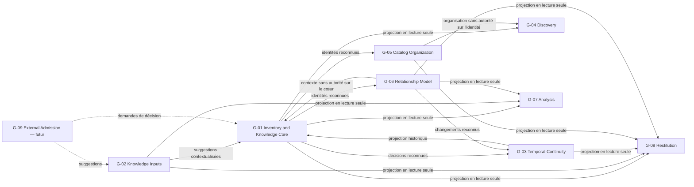

# Architecture Boundary Map

## Purpose

Cette Boundary Map précise les frontières d'autorité entre les quatorze responsabilités identifiées dans `00_ARCHITECTURE_BLUEPRINT.md`. Elle détermine ce que chaque responsabilité peut décider, produire et consommer afin de préserver les invariants du produit et d'éviter les autorités concurrentes.

Les regroupements proposés sont conceptuels et provisoires. Ils servent à préparer l'identification future des Bounded Contexts sans affirmer que chaque regroupement, ou chaque responsabilité, devra devenir une frontière définitive de réalisation.

## Principes d'analyse

- Une frontière d'autorité est définie par les décisions métier qu'elle est seule autorisée à reconnaître.
- Partager un regroupement n'autorise pas deux responsabilités à confondre leurs décisions.
- Consommer une information n'en transfère pas automatiquement l'autorité.
- Une responsabilité dérivée peut sélectionner, présenter ou restituer une vérité détenue ailleurs, jamais la modifier silencieusement.
- Une dépendance vers une responsabilité future ne peut pas devenir nécessaire au noyau d'une Release antérieure.
- Toute interaction conserve l'identité de sa source, son niveau d'autorité et les incertitudes qu'elle transporte.

## Niveaux d'autorité échangés

Les interactions utilisent les niveaux suivants :

- **Aucune autorité :** l'information est transmise comme contexte sans pouvoir de décision sur la responsabilité consommatrice.
- **Suggestion :** l'information propose une interprétation ou un contenu candidat qui exige un examen par la responsabilité autoritaire.
- **Demande de décision :** la responsabilité source demande explicitement à la responsabilité autoritaire de reconnaître ou refuser une évolution.
- **Décision reconnue :** une décision déjà prise par la responsabilité autoritaire est transmise comme fait canonique dans son périmètre.
- **Projection en lecture seule :** une représentation dérivée restitue une décision canonique sans pouvoir la modifier.

## Analyse des responsabilités

### Inventory

- **Rôle :** maintenir le périmètre d'un Inventaire, l'identité de ses Articles et leur appartenance.
- **Concepts possédés :** Inventaire, périmètre d'inventaire, Article d'inventaire dans sa dimension identitaire et d'appartenance.
- **Décisions autorisées :** reconnaître l'existence métier d'un Article, distinguer son unité de gestion, décider de son appartenance à un Inventaire et reconnaître une évolution d'identité explicitement arbitrée.
- **Informations produites :** identité reconnue, appartenance courante, périmètre, état d'existence métier et Changement identitaire reconnu.
- **Informations consommées :** demande explicite d'inclusion ou d'évolution, Observation pertinente, arbitrage de cycle de vie et relation de continuité entre identités.
- **Dépend de :** aucune responsabilité dérivée pour établir une identité ; dépend sous contrôle de History pour préserver la continuité d'une décision reconnue.
- **Est utilisée par :** Observation and Provenance, Knowledge, Documentation, History, Search, Catalogs, Relationships, Lifecycle and Archive, Export, Comparison et Sharing.

### Observation and Provenance

- **Rôle :** préserver les constats, leur contexte et l'origine identifiable des informations disponibles.
- **Concepts possédés :** Observation, Source et relation explicite de provenance.
- **Décisions autorisées :** reconnaître qu'un constat a été conservé dans un contexte donné et qu'une Source est associée à une information déterminée.
- **Informations produites :** constat contextualisé, Source identifiable, circonstance d'observation et provenance déclarée.
- **Informations consommées :** identité d'Article reconnue par Inventory, contenu constaté et contexte fourni par l'utilisateur ou une future entrée externe.
- **Dépend de :** Inventory pour l'identité de l'Article concerné ; ne dépend pas de l'acceptation par Knowledge pour préserver un constat.
- **Est utilisée par :** Knowledge, Evidence, History, Export, Comparison et, potentiellement, Import comme destination de suggestions.

### Knowledge

- **Rôle :** maintenir les Informations d'inventaire actuellement retenues ainsi que leurs incertitudes et contradictions.
- **Concepts possédés :** Information d'inventaire retenue, état courant, arbitrage explicite, incertitude et conflit dans leur effet sur la connaissance actuelle.
- **Décisions autorisées :** accepter, maintenir, contester ou remplacer explicitement une Information ; reconnaître qu'une connaissance reste inconnue ou incertaine ; décider si une évolution constitue un Changement de connaissance.
- **Informations produites :** Information retenue, état courant, décision d'arbitrage, conflit ou incertitude explicite et Changement reconnu.
- **Informations consommées :** identité et périmètre d'Inventory, Observations et Sources, Documentation, Éléments probants et demandes explicites d'actualisation.
- **Dépend de :** Inventory pour l'objet de la connaissance ; Observation and Provenance pour les constats et Sources ; Documentation ou Evidence lorsqu'elles existent ; History uniquement pour expliquer le passé, jamais pour reconstruire silencieusement l'état courant.
- **Est utilisée par :** Search, History, Lifecycle and Archive, Export, Comparison et Sharing.

### Documentation

- **Rôle :** conserver des explications contextualisées relatives à un Article ou à sa connaissance.
- **Concepts possédés :** Documentation, contenu explicatif, Source documentaire, contexte et rattachement explicite.
- **Décisions autorisées :** reconnaître qu'une Documentation décrit un objet déterminé dans un contexte donné ; maintenir sa provenance et son rôle explicatif.
- **Informations produites :** explication contextualisée et dotée d'une Source.
- **Informations consommées :** identité d'Article fournie par Inventory, Source et contexte déclarés.
- **Dépend de :** Inventory pour le rattachement à un Article ; Observation and Provenance pour la provenance lorsqu'elle est partagée ; ne dépend pas de Knowledge pour exister.
- **Est utilisée par :** Knowledge comme contexte, Evidence lorsqu'un rôle probant est explicitement déclaré, Search, Export, Comparison et Sharing.

### History

- **Rôle :** conserver la continuité des Changements significatifs reconnus par les responsabilités autoritaires.
- **Concepts possédés :** Historique, Changement historique, relation entre état antérieur, décision reconnue et état courant.
- **Décisions autorisées :** reconnaître qu'un Changement canonique a été conservé avec son origine et sa continuité ; distinguer ce Changement d'une activité sans portée métier.
- **Informations produites :** continuité historique, état antérieur conservé, séquence explicable de Changements et provenance de la décision historique.
- **Informations consommées :** décisions reconnues et Changements produits par Inventory, Knowledge, Lifecycle and Archive, Relationships ou Catalogs lorsqu'ils sont significatifs.
- **Dépend de :** les responsabilités autoritaires pour le sens de leurs décisions ; elle ne dépend pas d'une responsabilité dérivée.
- **Est utilisée par :** Knowledge pour l'explication du passé, Search, Lifecycle and Archive, Export et Sharing.

### Search

- **Rôle :** retrouver des Articles et des connaissances à partir d'une intention utilisateur.
- **Concepts possédés :** intention de recherche, correspondance calculée et présentation des résultats ; aucun concept métier source.
- **Décisions autorisées :** sélectionner et ordonner des correspondances à partir des informations disponibles, puis déclarer l'absence de correspondance.
- **Informations produites :** projection de résultats, critères interprétés et absence explicite de résultat.
- **Informations consommées :** identités et appartenance d'Inventory, Informations retenues de Knowledge, Documentation, Historique et organisation fournie par Catalogs lorsqu'elle existe.
- **Dépend de :** Inventory, Knowledge, Documentation, History et, à partir de 0.5, Catalogs.
- **Est utilisée par :** les parcours de consultation ; aucune responsabilité autoritaire ne dépend de Search pour établir une vérité métier.

### Evidence

- **Rôle :** maintenir les Éléments probants et leur relation explicite avec ce qu'ils soutiennent, nuancent ou contredisent.
- **Concepts possédés :** Élément probant, cible probante, sens de soutien, nuance ou contradiction et Source associée.
- **Décisions autorisées :** reconnaître qu'un élément possède un rôle probant explicite envers une Information ou une interprétation d'Observation.
- **Informations produites :** Élément probant contextualisé et relation probante déclarée.
- **Informations consommées :** Source, Observation ou Documentation candidate, identité d'Article et cible de Knowledge.
- **Dépend de :** Observation and Provenance pour la Source, Documentation lorsqu'un document reçoit explicitement ce rôle, Inventory pour l'identité et Knowledge pour identifier la cible examinée.
- **Est utilisée par :** Knowledge, History après arbitrage, Export, Comparison et Sharing.

### Catalogs

- **Rôle :** organiser les Articles au moyen de Catalogues et de Catégories ayant un sens explicite.
- **Concepts possédés :** Catalogue, Catégorie, règles de regroupement admises et rattachement organisationnel.
- **Décisions autorisées :** créer ou faire évoluer un regroupement, reconnaître le rattachement d'un Article à une Catégorie et préserver le sens de l'organisation.
- **Informations produites :** structure de consultation, catégories et rattachements organisationnels reconnus.
- **Informations consommées :** identités d'Articles et périmètre fournis par Inventory, demande explicite d'organisation.
- **Dépend de :** Inventory pour les Articles organisés ; éventuellement History pour préserver un Changement d'organisation significatif.
- **Est utilisée par :** Search, Export et les parcours de consultation.

### Relationships

- **Rôle :** maintenir des Relations métier explicites entre des objets reconnus.
- **Concepts possédés :** Relation, objets reliés, sens déclaré et état courant de la Relation.
- **Décisions autorisées :** reconnaître, modifier ou retirer une Relation explicite sans déduire une propriété cachée.
- **Informations produites :** Relation reconnue, contexte relationnel et Changement de Relation significatif.
- **Informations consommées :** identités fournies par Inventory, demande explicite de mise en relation et contexte utile de Knowledge ou Documentation.
- **Dépend de :** Inventory pour l'identité des objets ; History pour conserver les Changements significatifs sans lui déléguer l'état courant.
- **Est utilisée par :** Knowledge comme contexte, Export, Comparison et Sharing.

### Lifecycle and Archive

- **Rôle :** gouverner le passage explicite entre usage courant et état archivé sans effacer l'existence historique.
- **Concepts possédés :** décision d'archivage, de réactivation et état de cycle de vie dans sa dimension d'usage.
- **Décisions autorisées :** reconnaître qu'un Inventaire ou un Article sort de l'usage courant ou y revient, en distinguant cette décision d'une disparition ou d'une incertitude.
- **Informations produites :** état de cycle de vie reconnu et Changement correspondant.
- **Informations consommées :** identité et appartenance d'Inventory, état courant de Knowledge, demande explicite et Historique pertinent.
- **Dépend de :** Inventory et Knowledge pour l'objet concerné ; History pour préserver la continuité de la décision.
- **Est utilisée par :** Inventory pour l'état d'usage reconnu, Search pour la consultation appropriée, Export et Sharing.

### Export

- **Rôle :** restituer une connaissance cohérente hors de son contexte actif.
- **Concepts possédés :** périmètre de restitution et résultat exporté ; aucune vérité métier exportée ne lui appartient.
- **Décisions autorisées :** déterminer, selon une intention explicite, quelles connaissances canonique et historique appartiennent à la restitution.
- **Informations produites :** projection portable et traçable du périmètre sélectionné.
- **Informations consommées :** Inventory, Knowledge, Observation and Provenance, Documentation, Evidence, Catalogs, Relationships, Lifecycle and Archive et History selon le Scope exporté.
- **Dépend de :** toutes les responsabilités autoritaires dont elle restitue les décisions ; aucune dépendance inverse n'est admise.
- **Est utilisée par :** un contexte extérieur non autoritaire sur la connaissance source ; elle ne produit aucun retour direct vers le domaine.

### Comparison

- **Rôle :** mettre en regard des Articles, Observations ou Informations selon des dimensions explicitement admises.
- **Concepts possédés :** sélection comparative, dimensions de comparaison et résultat dérivé ; aucune identité ni Information source.
- **Décisions autorisées :** choisir et appliquer des dimensions de comparaison reconnues, puis restituer ressemblances, différences et contradictions.
- **Informations produites :** projection comparative et écarts observés.
- **Informations consommées :** Inventory, Knowledge, Observation and Provenance, Evidence, Documentation et Relationships selon la comparaison.
- **Dépend de :** les responsabilités autoritaires portant les éléments comparés ; aucune dépendance inverse n'est admise.
- **Est utilisée par :** l'utilisateur pour éclairer un jugement ; le résultat ne constitue ni une identité ni une décision de Knowledge.

### Sharing

- **Rôle :** exposer un périmètre autorisé de connaissance à d'autres personnes sans créer d'autorité concurrente.
- **Concepts possédés :** périmètre partagé, destinataires admis et conditions de diffusion ; aucune vérité métier partagée ne lui appartient.
- **Décisions autorisées :** reconnaître ce qui est exposé, à qui et dans quelles limites, selon les règles produit admises.
- **Informations produites :** projection partagée accompagnée de sa provenance, de ses incertitudes et de ses limites.
- **Informations consommées :** Inventory, Knowledge, Documentation, Evidence, Relationships, Lifecycle and Archive et History dans le périmètre autorisé.
- **Dépend de :** les responsabilités autoritaires et les contraintes de confidentialité et de maîtrise des Informations ; aucune dépendance inverse n'est admise pour la consultation.
- **Est utilisée par :** les destinataires autorisés ; une éventuelle contribution future ne pourrait produire qu'une demande de décision vers les responsabilités autoritaires.

### Import

- **Rôle :** représenter une future entrée de contenu candidat provenant d'un autre contexte.
- **Concepts possédés :** aucun concept produit actuellement approuvé ; un futur périmètre d'entrée resterait à décider.
- **Décisions autorisées :** aucune dans l'architecture 1.0 actuelle.
- **Informations produites :** uniquement, si la capacité est admise, des suggestions de Sources, Observations, Documentation, identités candidates ou Informations candidates.
- **Informations consommées :** contenu extérieur et règles d'admission futures ; aucune dépendance actuelle du produit.
- **Dépend de :** aucune responsabilité actuelle tant que la capacité reste hors Scope ; dépendrait ensuite de leurs décisions explicites.
- **Est utilisée par :** potentiellement Observation and Provenance, Documentation, Inventory et Knowledge comme origine de suggestions ou demandes, jamais de décisions reconnues.

## Regroupements conceptuels provisoires

Un regroupement rassemble des responsabilités qui peuvent partager une frontière conceptuelle générale. Les sous-autorités décrites précédemment restent obligatoires à l'intérieur du regroupement.

### G-01 — Inventory and Knowledge Core

- **Mission :** maintenir le périmètre, l'identité, l'appartenance, la connaissance courante et le cycle de vie reconnu.
- **Autorité :** décisions canoniques concernant ce qui appartient à l'Inventaire, ce qui est actuellement retenu et ce qui relève de l'usage courant.
- **Responsabilités :** Inventory, Knowledge, Lifecycle and Archive.
- **Justification :** ces décisions portent sur le même Article et exigent une cohérence immédiate entre identité, état courant et évolution de cycle de vie. Leur regroupement évite une circulation de décisions incomplètes au cœur du produit.
- **Risque de couplage :** l'identité pourrait être confondue avec les Informations mutables, ou l'archivage avec une disparition. Les trois sous-autorités doivent donc rester nommées et vérifiables.
- **Statut :** regroupement recommandé pour formalisation, sans décision définitive sur sa réalisation.

### G-02 — Knowledge Inputs

- **Mission :** préserver des entrées contextualisées pouvant expliquer, soutenir ou contredire la connaissance.
- **Autorité :** origine, contexte et rôle explicite des Observations, Sources, Documentation et Éléments probants ; aucune autorité sur l'Information retenue.
- **Responsabilités :** Observation and Provenance, Documentation, Evidence.
- **Justification :** ces responsabilités partagent l'exigence de provenance et fournissent des entrées à Knowledge sans accepter elles-mêmes une conclusion.
- **Risque de couplage :** une Documentation pourrait être traitée comme Observation ou Evidence par défaut, ou un Élément probant comme vérité. Le regroupement doit conserver leurs distinctions sémantiques internes.
- **Statut :** regroupement plausible ; l'autonomie de Documentation devra être réévaluée selon ses règles et usages futurs.

### G-03 — Temporal Continuity

- **Mission :** préserver l'explication temporelle des décisions reconnues.
- **Autorité :** Historique et continuité des Changements significatifs ; aucune autorité sur l'état courant.
- **Responsabilités :** History.
- **Justification :** History reçoit des Changements de plusieurs responsabilités et doit rester protégée contre leur réécriture, tout en ne pouvant les décider à leur place.
- **Risque de couplage :** une séparation excessive pourrait détacher le Changement de sa signification, tandis qu'un regroupement dans le cœur pourrait permettre la réécriture du passé. L'interaction contrôlée doit préserver les deux autorités.
- **Statut :** frontière d'autorité distincte recommandée ; son degré d'autonomie reste à formaliser.

### G-04 — Discovery

- **Mission :** retrouver et restituer une connaissance existante à partir d'une intention.
- **Autorité :** intention, correspondance et projection de résultats uniquement.
- **Responsabilités :** Search.
- **Justification :** Search dépend de plusieurs sources mais aucune vérité métier ne doit dépendre d'elle. Une frontière dérivée explicite protège cette asymétrie.
- **Risque de couplage :** une correspondance calculée pourrait devenir une identité ou une Information acceptée implicite.
- **Statut :** frontière dérivée claire, prête à être formalisée.

### G-05 — Catalog Organization

- **Mission :** organiser les Articles sans modifier leur identité ni leur appartenance.
- **Autorité :** Catalogues, Catégories et rattachements organisationnels.
- **Responsabilités :** Catalogs.
- **Justification :** l'organisation possède des décisions propres, mais repose entièrement sur des Articles reconnus par Inventory.
- **Risque de couplage :** confondre absence d'une Catégorie avec absence de l'Inventaire, ou rendre l'identité dépendante d'une classification mutable.
- **Statut :** frontière sémantique justifiée ; la richesse de ses règles doit être définie avant sa formalisation définitive.

### G-06 — Relationship Model

- **Mission :** maintenir la cohérence et le sens explicite des Relations entre objets reconnus.
- **Autorité :** Relation, objets reliés, sens déclaré et évolution de la Relation.
- **Responsabilités :** Relationships.
- **Justification :** une Relation possède sa propre cohérence et son propre cycle d'évolution, tout en dépendant des identités qu'elle relie.
- **Risque de couplage :** une Relation pourrait redéfinir implicitement une identité, une hiérarchie ou une causalité.
- **Statut :** frontière candidate distincte, à confirmer avec les types de Relations admis.

### G-07 — Analysis

- **Mission :** produire des rapprochements dérivés sans modifier les éléments comparés.
- **Autorité :** dimensions admises et résultat de comparaison, jamais les sources comparées.
- **Responsabilités :** Comparison.
- **Justification :** l'analyse dépend de plusieurs autorités et doit rester explicitement sans effet direct sur elles.
- **Risque de couplage :** transformer une similarité en identité, une différence en conflit canonique ou un résultat en décision automatique.
- **Statut :** regroupement dérivé plausible ; les dimensions métier doivent être définies avant formalisation.

### G-08 — Restitution

- **Mission :** restituer ou exposer une connaissance canonique hors de son contexte d'usage individuel.
- **Autorité :** périmètre de restitution ou de diffusion, destinataires et fidélité de la projection ; aucune autorité sur la connaissance source.
- **Responsabilités :** Export, Sharing.
- **Justification :** les deux responsabilités sélectionnent et transmettent une connaissance avec son contexte, ses incertitudes et son Historique sans la redéfinir.
- **Risque de couplage :** confondre export et partage, introduire une autorité concurrente, ou permettre à une contribution partagée de modifier directement le cœur.
- **Statut :** regroupement recommandé tant que Sharing reste une exposition ; une future contribution pourrait justifier une frontière supplémentaire.

### G-09 — External Admission

- **Mission potentielle :** soumettre du contenu extérieur aux responsabilités autoritaires sans contourner leur examen.
- **Autorité :** aucune tant qu'Import reste hors Scope.
- **Responsabilités :** Import.
- **Justification :** isoler conceptuellement l'entrée future empêche qu'elle soit confondue avec Observation, Knowledge ou Inventory.
- **Risque de couplage :** créer une voie parallèle d'acceptation, écraser une identité ou une Information, ou rendre le noyau dépendant d'une capacité future.
- **Statut :** exclu de la formalisation de l'architecture 1.0 actuelle.

## Diagramme des regroupements conceptuels

Le diagramme représente des regroupements provisoires et leurs autorités dominantes. Il ne définit pas leur forme future.

```mermaid
flowchart TB
    subgraph CORE["G-01 Inventory and Knowledge Core — autorité courante"]
        INVENTORY["Inventory"]
        KNOWLEDGE["Knowledge"]
        LIFECYCLE["Lifecycle and Archive"]
    end

    subgraph INPUTS["G-02 Knowledge Inputs — autorité sur les entrées"]
        OBSERVATION["Observation and Provenance"]
        DOCUMENTATION["Documentation"]
        EVIDENCE["Evidence"]
    end

    subgraph TEMPORAL["G-03 Temporal Continuity — autorité historique"]
        HISTORY["History"]
    end

    subgraph DISCOVERY["G-04 Discovery — projection dérivée"]
        SEARCH["Search"]
    end

    subgraph CATALOG["G-05 Catalog Organization — autorité d'organisation"]
        CATALOGS["Catalogs"]
    end

    subgraph RELATIONS["G-06 Relationship Model — autorité relationnelle"]
        RELATIONSHIPS["Relationships"]
    end

    subgraph ANALYSIS["G-07 Analysis — résultat dérivé"]
        COMPARISON["Comparison"]
    end

    subgraph RESTITUTION["G-08 Restitution — périmètre de diffusion"]
        EXPORT["Export"]
        SHARING["Sharing"]
    end

    subgraph ADMISSION["G-09 External Admission — futur sans autorité"]
        IMPORT["Import"]
    end
```

## Interactions principales

| Source | Consommatrice | Information échangée | Sens de la dépendance | Niveau d'autorité transféré |
| --- | --- | --- | --- | --- |
| Observation and Provenance | Knowledge | Observation, Source et contexte | Knowledge examine une entrée préservée indépendamment de son acceptation | Suggestion |
| Evidence | Knowledge | Élément probant, cible et sens de soutien, nuance ou contradiction | Knowledge arbitre sans modifier l'Élément probant | Suggestion |
| Documentation | Knowledge | Explication contextualisée et Source | Knowledge peut l'utiliser comme contexte ; un rôle probant exige une décision explicite | Suggestion |
| Inventory | Knowledge | Identité, appartenance et périmètre reconnus | Knowledge ne peut porter une Information que sur un objet reconnu | Décision reconnue |
| Knowledge | Search | Informations retenues, incertitudes et conflits | Search dépend de Knowledge ; aucune dépendance inverse n'est admise | Projection en lecture seule |
| Inventory | Search | Identités et appartenance | Search retrouve sans créer ni modifier l'Article | Projection en lecture seule |
| Inventory, Knowledge, Lifecycle and Archive, Relationships ou Catalogs | History | Changement significatif et décision source | History conserve une décision déjà reconnue sans la prendre à la place de sa source | Décision reconnue |
| History | Knowledge | État antérieur et continuité explicable | Knowledge consulte le passé sans lui déléguer l'état courant | Projection en lecture seule |
| Catalogs | Inventory | Rattachement organisationnel reconnu | Inventory peut exposer l'organisation sans lui céder identité ou appartenance | Aucune autorité sur Inventory ; décision reconnue dans Catalogs |
| Inventory | Catalogs | Identité d'Article reconnue | Catalogs organise uniquement des Articles existants | Projection en lecture seule |
| Inventory | Relationships | Identités des objets à relier | Relationships dépend des identités sans pouvoir les redéfinir | Projection en lecture seule |
| Relationships | Inventory ou Knowledge | Relation explicite et sens déclaré | La Relation fournit un contexte, jamais une propriété implicite | Aucune autorité sur l'identité ou la connaissance |
| Inventory | Lifecycle and Archive | Identité, appartenance et état d'existence | Le cycle de vie décide seulement de la participation à l'usage courant | Décision reconnue |
| Lifecycle and Archive | Inventory | Décision d'archivage ou de réactivation | Inventory reconnaît l'état d'usage sans effacer l'existence historique | Demande de décision, puis décision reconnue |
| Inventory | Export | Périmètre, identités et appartenance | Export restitue sans modifier | Projection en lecture seule |
| Knowledge | Export | Informations retenues, Sources, conflits et incertitudes | Export conserve le sens de la connaissance source | Projection en lecture seule |
| Knowledge | Comparison | Informations retenues et états explicites | Comparison produit un résultat dérivé sans arbitrage | Projection en lecture seule |
| Inventory | Comparison | Identités distinctes | Comparison ne peut pas conclure à une identité par similarité | Projection en lecture seule |
| Inventory et Knowledge | Sharing | Périmètre, identités et connaissance autorisée | Sharing expose sans devenir l'autorité principale | Projection en lecture seule |
| History | Export ou Sharing | Changements et continuité pertinents | La restitution préserve l'explication du passé | Projection en lecture seule |
| Import | Observation and Provenance ou Documentation | Contenu extérieur candidat et provenance déclarée | Les responsabilités destinataires examinent et contextualisent l'entrée | Suggestion |
| Import | Inventory ou Knowledge | Identité ou Information candidate | Seule la responsabilité autoritaire peut reconnaître ou refuser la proposition | Demande de décision |

## Diagramme des dépendances entre frontières

Dans ce diagramme, les flèches vont de la source de l'information vers la frontière consommatrice. Leur libellé indique le niveau d'autorité transmis.

## Règles de dépendance

### Dépendances autorisées

- Une responsabilité autoritaire peut produire une décision reconnue destinée à History ou une projection destinée à une responsabilité dérivée.
- Knowledge peut examiner Observation, Documentation et Evidence sans modifier leur contenu source.
- Une responsabilité dérivée peut consulter plusieurs autorités si elle conserve la provenance et les limites de chacune.
- Catalogs et Relationships peuvent référencer des Articles reconnus tout en conservant leurs propres règles de cohérence.
- Export et Sharing peuvent combiner plusieurs projections si la restitution conserve leur sens et n'établit aucune vérité concurrente.

### Dépendances à sens unique

- Search, Comparison, Export et Sharing dépendent des responsabilités canoniques consultées ; le cœur ne dépend pas d'elles pour établir son état.
- Catalogs dépend d'Inventory pour l'identité ; Inventory ne dépend pas d'un classement pour reconnaître un Article.
- Relationships dépend d'Inventory pour les identités ; Inventory ne dépend pas d'une Relation pour établir leur existence.
- Import, s'il est admis, dépend des décisions des responsabilités autoritaires ; aucune responsabilité du Scope 1.0 ne dépend d'Import.

### Dépendances bidirectionnelles sous contrôle

- Inventory et Knowledge partagent le même Article : Inventory décide de son identité, Knowledge de ce qui est retenu à son sujet. Chaque sens d'échange transporte une décision déjà reconnue dans son propre périmètre.
- Le cœur produit des Changements reconnus pour History ; History restitue ensuite une projection du passé sans pouvoir modifier le présent.
- Lifecycle and Archive demande une évolution d'état à Inventory et transmet la décision reconnue à History ; ni l'archive ni l'Historique ne suppriment l'existence métier.
- Relationships peut fournir un contexte à Knowledge, tandis que Knowledge peut motiver une demande explicite de Relation ; aucune conclusion automatique n'est admise.

### Dépendances interdites

- Observation and Provenance ne peut pas écrire directement une Information retenue.
- Evidence ne peut pas décider de la vérité ni résoudre automatiquement une contradiction.
- Documentation ne peut pas devenir automatiquement Observation, Evidence ou Information retenue.
- Knowledge ne peut pas altérer une Observation, une Source, une Documentation ou un Élément probant pour les rendre conformes à son arbitrage.
- Search ne peut pas créer ou modifier une identité, une appartenance, une Information, un Statut ou un Historique.
- History ne peut pas réécrire l'état courant ni inventer un Changement absent de la responsabilité qui l'a reconnu.
- Catalogs ne peut pas déterminer l'identité ou l'appartenance d'un Article.
- Relationships ne peut pas déduire une identité, une propriété, une hiérarchie ou une causalité non déclarée.
- Lifecycle and Archive ne peut pas assimiler archivage, disparition réelle et absence d'Observation.
- Export ne peut pas modifier le domaine ni devenir une source canonique concurrente.
- Comparison ne peut pas redéfinir les Articles, accepter une Information ou transformer une similarité en identité.
- Sharing ne peut pas devenir l'autorité principale ni permettre une modification directe du cœur sans demande et décision explicites.
- Import ne peut pas introduire silencieusement une identité, une appartenance, une Information retenue, un Changement ou une suppression.
- Aucune responsabilité du noyau 0.1 ne peut dépendre d'une responsabilité propre aux Releases 0.5, 1.0 ou ultérieures pour respecter ses invariants.

## Frontières d'autorité consolidées

| Autorité | Frontière propriétaire | Limite impérative |
| --- | --- | --- |
| Identité d'un Article d'inventaire | Inventory dans G-01 | Indépendante de l'Emplacement, du Statut, du classement, de la Documentation, d'une Relation ou d'un résultat dérivé. |
| Appartenance à un Inventaire | Inventory dans G-01 | Unique à un instant donné ; non déterminée par Catalogs ou Sharing. |
| Observation | Observation and Provenance dans G-02 | Constat contextualisé, jamais conclusion automatique. |
| Provenance | Observation and Provenance dans G-02 | Source identifiable conservée avec l'information concernée. |
| Information retenue | Knowledge dans G-01 | Résulte d'un arbitrage explicite et ne remplace pas ses entrées. |
| Documentation | Documentation dans G-02 | Explication contextualisée, sans autorité automatique sur Knowledge. |
| Élément probant | Evidence dans G-02 | Soutient, nuance ou contredit sans décider de la vérité. |
| Changement courant | Responsabilité qui reconnaît la décision | Le sens appartient à sa source avant conservation historique. |
| Historique | History dans G-03 | Conserve le passé sans redéfinir le présent. |
| Contradiction dans la connaissance | Knowledge dans G-01 | Reste visible jusqu'à arbitrage ; Evidence conserve les éléments contradictoires. |
| Incertitude de la connaissance | Knowledge dans G-01 | Ne peut pas être supprimée par une projection ou une absence de résultat. |
| Cycle de vie | Lifecycle and Archive dans G-01 | Distingue usage courant, archivage, existence historique et incertitude. |
| Relation | Relationships dans G-06 | Possède un sens explicite sans implication cachée. |
| Catalogue et Catégorie | Catalogs dans G-05 | Organisent sans définir identité ni appartenance. |

## Traçabilité documentaire

| Regroupement proposé | Sources produit principales | Apport du Blueprint |
| --- | --- | --- |
| G-01 Inventory and Knowledge Core | `21_INVENTORY_DOMAIN.md`, `22_DOMAIN_INVARIANTS.md`, `23_PRODUCT_CAPABILITIES.md`, DSD-001 à DSD-003 dans `27_DOMAIN_DECISIONS.md`, `29_RELEASE_0.1_ACCEPTANCE.md` | Responsabilités Inventory, Knowledge et Lifecycle ; séparation identité, connaissance et cycle de vie. |
| G-02 Knowledge Inputs | `21_INVENTORY_DOMAIN.md`, `22_DOMAIN_INVARIANTS.md`, `23_PRODUCT_CAPABILITIES.md`, DSD-003 et DSD-004, `29_RELEASE_0.1_ACCEPTANCE.md` | Responsabilités Observation and Provenance, Documentation et Evidence ; absence d'acceptation automatique. |
| G-03 Temporal Continuity | `21_INVENTORY_DOMAIN.md`, `22_DOMAIN_INVARIANTS.md`, `23_PRODUCT_CAPABILITIES.md`, `29_RELEASE_0.1_ACCEPTANCE.md` | Responsabilité History et dépendance aux Changements reconnus. |
| G-04 Discovery | `23_PRODUCT_CAPABILITIES.md`, `29_RELEASE_0.1_ACCEPTANCE.md`, `30_ARCHITECTURE_CONSTRAINTS.md` | Search comme projection dérivée, hors de toute autorité métier source. |
| G-05 Catalog Organization | `21_INVENTORY_DOMAIN.md`, `22_DOMAIN_INVARIANTS.md`, `23_PRODUCT_CAPABILITIES.md` | Catalogs comme organisation distincte de l'identité et du périmètre. |
| G-06 Relationship Model | `21_INVENTORY_DOMAIN.md`, `22_DOMAIN_INVARIANTS.md`, `23_PRODUCT_CAPABILITIES.md` | Relationships comme autorité du sens explicite des Relations. |
| G-07 Analysis | `22_DOMAIN_INVARIANTS.md`, `23_PRODUCT_CAPABILITIES.md`, `30_ARCHITECTURE_CONSTRAINTS.md` | Comparison comme résultat dérivé sans effet sur l'identité ou Knowledge. |
| G-08 Restitution | `23_PRODUCT_CAPABILITIES.md`, `24_RELEASE_SCOPE.md`, `30_ARCHITECTURE_CONSTRAINTS.md` | Export et Sharing comme projections fidèles sans autorité concurrente. |
| G-09 External Admission | `30_ROADMAP.md`, `30_ARCHITECTURE_CONSTRAINTS.md`, `31_PRODUCT_READINESS_CERTIFICATION.md` | Import conservé hors Scope et sans voie directe vers une décision canonique. |

Tous les regroupements sont également soumis à la décision `READY FOR ARCHITECTURE` de `31_PRODUCT_READINESS_CERTIFICATION.md` et au modèle commun d'autorité défini dans `00_ARCHITECTURE_BLUEPRINT.md`.

## Questions analysées

### Inventory et Knowledge partagent-ils une même frontière ?

**Proposition : oui, dans un regroupement provisoire commun, avec deux sous-autorités impérativement distinctes.** Leur cohérence sur un même Article favorise le regroupement ; leurs décisions ne sont toutefois pas interchangeables. La formalisation devra démontrer que l'identité reste indépendante des Informations mutables.

### Observation et Evidence appartiennent-elles au même regroupement ?

**Proposition : oui, avec Documentation, dans Knowledge Inputs.** Elles partagent la provenance et l'absence d'autorité sur Knowledge. Observation conserve un constat ; Evidence porte une relation probante explicite. Cette différence doit rester visible.

### Documentation est-elle autonome ?

**Proposition : responsabilité autonome au sein de Knowledge Inputs, sans frontière séparée à ce stade.** Son contenu et sa provenance lui appartiennent, mais le Scope actuel ne justifie pas encore un regroupement distinct. Une croissance de ses règles propres pourrait rouvrir la question.

### History est-elle une autorité métier ou une responsabilité transverse ?

**Proposition : autorité métier sur la continuité historique et responsabilité transverse par ses sources.** Elle est seule autorisée à conserver l'Historique, mais ne possède pas le sens initial des décisions ni l'état courant.

### Search reste-t-elle entièrement dérivée ?

**Proposition : oui.** Elle possède l'intention, la correspondance et la projection, mais aucune vérité métier consultée.

### Lifecycle and Archive appartient-il au cœur Inventory ?

**Proposition : oui.** L'archivage modifie l'état d'usage d'un objet dont Inventory porte l'identité, tout en exigeant Knowledge et History pour préserver sens et continuité.

### Catalogs possède-t-il des règles propres ?

**Proposition : oui, limitées au sens de l'organisation.** La définition détaillée de ces règles reste à faire avant formalisation ; elles ne peuvent porter sur l'identité ou l'appartenance.

### Relationships possède-t-il sa propre cohérence ?

**Proposition : oui.** Une Relation possède des objets, un sens et une évolution explicites. Elle dépend des identités d'Inventory mais ne se réduit pas à celles-ci.

### Sharing et Export partagent-ils une frontière ?

**Proposition : oui, provisoirement, dans Restitution.** Les deux projettent un périmètre sans modifier la source. Si Sharing admet ultérieurement la contribution, la réception des demandes devra rester séparée de la restitution et pourrait justifier une nouvelle frontière.

### Import reste-t-il exclu de l'architecture 1.0 ?

**Proposition : oui.** Aucune capacité Import n'est approuvée. La seule décision actuelle consiste à protéger les autorités existantes contre une admission silencieuse future.

## Questions ouvertes avant formalisation

- Le regroupement G-01 peut-il préserver durablement la séparation entre identité, connaissance et cycle de vie sans dépendance circulaire cachée ?
- Documentation développera-t-elle assez de règles propres pour justifier une frontière distincte de Knowledge Inputs ?
- Quels Changements d'organisation ou de Relation sont suffisamment significatifs pour être transmis à History ?
- Quelles règles propres et valeurs contrôlées sont nécessaires à Catalogs dans la Release 0.5 ?
- Quels types de Relations et quelles contraintes de cohérence sont admis avant de formaliser G-06 ?
- Quelles dimensions de comparaison relèvent de l'autorité d'Analysis en Release 1.0 ?
- Sharing reste-t-il une consultation ou admet-il des contributions sous forme de demandes de décision ?
- Comment les obligations transversales de confidentialité, accessibilité, fonctionnement hors ligne, sauvegarde et performance seront-elles évaluées à travers plusieurs frontières ?

Ces questions ne remettent pas en cause les autorités déjà attribuées. Elles déterminent le degré de regroupement approprié et doivent être résolues ou explicitement différées lors de la formalisation.

## Conclusion

Les frontières d'autorité sont **suffisamment claires pour passer à leur formalisation**.

La distinction entre cœur autoritaire, entrées de connaissance, continuité historique et responsabilités dérivées élimine les principales ambiguïtés. Les neuf regroupements constituent des candidats de travail, non des Bounded Contexts certifiés. La prochaine étape devra tester leurs cohésions internes, leurs langages, leurs invariants et leurs dépendances avant toute décision définitive.
