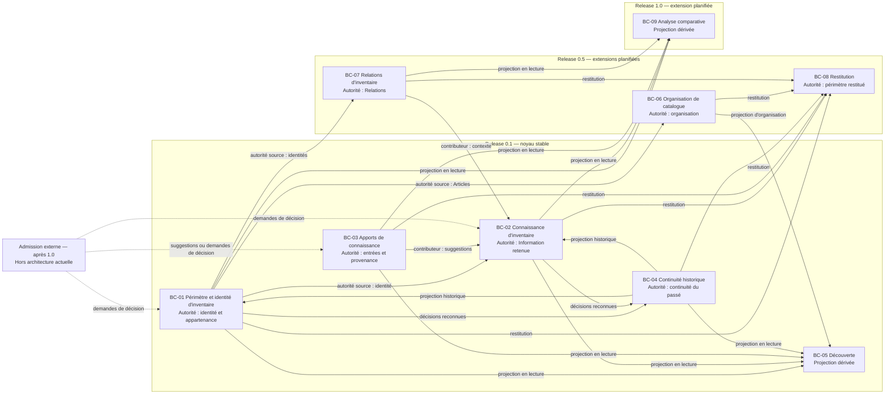

# Bounded Contexts

## Purpose

Ce document formalise les frontières métier conceptuelles d'Inventaire à partir de `00_ARCHITECTURE_BLUEPRINT.md` et `01_BOUNDARY_MAP.md`. Il attribue à chaque Bounded Context un langage, une autorité, des responsabilités et des dépendances contrôlées.

Les contextes décrivent où les décisions métier sont reconnues. Ils ne déterminent pas leur forme de réalisation. Les noms français sont canoniques dans l'architecture ; les noms anglais sont uniquement des alias de repérage et ne créent pas un vocabulaire concurrent.

## Critères de formalisation

Chaque regroupement provisoire a été évalué selon :

- la cohésion de son langage et de ses règles ;
- l'unicité de son autorité sur les concepts ;
- la compatibilité des cycles d'évolution qu'il réunit ;
- son autonomie à l'égard des responsabilités dérivées ;
- le risque de dépendance circulaire ou de duplication d'autorité ;
- sa contribution aux invariants Produit ;
- sa nécessité dans le Scope de chaque Release.

Un contexte est retenu seulement lorsqu'une frontière d'autorité apporte une distinction durable. Une responsabilité peut être intégrée à un contexte plus large si elle partage son langage et son cycle de décision sans perdre son autorité propre.

## Décisions de formalisation

| Regroupement provisoire | Décision | Justification |
| --- | --- | --- |
| Inventory and Knowledge Core | **Divisé** entre Périmètre et identité d'inventaire, et Connaissance d'inventaire | Identité, appartenance et cycle de vie ne sont pas des Informations mutables. Knowledge possède l'arbitrage de la connaissance, pas l'existence de l'Article. |
| Knowledge Inputs | **Confirmé et renommé** Apports de connaissance | Observation, provenance, Documentation et Evidence partagent l'exigence de Source et l'absence d'autorité sur la connaissance retenue. Leurs distinctions restent internes et explicites. |
| Temporal Continuity | **Confirmé et renommé** Continuité historique | History possède une autorité propre sur la conservation du passé, tout en recevant le sens des Changements des contextes qui les reconnaissent. |
| Discovery | **Confirmé et renommé** Découverte | Search possède son langage de recherche mais aucune vérité métier source. Sa dépendance est entièrement dérivée. |
| Catalog Organization | **Confirmé et renommé** Organisation de catalogue | Catalogues, Catégories et rattachements ont une cohérence propre, distincte de l'identité et de l'appartenance. |
| Relationship Model | **Confirmé et renommé** Relations d'inventaire | Une Relation possède un sens, des objets et une évolution propres sans redéfinir les Articles. |
| Analysis | **Confirmé et renommé** Analyse comparative | Comparison est une projection analytique autonome prévue pour 1.0 et sans autorité sur les éléments comparés. |
| Restitution | **Confirmé** | Export et Sharing sélectionnent et restituent une connaissance sans en devenir l'autorité. Une contribution future n'est pas admise par cette décision. |
| External Admission | **Exclu de l'architecture actuelle** | Import n'est pas une capacité approuvée dans le Scope 1.0. Sa frontière reste une hypothèse après 1.0, sans dépendance actuelle. |

## Contextes retenus

### BC-01 — Périmètre et identité d'inventaire

**Alias anglais :** Inventory Scope and Identity

- **Mission :** reconnaître les Inventaires, leur périmètre, l'identité de leurs Articles, leur appartenance et leur état de cycle de vie.
- **Responsabilités incluses :** Inventory ; Lifecycle and Archive à partir de la Release 0.5.
- **Responsabilités exclues :** connaissance retenue, Observation, Documentation, Evidence, organisation par Catalogue, Relations, recherche, Historique, analyse et restitution.
- **Concepts possédés :** Inventaire, périmètre d'inventaire, Article d'inventaire dans sa dimension identitaire, appartenance à un Inventaire, état actif ou archivé.
- **Décisions autorisées :** créer un Inventaire ; reconnaître, distinguer, transférer ou corriger l'identité d'un Article ; reconnaître son appartenance ; archiver ou réactiver sans effacer son existence historique.
- **Invariants protégés :** `INV-ID-001`, `INV-ID-002`, `INV-EXI-001`, `INV-EXI-002` ; contribution à `INV-HIS-001`, `INV-CHG-001` et `INV-STA-001`.
- **Informations produites :** identité reconnue, appartenance, périmètre, état de cycle de vie et Changement identitaire ou de cycle de vie reconnu.
- **Informations consommées :** intention explicite d'inclusion ou d'évolution, Observations pertinentes, décision d'archivage ou de réactivation et continuité historique en lecture.
- **Dépendances autorisées :** Apports de connaissance comme contributeur ; Continuité historique comme projection du passé ; demande explicite de décision provenant d'un autre contexte.
- **Dépendances interdites :** dépendre de Search, Catalogs, Relationships, Comparison, Export, Sharing ou Import pour établir identité ou appartenance ; déduire une identité d'une Information mutable.
- **Capacités Produit supportées :** `CAP-001`, `CAP-002`, `CAP-014`.
- **Release d'introduction :** **0.1** ; extension Lifecycle and Archive en **0.5**.
- **Niveau de stabilité :** **noyau stable**, avec extension planifiée du cycle de vie.

#### Langage de BC-01

- **Termes canoniques :** Inventaire, périmètre d'inventaire, Article d'inventaire, appartenance, archivage, réactivation.
- **Sens spécifique :** un Article d'inventaire est une unité de gestion reconnue dans un seul Inventaire à un instant donné ; il n'est pas le bien réel.
- **Termes partagés :** Changement et Historique avec BC-04 ; Statut et Information d'inventaire avec BC-02, uniquement comme contexte de consultation.
- **Synonymes interdits :** bien, objet, fiche ou ligne comme substitut de l'Article d'inventaire ; suppression comme synonyme d'archivage ; Catalogue comme synonyme d'Inventaire.
- **Risques d'ambiguïté :** confondre présence observée, existence réelle, appartenance métier et état actif ; confondre modification d'Information et changement d'identité.

### BC-02 — Connaissance d'inventaire

**Alias anglais :** Inventory Knowledge

- **Mission :** maintenir les Informations d'inventaire actuellement retenues, leurs arbitrages, leurs incertitudes et leurs contradictions.
- **Responsabilités incluses :** Knowledge.
- **Responsabilités exclues :** identité et appartenance, conservation des entrées, Historique, recherche, comparaison, organisation et restitution.
- **Concepts possédés :** Information d'inventaire retenue, connaissance actuelle, arbitrage explicite, incertitude, conflit dans son effet sur l'état courant, Emplacement retenu et Statut retenu.
- **Décisions autorisées :** accepter, maintenir, contester ou remplacer une Information ; reconnaître un état inconnu ou incertain ; arbitrer explicitement des entrées incompatibles ; reconnaître un Changement de connaissance significatif.
- **Invariants protégés :** `INV-TRA-001`, `INV-OBS-002`, `INV-LOC-001`, `INV-STA-001`, `INV-COH-001`, `INV-COH-002` ; contribution à `INV-HIS-001` et `INV-CHG-001`.
- **Informations produites :** état courant, Information retenue, Source associée, arbitrage, incertitude, contradiction et Changement de connaissance reconnu.
- **Informations consommées :** identité reconnue de BC-01 ; Observations, Sources, Documentation et Evidence de BC-03 ; continuité passée de BC-04 ; demande explicite d'actualisation.
- **Dépendances autorisées :** BC-01 comme autorité source sur l'Article ; BC-03 comme contributeur ; BC-04 comme projection historique.
- **Dépendances interdites :** accepter automatiquement une entrée ; modifier ses Sources pour justifier un arbitrage ; dépendre d'un résultat de Search, Comparison, Export ou Sharing pour établir l'état courant.
- **Capacités Produit supportées :** `CAP-006` et consultation transversale de la connaissance actuelle.
- **Release d'introduction :** **0.1**.
- **Niveau de stabilité :** **noyau stable**.

#### Langage de BC-02

- **Termes canoniques :** Information d'inventaire, connaissance retenue, arbitrage, incertitude, conflit, Emplacement, Statut.
- **Sens spécifique :** retenue signifie explicitement acceptée comme état courant, jamais objectivement vraie ou définitive.
- **Termes partagés :** Article d'inventaire avec BC-01 ; Source, Observation, Documentation et Élément probant avec BC-03 ; Changement et Historique avec BC-04.
- **Synonymes interdits :** donnée, fait, vérité ou conclusion automatique comme substitut indifférencié d'Information retenue ; absence d'information comme synonyme de valeur négative.
- **Risques d'ambiguïté :** confondre Source et autorité ; confondre Statut synthétique et connaissance complète ; confondre Observation et conclusion.

### BC-03 — Apports de connaissance

**Alias anglais :** Knowledge Inputs

Le nom « Apports de connaissance » désigne une frontière architecturale. Il n'introduit pas un nouveau concept dans le langage métier.

- **Mission :** préserver les entrées contextualisées qui décrivent, expliquent, soutiennent, nuancent ou contredisent une connaissance possible.
- **Responsabilités incluses :** Observation and Provenance, Documentation ; Evidence à partir de la Release 0.5.
- **Responsabilités exclues :** identité, appartenance, acceptation d'une Information, Historique, recherche, comparaison et restitution.
- **Concepts possédés :** Observation, Source, provenance, Documentation, contexte ; Élément probant et relation probante à partir de 0.5.
- **Décisions autorisées :** conserver un constat et son contexte ; reconnaître une Source ; rattacher une Documentation à l'objet expliqué ; reconnaître explicitement le rôle probant d'un élément envers une cible déterminée.
- **Invariants protégés :** `INV-TRA-001`, `INV-OBS-001`, `INV-OBS-002`, `INV-DOC-001`, `INV-EVD-001`, `INV-EVD-002`, `INV-EVD-003`, `INV-COH-002`.
- **Informations produites :** Observation contextualisée, provenance, Documentation sourcée et, à partir de 0.5, Élément probant avec sa cible et son sens.
- **Informations consommées :** identité d'Article reconnue par BC-01, contenu et contexte fournis par l'utilisateur, cible de connaissance reconnue par BC-02.
- **Dépendances autorisées :** BC-01 en lecture pour le rattachement ; BC-02 en lecture pour désigner une cible ; contribution vers BC-02 sans transfert d'autorité.
- **Dépendances interdites :** créer ou modifier l'identité ; accepter une Information ; transformer automatiquement une Documentation en Evidence, une Observation en conclusion ou un Élément probant en vérité.
- **Capacités Produit supportées :** `CAP-003`, `CAP-005` ; `CAP-004` à partir de 0.5.
- **Release d'introduction :** **0.1** ; extension Evidence en **0.5**.
- **Niveau de stabilité :** **noyau stable**, avec extension planifiée.

#### Langage de BC-03

- **Termes canoniques :** Observation, Source, provenance, Documentation, contexte, Élément probant.
- **Sens spécifique :** Source désigne l'origine identifiable d'une information ; elle ne signifie ni vérité ni autorité de décision. Élément probant désigne un rôle explicite de soutien, nuance ou contradiction.
- **Termes partagés :** Article d'inventaire avec BC-01 ; Information d'inventaire et incertitude avec BC-02 ; Changement avec BC-04 lorsqu'un apport motive une évolution reconnue.
- **Synonymes interdits :** fait comme synonyme d'Observation ; preuve absolue comme synonyme d'Élément probant ; vérité comme synonyme de Documentation ; origine non identifiée comme Source.
- **Risques d'ambiguïté :** Documentation et Evidence peuvent concerner le même contenu sans jouer le même rôle ; une Observation peut être fiable sans être automatiquement retenue.

### BC-04 — Continuité historique

**Alias anglais :** Historical Continuity

- **Mission :** conserver la continuité explicable des Changements significatifs reconnus par les contextes autoritaires.
- **Responsabilités incluses :** History.
- **Responsabilités exclues :** décision sur l'état courant, identité, acceptation de connaissance, archivage, recherche et restitution.
- **Concepts possédés :** Historique et représentation historique d'un Changement reconnu, avec son état antérieur, son origine et sa relation à l'état courant.
- **Décisions autorisées :** reconnaître qu'un Changement canonique est conservé ; distinguer sa continuité d'une activité sans portée métier ; restituer un état antérieur sans le réactiver.
- **Invariants protégés :** `INV-TRA-001`, `INV-HIS-001`, `INV-CHG-001`.
- **Informations produites :** continuité historique, états antérieurs, séquence explicable et projection du passé.
- **Informations consommées :** Changements reconnus par BC-01, BC-02, BC-06 ou BC-07, avec leur origine et leur sens.
- **Dépendances autorisées :** les contextes autoritaires comme contributeurs de décisions reconnues ; projection en lecture vers les autres contextes.
- **Dépendances interdites :** inventer un Changement ; décider de l'état courant ; corriger le passé pour le rendre conforme au présent ; devenir nécessaire à l'existence d'une identité courante.
- **Capacités Produit supportées :** `CAP-011` ; contribution à `CAP-006` et `CAP-014`.
- **Release d'introduction :** **0.1**.
- **Niveau de stabilité :** **noyau stable**.

#### Langage de BC-04

- **Termes canoniques :** Historique, Changement, état antérieur, état courant, continuité.
- **Sens spécifique :** Changement historique désigne la conservation d'une décision déjà reconnue par son contexte source ; il n'est pas une nouvelle décision.
- **Termes partagés :** Changement avec les contextes qui le reconnaissent ; Source avec BC-03 ; Article d'inventaire avec BC-01 ; Information avec BC-02.
- **Synonymes interdits :** activité, journal exhaustif ou surveillance comme synonymes d'Historique ; restauration comme synonyme de consultation d'un état antérieur.
- **Risques d'ambiguïté :** confondre possession de l'Historique et possession du sens métier initial ; confondre continuité et pouvoir de réécriture.

### BC-05 — Découverte

**Alias anglais :** Discovery

- **Mission :** permettre de retrouver des Articles et des connaissances à partir d'une intention compréhensible.
- **Responsabilités incluses :** Search.
- **Responsabilités exclues :** toute décision d'identité, de connaissance, de classement, de Relation ou d'Historique.
- **Concepts possédés :** intention de recherche, correspondance, résultat de recherche et absence de résultat ; ces termes restent propres au contexte dérivé.
- **Décisions autorisées :** interpréter une intention, sélectionner et ordonner des correspondances, signaler explicitement l'absence de correspondance.
- **Invariants protégés :** contribution à `INV-ID-001`, `INV-EXI-001`, `INV-COH-001`, `INV-COH-002` par une restitution fidèle.
- **Informations produites :** projection de résultats et explication de la correspondance disponible.
- **Informations consommées :** identités et appartenance de BC-01, connaissance de BC-02, contenus de BC-03, Historique de BC-04 et organisation de BC-06 lorsqu'elle existe.
- **Dépendances autorisées :** consommation en lecture et projections dérivées provenant des contextes autoritaires.
- **Dépendances interdites :** modifier une source ; créer une identité ou une Information ; traiter une correspondance comme une décision ; déclarer qu'un bien réel n'existe pas en raison d'un résultat absent.
- **Capacités Produit supportées :** `CAP-009`.
- **Release d'introduction :** **0.1**.
- **Niveau de stabilité :** **noyau stable** et entièrement dérivé.

#### Langage de BC-05

- **Termes canoniques :** recherche, intention de recherche, correspondance, résultat, absence de résultat.
- **Sens spécifique :** correspondance indique une pertinence pour l'intention, jamais une identité ou une vérité nouvelle.
- **Termes partagés :** Article d'inventaire, Information, Documentation, Historique, Catalogue et Catégorie comme projections de leurs contextes sources.
- **Synonymes interdits :** identité comme synonyme de correspondance ; absence réelle comme synonyme d'absence de résultat ; vérité recherchée comme synonyme de résultat.
- **Risques d'ambiguïté :** un classement des résultats pourrait être pris pour un classement métier ; une correspondance forte pour une certitude.

### BC-06 — Organisation de catalogue

**Alias anglais :** Catalog Organization

- **Mission :** organiser les Articles au moyen de Catalogues et de Catégories utiles, sans modifier leur identité ni leur appartenance.
- **Responsabilités incluses :** Catalogs.
- **Responsabilités exclues :** périmètre d'Inventaire, identité, connaissance retenue, Relations, recherche et Historique.
- **Concepts possédés :** Catalogue, Catégorie, règle de regroupement admise et rattachement organisationnel.
- **Décisions autorisées :** créer ou faire évoluer un Catalogue ou une Catégorie ; reconnaître ou retirer un rattachement d'organisation ; déclarer un Changement d'organisation significatif.
- **Invariants protégés :** `INV-ID-002`, `INV-CAT-001`, `INV-COH-001` ; contribution à `INV-HIS-001` et `INV-CHG-001`.
- **Informations produites :** organisation reconnue, rattachements et Changements significatifs associés.
- **Informations consommées :** identités d'Articles et périmètre en lecture depuis BC-01 ; intention explicite d'organisation.
- **Dépendances autorisées :** BC-01 comme autorité source ; BC-04 pour conserver un Changement reconnu ; projection vers BC-05 et BC-08.
- **Dépendances interdites :** créer un Article ; déterminer son appartenance ; modifier une Information ; faire de l'absence de classement une absence métier.
- **Capacités Produit supportées :** `CAP-007`.
- **Release d'introduction :** **0.5**.
- **Niveau de stabilité :** **extension planifiée**.

#### Langage de BC-06

- **Termes canoniques :** Catalogue, Catégorie, organisation, regroupement, rattachement.
- **Sens spécifique :** Catalogue est une lecture organisée à l'intérieur d'un Inventaire, pas un autre périmètre d'existence.
- **Termes partagés :** Article d'inventaire et Inventaire avec BC-01 ; Changement avec BC-04 ; résultat de recherche avec BC-05.
- **Synonymes interdits :** Inventaire comme synonyme de Catalogue ; identité comme synonyme de Catégorie ; appartenance à l'Inventaire comme synonyme de rattachement.
- **Risques d'ambiguïté :** confondre organisation et périmètre ; traiter une valeur contrôlée comme une propriété identitaire immuable.

### BC-07 — Relations d'inventaire

**Alias anglais :** Inventory Relationships

- **Mission :** maintenir des Relations métier explicites et cohérentes entre des objets reconnus.
- **Responsabilités incluses :** Relationships.
- **Responsabilités exclues :** identité des objets, connaissance retenue à leur sujet, classement, comparaison et Historique.
- **Concepts possédés :** Relation, objets reliés, sens déclaré, état courant et Changement de Relation reconnu.
- **Décisions autorisées :** reconnaître, modifier ou retirer une Relation explicite ; valider que les objets existent et que le sens déclaré ne porte aucune implication cachée.
- **Invariants protégés :** `INV-REL-001`, `INV-REL-002`, `INV-CHG-001`, `INV-HIS-001`.
- **Informations produites :** Relation reconnue, contexte relationnel et Changement significatif.
- **Informations consommées :** identités de BC-01 ; contexte de BC-02 ou BC-03 uniquement pour motiver une demande explicite.
- **Dépendances autorisées :** BC-01 comme autorité source ; BC-04 pour la continuité ; projection vers BC-02, BC-08 et BC-09.
- **Dépendances interdites :** modifier l'identité ; déduire une hiérarchie, causalité, propriété ou connaissance non déclarée ; exister sans objets reconnus.
- **Capacités Produit supportées :** `CAP-008`.
- **Release d'introduction :** **0.5**.
- **Niveau de stabilité :** **extension planifiée**.

#### Langage de BC-07

- **Termes canoniques :** Relation, objet relié, sens de la Relation, contexte relationnel.
- **Sens spécifique :** Relation exprime uniquement le sens explicitement reconnu entre des objets identifiés.
- **Termes partagés :** Article d'inventaire avec BC-01 ; Information avec BC-02 ; Changement et Historique avec BC-04.
- **Synonymes interdits :** implication, propriété, dépendance, hiérarchie ou causalité comme synonymes génériques de Relation.
- **Risques d'ambiguïté :** déduire l'identité d'un Article à partir de ses liens ; faire d'une Relation une Information acceptée non arbitrée.

### BC-08 — Restitution

**Alias anglais :** Restitution

- **Mission :** restituer ou exposer un périmètre autorisé de connaissance sans acquérir l'autorité des informations transmises.
- **Responsabilités incluses :** Export en 0.5 ; Sharing à partir de 1.0.
- **Responsabilités exclues :** modification de l'identité, acceptation de connaissance, arbitrage de conflit, Historique source et admission de contenu extérieur.
- **Concepts possédés :** périmètre de restitution, résultat exporté, périmètre partagé, destinataire autorisé et conditions de diffusion. Ces termes décrivent la restitution, pas le domaine source.
- **Décisions autorisées :** sélectionner explicitement ce qui est restitué ou exposé, à qui et avec quelles limites ; déclarer la fidélité et les limites du résultat.
- **Invariants protégés :** contribution à `INV-TRA-001`, `INV-HIS-001`, `INV-COH-001`, `INV-COH-002` ; conformité à `ARC-CON-001`, `ARC-CON-002`, `ARC-CON-007`, `ARC-CON-012`, `ARC-CON-015`, `ARC-CON-016`, `ARC-CON-017`.
- **Informations produites :** projection portable ou partagée avec périmètre, provenance, incertitudes, contradictions et continuité nécessaires.
- **Informations consommées :** projections en lecture des BC-01 à BC-04, BC-06 et BC-07 selon le périmètre autorisé.
- **Dépendances autorisées :** contextes autoritaires comme sources ; destinataire autorisé comme consommateur de la restitution.
- **Dépendances interdites :** modifier la source ; devenir l'autorité principale ; exposer hors du périmètre autorisé ; accepter directement une contribution ; rendre le cœur dépendant du résultat restitué.
- **Capacités Produit supportées :** `CAP-012`, puis `CAP-013`.
- **Release d'introduction :** **0.5** ; extension Sharing en **1.0**.
- **Niveau de stabilité :** **extension planifiée**.

#### Langage de BC-08

- **Termes canoniques :** export, restitution, périmètre restitué, partage, périmètre partagé, destinataire.
- **Sens spécifique :** périmètre désigne ici ce qui est restitué ou exposé ; il ne redéfinit pas le périmètre d'existence de BC-01.
- **Termes partagés :** tous les termes métier projetés conservent le sens et l'autorité de leur contexte source.
- **Synonymes interdits :** sauvegarde comme synonyme d'export ; copie comme nouvelle autorité ; partage comme contribution tant que cette capacité n'est pas admise.
- **Risques d'ambiguïté :** confondre fidélité de restitution et vérité absolue ; confondre destination autorisée et transfert d'autorité.

### BC-09 — Analyse comparative

**Alias anglais :** Comparative Analysis

- **Mission :** mettre en regard des Articles, Observations ou Informations selon des dimensions explicitement admises, sans modifier les éléments comparés.
- **Responsabilités incluses :** Comparison.
- **Responsabilités exclues :** identité, connaissance retenue, Relation, arbitrage et restitution partagée.
- **Concepts possédés :** sélection comparative, dimension de comparaison et résultat comparatif ; aucun concept source comparé.
- **Décisions autorisées :** sélectionner des éléments et dimensions admis ; reconnaître le résultat dérivé de leur mise en regard.
- **Invariants protégés :** `INV-ID-001`, `INV-OBS-002`, `INV-EVD-002`, `INV-EVD-003`, `INV-COH-001`.
- **Informations produites :** ressemblances, différences et contradictions dérivées, accompagnées de leurs sources.
- **Informations consommées :** projections en lecture de BC-01, BC-02, BC-03 et BC-07 selon le besoin comparatif.
- **Dépendances autorisées :** contextes sources comme autorités ; l'utilisateur comme arbitre d'une éventuelle décision ultérieure.
- **Dépendances interdites :** fusionner des identités ; accepter une Information ; créer une Relation automatique ; transformer une similarité en Evidence ou en certitude.
- **Capacités Produit supportées :** `CAP-010`.
- **Release d'introduction :** **1.0**.
- **Niveau de stabilité :** **extension planifiée** ; dimensions métier encore à préciser.

#### Langage de BC-09

- **Termes canoniques :** comparaison, élément comparé, dimension, ressemblance, différence, contradiction, résultat comparatif.
- **Sens spécifique :** contradiction comparative est un écart observé entre éléments ; elle ne devient un conflit canonique dans BC-02 qu'après examen.
- **Termes partagés :** Article, Observation, Information, Evidence et Relation conservent le sens de leur contexte source.
- **Synonymes interdits :** identité comme synonyme de similarité ; preuve comme synonyme de résultat ; décision comme synonyme de comparaison.
- **Risques d'ambiguïté :** prendre une forte ressemblance pour une même identité ; présenter une dimension choisie comme règle universelle.

## Termes partagés et sens contextuels

| Terme | Contexte propriétaire | Usages dans les autres contextes | Distinction obligatoire |
| --- | --- | --- | --- |
| Périmètre d'inventaire | BC-01 | BC-08 sélectionne un périmètre de restitution | Le premier définit l'existence métier ; le second sélectionne une projection sans la redéfinir. |
| Article d'inventaire | BC-01 | Tous les contextes peuvent le référencer | Une référence, un résultat ou une Relation ne possède jamais son identité. |
| Information d'inventaire | BC-02 | BC-04 la situe dans le passé ; BC-05, BC-08 et BC-09 la projettent | Seule BC-02 peut reconnaître l'Information actuellement retenue. |
| Source | BC-03 | BC-02 l'associe à l'Information retenue ; les contextes dérivés la restituent | Source signifie provenance, jamais autorité automatique ni certitude. |
| Changement | Le contexte qui reconnaît la décision | BC-04 en conserve la représentation historique | L'autorité sur le sens initial reste à la source ; BC-04 possède uniquement sa continuité. |
| Contradiction | BC-02 pour son effet sur la connaissance actuelle | BC-03 conserve des apports contradictoires ; BC-09 observe des écarts comparatifs | Un désaccord d'entrée ou de comparaison ne devient un conflit canonique qu'après examen par BC-02. |
| Statut | BC-02 | BC-01 porte séparément l'état actif ou archivé du cycle de vie | Un Statut synthétise une connaissance ; l'archivage décrit la participation à l'usage courant. |
| Historique | BC-04 | Les autres contextes le consultent ou lui transmettent un Changement reconnu | Consulter le passé ne transfère ni sa conservation ni le pouvoir de décider du présent. |

## Responsabilités intégrées

Les responsabilités suivantes ne forment pas un Bounded Context autonome :

- **Lifecycle and Archive** est intégrée à BC-01, car elle décide de l'état d'usage d'identités appartenant déjà à ce contexte.
- **Observation and Provenance**, **Documentation** et **Evidence** sont intégrées à BC-03, avec des sous-autorités distinctes mais une même responsabilité de provenance et d'entrée contextualisée.
- **Search** constitue à elle seule BC-05 en raison de son langage propre et de sa dépendance strictement dérivée.
- **Export** et **Sharing** sont intégrées à BC-08 tant que Sharing reste une restitution autorisée et non une contribution directe.

## Contextes par Release

### Release 0.1 — Contextes retenus

- BC-01 — Périmètre et identité d'inventaire ;
- BC-02 — Connaissance d'inventaire ;
- BC-03 — Apports de connaissance, sans Evidence ;
- BC-04 — Continuité historique ;
- BC-05 — Découverte.

Ces cinq contextes forment l'architecture conceptuelle minimale de la Release 0.1.

### Release 0.5 — Contextes et extensions planifiés

- extension Evidence dans BC-03 ;
- extension Lifecycle and Archive dans BC-01 ;
- BC-06 — Organisation de catalogue ;
- BC-07 — Relations d'inventaire ;
- BC-08 — Restitution avec Export.

### Release 1.0 — Contextes et extensions planifiés

- extension Sharing dans BC-08 ;
- BC-09 — Analyse comparative.

### Après 1.0 — Hors architecture actuelle

Import ne constitue pas un Bounded Context certifié. Une future analyse devra d'abord établir sa capacité produit, son langage et ses règles d'admission. Tout candidat devra rester demandeur de décisions auprès de BC-01, BC-02 ou BC-03, jamais leur autorité concurrente.

## Relations entre contextes

| Contexte amont | Contexte aval | Nature de la dépendance | Information échangée | Autorité conservée | Risque principal | Règle de protection |
| --- | --- | --- | --- | --- | --- | --- |
| BC-01 | BC-02 | Autorité source | Identité, appartenance et périmètre reconnus | BC-01 conserve identité et appartenance | Knowledge redéfinit l'Article à partir d'une Information | BC-02 référence l'identité reconnue sans la modifier. |
| BC-03 | BC-02 | Contributeur | Observation, Source, Documentation ou Evidence contextualisée | BC-03 conserve l'entrée ; BC-02 conserve l'arbitrage | Entrée acceptée automatiquement | Toute entrée reste une suggestion examinée explicitement. |
| BC-01 | BC-04 | Contributeur | Changement identitaire ou de cycle de vie reconnu | BC-01 conserve le sens de la décision ; BC-04 possède sa continuité historique | History devient autorité d'identité | BC-04 conserve sans réinterpréter. |
| BC-02 | BC-04 | Contributeur | Changement de connaissance reconnu | BC-02 conserve le sens de l'état courant ; BC-04 possède sa continuité historique | Reconstruction du présent depuis le passé | La projection historique ne remplace jamais l'état courant. |
| BC-04 | BC-01 ou BC-02 | Consommateur en lecture | État antérieur et continuité | BC-04 conserve l'autorité historique | Dépendance circulaire de décision | Le retour est une projection en lecture, jamais une commande de changement. |
| BC-01 à BC-04 | BC-05 | Projection dérivée | Identités, Informations, contenus et Historique | Chaque contexte source conserve son autorité | Search devient vérité métier | BC-05 ne produit que correspondances et résultats. |
| BC-01 | BC-06 | Autorité source | Identités d'Articles et périmètre | BC-01 conserve identité et appartenance | Catalogue redéfinit le périmètre | BC-06 possède uniquement l'organisation. |
| BC-06 | BC-05 | Projection dérivée | Catalogues, Catégories et rattachements | BC-06 conserve l'organisation | Classement de recherche pris pour classement métier | La provenance du classement reste explicite. |
| BC-01 | BC-07 | Autorité source | Identités des objets reliés | BC-01 conserve les identités | Relation créant une identité implicite | BC-07 ne relie que des objets reconnus. |
| BC-07 | BC-02 | Contributeur | Relation explicite comme contexte | BC-07 conserve la Relation ; BC-02 conserve Knowledge | Relation transformée en Information automatique | Toute incidence sur Knowledge demande un arbitrage. |
| BC-01 à BC-04, BC-06 et BC-07 | BC-08 | Restitution | Projections du périmètre autorisé | Chaque source conserve son autorité | Exposition excessive ou autorité concurrente | BC-08 sélectionne explicitement et ne modifie jamais la source. |
| BC-01 à BC-03 et BC-07 | BC-09 | Projection dérivée | Éléments comparés et provenance | Chaque source conserve son autorité | Résultat transformé en identité ou vérité | BC-09 produit uniquement une analyse dérivée. |
| Admission externe future | BC-01, BC-02 ou BC-03 | Demandeur de décision | Identité, Information ou entrée candidate | Les contextes destinataires conservent toute autorité | Admission silencieuse | Aucun contenu extérieur ne devient canonique sans décision explicite. |

## Context Map

Les flèches indiquent le sens principal de circulation de l'information. Leur libellé qualifie la relation conceptuelle ; elles ne décrivent aucun mécanisme de réalisation.

## Matrice de traçabilité

| Bounded Context | Autorité principale | Responsabilités | Capacités supportées | Invariants concernés | Release | Dépendances principales |
| --- | --- | --- | --- | --- | --- | --- |
| BC-01 Périmètre et identité d'inventaire | Identité, appartenance, périmètre et cycle de vie | Inventory ; Lifecycle and Archive | `CAP-001`, `CAP-002`, `CAP-014` | `INV-ID-001`, `INV-ID-002`, `INV-EXI-001`, `INV-EXI-002`, `INV-STA-001`, `INV-CHG-001`, `INV-HIS-001` | 0.1 ; extension 0.5 | BC-03, BC-04 |
| BC-02 Connaissance d'inventaire | Information retenue, arbitrage, incertitude et conflit | Knowledge | `CAP-006` | `INV-TRA-001`, `INV-OBS-002`, `INV-LOC-001`, `INV-STA-001`, `INV-COH-001`, `INV-COH-002`, `INV-CHG-001`, `INV-HIS-001` | 0.1 | BC-01, BC-03, BC-04 |
| BC-03 Apports de connaissance | Entrées, provenance, Documentation et Evidence | Observation and Provenance ; Documentation ; Evidence | `CAP-003`, `CAP-005`, `CAP-004` | `INV-TRA-001`, `INV-OBS-001`, `INV-OBS-002`, `INV-DOC-001`, `INV-EVD-001`, `INV-EVD-002`, `INV-EVD-003`, `INV-COH-002` | 0.1 ; extension 0.5 | BC-01, BC-02 |
| BC-04 Continuité historique | Historique et continuité des Changements | History | `CAP-011` | `INV-TRA-001`, `INV-HIS-001`, `INV-CHG-001` | 0.1 | BC-01, BC-02, BC-06, BC-07 |
| BC-05 Découverte | Intention, correspondance et résultat dérivé | Search | `CAP-009` | `INV-ID-001`, `INV-EXI-001`, `INV-COH-001`, `INV-COH-002` | 0.1 | BC-01 à BC-04 ; BC-06 en 0.5 |
| BC-06 Organisation de catalogue | Catalogues, Catégories et rattachements | Catalogs | `CAP-007` | `INV-ID-002`, `INV-CAT-001`, `INV-COH-001`, `INV-CHG-001`, `INV-HIS-001` | 0.5 | BC-01, BC-04, BC-05, BC-08 |
| BC-07 Relations d'inventaire | Relations explicites et leur sens | Relationships | `CAP-008` | `INV-REL-001`, `INV-REL-002`, `INV-CHG-001`, `INV-HIS-001` | 0.5 | BC-01, BC-02, BC-04, BC-08, BC-09 |
| BC-08 Restitution | Périmètre exporté ou partagé | Export ; Sharing | `CAP-012`, `CAP-013` | `INV-TRA-001`, `INV-HIS-001`, `INV-COH-001`, `INV-COH-002` et contraintes de confidentialité, portabilité et traçabilité | 0.5 ; extension 1.0 | BC-01 à BC-04, BC-06, BC-07 |
| BC-09 Analyse comparative | Dimensions et résultat comparatif | Comparison | `CAP-010` | `INV-ID-001`, `INV-OBS-002`, `INV-EVD-002`, `INV-EVD-003`, `INV-COH-001` | 1.0 | BC-01 à BC-03, BC-07 |

### Sources documentaires communes

La formalisation s'appuie sur :

- `docs/product/20_UBIQUITOUS_LANGUAGE.md` pour les termes canoniques ;
- `docs/product/21_INVENTORY_DOMAIN.md` pour les responsabilités métier ;
- `docs/product/22_DOMAIN_INVARIANTS.md` pour les vérités à préserver ;
- `docs/product/23_PRODUCT_CAPABILITIES.md` et `24_RELEASE_SCOPE.md` pour les capacités et leurs horizons ;
- `docs/product/27_DOMAIN_DECISIONS.md` pour l'identité, la connaissance acceptée et les rôles de Source, Evidence et Documentation ;
- `docs/product/29_RELEASE_0.1_ACCEPTANCE.md` pour les résultats vérifiables du noyau ;
- `docs/product/30_ARCHITECTURE_CONSTRAINTS.md` pour les obligations transversales ;
- `docs/product/31_PRODUCT_READINESS_CERTIFICATION.md` pour l'autorisation d'entrée en architecture ;
- `docs/architecture/00_ARCHITECTURE_BLUEPRINT.md` et `01_BOUNDARY_MAP.md` pour les responsabilités, autorités et regroupements analysés.

## Risques architecturaux

| Risque | Cause | Impact produit | Règle de prévention |
| --- | --- | --- | --- |
| Contexte central trop large | Fusion de BC-01, BC-02, BC-03 et BC-04 par commodité | Identité, entrée, vérité courante et passé deviennent indissociables | Maintenir quatre autorités nommées, même si une future réalisation les rapproche. |
| Fragmentation excessive | Transformation de chaque responsabilité ou concept en contexte autonome | Multiplication des dépendances et perte de cohérence métier | Ne séparer que lorsqu'un langage, une autorité et un cycle d'évolution propres sont démontrés. |
| Dépendances circulaires | Un contexte source attend une décision de son consommateur dérivé | État impossible à établir sans boucle ou arbitrage caché | Le cœur ne dépend jamais de BC-05, BC-08 ou BC-09 ; les retours de BC-04 restent en lecture. |
| Duplication d'autorité | Copie d'une décision canonique traitée comme modifiable dans un autre contexte | Deux vérités concurrentes sur un Article ou une Information | Toute projection conserve sa source et reste non autoritaire. |
| Vocabulaire incohérent | Usage d'un même mot sans préciser son contexte | Décisions contradictoires et frontières incompréhensibles | Employer les termes canoniques et préciser les sens contextuels de périmètre, Source, Changement, correspondance et contradiction. |
| History omniscient | BC-04 interprète ou reconstruit les décisions reçues | Le passé devient une autorité concurrente du présent | BC-04 conserve uniquement des Changements reconnus et leur continuité. |
| Search devenant une autorité | Correspondance ou classement traité comme connaissance | Résultats inventés, identité implicite ou incertitude masquée | BC-05 reste une projection dérivée sans voie d'écriture vers les sources. |
| Catalogs redéfinissant le domaine | Catégorie utilisée comme identité ou appartenance | Reclassement interprété comme création, suppression ou changement d'Article | BC-06 dépend de BC-01 et ne possède que l'organisation. |
| Relationships redéfinissant les Articles | Sens implicite déduit d'un lien | Identité, propriété ou causalité modifiée sans décision | BC-07 ne possède que la Relation explicite et référence des identités reconnues. |
| Import contournant l'arbitrage | Contenu extérieur admis directement | Vérité, identité ou suppression silencieuse | Import reste hors architecture 1.0 ; toute future entrée sera suggestion ou demande de décision. |
| Restitution non autorisée | BC-08 sélectionne plus que le périmètre permis ou perd la provenance | Exposition confidentielle et perte de maîtrise utilisateur | La sélection est explicite, traçable et soumise aux autorités sources ainsi qu'aux contraintes de confidentialité. |

## Décisions différées

Les décisions suivantes ne sont pas nécessaires à la stabilité des contextes 0.1 et restent différées jusqu'à leur horizon produit :

- définir les règles et valeurs contrôlées de BC-06 avant l'analyse de ses agrégats en 0.5 ;
- définir les types et contraintes de Relations de BC-07 avant son analyse détaillée ;
- décider si Sharing demeure une consultation ou admet des contributions sous forme de demandes de décision avant l'extension 1.0 de BC-08 ;
- définir les dimensions métier de BC-09 avant son analyse détaillée ;
- décider si une contribution partagée exige un contexte distinct de Restitution ;
- décider après 1.0 si Import devient une capacité produit et, seulement ensuite, si un contexte d'admission externe est justifié.

La manière de rapprocher ou distribuer ces contextes reste également ouverte. Elle n'affecte pas leurs frontières d'autorité conceptuelles.

## Conclusion

**READY FOR AGGREGATE ANALYSIS**

Les cinq contextes de la Release 0.1 possèdent un langage, une autorité, des responsabilités, des dépendances et des invariants suffisamment explicites pour identifier leurs agrégats, leurs racines, leurs frontières transactionnelles et les invariants qu'ils possèdent.

Les contextes planifiés pour 0.5 et 1.0 sont formalisés au niveau nécessaire pour préserver leurs frontières, mais leur analyse détaillée devra attendre les décisions produit différées propres à leurs capacités. Import reste hors de l'architecture actuelle et ne bloque pas l'analyse du noyau.
