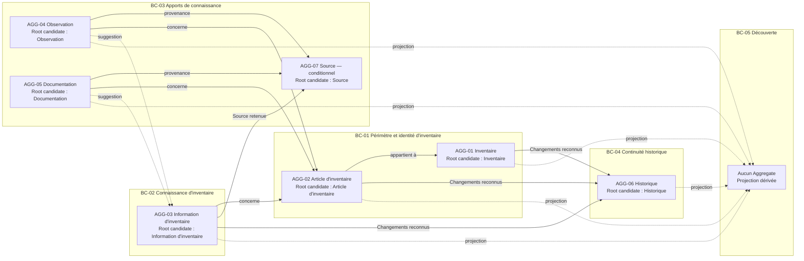

# Aggregate Analysis

## Purpose

Ce document analyse les frontières de cohérence métier du cœur Release 0.1 d'Inventaire. Il identifie des candidats Aggregate et Aggregate Root à partir des invariants Produit et des autorités définies dans `02_BOUNDED_CONTEXTS.md`.

Les candidats ne constituent pas encore un design définitif. Ils indiquent quelles décisions doivent produire un état métier cohérent en une seule transaction métier, quelles informations peuvent évoluer séparément et quelles dépendances doivent rester des références vers une autre autorité.

## Principes d'analyse

- Un Aggregate protège un ensemble minimal d'invariants qui doivent être vrais ensemble à la fin d'une décision métier.
- Une frontière n'est pas agrandie pour simplifier la consultation ou regrouper des informations souvent affichées ensemble.
- Une information possédée peut être modifiée par l'autorité de l'Aggregate ; une information référencée reste sous l'autorité de sa source.
- Une opération qui ne change aucune vérité métier n'impose pas à elle seule un Aggregate.
- Une cohérence différée n'est acceptable que si aucun invariant Produit n'exige un résultat immédiat et si l'état intermédiaire reste explicite.
- Les contraintes de volumétrie, de performance, de fonctionnement hors ligne et de continuité interdisent les Aggregates inutilement vastes.
- Les noms des candidats décrivent l'analyse. Ils n'ajoutent aucun concept au langage métier.

## Bounded Contexts 0.1 analysés

### BC-01 — Périmètre et identité d'inventaire

- **Décisions métier :** créer un Inventaire ; définir son périmètre ; reconnaître un Article d'inventaire ; établir son appartenance ; distinguer son identité ; corriger une identité ; faire évoluer son cycle de vie lorsque cette capacité sera admise.
- **Invariants protégés :** `INV-ID-001`, `INV-ID-002`, `INV-EXI-001`, `INV-EXI-002` ; contribution à `INV-HIS-001` et `INV-CHG-001`.
- **Modifications devant rester atomiques :** création d'un Inventaire valide ; reconnaissance simultanée de l'identité et de l'appartenance d'un nouvel Article ; remplacement d'une ancienne appartenance par une nouvelle ; correction d'identité sans double représentation active ; conservation du Changement significatif correspondant.
- **Informations pouvant évoluer indépendamment :** le but ou les limites explicites d'un Inventaire peuvent évoluer sans modifier la connaissance de chaque Article ; deux Articles distincts peuvent évoluer séparément si aucune décision d'identité ne les rapproche ; les Informations retenues relèvent de BC-02.
- **Dépendances externes :** BC-03 peut motiver une décision d'identité sans la prendre ; BC-04 doit conserver les Changements reconnus ; BC-02 référence l'identité mais ne la modifie pas.
- **Tension principale :** l'unicité et l'appartenance concernent l'ensemble d'un Inventaire, tandis que la volumétrie exige que l'évolution d'un Article n'engage pas systématiquement tous les autres Articles.

### BC-02 — Connaissance d'inventaire

- **Décisions métier :** accepter, maintenir, contester ou remplacer une Information ; reconnaître une Source ; rendre une incertitude ou une contradiction explicite ; reconnaître un Emplacement ou un Statut retenu ; déclarer un Changement significatif.
- **Invariants protégés :** `INV-TRA-001`, `INV-OBS-002`, `INV-LOC-001`, `INV-STA-001`, `INV-COH-001`, `INV-COH-002`, avec contribution à `INV-HIS-001` et `INV-CHG-001`.
- **Modifications devant rester atomiques :** remplacement d'une Information courante avec conservation de son état antérieur ; association de la Source à l'Information retenue ; arbitrage entre propositions incompatibles ; mise à jour conjointe de l'état retenu, de l'incertitude et du conflit ; reconnaissance du Changement historique correspondant.
- **Informations pouvant évoluer indépendamment :** deux Informations portant sur des sujets indépendants peuvent évoluer séparément ; une Observation ou une Documentation peut être ajoutée sans modifier Knowledge ; la consultation et la recherche ne modifient aucune Information.
- **Dépendances externes :** BC-01 fournit l'identité de l'Article ; BC-03 fournit des suggestions contextualisées ; BC-04 conserve les Changements ; BC-05 consomme une projection en lecture.
- **Tension principale :** un Aggregate trop large regroupant toute la connaissance d'un Article faciliterait les arbitrages globaux mais pénaliserait l'évolution indépendante de nombreuses Informations ; un Aggregate par Information exige de définir précisément quelles propositions sont mutuellement incompatibles.

### BC-03 — Apports de connaissance

- **Décisions métier :** conserver une Source ; enregistrer une Observation avec son contexte ; rattacher une Documentation au bon Article ; préserver la distinction entre constat, explication et Information retenue.
- **Invariants protégés en 0.1 :** `INV-TRA-001`, `INV-OBS-001`, `INV-OBS-002`, `INV-DOC-001`, `INV-COH-002`. Les invariants Evidence seront activés avec `CAP-004` en 0.5.
- **Modifications devant rester atomiques :** création d'une Observation avec sa Source, son contexte et son Article de référence ; création d'une Documentation avec sa Source, son contexte et son rattachement ; correction d'un apport sans perdre le sens de sa provenance initiale.
- **Informations pouvant évoluer indépendamment :** Observations et Documentations distinctes peuvent être ajoutées séparément ; leur conservation ne dépend pas de leur acceptation par BC-02 ; les détails d'une Source peuvent évoluer indépendamment seulement si cette évolution ne change pas rétroactivement la provenance déjà comprise.
- **Dépendances externes :** BC-01 fournit l'identité de l'Article ; BC-02 fournit la cible éventuelle d'une suggestion et conserve toute autorité d'acceptation ; BC-04 conserve un Changement significatif si une correction modifie le sens historique.
- **Tension principale :** Source peut être partagée par plusieurs apports, mais séparer son autorité ne doit jamais permettre une Observation ou une Documentation sans provenance compréhensible.

### BC-04 — Continuité historique

- **Décisions métier :** conserver un Changement reconnu ; relier état antérieur, décision source et état courant ; distinguer un Changement significatif d'une activité sans portée métier ; restituer le passé sans le réactiver.
- **Invariants protégés :** `INV-TRA-001`, `INV-HIS-001`, `INV-CHG-001`.
- **Modifications devant rester atomiques :** conservation du Changement avec l'identité de son sujet, son origine, l'état antérieur nécessaire et la décision reconnue ; ajout d'une continuité sans altération des Changements antérieurs.
- **Informations pouvant évoluer indépendamment :** les Historiques de deux Articles distincts peuvent progresser séparément ; la consultation d'un Historique ne modifie rien ; une projection de lecture peut être préparée indépendamment de l'autorité historique.
- **Dépendances externes :** BC-01 et BC-02 produisent le sens des Changements ; BC-04 ne peut pas le reconstituer seul ; BC-05 consomme une projection du passé.
- **Tension principale :** un Historique unique pour tout un Inventaire simplifierait la chronologie globale mais deviendrait un Aggregate croissant et fortement sollicité ; un Historique par sujet réduit cette taille mais doit préserver les Changements qui concernent simultanément l'Inventaire et un Article.

### BC-05 — Découverte

- **Décisions métier :** interpréter une intention de recherche, sélectionner des correspondances, les ordonner et signaler une absence de résultat.
- **Invariants protégés :** aucun invariant source n'est possédé ; BC-05 contribue à `INV-ID-001`, `INV-EXI-001`, `INV-COH-001` et `INV-COH-002` par une projection fidèle.
- **Modifications devant rester atomiques :** aucune modification de vérité métier. Une recherche doit restituer un résultat cohérent avec les projections qu'elle consulte au moment de son évaluation.
- **Informations pouvant évoluer indépendamment :** intention, correspondances et présentation peuvent évoluer sans modifier Inventory, Knowledge, Inputs ou History.
- **Dépendances externes :** BC-01 à BC-04 sont les autorités sources ; aucune dépendance inverse n'est autorisée.
- **Conclusion d'Aggregate :** aucun candidat Aggregate n'est justifié en 0.1. Search possède un comportement dérivé, mais aucun état métier durable dont la cohérence exigerait une Aggregate Root.

## Propriété des invariants

La colonne « peut modifier l'état concerné » désigne l'autorité sur les informations soumises à l'invariant. Aucun contexte ne peut modifier l'énoncé de l'invariant.

| Invariant | Propriétaire | Moment de vérification | Peut modifier l'état concerné | Ne peut jamais le modifier |
| --- | --- | --- | --- | --- |
| `INV-ID-001` — Identité distincte | BC-01 ; candidat Article d'inventaire avec contrôle au niveau de l'Inventaire | Inclusion, correction, transfert, décomposition ou rapprochement d'identités | BC-01 après arbitrage explicite | BC-02 à BC-09, Import futur |
| `INV-ID-002` — Identité indépendante du contexte mutable | BC-01 ; candidat Article d'inventaire | Toute évolution d'Emplacement, Statut, Catégorie, Catalogue ou Documentation | BC-01 uniquement pour une décision d'identité explicite | BC-02, BC-03, BC-05, BC-06 et contextes dérivés |
| `INV-EXI-001` — Inclusion explicite | BC-01 ; candidat Article d'inventaire | Création, inclusion et changement d'appartenance | BC-01 | Tous les autres contextes |
| `INV-EXI-002` — Existence distincte de la présence constatée | BC-01 ; candidat Article d'inventaire | Observation d'absence, recherche infructueuse, archivage ou réactivation | BC-01 après décision explicite | BC-03 et BC-05 par leurs seuls résultats |
| `INV-TRA-001` — Origine identifiable | BC-02 pour l'Information retenue ; BC-03 pour la Source | Enregistrement d'un apport et acceptation ou actualisation d'une Information | BC-03 sur la provenance ; BC-02 sur l'association retenue | BC-05, BC-08, BC-09 et Import futur |
| `INV-OBS-001` — Contexte préservé | BC-03 ; candidat Observation | Création ou correction d'une Observation | BC-03 sans effacer le sens antérieur | BC-02 et contextes dérivés |
| `INV-OBS-002` — Constat distinct de la conclusion | Frontière BC-03 vers BC-02 ; décision d'acceptation possédée par BC-02 | Toute utilisation d'une Observation pour actualiser Knowledge | BC-03 modifie l'Observation ; BC-02 modifie uniquement la connaissance retenue | Aucun des deux ne peut modifier silencieusement l'autorité de l'autre |
| `INV-EVD-001` — Élément probant identifiable | BC-03 à partir de 0.5 | Création ou rattachement d'un Élément probant | BC-03 | BC-02, BC-08, BC-09 |
| `INV-EVD-002` — Élément probant distinct de la vérité | Frontière BC-03 vers BC-02 à partir de 0.5 | Examen d'un Élément probant | BC-02 décide seulement de l'Information retenue | BC-03 ne peut pas imposer la vérité ; BC-09 ne peut pas l'inférer |
| `INV-EVD-003` — Contradiction conservée | BC-03 pour les Éléments ; BC-02 pour l'arbitrage | Apparition, examen et arbitrage d'Éléments incompatibles | Chaque contexte dans son autorité propre | BC-05, BC-08, BC-09 et Import futur |
| `INV-DOC-001` — Documentation distincte de l'objet et de l'autorité | BC-03 ; candidat Documentation | Création, rattachement et usage comme contexte ou Evidence | BC-03 sur Documentation ; BC-02 sur Knowledge | BC-01 ne change pas l'identité à partir du document ; aucun contexte dérivé ne lui confère une autorité |
| `INV-HIS-001` — Continuité des Changements significatifs | BC-04 ; candidat Historique | Toute décision reconnue comme Changement significatif | BC-04 ajoute la continuité ; le contexte source produit la décision | BC-04 ne modifie pas la décision ; BC-05, BC-08 et BC-09 ne modifient pas l'Historique |
| `INV-REL-001` — Relation explicite et signifiante | BC-07 à partir de 0.5 | Création ou évolution d'une Relation | BC-07 | BC-01, BC-02 et contextes dérivés |
| `INV-REL-002` — Absence d'implication cachée | BC-07 à partir de 0.5 | Interprétation ou utilisation d'une Relation | BC-07 sur le sens explicite | BC-02, BC-06, BC-09 ne peuvent pas ajouter une implication non reconnue |
| `INV-LOC-001` — Nature de la localisation explicite | BC-02 pour l'Emplacement retenu ; BC-03 pour la situation observée | Observation, acceptation et actualisation d'un Emplacement | BC-03 sur le constat ; BC-02 sur l'Information retenue | BC-05 et les contextes dérivés |
| `INV-CAT-001` — Organisation distincte du périmètre | BC-06 à partir de 0.5, avec identité protégée par BC-01 | Création ou retrait d'un rattachement organisationnel | BC-06 uniquement sur l'organisation | BC-06 ne modifie jamais identité ou appartenance ; BC-05 ne modifie ni l'une ni l'autre |
| `INV-CHG-001` — Changement explicable et non destructif | Contexte source pour la décision ; BC-04 pour sa continuité | Toute évolution reconnue comme significative | Le contexte source modifie son état ; BC-04 ajoute la représentation historique | BC-04 ne réécrit pas la source ; les contextes dérivés ne modifient aucun des deux |
| `INV-STA-001` — Statut contextualisé | BC-02 ; candidat Information d'inventaire | Acceptation ou actualisation d'un Statut | BC-02 après examen des apports | BC-01 ne le confond pas avec le cycle de vie ; BC-05, BC-08 et BC-09 |
| `INV-COH-001` — Conflit explicite | BC-02 ; candidat Information d'inventaire | Apparition ou arbitrage d'Informations incompatibles | BC-02 | BC-03 ne peut pas aplatir ses entrées ; les contextes dérivés ne peuvent pas arbitrer |
| `INV-COH-002` — L'inconnu reste inconnu | BC-02 pour la connaissance ; chaque contexte pour ses absences propres | Toute décision, projection ou restitution confrontée à une information insuffisante | BC-02 seulement après nouvel arbitrage justifié | BC-05, BC-08, BC-09 et Import futur ne peuvent pas créer une certitude |

## Candidats Aggregate

### AGG-01 — Inventaire

- **Bounded Context :** BC-01 — Périmètre et identité d'inventaire.
- **Mission :** maintenir l'existence, la finalité et les limites explicites d'un Inventaire comme périmètre de connaissance.
- **Frontière candidate :** un Inventaire et les décisions qui portent directement sur son propre périmètre ; les Articles sont référencés par leur appartenance reconnue, sans intégrer leur connaissance mutable.
- **Autorité :** existence et identité de l'Inventaire, finalité, limites du périmètre et état de cycle de vie de l'Inventaire.
- **Raisons d'existence :** un Inventaire doit être valide avant qu'un Article puisse lui appartenir ; ses limites peuvent évoluer indépendamment des Informations de chaque Article.
- **Invariants protégés :** `INV-EXI-001`, `INV-EXI-002` dans leur application à l'Inventaire ; contribution à `INV-CHG-001` et `INV-HIS-001`.
- **Informations possédées :** identité de l'Inventaire, but, limites explicites et état de cycle de vie.
- **Informations référencées :** identités des Articles qui déclarent leur appartenance ; Historique correspondant.
- **Informations interdites :** Informations d'inventaire des Articles, Observations, Sources, Documentation, résultats de recherche et organisation par Catalogue.
- **Niveau de confiance :** élevé.

### AGG-02 — Article d'inventaire

- **Bounded Context :** BC-01 — Périmètre et identité d'inventaire.
- **Mission :** préserver l'identité distincte, l'appartenance unique et la continuité du cycle de vie d'un Article.
- **Frontière candidate :** un Article d'inventaire avec son identité reconnue, son appartenance courante et son état de cycle de vie ; les connaissances qui le décrivent restent référencées.
- **Autorité :** identité de l'unité de gestion, appartenance à un Inventaire et état actif ou archivé.
- **Raisons d'existence :** les Articles évoluent indépendamment et leur nombre peut atteindre la volumétrie de référence ; les inclure tous dans AGG-01 créerait une frontière disproportionnée.
- **Invariants protégés :** `INV-ID-001`, `INV-ID-002`, `INV-EXI-001`, `INV-EXI-002`, avec contribution à `INV-CHG-001` et `INV-HIS-001`.
- **Informations possédées :** identité reconnue, définition de l'unité de gestion, appartenance et cycle de vie.
- **Informations référencées :** Inventaire d'appartenance, Historique de l'Article et existence de sa connaissance dans BC-02.
- **Informations interdites :** Information retenue, Observation, Documentation, Evidence, Catégorie, Relation et résultat dérivé comme constituants de l'identité.
- **Niveau de confiance :** élevé, sous réserve de formaliser le contrôle d'unicité à l'échelle de l'Inventaire.

### AGG-03 — Information d'inventaire

- **Bounded Context :** BC-02 — Connaissance d'inventaire.
- **Mission :** maintenir une affirmation cohérente actuellement retenue à propos d'un Article, avec sa Source, son niveau d'incertitude et ses alternatives incompatibles.
- **Frontière candidate :** une unité de connaissance dont les propositions peuvent être arbitrées ensemble parce qu'elles répondent à la même question sur un Article.
- **Autorité :** Information actuellement retenue, décision d'arbitrage, état inconnu ou incertain et conflit associé.
- **Raisons d'existence :** des Informations indépendantes doivent pouvoir évoluer séparément ; les alternatives incompatibles doivent cependant rester dans une même frontière de cohérence pour éviter plusieurs vérités non contestées.
- **Invariants protégés :** `INV-TRA-001`, `INV-OBS-002`, `INV-LOC-001`, `INV-STA-001`, `INV-COH-001`, `INV-COH-002`, avec contribution à `INV-CHG-001` et `INV-HIS-001`.
- **Informations possédées :** question ou sujet de connaissance, état retenu, décision d'arbitrage, incertitude et conflit.
- **Informations référencées :** Article de BC-01 ; Source, Observation et Documentation de BC-03 ; Historique de BC-04.
- **Informations interdites :** identité de l'Article, contenu original des apports, réécriture du passé, résultat de recherche ou comparaison comme décision automatique.
- **Niveau de confiance :** moyen à élevé ; la granularité exacte d'une « même question » doit être confirmée dans l'Aggregate Design.

### AGG-04 — Observation

- **Bounded Context :** BC-03 — Apports de connaissance.
- **Mission :** préserver un constat unique avec la provenance et le contexte nécessaires à son interprétation.
- **Frontière candidate :** une Observation, son contexte, sa relation à une Source et son rattachement à l'objet observé.
- **Autorité :** contenu constaté, circonstances et provenance de l'Observation.
- **Raisons d'existence :** une Observation existe indépendamment de son acceptation et ne doit pas être modifiée par l'arbitrage qu'elle peut motiver.
- **Invariants protégés :** `INV-TRA-001`, `INV-OBS-001`, `INV-OBS-002`, `INV-LOC-001`, `INV-COH-002`.
- **Informations possédées :** constat, contexte, moment métier pertinent et association explicite à sa provenance.
- **Informations référencées :** Article de BC-01, Source candidate AGG-07 et éventuelle Information cible de BC-02.
- **Informations interdites :** Information retenue, décision d'identité, vérité garantie ou changement automatique de Statut ou d'Emplacement.
- **Niveau de confiance :** élevé.

### AGG-05 — Documentation

- **Bounded Context :** BC-03 — Apports de connaissance.
- **Mission :** préserver une explication contextualisée et sourcée concernant un Article.
- **Frontière candidate :** une Documentation, son contexte, son rattachement et sa provenance.
- **Autorité :** contenu explicatif, contexte, rattachement et Source documentaire.
- **Raisons d'existence :** la Documentation évolue indépendamment des Observations et de Knowledge, et sa seule présence ne lui confère aucune autorité supplémentaire.
- **Invariants protégés :** `INV-TRA-001`, `INV-DOC-001`, `INV-COH-002`.
- **Informations possédées :** contenu explicatif, contexte et association explicite à l'objet documenté.
- **Informations référencées :** Article de BC-01, Source candidate AGG-07 et éventuelle cible de Knowledge.
- **Informations interdites :** identité de l'Article, Information retenue, rôle probant implicite et décision d'arbitrage.
- **Niveau de confiance :** élevé.

### AGG-06 — Historique

- **Bounded Context :** BC-04 — Continuité historique.
- **Mission :** conserver la continuité des Changements significatifs pour un sujet suivi.
- **Frontière candidate :** un Historique rattaché soit à un Inventaire, soit à un Article, avec les Changements reconnus qui assurent sa continuité logique.
- **Autorité :** conservation de l'état antérieur, de la décision source et de leur relation avec l'état courant.
- **Raisons d'existence :** les Changements d'un sujet doivent former une histoire cohérente, tandis que les sujets distincts doivent pouvoir évoluer indépendamment.
- **Invariants protégés :** `INV-TRA-001`, `INV-HIS-001`, `INV-CHG-001`.
- **Informations possédées :** continuité, ordre métier des Changements, état antérieur nécessaire et origine de la décision.
- **Informations référencées :** sujet de BC-01, décision de BC-01 ou BC-02, Source de BC-03 et état courant correspondant.
- **Informations interdites :** pouvoir de modifier l'état courant, réinterprétation de la décision source et activités sans portée métier.
- **Niveau de confiance :** moyen à élevé ; la frontière logique est claire, mais sa croissance doit être traitée sans fragmenter l'autorité historique.

### AGG-07 — Source

- **Bounded Context :** BC-03 — Apports de connaissance.
- **Mission :** préserver l'identité et la compréhension d'une provenance réutilisée par plusieurs apports.
- **Frontière candidate :** une Source avec les informations nécessaires pour l'identifier et comprendre son origine, indépendamment du contenu qu'elle source.
- **Autorité :** identité et description de la provenance.
- **Raisons d'existence :** une Source peut être commune à plusieurs Observations ou Documentations et peut nécessiter une correction indépendante ; une autorité unique évite des provenances divergentes.
- **Invariants protégés :** contribution à `INV-TRA-001`, `INV-OBS-001` et `INV-DOC-001`.
- **Informations possédées :** identité de provenance et contexte commun qui ne dépend pas d'un apport particulier.
- **Informations référencées :** apports qui l'utilisent, sans posséder leur contenu.
- **Informations interdites :** Information retenue, rôle probant automatique, vérité ou autorité sur l'Article.
- **Niveau de confiance :** conditionnel. Si une Source n'a ni réutilisation ni évolution indépendante, elle devrait rester dans la frontière de l'Observation ou de la Documentation afin d'éviter une fragmentation artificielle.

## Aggregate Roots candidates

| Aggregate candidat | Aggregate Root candidate | Justification |
| --- | --- | --- |
| AGG-01 Inventaire | **Inventaire** | Toute décision sur le périmètre et le cycle de vie de l'Inventaire doit être adressée à son identité canonique. |
| AGG-02 Article d'inventaire | **Article d'inventaire** | Il est l'unité dont l'identité, l'appartenance et la continuité doivent rester cohérentes ensemble. |
| AGG-03 Information d'inventaire | **Information d'inventaire** | Elle porte l'acceptation, l'incertitude et les alternatives incompatibles répondant à une même question. |
| AGG-04 Observation | **Observation** | Elle protège son constat, son contexte et sa provenance contre toute modification externe. |
| AGG-05 Documentation | **Documentation** | Elle gouverne son contenu, son rattachement et son rôle explicatif sans dépendre de son usage par Knowledge. |
| AGG-06 Historique | **Historique** | Il est le point d'entrée de la continuité d'un sujet et le seul autorisé à conserver ses Changements reconnus. |
| AGG-07 Source | **Source**, sous condition | Elle n'est une Root pertinente que si son identité ou son évolution est partagée par plusieurs apports. |

Ces choix n'établissent aucune structure interne. Ils identifient seulement le concept auquel une décision métier doit être adressée pour protéger la frontière candidate.

## Frontières transactionnelles métier

### Transactions devant rester atomiques

| Transaction métier | Candidats concernés | Cohérence exigée |
| --- | --- | --- |
| Créer un Inventaire | AGG-01 | Identité, but, limites et existence valide apparaissent ensemble ; aucun Inventaire partiel n'est reconnu. |
| Inclure un Article | AGG-01 et AGG-02, frontière à confirmer | L'Inventaire cible existe, l'identité est distinguable et l'appartenance unique est reconnue avant tout succès. Aucun Article sans Inventaire ni appartenance concurrente n'est admis. |
| Corriger l'identité ou l'appartenance d'un Article | AGG-02, avec contrôle du périmètre AGG-01 | Ancienne et nouvelle positions ne peuvent pas être simultanément actives ; la continuité reste explicable. |
| Accepter ou actualiser une Information | AGG-03 | État antérieur, nouvel état, Source, incertitude, conflit et arbitrage produisent une connaissance cohérente ensemble. |
| Conserver une Observation | AGG-04 et provenance AGG-07 si distincte | Constat, contexte, Source et Article de référence sont tous compréhensibles ou l'Observation n'est pas reconnue. |
| Conserver une Documentation | AGG-05 et provenance AGG-07 si distincte | Contenu, contexte, Source et rattachement sont cohérents ou la Documentation n'est pas reconnue. |
| Conserver un Changement significatif | Aggregate source et AGG-06 | Une décision ne peut être déclarée accomplie si la continuité exigée par `INV-HIS-001` n'est pas préservée. |
| Arbitrer une contradiction | AGG-03 | Les propositions incompatibles, la position retenue et l'incertitude restante sont mises à jour comme une seule décision. |

Les lignes qui impliquent plusieurs candidats constituent des tests de frontière pour l'Aggregate Design. Le design devra soit démontrer une frontière unique pour la décision, soit définir un état métier intermédiaire explicitement autorisé. Aucun état intermédiaire incohérent n'est actuellement admis par le produit.

### Évolutions indépendantes

- Deux Articles distincts peuvent évoluer séparément si aucune décision d'identité ou d'appartenance ne les met en conflit.
- Deux Informations d'un même Article peuvent évoluer séparément si elles ne répondent pas à la même question et ne créent aucune contradiction.
- Une Observation et une Documentation peuvent être conservées indépendamment l'une de l'autre et indépendamment de leur éventuelle acceptation par Knowledge.
- Les Historiques de sujets distincts peuvent progresser séparément.
- Une recherche peut être effectuée sans modifier aucun Aggregate.

### Opérations éventuellement asynchrones

- La prise en compte d'une Observation ou d'une Documentation par Knowledge peut être différée : l'apport reste conservé comme suggestion tant qu'aucun arbitrage n'a eu lieu.
- Les projections utilisées par Search peuvent être actualisées de manière asynchrone si une modification récemment reconnue reste retrouvable selon les Acceptance Criteria et si toute obsolescence perceptible ne produit pas une fausse certitude.
- La préparation d'une sauvegarde peut être asynchrone si sa portée et sa fraîcheur restent identifiables et si aucun échec n'est silencieux.
- La préparation d'une restitution future peut être asynchrone ; elle ne fait pas partie du Scope 0.1.

Ne peuvent pas être différés après confirmation de la décision métier : la reconnaissance de l'identité et de l'appartenance, l'association d'une Source à une Information retenue, l'arbitrage d'un conflit et la conservation du Changement significatif exigée par l'Historique.

## Diagramme des candidats Aggregate

Les flèches pleines représentent une référence d'autorité nécessaire à une décision. Les flèches en pointillés représentent une contribution qui peut être examinée ultérieurement. BC-05 apparaît sans Aggregate pour rendre explicite sa nature dérivée.

## Traçabilité des candidats

| Aggregate candidat | Bounded Context | Invariants principaux | Acceptance Criteria | Architecture Constraints principales |
| --- | --- | --- | --- | --- |
| AGG-01 Inventaire | BC-01 | `INV-EXI-001`, `INV-EXI-002`, `INV-CHG-001`, `INV-HIS-001` | `AC-01-CAP-001`, `AC-01-GLO-001`, `AC-01-GLO-008`, `AC-01-GLO-009` | `ARC-CON-001`, `ARC-CON-002`, `ARC-CON-003`, `ARC-CON-005`, `ARC-CON-006`, `ARC-CON-009`, `ARC-CON-013`, `ARC-CON-017` |
| AGG-02 Article d'inventaire | BC-01 | `INV-ID-001`, `INV-ID-002`, `INV-EXI-001`, `INV-EXI-002`, `INV-CHG-001`, `INV-HIS-001` | `AC-01-CAP-002`, `AC-01-GLO-002`, `AC-01-GLO-007`, `AC-01-GLO-009` | `ARC-CON-001`, `ARC-CON-002`, `ARC-CON-003`, `ARC-CON-008`, `ARC-CON-009`, `ARC-CON-013`, `ARC-CON-017` |
| AGG-03 Information d'inventaire | BC-02 | `INV-TRA-001`, `INV-OBS-002`, `INV-LOC-001`, `INV-STA-001`, `INV-COH-001`, `INV-COH-002` | `AC-01-CAP-006`, `AC-01-GLO-003` à `AC-01-GLO-009` | `ARC-CON-002`, `ARC-CON-003`, `ARC-CON-005`, `ARC-CON-006`, `ARC-CON-008`, `ARC-CON-009`, `ARC-CON-015`, `ARC-CON-016`, `ARC-CON-017` |
| AGG-04 Observation | BC-03 | `INV-TRA-001`, `INV-OBS-001`, `INV-OBS-002`, `INV-LOC-001`, `INV-COH-002` | `AC-01-CAP-003`, `AC-01-GLO-003`, `AC-01-GLO-005`, `AC-01-GLO-006` | `ARC-CON-001`, `ARC-CON-002`, `ARC-CON-003`, `ARC-CON-005`, `ARC-CON-013`, `ARC-CON-014`, `ARC-CON-015`, `ARC-CON-017` |
| AGG-05 Documentation | BC-03 | `INV-TRA-001`, `INV-DOC-001`, `INV-COH-002` | `AC-01-CAP-005`, `AC-01-GLO-003`, `AC-01-GLO-006` | `ARC-CON-001`, `ARC-CON-002`, `ARC-CON-003`, `ARC-CON-005`, `ARC-CON-013`, `ARC-CON-014`, `ARC-CON-015`, `ARC-CON-017` |
| AGG-06 Historique | BC-04 | `INV-TRA-001`, `INV-HIS-001`, `INV-CHG-001` | `AC-01-CAP-011`, `AC-01-GLO-004`, `AC-01-GLO-007`, `AC-01-GLO-008`, `AC-01-GLO-009` | `ARC-CON-003`, `ARC-CON-005`, `ARC-CON-006`, `ARC-CON-008`, `ARC-CON-009`, `ARC-CON-013`, `ARC-CON-015`, `ARC-CON-016`, `ARC-CON-017` |
| AGG-07 Source | BC-03 | `INV-TRA-001`, `INV-OBS-001`, `INV-DOC-001` | `AC-01-GLO-003`, plus les critères des apports concernés | `ARC-CON-001`, `ARC-CON-002`, `ARC-CON-003`, `ARC-CON-005`, `ARC-CON-013`, `ARC-CON-014`, `ARC-CON-015`, `ARC-CON-017` |

BC-05 reste relié à `AC-01-CAP-009`, `AC-01-GLO-001`, `AC-01-GLO-002`, `ARC-CON-003`, `ARC-CON-008`, `ARC-CON-009` et `ARC-CON-013`, sans candidat Aggregate.

## Risques identifiés

### Surdimensionnement

| Risque | Cause | Impact | Prévention pour l'Aggregate Design |
| --- | --- | --- | --- |
| Inventaire contenant tous les Articles | Volonté de garantir toute appartenance dans une seule frontière | Chaque évolution engagerait jusqu'à 5 000 Articles et compromettrait performance et autonomie | Limiter AGG-01 au périmètre et tester AGG-02 comme unité d'identité, avec une règle explicite d'inclusion. |
| Toute la connaissance d'un Article dans AGG-03 | Volonté d'arbitrer tous les conflits ensemble | Des Informations indépendantes ne pourraient plus évoluer séparément | Définir la granularité par question cohérente et n'agréger que les alternatives réellement incompatibles. |
| Historique illimité dans une seule frontière | Volonté de conserver une chronologie globale unique | Croissance continue, forte contention conceptuelle et consultation coûteuse | Scoper AGG-06 par sujet suivi tout en préservant les Changements transverses explicitement reliés. |

### Fragmentation

| Risque | Cause | Impact | Prévention pour l'Aggregate Design |
| --- | --- | --- | --- |
| Source séparée sans autonomie réelle | Création systématique d'AGG-07 | Observation ou Documentation pourrait exister sans provenance cohérente | Ne retenir AGG-07 que si partage ou évolution indépendante est démontré ; sinon inclure la provenance dans AGG-04 ou AGG-05. |
| Une Information par valeur isolée | Granularité trop fine d'AGG-03 | Alternatives incompatibles acceptées dans plusieurs frontières | Regrouper les propositions répondant à une même question de connaissance. |
| Changement séparé de sa décision source | BC-04 traité comme autorité du sens | Historique impossible à expliquer ou décision confirmée sans continuité | Faire de la conservation historique une partie obligatoire de la transaction métier significative. |

### Duplication d'autorité

| Risque | Autorités concurrentes possibles | Impact | Prévention pour l'Aggregate Design |
| --- | --- | --- | --- |
| Appartenance dupliquée | AGG-01 et AGG-02 | Inventaire et Article déclarent des appartenances incompatibles | Désigner AGG-02 comme propriétaire de l'appartenance et AGG-01 comme autorité du périmètre cible, ou revoir la frontière ; ne jamais conserver deux décisions modifiables. |
| Identité reproduite dans Knowledge | AGG-02 et AGG-03 | Une Information mutable redéfinit l'Article | AGG-03 référence l'identité de BC-01 sans la posséder. |
| Source dupliquée dans plusieurs apports | AGG-04, AGG-05 et AGG-07 | Provenances divergentes sous un même nom | Choisir une seule autorité selon que Source est autonome ou incluse ; les autres frontières conservent une référence ou une copie historique non modifiable. |
| Changement possédé par History | Aggregate source et AGG-06 | Le passé réinterprète la décision actuelle | La source possède le sens ; AGG-06 possède uniquement la continuité historique. |

## Décisions à prendre pendant l'Aggregate Design

Les points suivants sont des décisions de design, non des lacunes Produit :

1. confirmer comment AGG-01 valide le périmètre sans dupliquer l'appartenance possédée par AGG-02 ;
2. définir la granularité qui fait de plusieurs propositions une seule question cohérente dans AGG-03 ;
3. confirmer si Source mérite AGG-07 ou reste incluse dans les apports ;
4. définir le sujet et la croissance logique d'AGG-06 sans perdre les Changements transverses ;
5. démontrer comment toute décision significative et sa continuité historique forment une seule transaction métier ;
6. confirmer qu'aucun état intermédiaire incohérent n'est nécessaire aux opérations d'inclusion, d'arbitrage et de correction d'identité.

## Conclusion

**READY FOR AGGREGATE DESIGN**

Les invariants, autorités, opérations atomiques et dépendances du cœur 0.1 font émerger six candidats Aggregate solides et un candidat conditionnel. BC-05 ne requiert aucun Aggregate, ce qui évite de transformer une projection dérivée en autorité métier.

Les tensions restantes concernent la forme précise des frontières, en particulier l'appartenance entre AGG-01 et AGG-02, la granularité d'AGG-03, l'autonomie de Source et la croissance d'AGG-06. Elles sont explicitement circonscrites et constituent le travail normal de l'Aggregate Design ; aucune décision Produit supplémentaire n'est nécessaire avant de l'ouvrir.
