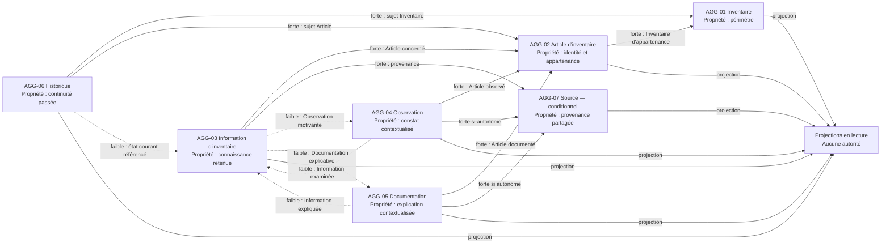

# Aggregate Ownership Model

## Purpose

Ce document précise les frontières de propriété métier des candidats Aggregate identifiés dans `03_AGGREGATE_ANALYSIS.md`. Il détermine quelles informations chaque Aggregate possède, référence, projette, calcule ou conserve comme valeur historique.

Le modèle empêche qu'une même vérité soit modifiable depuis plusieurs Aggregate Roots. Il ne décrit aucune structure interne ni aucun mécanisme de réalisation.

## Catégories de propriété

- **Propriété exclusive :** information canonique que seule l'Aggregate Root propriétaire peut créer ou modifier dans son périmètre.
- **Référence :** identité d'une information possédée par un autre Aggregate. La référence ne transfère aucun pouvoir de modification.
- **Projection :** représentation en lecture d'une information externe. Elle peut être reproduite pour un usage dérivé, mais ne devient jamais canonique.
- **Valeur calculée :** résultat obtenu à partir d'informations autorisées sans nouvelle décision métier. Elle ne remplace pas ses sources.
- **Valeur historique :** représentation d'un état ou d'une décision passée possédée par AGG-06. Elle explique le passé sans devenir l'état courant.

Une copie destinée à la consultation est toujours une Projection. Elle doit rester rattachable à sa source et ne peut pas être modifiée comme une Propriété exclusive.

## Types de référence

- **Référence forte :** la décision de l'Aggregate référent n'est valide que si l'identité référencée est reconnue par son autorité. La référence demeure valable lorsque l'objet sort de l'usage courant.
- **Référence faible :** le lien apporte un contexte utile mais son absence n'invalide pas la cohérence propre de l'Aggregate.
- **Référence dérivée :** le lien est reconstruit depuis les autorités sources pour la consultation ; il n'appartient pas à l'Aggregate qui l'affiche.
- **Aucune référence :** aucune dépendance métier n'est justifiée entre les deux Aggregates.

## Règles générales d'autorité

- Seule l'Aggregate Root propriétaire reconnaît la création ou la modification d'une Propriété exclusive.
- Un autre Bounded Context peut suggérer ou demander une décision, jamais modifier directement l'Aggregate.
- Aucune suppression métier n'est autorisée dans le Scope 0.1. Une correction conserve la continuité historique ; l'archivage futur ne sera pas une suppression.
- Une Projection ne peut pas être utilisée pour réparer ou remplacer silencieusement sa source.
- Une Valeur calculée doit pouvoir être expliquée à partir de ses informations sources et ne possède aucune autorité indépendante.
- Une Valeur historique ne peut être corrigée pour ressembler au présent ; toute rectification devient un nouveau Changement explicable.

## Modèles de propriété par Aggregate

### AGG-01 — Inventaire

#### Autorité

AGG-01 possède l'existence, l'identité et le périmètre de l'Inventaire. Il ne possède pas l'appartenance de chaque Article : cette décision appartient à AGG-02. L'ensemble des Articles appartenant à l'Inventaire est donc une Projection dérivée des appartenances canoniques.

#### Classification des informations

| Information | Classification | Règle de propriété |
| --- | --- | --- |
| Identité de l'Inventaire | Propriété exclusive | Créée et modifiée uniquement par BC-01 au travers de la Root Inventaire. |
| Finalité de l'Inventaire | Propriété exclusive | Évolue comme décision portant sur le périmètre, avec continuité si le changement est significatif. |
| Limites du périmètre | Propriété exclusive | Définissent ce que l'Inventaire cherche à couvrir sans inclure implicitement un Article. |
| État de cycle de vie de l'Inventaire | Propriété exclusive | Appartient à AGG-01 lorsque cette capacité est admise ; l'archivage ne supprime pas l'Inventaire. |
| Articles appartenant à l'Inventaire | Projection | Dérivée des appartenances possédées par AGG-02 ; elle n'est jamais une seconde liste modifiable. |
| Nombre d'Articles | Valeur calculée | Calculé depuis la Projection d'appartenance et sans effet sur les Articles. |
| Anciennes finalités, limites ou états | Valeur historique | Possédées par AGG-06, uniquement projetées par AGG-01 lorsque nécessaire. |

#### Ce qu'AGG-01 référence

- **Référence dérivée** vers les Articles dont AGG-02 reconnaît l'appartenance.
- **Référence faible** vers son Historique pour la consultation ; l'existence courante ne dépend pas d'une reconstruction du passé.

#### Ce qu'AGG-01 ne doit jamais posséder

- l'identité détaillée ou l'appartenance canonique d'un Article ;
- une Information d'inventaire, une Observation, une Source ou une Documentation ;
- une Catégorie, une Relation ou un résultat de recherche ;
- une copie modifiable de son Historique.

#### Autorisations

- **Créer :** BC-01, à la suite d'une décision explicite de création d'Inventaire.
- **Modifier :** BC-01 uniquement, pour une décision portant sur la finalité, les limites ou le cycle de vie de l'Inventaire.
- **Supprimer :** personne dans le Scope 0.1 ; une future sortie d'usage relève de l'archivage et conserve l'existence historique.
- **Consulter uniquement :** BC-02 à BC-09 selon leur Scope, au moyen d'une Projection.

### AGG-02 — Article d'inventaire

#### Autorité

AGG-02 possède l'identité de l'Article, la définition de son unité de gestion, son appartenance unique et son cycle de vie. AGG-01 confirme l'existence du périmètre cible mais ne conserve pas une appartenance concurrente.

#### Classification des informations

| Information | Classification | Règle de propriété |
| --- | --- | --- |
| Identité de l'Article | Propriété exclusive | Ne dépend pas d'une Information mutable, d'une Catégorie, d'une Relation ou d'un résultat dérivé. |
| Définition de l'unité de gestion | Propriété exclusive | Distingue un bien individuel d'un ensemble volontairement indivisible. |
| Appartenance à un Inventaire | Propriété exclusive | Une seule appartenance courante est reconnue à un instant donné. |
| État actif ou archivé de l'Article | Propriété exclusive | Appartient à AGG-02 lorsque Lifecycle and Archive est admis. |
| Inventaire d'appartenance | Référence forte | Pointe vers AGG-01 ; l'inclusion n'est valide que si l'Inventaire est reconnu. |
| Connaissance actuelle de l'Article | Projection | Dérivée des AGG-03 associés ; elle ne participe pas à l'identité. |
| Emplacement et Statut retenus | Projection | Possédés par AGG-03 dans BC-02. |
| Observations et Documentation associées | Projection | Dérivées d'AGG-04 et AGG-05. |
| Anciennes identités, appartenances ou états | Valeur historique | Possédées par AGG-06 ; AGG-02 ne possède que l'état courant. |

#### Ce qu'AGG-02 référence

- **Référence forte** vers AGG-01, autorité du périmètre d'appartenance.
- **Références dérivées** vers AGG-03, AGG-04, AGG-05 et AGG-06 pour la consultation.
- **Aucune référence nécessaire** vers Search, Catalogs, Relationships, Comparison, Export ou Sharing pour établir son identité.

#### Ce qu'AGG-02 ne doit jamais posséder

- la finalité ou les limites de l'Inventaire ;
- les Informations retenues, Observations, Sources ou Documentation ;
- le classement, les Relations ou les résultats dérivés ;
- plusieurs appartenances courantes ;
- un état historique modifiable.

#### Autorisations

- **Créer :** BC-01, après validation de l'Inventaire cible et reconnaissance d'une identité distinguable.
- **Modifier :** BC-01 uniquement, après arbitrage explicite d'identité, d'appartenance ou de cycle de vie.
- **Supprimer :** personne ; une correction ou un archivage conserve la continuité et ne détruit pas l'existence historique.
- **Consulter uniquement :** tous les autres contextes autorisés, comme identité source.

### AGG-03 — Information d'inventaire

#### Autorité

AGG-03 possède une unité cohérente de connaissance répondant à une même question sur un Article. Elle possède l'état retenu, l'arbitrage, l'incertitude et le conflit ; elle ne possède ni l'Article ni les apports examinés.

#### Classification des informations

| Information | Classification | Règle de propriété |
| --- | --- | --- |
| Question ou sujet de connaissance | Propriété exclusive | Délimite quelles propositions doivent être arbitrées ensemble. Sa granularité sera confirmée dans l'Aggregate Design. |
| Information actuellement retenue | Propriété exclusive | Seule BC-02 peut la reconnaître ou la remplacer. |
| Décision d'arbitrage | Propriété exclusive | Explique pourquoi une proposition est retenue, contestée ou laissée inconnue. |
| Incertitude courante | Propriété exclusive | Évolue avec l'état retenu et ne peut pas être masquée par un consommateur. |
| Conflit courant | Propriété exclusive | Regroupe les propositions incompatibles dans la même frontière de cohérence. |
| Association à la Source retenue | Propriété exclusive | Le lien est possédé par AGG-03 ; la Source elle-même appartient à AGG-07 ou à l'apport qui la contient. |
| Article concerné | Référence forte | Pointe vers AGG-02 ; aucune Information n'existe sans sujet reconnu. |
| Source retenue | Référence forte | Pointe vers AGG-07 si Source est autonome, sinon vers l'apport sourcé qui établit la provenance. |
| Observation ou Documentation motivante | Référence faible | Conserve l'explication disponible sans transférer le contenu de l'apport. |
| Présentation de la provenance | Projection | Dérivée de BC-03 et non modifiable depuis AGG-03. |
| Degré de complétude éventuel | Valeur calculée | Ne peut pas transformer l'absence en certitude ni devenir un Statut implicite. |
| États retenus et arbitrages antérieurs | Valeur historique | Possédés par AGG-06 ; AGG-03 porte uniquement l'état courant. |

#### Ce qu'AGG-03 référence

- **Référence forte** vers AGG-02.
- **Référence forte** vers la provenance canonique de BC-03.
- **Références faibles** vers AGG-04 et AGG-05 lorsqu'ils motivent l'arbitrage.
- **Référence dérivée** vers AGG-06 pour expliquer les états antérieurs.

#### Ce qu'AGG-03 ne doit jamais posséder

- l'identité ou l'appartenance de l'Article ;
- le contenu original d'une Observation, d'une Documentation ou d'une Source ;
- un résultat de recherche ou de comparaison comme vérité ;
- une copie modifiable d'un état antérieur ;
- deux Informations incompatibles présentées comme certaines et non contestées.

#### Autorisations

- **Créer :** BC-02, lorsqu'une question de connaissance est explicitement ouverte et qu'une première position est retenue, inconnue ou contestée.
- **Modifier :** BC-02 uniquement, après arbitrage explicite et avec une provenance identifiable.
- **Supprimer :** personne ; une Information remplacée ou devenue sans objet conserve sa continuité historique et ne disparaît pas silencieusement.
- **Consulter uniquement :** BC-01 pour le contexte, BC-04 pour la continuité, BC-05 et les contextes dérivés comme Projection.

### AGG-04 — Observation

#### Autorité

AGG-04 possède un constat contextualisé. Il ne possède aucune conclusion acceptée et ne peut pas modifier AGG-03.

#### Classification des informations

| Information | Classification | Règle de propriété |
| --- | --- | --- |
| Identité de l'Observation | Propriété exclusive | Distingue le constat des autres apports. |
| Contenu constaté | Propriété exclusive | Préserve ce qui a été observé sans le transformer en conclusion. |
| Contexte de l'Observation | Propriété exclusive | Rend les circonstances compréhensibles. |
| Association à la provenance | Propriété exclusive | Le lien à la Source fait partie de la validité de l'Observation. |
| Article observé | Référence forte | Pointe vers AGG-02. |
| Source | Référence forte | Pointe vers AGG-07 si autonome, sinon la provenance est possédée dans AGG-04. |
| Information éventuellement examinée | Référence faible | Une Observation peut exister sans être liée à AGG-03. |
| Effet sur la connaissance retenue | Projection | Dérivé de la décision de BC-02 ; il ne modifie pas l'Observation. |
| Interprétation ou degré de confiance | Valeur calculée éventuelle | Reste non autoritaire et ne devient jamais une Information retenue sans arbitrage. |
| Versions antérieures après correction significative | Valeur historique | Possédées par AGG-06 si la correction change le sens du constat. |

#### Ce qu'AGG-04 référence

- **Référence forte** vers AGG-02 et vers la provenance canonique.
- **Référence faible** vers AGG-03 si l'Observation concerne explicitement une Information.
- **Référence dérivée** vers AGG-06 pour sa continuité éventuelle.

#### Ce qu'AGG-04 ne doit jamais posséder

- une Information retenue, un arbitrage ou un Statut accepté ;
- l'identité de l'Article ;
- une vérité garantie ;
- une Documentation ou un Élément probant confondu avec le constat ;
- un état historique réécrit.

#### Autorisations

- **Créer :** BC-03, après rattachement à un Article reconnu et à une provenance identifiable.
- **Modifier :** BC-03 uniquement pour une correction explicable qui préserve le contexte et, si nécessaire, sa continuité historique.
- **Supprimer :** personne dans le Scope 0.1 ; une Observation devenue contestée reste distinguable de la connaissance actuelle.
- **Consulter uniquement :** BC-02, BC-04, BC-05 et les contextes dérivés selon leur Scope.

### AGG-05 — Documentation

#### Autorité

AGG-05 possède une explication contextualisée et son rattachement. Il ne possède ni le bien décrit, ni la connaissance retenue, ni un rôle probant automatique.

#### Classification des informations

| Information | Classification | Règle de propriété |
| --- | --- | --- |
| Identité de la Documentation | Propriété exclusive | Distingue cette explication des autres apports. |
| Contenu explicatif | Propriété exclusive | Reste distinct du bien et de toute vérité acceptée. |
| Contexte documentaire | Propriété exclusive | Permet de comprendre la portée et les limites du contenu. |
| Rattachement à l'objet documenté | Propriété exclusive | Déclare ce que la Documentation explique. |
| Association à la provenance | Propriété exclusive | Rend la Source identifiable sans en transférer la propriété. |
| Article documenté | Référence forte | Pointe vers AGG-02. |
| Source | Référence forte | Pointe vers AGG-07 si autonome, sinon la provenance est possédée dans AGG-05. |
| Information éventuellement expliquée | Référence faible | La Documentation peut expliquer un Article sans cibler une Information particulière. |
| Usage par Knowledge ou Search | Projection | Appartient aux contextes consommateurs et ne change pas le rôle de la Documentation. |
| Indicateur de présence ou de disponibilité | Valeur calculée | N'établit ni qualité, ni exactitude, ni autorité du contenu. |
| Versions antérieures après correction significative | Valeur historique | Possédées par AGG-06 lorsque leur sens doit rester compréhensible. |

#### Ce qu'AGG-05 référence

- **Référence forte** vers AGG-02 et vers la provenance canonique.
- **Référence faible** vers AGG-03 lorsqu'une Information est explicitement expliquée.
- **Référence dérivée** vers AGG-06 pour sa continuité éventuelle.

#### Ce qu'AGG-05 ne doit jamais posséder

- l'identité de l'Article ou sa connaissance actuelle ;
- une Observation ou un Élément probant implicite ;
- une décision d'arbitrage ;
- une copie modifiable de sa Source si AGG-07 est retenu ;
- l'autorité provenant de sa seule existence.

#### Autorisations

- **Créer :** BC-03, avec objet, contexte et provenance explicites.
- **Modifier :** BC-03 uniquement, en conservant le sens antérieur lorsqu'une correction est significative.
- **Supprimer :** personne dans le Scope 0.1 ; une Documentation obsolète ou contestée doit rester compréhensible comme telle.
- **Consulter uniquement :** BC-02, BC-04, BC-05 et les contextes dérivés autorisés.

### AGG-06 — Historique

#### Autorité

AGG-06 possède la continuité historique d'un sujet suivi. Il ne possède ni l'état courant ni le sens initial de la décision qui a produit un Changement.

#### Classification des informations

| Information | Classification | Règle de propriété |
| --- | --- | --- |
| Identité de l'Historique | Propriété exclusive | Délimite la continuité d'un Inventaire ou d'un Article. |
| Sujet suivi | Référence forte | Pointe vers AGG-01 ou AGG-02 et demeure valable après archivage. |
| Changement historique reconnu | Valeur historique et Propriété exclusive | AGG-06 possède sa conservation ; le contexte source conserve le sens de la décision. |
| État antérieur nécessaire | Valeur historique | Conservé pour expliquer la transition sans redevenir courant. |
| Origine de la décision | Référence forte | Pointe vers l'autorité et la provenance qui ont reconnu le Changement. |
| Ordre métier des Changements | Propriété exclusive | Préserve une continuité compréhensible sans enregistrer toute activité. |
| État courant | Projection | Consulté depuis AGG-01, AGG-02 ou AGG-03 ; jamais reconstruit comme autorité par AGG-06. |
| Durée ou nombre de Changements | Valeur calculée | Sert uniquement à la consultation et ne modifie pas la continuité. |

#### Ce qu'AGG-06 référence

- **Référence forte** vers son sujet AGG-01 ou AGG-02.
- **Référence forte** vers l'identité de la décision source au moment de sa conservation.
- **Référence faible** vers AGG-03 lorsqu'un Changement de connaissance est concerné ; la Valeur historique demeure valide indépendamment de l'état courant ultérieur.
- **Aucune référence d'autorité** vers Search ou les futurs contextes dérivés.

#### Ce qu'AGG-06 ne doit jamais posséder

- l'état courant d'un Inventaire, d'un Article ou d'une Information ;
- le pouvoir de corriger une décision source ;
- des activités sans signification métier ;
- une copie modifiable d'Observation, de Documentation ou de Source ;
- un mécanisme d'acceptation d'Information.

#### Autorisations

- **Créer :** BC-04, lorsqu'un premier Changement significatif doit être conservé pour un sujet reconnu.
- **Modifier :** BC-04 uniquement par ajout d'une continuité reconnue ou rectification explicite produisant elle-même un nouveau Changement ; jamais par réécriture du passé.
- **Supprimer :** personne ; la disparition de l'Historique violerait la continuité et l'absence de perte silencieuse.
- **Consulter uniquement :** BC-01, BC-02, BC-05 et les contextes dérivés autorisés.

### AGG-07 — Source, candidat conditionnel

#### Autorité

AGG-07 possède l'identité et le contexte commun d'une provenance seulement lorsqu'une même Source est réutilisée ou évolue indépendamment de ses apports. Sinon, la provenance est une Propriété exclusive inséparable d'AGG-04 ou AGG-05 et AGG-07 n'existe pas.

Ces deux modèles sont exclusifs : une même Source ne peut pas être simultanément modifiable dans AGG-07 et dans les apports qui la référencent.

#### Classification des informations

| Information | Classification | Règle de propriété |
| --- | --- | --- |
| Identité de la Source | Propriété exclusive si AGG-07 est retenu | Une seule autorité reconnaît la provenance partagée. |
| Contexte commun de provenance | Propriété exclusive si AGG-07 est retenu | Ne contient que ce qui est commun aux apports qui utilisent la Source. |
| Apports utilisant la Source | Projection | Dérivée des références d'AGG-03, AGG-04 et AGG-05. |
| Nombre d'utilisations | Valeur calculée | Sans effet sur la fiabilité ou l'autorité de la Source. |
| Ancienne description après correction significative | Valeur historique | Possédée par AGG-06 si le changement altère l'interprétation passée. |

#### Ce qu'AGG-07 référence

- **Références dérivées** vers les apports et Informations qui l'utilisent.
- **Aucune référence nécessaire** vers l'Article, car la Source peut concerner plusieurs apports ou objets.

#### Ce qu'AGG-07 ne doit jamais posséder

- le contenu des Observations ou Documentation ;
- l'Information retenue ou son arbitrage ;
- une cible probante automatique ;
- l'identité d'un Article ;
- une mesure de vérité ou de confiance universelle.

#### Autorisations

- **Créer :** BC-03, uniquement si l'autonomie de la Source est démontrée.
- **Modifier :** BC-03, sans changer rétroactivement le sens des apports historiques ; une correction significative conserve sa continuité.
- **Supprimer :** personne tant qu'une Information ou un apport la référence ; aucune suppression métier n'est admise en 0.1.
- **Consulter uniquement :** BC-02, BC-04, BC-05 et les contextes dérivés autorisés.

## Matrice des références entre Aggregate Roots

La flèche conceptuelle va de l'Aggregate référent vers l'autorité référencée.

| Référent | Référencé | Type | Information concernée | Règle de protection |
| --- | --- | --- | --- | --- |
| AGG-01 | AGG-02 | Référence dérivée | Ensemble des Articles appartenant à l'Inventaire | AGG-01 ne conserve aucune appartenance modifiable. |
| AGG-02 | AGG-01 | Référence forte | Inventaire d'appartenance | AGG-02 seul possède l'appartenance ; AGG-01 confirme uniquement que le périmètre existe. |
| AGG-03 | AGG-02 | Référence forte | Article concerné | Knowledge ne possède ni ne corrige l'identité. |
| AGG-03 | AGG-07 ou apport sourcé | Référence forte | Provenance de l'Information retenue | Une seule autorité de provenance est choisie. |
| AGG-03 | AGG-04 | Référence faible | Observation motivante | L'Observation reste autonome et ne décide pas de l'acceptation. |
| AGG-03 | AGG-05 | Référence faible | Documentation explicative | Le document reste autonome et non autoritaire. |
| AGG-04 | AGG-02 | Référence forte | Article observé | Le constat ne peut pas redéfinir l'Article. |
| AGG-04 | AGG-07 | Référence forte si AGG-07 existe | Provenance | Sans AGG-07, la provenance appartient exclusivement à AGG-04. |
| AGG-04 | AGG-03 | Référence faible | Information éventuellement examinée | L'Observation peut exister sans acceptation ni cible de Knowledge. |
| AGG-05 | AGG-02 | Référence forte | Article documenté | La Documentation ne possède pas l'identité. |
| AGG-05 | AGG-07 | Référence forte si AGG-07 existe | Provenance | Sans AGG-07, la provenance appartient exclusivement à AGG-05. |
| AGG-05 | AGG-03 | Référence faible | Information éventuellement expliquée | Le document peut concerner l'Article sans cibler une Information. |
| AGG-06 | AGG-01 ou AGG-02 | Référence forte | Sujet de l'Historique | La continuité demeure liée au sujet après sortie d'usage. |
| AGG-06 | AGG-03 | Référence faible | Source d'un Changement de connaissance | AGG-06 possède la Valeur historique, pas l'état courant. |
| AGG-07 | AGG-03, AGG-04 ou AGG-05 | Référence dérivée | Utilisations de la Source | La liste des utilisations ne devient pas une autorité concurrente. |

Toute paire absente de cette matrice possède **Aucune référence** tant qu'un besoin métier explicite n'est pas démontré. La consultation transversale passe par des Projections et ne crée pas une référence d'autorité supplémentaire.

## Diagramme de propriété et de références

Les flèches pleines représentent des Références fortes. Les flèches en pointillés représentent des Références faibles. Les Projections dérivées sont montrées séparément et ne font pas partie du graphe d'autorité.

Si AGG-07 n'est pas retenu, les trois flèches fortes vers Source disparaissent. AGG-04 et AGG-05 possèdent alors leur provenance respective ; AGG-03 référence l'apport ou l'arbitrage sourcé qui établit l'origine. Aucune Source autonome fictive n'est créée.

## Informations qui ne doivent jamais être dupliquées

Les informations suivantes ont une autorité unique. Elles peuvent être projetées, mais jamais maintenues comme secondes propriétés modifiables :

- identité, finalité et limites de l'Inventaire — AGG-01 ;
- identité, unité de gestion, appartenance et cycle de vie de l'Article — AGG-02 ;
- Information actuellement retenue, arbitrage, incertitude et conflit — AGG-03 ;
- contenu et contexte originaux d'une Observation — AGG-04 ;
- contenu, contexte et rattachement d'une Documentation — AGG-05 ;
- continuité et Valeurs historiques des Changements — AGG-06 ;
- identité d'une Source partagée — AGG-07 si retenu, sinon provenance propre à l'apport ;
- sens initial d'un Changement — Aggregate qui reconnaît la décision ; AGG-06 n'en possède que la conservation historique.

Les résultats de Search, les regroupements futurs, les comparaisons et les restitutions sont des Projections. Leur duplication pour la lecture n'est acceptable que si leur caractère dérivé et leur source restent explicites.

## Responsabilités devant rester uniques

| Responsabilité | Autorité unique |
| --- | --- |
| Reconnaître l'existence et le périmètre d'un Inventaire | AGG-01 |
| Reconnaître l'identité et l'appartenance d'un Article | AGG-02 |
| Accepter ou contester une Information | AGG-03 |
| Préserver un constat et son contexte | AGG-04 |
| Préserver une explication documentaire | AGG-05 |
| Conserver la continuité d'un Changement | AGG-06 |
| Reconnaître une provenance partagée | AGG-07 si son autonomie est confirmée ; sinon l'Aggregate de l'apport |
| Interpréter une intention de recherche | BC-05, sans Aggregate et sans autorité sur les résultats sources |

## Dépendances acceptables entre Aggregate Roots

- AGG-02 peut dépendre fortement de l'existence d'AGG-01, sans qu'AGG-01 possède une seconde appartenance.
- AGG-03, AGG-04 et AGG-05 peuvent dépendre fortement de l'identité AGG-02, sans posséder sa représentation métier.
- AGG-03, AGG-04 et AGG-05 peuvent dépendre de la provenance AGG-07 uniquement si celle-ci est autonome et unique.
- AGG-03 peut référencer faiblement les apports qui motivent une décision ; ceux-ci ne dépendent pas de l'acceptation pour exister.
- AGG-06 peut référencer fortement son sujet et conserver une Valeur historique issue d'une décision reconnue ; le sujet courant ne dépend jamais d'AGG-06 pour exister.
- Une dépendance inverse destinée uniquement à la consultation est une Référence dérivée ou une Projection, jamais une seconde autorité.

Une chaîne de Références fortes ne peut pas être utilisée pour modifier plusieurs Aggregates comme s'ils n'en formaient qu'un. Toute décision exigeant leur cohérence simultanée reste un test de frontière à résoudre pendant l'Aggregate Design.

## Risques résiduels

### Appartenance entre AGG-01 et AGG-02

AGG-02 est désigné comme propriétaire unique de l'appartenance ; AGG-01 ne possède qu'une Projection des membres. L'Aggregate Design doit encore démontrer comment l'inclusion vérifie l'existence et l'état admissible d'AGG-01 sans créer une seconde décision d'appartenance.

### Granularité d'AGG-03

La « même question de connaissance » doit être suffisamment précise pour regrouper les propositions incompatibles sans réunir toute la connaissance d'un Article. Une granularité trop fine permettrait des vérités concurrentes ; une granularité trop large empêcherait les évolutions indépendantes.

### Modèle conditionnel de Source

Le choix entre AGG-07 autonome et provenance incluse doit être unique pour une Source donnée. Une décision ambiguë créerait soit une fragmentation, soit plusieurs descriptions concurrentes de la même provenance.

### Croissance d'AGG-06

AGG-06 possède une continuité logique qui peut croître durablement. Le design devra préserver son autorité et l'ordre métier sans obliger chaque consultation ou ajout à considérer toute l'histoire comme un bloc indivisible.

### Références croisées entre AGG-03 et les apports

Les références faibles peuvent former un graphe de navigation dans les deux sens, mais pas un cycle d'autorité. AGG-03 décide de l'acceptation ; AGG-04 et AGG-05 restent propriétaires de leur contenu.

## Conclusion

**READY FOR AGGREGATE DESIGN**

Chaque information canonique possède désormais une autorité unique. Les Références fortes, faibles et dérivées sont distinguées ; les Projections et Valeurs calculées ne peuvent pas devenir des sources concurrentes ; les Valeurs historiques restent sous l'autorité d'AGG-06.

Les risques résiduels portent sur la forme précise des frontières, non sur leur responsabilité. Ils sont suffisamment circonscrits pour poursuivre l'Aggregate Design sans nouvelle décision Produit.
