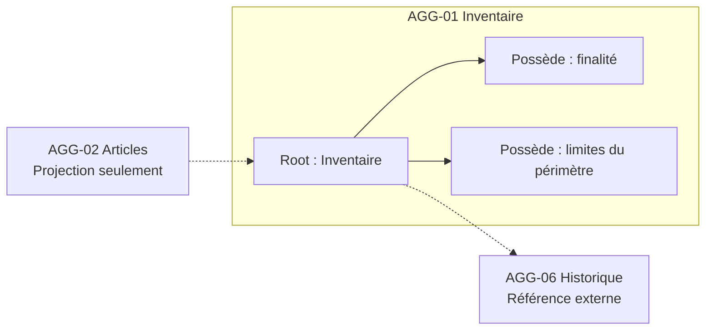
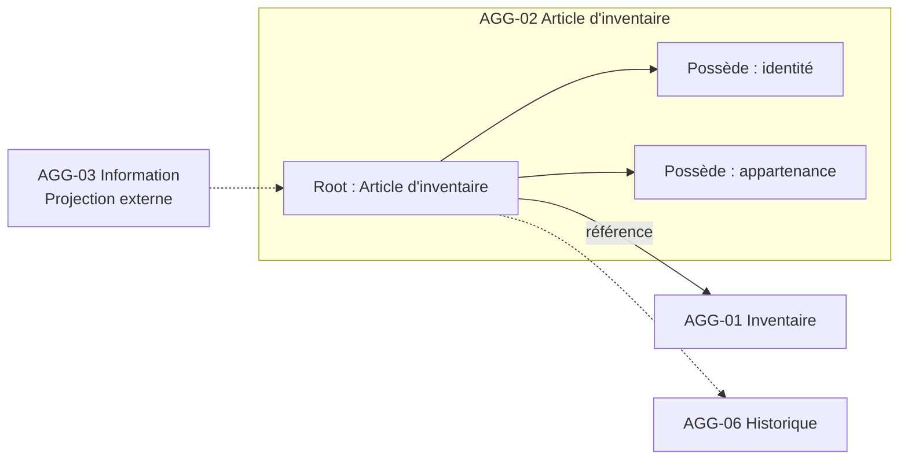
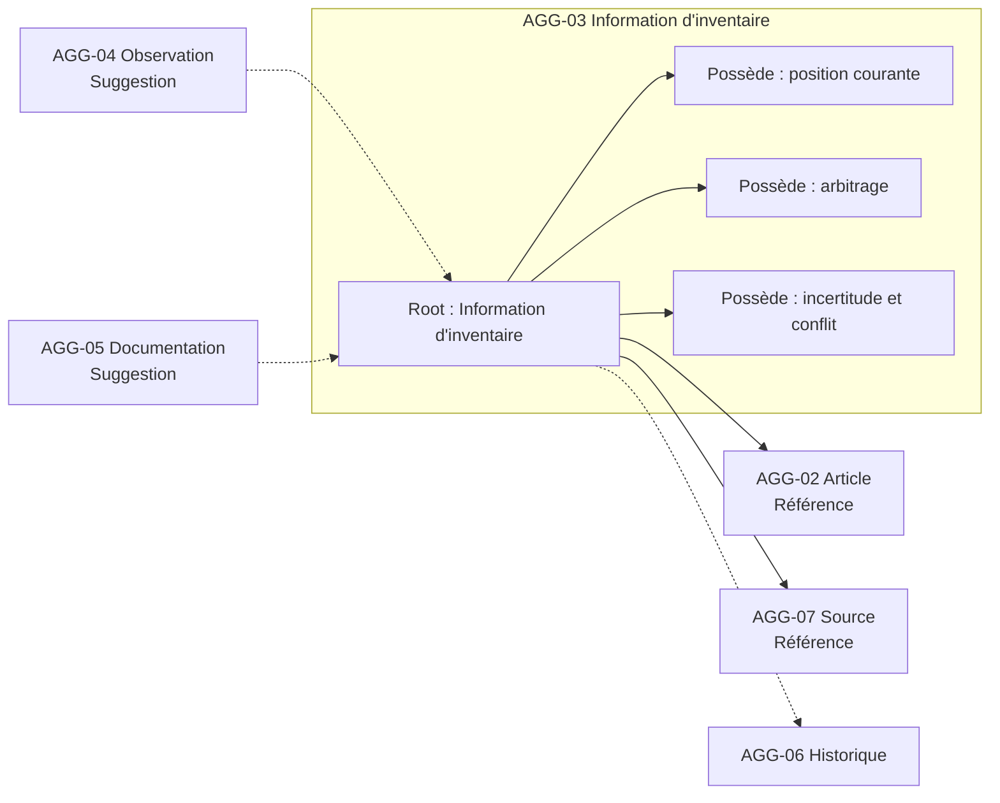
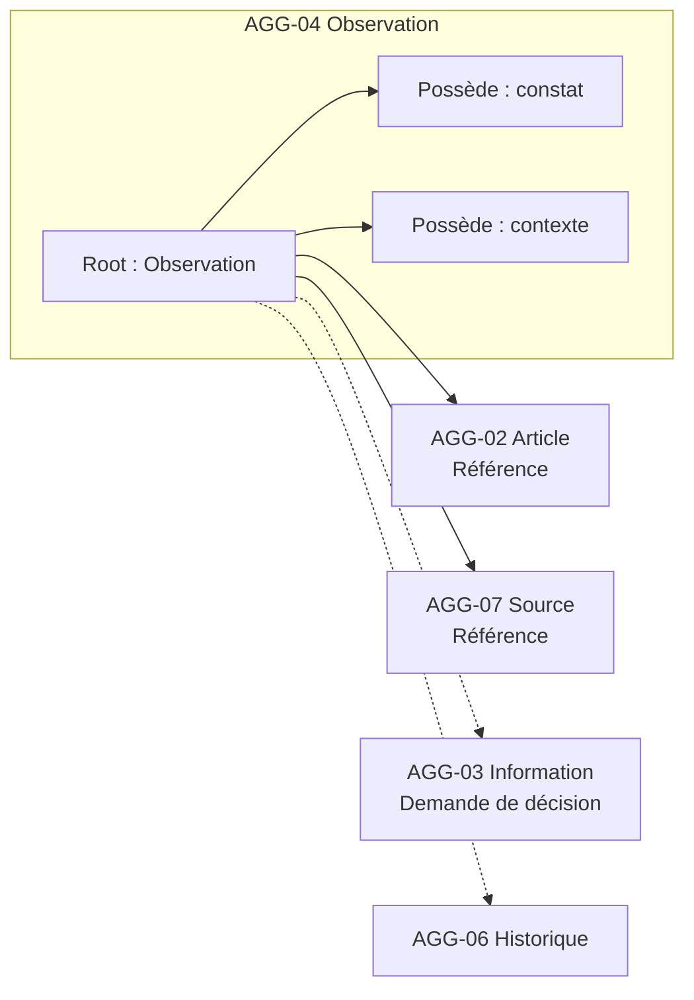
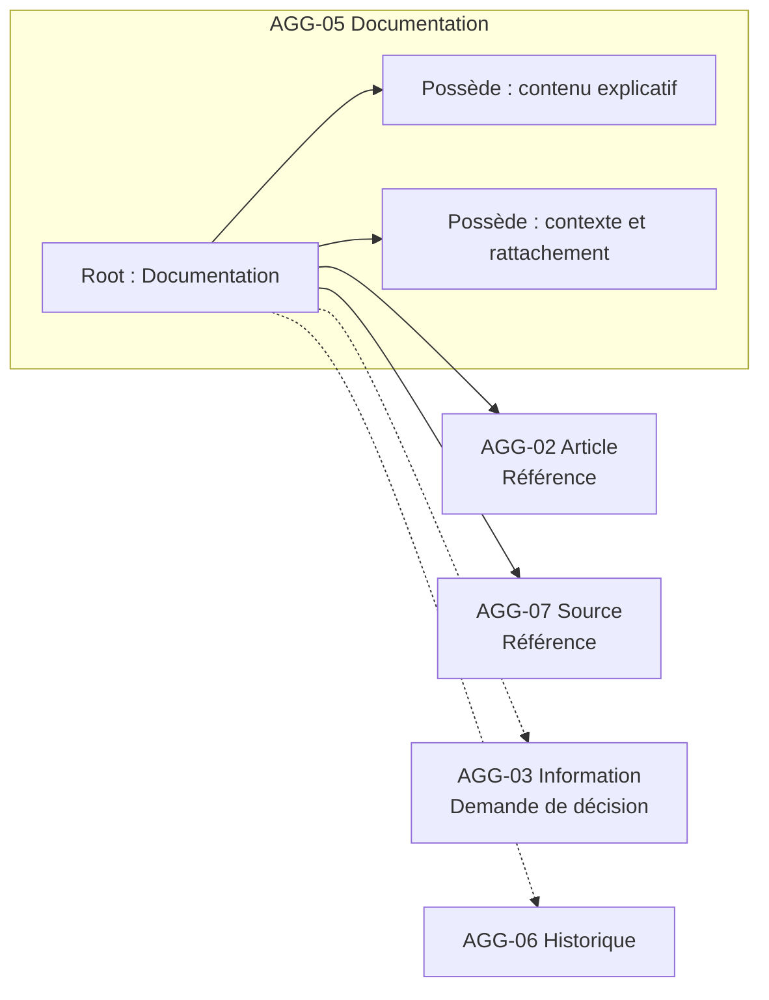
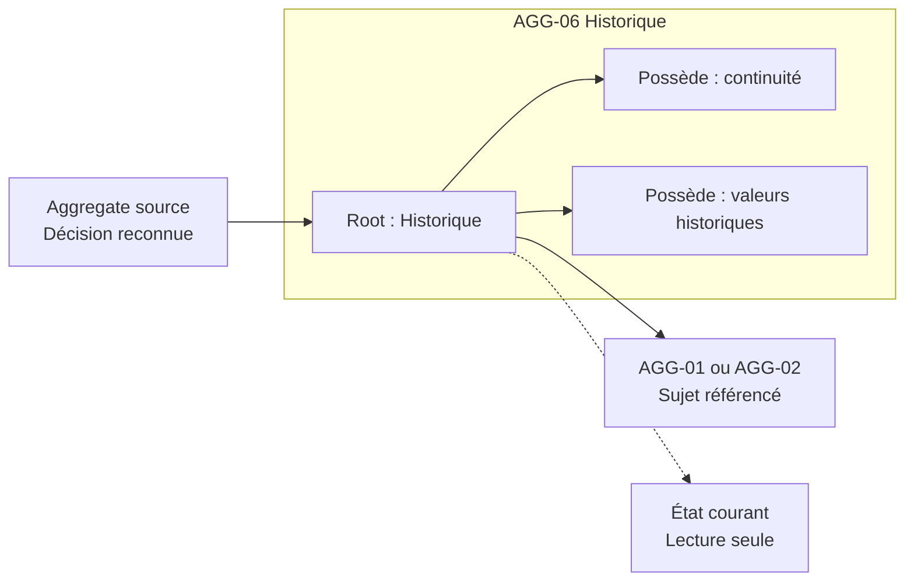
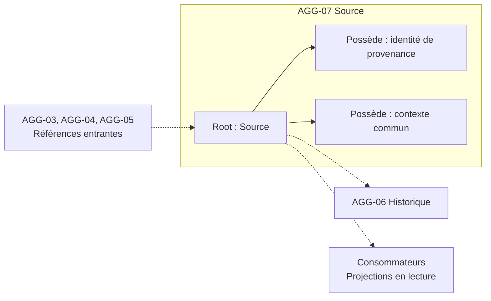

# Aggregate Design

## Purpose

Ce document formalise le contrat métier des Aggregates de la Release 0.1. Chaque Aggregate est défini comme gardien d'invariants et autorité de décisions déterminées, non comme conteneur d'informations.

Le design dérive de `03_AGGREGATE_ANALYSIS.md` et `04_AGGREGATE_OWNERSHIP.md`. Il fixe les opérations autorisées, les transitions, les références et les limites nécessaires pour que des réalisations différentes préservent les mêmes règles métier.

## Décision sur Source

AGG-07 — Source est retenu comme Aggregate de la Release 0.1.

Le produit établit qu'une même Source peut être associée à plusieurs Observations, Informations ou Documentation. Une autorité autonome évite que la même provenance soit décrite et modifiée concurremment dans plusieurs Aggregates. AGG-04, AGG-05 et AGG-03 possèdent uniquement l'association à cette Source ; ils ne possèdent ni son identité ni son contexte commun.

Une Source reste une provenance, jamais une vérité, un niveau de confiance ou une décision sur Knowledge.

## Conventions du contrat

### Formes d'interaction

- **Lecture seule :** consultation ponctuelle de l'état canonique d'un autre Aggregate sans conservation d'une seconde autorité.
- **Référence :** conservation de l'identité d'une autre Aggregate Root dont l'autorité reste externe.
- **Demande de décision :** formulation d'une intention qu'un autre Aggregate accepte ou refuse selon ses propres invariants.
- **Projection :** représentation dérivée destinée à consulter ou rechercher, sans effet direct sur l'état source.

### Transitions

Les états décrits ci-dessous servent uniquement à exprimer les transitions autorisées. Ils ne créent pas un nouveau vocabulaire général de Statuts.

Une opération réussit seulement si toutes ses préconditions et postconditions sont satisfaites. Une opération refusée ne produit ni état partiel ni réussite apparente.

## AGG-01 — Inventaire

### Contrat

- **Mission :** maintenir un périmètre d'Inventaire explicite, valide et durablement compréhensible.
- **Responsabilité :** reconnaître l'existence de l'Inventaire, sa finalité, ses limites et son état de cycle de vie lorsqu'il sera admis.
- **Aggregate Root :** **Inventaire**.
- **Invariants protégés :** `INV-EXI-001`, `INV-EXI-002`, avec contribution à `INV-CHG-001` et `INV-HIS-001`.
- **Cycle de vie 0.1 :** inexistant → actif par création explicite ; actif → actif après redéfinition justifiée du périmètre. Archivage et suppression ne sont pas admis en 0.1.
- **Autorité :** identité de l'Inventaire, finalité et limites du périmètre. L'appartenance des Articles appartient à AGG-02.

### Opérations métier autorisées

#### OP-INV-001 — Créer un Inventaire

- **Objectif :** établir un nouveau périmètre de connaissance compréhensible.
- **Préconditions :** l'intention de création est explicite ; la finalité et les limites permettent de distinguer ce périmètre d'un autre Inventaire.
- **Décision métier :** reconnaître l'identité et l'existence d'un Inventaire actif.
- **Postconditions :** l'Inventaire existe, son périmètre est compréhensible, il est vide et aucun Article n'est inclus implicitement.
- **Invariants vérifiés :** `INV-EXI-001`, `INV-COH-002` dans la représentation de l'état vide.
- **Historique produit :** la création établit l'origine de l'Inventaire ; tout Changement ultérieur significatif sera transmis à AGG-06.
- **Impact sur les autres Aggregates :** AGG-02 peut désormais demander l'inclusion d'un Article dans ce périmètre ; aucun autre Aggregate n'est créé automatiquement.

#### OP-INV-002 — Redéfinir le périmètre

- **Objectif :** clarifier ou faire évoluer la finalité ou les limites de l'Inventaire sans modifier silencieusement ses Articles.
- **Préconditions :** l'Inventaire est actif ; la nouvelle définition est explicite ; les conséquences éventuelles sur les appartenances sont identifiées mais ne sont pas exécutées implicitement.
- **Décision métier :** reconnaître la nouvelle définition du périmètre.
- **Postconditions :** la finalité et les limites courantes sont cohérentes ; les appartenances AGG-02 restent inchangées jusqu'à leurs propres décisions.
- **Invariants vérifiés :** `INV-EXI-001`, `INV-CHG-001`, `INV-HIS-001`.
- **Historique produit :** toute redéfinition significative conserve l'ancienne définition et sa justification dans AGG-06.
- **Impact sur les autres Aggregates :** peut produire des demandes de réexamen d'appartenance vers AGG-02, jamais des modifications directes.

### Opérations interdites

- **Inclure ou retirer directement un Article :** interdit parce que l'appartenance est une propriété exclusive d'AGG-02.
- **Déduire le périmètre depuis un Catalogue ou une recherche :** interdit car ces éléments sont dérivés et non autoritaires.
- **Modifier la connaissance d'un Article :** interdit car cette autorité appartient à AGG-03.
- **Supprimer l'Inventaire :** interdit en 0.1 afin de préserver l'existence historique et l'absence de perte silencieuse.

### Références externes

- AGG-02 : **Projection** dérivée des Articles déclarant leur appartenance ; aucune liste concurrente n'est possédée.
- AGG-06 : **Lecture seule** de la continuité passée ; **demande de décision** pour conserver une redéfinition significative.
- BC-05 : AGG-01 fournit une **Projection** en lecture sans dépendance inverse.

### Transitions interdites

- inexistant → Inventaire contenant implicitement des Articles ;
- actif → supprimé ;
- actif → autre périmètre avec modification automatique des appartenances ;
- projection dérivée → définition canonique du périmètre.

### Diagramme conceptuel

## AGG-02 — Article d'inventaire

### Contrat

- **Mission :** préserver une identité d'Article distincte, une appartenance unique et une continuité explicable.
- **Responsabilité :** reconnaître l'unité de gestion, l'Inventaire d'appartenance et, à partir de 0.5, le cycle de vie actif ou archivé.
- **Aggregate Root :** **Article d'inventaire**.
- **Invariants protégés :** `INV-ID-001`, `INV-ID-002`, `INV-EXI-001`, `INV-EXI-002`, avec contribution à `INV-CHG-001` et `INV-HIS-001`.
- **Cycle de vie 0.1 :** non reconnu → actif dans un Inventaire ; actif → actif après correction d'identité justifiée. Transfert, décomposition, archivage et suppression sont différés.
- **Autorité :** identité, définition de l'unité de gestion et appartenance courante.

### Opérations métier autorisées

#### OP-ITEM-001 — Inclure un Article

- **Objectif :** reconnaître un bien individuel ou un ensemble volontairement indivisible comme unité de gestion dans un Inventaire.
- **Préconditions :** AGG-01 cible existe et est actif ; l'unité proposée est distinguable ; elle n'est pas simultanément reconnue comme autre Article actif ou membre d'un ensemble actif dans le même Inventaire.
- **Décision métier :** reconnaître l'identité de l'Article et son appartenance unique.
- **Postconditions :** l'Article est actif, rattaché à un seul Inventaire et distinguable ; aucune Information absente n'est inventée.
- **Invariants vérifiés :** `INV-ID-001`, `INV-ID-002`, `INV-EXI-001`, `INV-COH-002`.
- **Historique produit :** l'inclusion et son origine sont conservées par AGG-06 comme commencement de la continuité de l'Article.
- **Impact sur les autres Aggregates :** autorise ensuite AGG-03, AGG-04 et AGG-05 à référencer l'Article ; n'en crée aucun automatiquement.

#### OP-ITEM-002 — Corriger l'identité

- **Objectif :** rectifier une identité mal reconnue sans produire un doublon ni perdre la continuité.
- **Préconditions :** l'Article existe ; la correction est explicitement justifiée ; les identités potentiellement en conflit ont été examinées à l'échelle de l'Inventaire.
- **Décision métier :** reconnaître la continuité entre l'ancienne compréhension identitaire et l'identité corrigée.
- **Postconditions :** une seule identité courante reste active ; l'appartenance demeure unique ; les références existantes continuent de désigner le même Article sauf décision distincte.
- **Invariants vérifiés :** `INV-ID-001`, `INV-ID-002`, `INV-EXI-001`, `INV-CHG-001`, `INV-HIS-001`.
- **Historique produit :** l'ancienne identité, la correction et sa justification sont conservées dans AGG-06.
- **Impact sur les autres Aggregates :** les Aggregates référents reçoivent la décision reconnue sans pouvoir la modifier ; leurs Informations restent inchangées.

### Opérations interdites

- **Créer une appartenance vers un Inventaire inexistant :** violerait `INV-EXI-001`.
- **Conserver plusieurs appartenances courantes :** créerait deux autorités concurrentes.
- **Déduire l'identité de l'Emplacement, du Statut, d'une Documentation, d'une Catégorie ou d'une Relation :** violerait `INV-ID-002`.
- **Modifier une Information retenue pendant une correction d'identité :** confondrait les autorités de BC-01 et BC-02.
- **Transférer, décomposer, archiver ou supprimer en 0.1 :** ces décisions ne disposent pas encore d'un contrat admis dans cette Release.

### Références externes

- AGG-01 : **Référence forte** vers l'Inventaire d'appartenance et **lecture seule** de son existence.
- AGG-06 : **demande de décision** pour préserver l'inclusion ou la correction comme Changement reconnu.
- AGG-03, AGG-04, AGG-05 et contextes dérivés : AGG-02 fournit une **Projection** de son identité ; aucune dépendance inverse d'autorité.

### Transitions interdites

- non reconnu → actif sans Inventaire valide ;
- actif dans un Inventaire → actif simultanément dans plusieurs Inventaires ;
- actif → autre identité sans continuité ;
- actif → supprimé ;
- Information mutable → identité canonique.

### Diagramme conceptuel

## AGG-03 — Information d'inventaire

### Contrat

- **Mission :** maintenir une réponse cohérente à une question déterminée sur un Article, avec sa provenance, son arbitrage et son incertitude.
- **Responsabilité :** posséder l'Information courante, les propositions incompatibles qui doivent être arbitrées ensemble, le conflit et la position retenue.
- **Aggregate Root :** **Information d'inventaire**.
- **Invariants protégés :** `INV-TRA-001`, `INV-OBS-002`, `INV-LOC-001`, `INV-STA-001`, `INV-COH-001`, `INV-COH-002`, avec contribution à `INV-CHG-001` et `INV-HIS-001`.
- **Cycle de vie 0.1 :** absente → retenue, incertaine ou contestée ; retenue ↔ incertaine ou contestée par nouvel arbitrage ; tout état → nouvel état explicitement arbitré. Suppression silencieuse interdite.
- **Autorité :** question de connaissance, état courant, arbitrage, incertitude et conflit.

### Opérations métier autorisées

#### OP-INFO-001 — Retenir une Information initiale

- **Objectif :** établir une première position explicite sur une question concernant un Article.
- **Préconditions :** AGG-02 existe ; AGG-07 Source est identifiable ; la question est délimitée ; l'information disponible permet soit une position retenue, soit un état explicitement incertain ou contesté.
- **Décision métier :** reconnaître l'état initial de la connaissance sans dépasser ce que la Source justifie.
- **Postconditions :** une seule position courante est identifiable ; sa provenance et son incertitude sont explicites ; les alternatives incompatibles ne sont pas présentées comme simultanément certaines.
- **Invariants vérifiés :** `INV-TRA-001`, `INV-OBS-002`, `INV-COH-001`, `INV-COH-002`, ainsi que `INV-LOC-001` ou `INV-STA-001` lorsque pertinent.
- **Historique produit :** la première position et son origine commencent la continuité AGG-06 de cette connaissance.
- **Impact sur les autres Aggregates :** aucun apport n'est modifié ; BC-05 peut recevoir une Projection de la position retenue.

#### OP-INFO-002 — Actualiser une Information

- **Objectif :** remplacer ou préciser la position courante lorsqu'un nouvel arbitrage le justifie.
- **Préconditions :** l'Information existe ; la nouvelle Source est identifiable ; les apports pertinents sont consultables ; la raison du Changement est explicite.
- **Décision métier :** retenir une nouvelle position, préciser l'incertitude ou déclarer que la question reste inconnue ou contestée.
- **Postconditions :** la nouvelle position, sa Source, son incertitude et le sort des alternatives sont cohérents ; l'ancien état n'est pas réécrit.
- **Invariants vérifiés :** `INV-TRA-001`, `INV-OBS-002`, `INV-COH-001`, `INV-COH-002`, `INV-CHG-001`, `INV-HIS-001`.
- **Historique produit :** ancien état, nouvelle décision, Source et justification sont conservés dans AGG-06 avant confirmation du succès.
- **Impact sur les autres Aggregates :** Search et autres consommateurs pourront actualiser leurs Projections ; AGG-04, AGG-05 et AGG-07 restent inchangés.

#### OP-INFO-003 — Déclarer un conflit ou une incertitude

- **Objectif :** rendre visible qu'une position ne peut pas être considérée comme certaine ou non contestée.
- **Préconditions :** une insuffisance ou incompatibilité identifiable concerne la même question de connaissance.
- **Décision métier :** reconnaître l'incertitude ou le conflit sans inventer de résolution.
- **Postconditions :** aucun état incompatible n'est présenté comme certain ; les propositions concernées restent distinguables par référence ; l'utilisateur peut comprendre ce qui manque ou s'oppose.
- **Invariants vérifiés :** `INV-COH-001`, `INV-COH-002`, `INV-TRA-001`.
- **Historique produit :** le changement de niveau de certitude est conservé s'il modifie significativement la connaissance actuelle.
- **Impact sur les autres Aggregates :** aucun apport n'est altéré ; les Projections doivent conserver la nouvelle incertitude.

#### OP-INFO-004 — Arbitrer un conflit

- **Objectif :** reconnaître une position courante après examen d'informations incompatibles.
- **Préconditions :** le conflit est explicite ; les Sources et apports concernés sont identifiables ; la décision reste humaine et justifiée.
- **Décision métier :** retenir une position, maintenir le conflit ou reconnaître l'inconnu.
- **Postconditions :** la position courante et l'incertitude résiduelle sont explicites ; les propositions écartées restent référencées ; aucune Source n'est supprimée.
- **Invariants vérifiés :** `INV-TRA-001`, `INV-COH-001`, `INV-COH-002`, `INV-CHG-001`, `INV-HIS-001`.
- **Historique produit :** l'arbitrage, les alternatives et la justification sont conservés par AGG-06.
- **Impact sur les autres Aggregates :** les apports restent inchangés ; seules les Projections de la connaissance courante évoluent.

### Opérations interdites

- **Retenir une Information sans Source :** violerait `INV-TRA-001`.
- **Accepter automatiquement une Observation ou Documentation :** violerait la frontière BC-03 → BC-02.
- **Maintenir deux positions incompatibles comme certaines :** violerait `INV-COH-001`.
- **Transformer l'absence en valeur supposée :** violerait `INV-COH-002`.
- **Modifier l'identité de l'Article ou le contenu d'un apport :** créerait une double autorité.
- **Supprimer l'état antérieur ou le conflit écarté :** romprait la continuité et la traçabilité.

### Références externes

- AGG-02 : **Référence forte** et **lecture seule** de l'identité de l'Article.
- AGG-07 : **Référence forte** vers la provenance de la position retenue.
- AGG-04 et AGG-05 : **Références faibles** vers les apports motivants ; AGG-03 reçoit leurs suggestions sans pouvoir les modifier.
- AGG-06 : **demande de décision** pour conserver tout Changement significatif ; **lecture seule** du passé.
- BC-05 : AGG-03 fournit une **Projection** de la connaissance courante.

### Transitions interdites

- absente → retenue sans Article ou Source ;
- Observation enregistrée → Information retenue sans arbitrage ;
- contestée → certaine sans décision justifiée ;
- inconnue → valeur supposée ;
- tout état → supprimé sans continuité historique.

### Diagramme conceptuel

## AGG-04 — Observation

### Contrat

- **Mission :** préserver un constat contextualisé sans le transformer en conclusion.
- **Responsabilité :** posséder ce qui a été observé, dans quelles circonstances, à propos de quel Article et depuis quelle Source.
- **Aggregate Root :** **Observation**.
- **Invariants protégés :** `INV-TRA-001`, `INV-OBS-001`, `INV-OBS-002`, `INV-LOC-001`, `INV-COH-002`.
- **Cycle de vie 0.1 :** absente → enregistrée ; enregistrée → corrigée explicitement avec continuité lorsque le sens change. Acceptation automatique et suppression sont interdites.
- **Autorité :** contenu du constat, contexte et associations à l'Article et à la Source.

### Opérations métier autorisées

#### OP-OBS-001 — Enregistrer une Observation

- **Objectif :** conserver fidèlement un constat à propos d'un Article ou de sa situation.
- **Préconditions :** AGG-02 existe ; AGG-07 Source existe ; le contexte permet de comprendre ce qui a été constaté et dans quelles circonstances.
- **Décision métier :** reconnaître l'Observation comme constat contextualisé.
- **Postconditions :** contenu, contexte, Article et Source sont tous identifiables ; aucune conclusion n'est acceptée automatiquement.
- **Invariants vérifiés :** `INV-TRA-001`, `INV-OBS-001`, `INV-OBS-002`, `INV-LOC-001`, `INV-COH-002`.
- **Historique produit :** l'origine de l'Observation est conservée ; sa création ne devient un Changement de Knowledge que si AGG-03 l'arbitre séparément.
- **Impact sur les autres Aggregates :** peut produire une suggestion vers AGG-03 ; ne le modifie pas.

#### OP-OBS-002 — Corriger une Observation

- **Objectif :** rectifier le contenu ou le contexte d'un constat mal enregistré sans falsifier ce qui avait été compris.
- **Préconditions :** l'Observation existe ; la correction et sa justification sont explicites ; l'Article et la Source restent identifiables.
- **Décision métier :** reconnaître la version corrigée du constat.
- **Postconditions :** le contexte courant est cohérent ; toute altération significative du sens conserve la version antérieure dans AGG-06.
- **Invariants vérifiés :** `INV-TRA-001`, `INV-OBS-001`, `INV-OBS-002`, `INV-CHG-001`, `INV-HIS-001`.
- **Historique produit :** une correction significative est conservée comme Changement ; une précision sans changement de sens ne crée pas artificiellement un Historique métier.
- **Impact sur les autres Aggregates :** AGG-03 reçoit une demande de réexamen seulement si la correction affecte une Information retenue.

### Opérations interdites

- **Enregistrer sans Article, Source ou contexte :** rendrait le constat ambigu.
- **Accepter une Information ou modifier un Statut :** appartient à AGG-03.
- **Garantir l'exactitude du constat :** une Observation n'est pas une vérité automatique.
- **Réécrire silencieusement une Observation significativement corrigée :** violerait la continuité.
- **Supprimer une Observation contestée :** masquerait une contradiction ou une provenance utile.

### Références externes

- AGG-02 et AGG-07 : **Références fortes** avec **lecture seule**.
- AGG-03 : **Référence faible** éventuelle ; AGG-04 peut émettre une **demande de décision** sans accepter la connaissance.
- AGG-06 : **demande de décision** pour une correction significative.
- BC-05 : **Projection** en lecture.

### Transitions interdites

- absente → enregistrée sans provenance ;
- enregistrée → Information retenue par conversion directe ;
- enregistrée → garantie exacte ;
- enregistrée → supprimée ;
- corrigée → passé réécrit.

### Diagramme conceptuel

## AGG-05 — Documentation

### Contrat

- **Mission :** préserver une explication contextualisée sans lui attribuer une autorité qu'elle ne possède pas.
- **Responsabilité :** posséder le contenu explicatif, son contexte, son objet documenté et sa Source.
- **Aggregate Root :** **Documentation**.
- **Invariants protégés :** `INV-TRA-001`, `INV-DOC-001`, `INV-COH-002`.
- **Cycle de vie 0.1 :** absente → enregistrée ; enregistrée → corrigée avec continuité si le sens change. Rôle Evidence, acceptation automatique et suppression sont interdits en 0.1.
- **Autorité :** contenu, contexte et rattachement documentaire.

### Opérations métier autorisées

#### OP-DOC-001 — Enregistrer une Documentation

- **Objectif :** conserver une explication utile relative à un Article.
- **Préconditions :** AGG-02 existe ; AGG-07 Source existe ; la portée et le contexte du contenu sont compréhensibles.
- **Décision métier :** reconnaître la Documentation et son rattachement explicite.
- **Postconditions :** contenu, contexte, Article et Source sont identifiables ; aucune Information ni Evidence n'est créée implicitement.
- **Invariants vérifiés :** `INV-TRA-001`, `INV-DOC-001`, `INV-COH-002`.
- **Historique produit :** l'origine documentaire est conservée ; la création n'actualise Knowledge que par une décision distincte.
- **Impact sur les autres Aggregates :** peut être consultée par AGG-03 et Search ; aucune modification externe n'est produite.

#### OP-DOC-002 — Corriger une Documentation

- **Objectif :** rectifier le contenu, le contexte ou le rattachement sans faire disparaître une interprétation antérieure significative.
- **Préconditions :** la Documentation existe ; la correction est explicite ; la Source et l'objet documenté restent identifiables.
- **Décision métier :** reconnaître la Documentation corrigée.
- **Postconditions :** le contenu courant reste contextualisé ; une correction significative conserve la continuité dans AGG-06.
- **Invariants vérifiés :** `INV-TRA-001`, `INV-DOC-001`, `INV-CHG-001`, `INV-HIS-001`, `INV-COH-002`.
- **Historique produit :** toute correction changeant le sens ou l'objet expliqué produit un Changement conservé.
- **Impact sur les autres Aggregates :** peut demander à AGG-03 de réexaminer une Information qui s'appuyait sur l'ancienne compréhension.

### Opérations interdites

- **Enregistrer sans Source ou contexte :** violerait la traçabilité et la distinction documentaire.
- **Modifier l'identité de l'Article documenté :** appartient à AGG-02.
- **Devenir automatiquement Evidence ou Information retenue :** ces rôles exigent des décisions distinctes.
- **Déclarer le contenu exact par sa seule présence :** violerait `INV-DOC-001`.
- **Supprimer une version significative sans continuité :** romprait l'explication du passé.

### Références externes

- AGG-02 et AGG-07 : **Références fortes** avec **lecture seule**.
- AGG-03 : **Référence faible** éventuelle ; AGG-05 peut produire une **demande de décision**.
- AGG-06 : **demande de décision** pour une correction significative.
- BC-05 : **Projection** en lecture.

### Transitions interdites

- absente → enregistrée sans provenance ;
- enregistrée → Evidence en 0.1 ;
- enregistrée → Information retenue par conversion directe ;
- enregistrée → autorité sur l'Article ;
- enregistrée → supprimée sans continuité.

### Diagramme conceptuel

## AGG-06 — Historique

### Contrat

- **Mission :** conserver la continuité explicable des Changements significatifs d'un Inventaire ou d'un Article.
- **Responsabilité :** posséder la représentation historique, l'ordre métier et les états antérieurs nécessaires sans devenir l'autorité du présent.
- **Aggregate Root :** **Historique**.
- **Invariants protégés :** `INV-TRA-001`, `INV-HIS-001`, `INV-CHG-001`.
- **Cycle de vie 0.1 :** absent → ouvert lors du premier Changement significatif ; ouvert → enrichi par ajout de Changements reconnus. Fermeture, réécriture et suppression sont interdites.
- **Autorité :** continuité historique d'un sujet reconnu.

### Opérations métier autorisées

#### OP-HIS-001 — Conserver un Changement reconnu

- **Objectif :** relier un état antérieur, une décision source et l'état courant qu'elle produit.
- **Préconditions :** le sujet AGG-01 ou AGG-02 existe ; le contexte autoritaire a reconnu une décision significative ; l'origine et le sens du Changement sont identifiables.
- **Décision métier :** accepter la conservation du Changement dans la continuité du sujet.
- **Postconditions :** l'état antérieur, la décision, son origine et sa place dans la continuité sont compréhensibles ; aucun Changement antérieur n'est altéré.
- **Invariants vérifiés :** `INV-TRA-001`, `INV-HIS-001`, `INV-CHG-001`.
- **Historique produit :** l'opération constitue précisément la conservation historique ; une rectification ultérieure devient un nouveau Changement.
- **Impact sur les autres Aggregates :** confirme qu'une décision significative peut être considérée complète ; ne modifie jamais son Aggregate source.

### Opérations interdites

- **Créer un Changement sans décision source :** AGG-06 ne possède pas le sens initial.
- **Modifier ou retirer un Changement passé :** réécrirait la continuité.
- **Décider de l'état courant :** appartient à AGG-01, AGG-02 ou AGG-03.
- **Conserver toute activité indistinctement :** ferait de History une surveillance et non une responsabilité métier.
- **Supprimer l'Historique :** violerait la continuité et l'absence de perte silencieuse.

### Références externes

- AGG-01 ou AGG-02 : **Référence forte** vers le sujet suivi.
- Aggregate ayant reconnu le Changement : **Référence** vers l'autorité source et **lecture seule** de la décision.
- AGG-03 : **Référence faible** vers l'état courant lorsqu'une Information est concernée.
- BC-05 et futurs contextes dérivés : AGG-06 fournit une **Projection** en lecture.

### Transitions interdites

- absent → ouvert sans premier Changement reconnu ;
- ouvert → état antérieur modifié ;
- ouvert → autorité du présent ;
- ouvert → fermé ou supprimé en 0.1 ;
- activité sans sens métier → Changement historique.

### Diagramme conceptuel

## AGG-07 — Source

### Contrat

- **Mission :** fournir une provenance identifiable, réutilisable et cohérente aux éléments qu'elle source.
- **Responsabilité :** posséder l'identité de la Source et son contexte commun sans attribuer exactitude ou autorité à ses usages.
- **Aggregate Root :** **Source**.
- **Invariants protégés :** `INV-TRA-001`, avec contribution à `INV-OBS-001` et `INV-DOC-001`.
- **Cycle de vie 0.1 :** non reconnue → reconnue ; reconnue → corrigée explicitement si son identité ou contexte était erroné. Suppression et transformation en vérité sont interdites.
- **Autorité :** identité et description commune de la provenance.

### Opérations métier autorisées

#### OP-SRC-001 — Reconnaître une Source

- **Objectif :** établir une provenance identifiable pouvant être associée à un ou plusieurs éléments.
- **Préconditions :** l'origine est suffisamment compréhensible pour être distinguée ; aucune Source existante n'est reconnue comme la même provenance sous une identité concurrente.
- **Décision métier :** reconnaître l'identité et le contexte commun de la Source.
- **Postconditions :** la Source peut être référencée ; elle n'exprime aucune garantie d'exactitude, aucun rôle probant et aucune décision Knowledge.
- **Invariants vérifiés :** `INV-TRA-001`, `INV-COH-002`.
- **Historique produit :** l'origine de la Source est explicite ; sa création n'est pas une décision sur les informations qu'elle sourcera.
- **Impact sur les autres Aggregates :** AGG-03, AGG-04 et AGG-05 peuvent désormais établir une Référence forte vers elle.

#### OP-SRC-002 — Corriger une Source

- **Objectif :** rectifier l'identité ou le contexte commun d'une provenance sans modifier les éléments qui l'utilisent.
- **Préconditions :** la Source existe ; la correction est justifiée ; les conséquences sur la compréhension des usages existants sont identifiées.
- **Décision métier :** reconnaître la Source corrigée tout en préservant son identité ou en explicitant une correction d'identité.
- **Postconditions :** une seule Source courante est reconnue ; ses utilisations restent rattachées ; le sens historique antérieur demeure compréhensible.
- **Invariants vérifiés :** `INV-TRA-001`, `INV-CHG-001`, `INV-HIS-001`, `INV-COH-002`.
- **Historique produit :** toute correction changeant la compréhension de la provenance est conservée dans AGG-06.
- **Impact sur les autres Aggregates :** peut produire une demande de réexamen vers AGG-03, AGG-04 ou AGG-05 ; ne modifie aucun de leurs contenus.

### Opérations interdites

- **Déclarer une Source vraie, fiable ou probante par nature :** ces qualités ne découlent pas de la provenance.
- **Modifier les apports qui la référencent :** ils appartiennent à leurs propres Aggregates.
- **Fusionner silencieusement deux Sources :** ferait perdre leur identité et leur interprétation passée.
- **Supprimer une Source référencée :** rendrait la connaissance ou l'apport intraçable.
- **Accepter une Information :** appartient à AGG-03.

### Références externes

- AGG-03, AGG-04 et AGG-05 : **Projections** dérivées de ses usages ; AGG-07 ne dépend pas de ces listes pour exister.
- AGG-06 : **demande de décision** pour conserver une correction significative.
- Contextes consommateurs : **lecture seule** de l'identité et du contexte de provenance.

### Transitions interdites

- non reconnue → Source indistinguable ;
- reconnue → vérité ou Evidence automatique ;
- reconnue → autre Source par fusion silencieuse ;
- reconnue → supprimée lorsqu'elle est référencée ;
- correction → réécriture du sens passé.

### Diagramme conceptuel

## Responsabilités hors Aggregate

Les responsabilités suivantes impliquent plusieurs Aggregates ou une décision sans état métier propre. Elles ne doivent pas être attribuées arbitrairement à une Aggregate Root.

### Candidats Domain Service

#### Contrôle d'identité dans un Inventaire

- vérifie qu'une unité proposée reste distinguable des autres AGG-02 du même AGG-01 ;
- protège `INV-ID-001` lors d'une inclusion ou correction ;
- formule une décision pour AGG-02 sans posséder les identités examinées.

#### Inclusion coordonnée

- vérifie l'existence et l'état admissible d'AGG-01 avant la création d'AGG-02 ;
- empêche qu'une appartenance soit reconnue vers un périmètre invalide ;
- ne possède ni l'Inventaire ni l'Article.

#### Arbitrage de connaissance

- rassemble en lecture les apports AGG-04 et AGG-05 ainsi que leur Source AGG-07 pour présenter une demande de décision à AGG-03 ;
- ne décide pas à la place d'AGG-03 et ne modifie aucun apport ;
- devient nécessaire lorsque l'arbitrage dépasse les informations déjà référencées par une seule AGG-03.

#### Conservation coordonnée d'un Changement

- garantit qu'une décision significative d'AGG-01, AGG-02, AGG-03, AGG-04, AGG-05 ou AGG-07 et sa conservation par AGG-06 forment une transaction métier complète ;
- ne possède ni la décision source ni la Valeur historique ;
- empêche la confirmation d'un changement significatif sans continuité.

#### Reconnaissance d'une Source commune

- examine si une provenance proposée correspond à AGG-07 existante ou justifie une nouvelle Source ;
- évite deux identités concurrentes pour une même provenance ;
- ne modifie pas la Source sans décision d'AGG-07.

### Responsabilités inter-Aggregates futures

- transfert ou décomposition d'un Article entre identités ou Inventaires ;
- archivage et réactivation d'un Inventaire ou Article ;
- association structurée d'Evidence ;
- organisation par Catalogue, Relations, comparaison, export et partage ;
- admission de contenu extérieur.

Ces responsabilités restent hors du contrat 0.1 tant que leur Release et leurs décisions propres ne sont pas ouvertes.

### Responsabilités dérivées sans Domain Service

Search demeure dans BC-05 comme responsabilité de Projection. Elle consulte les Aggregates autoritaires, mais ne protège aucun invariant nécessitant un Aggregate ni un Domain Service métier.

## Traçabilité

| Aggregate | Bounded Context | Invariants principaux | Acceptance Criteria | Architecture Constraints principales |
| --- | --- | --- | --- | --- |
| AGG-01 Inventaire | BC-01 | `INV-EXI-001`, `INV-EXI-002`, `INV-CHG-001`, `INV-HIS-001` | `AC-01-CAP-001`, `AC-01-GLO-001`, `AC-01-GLO-008`, `AC-01-GLO-009` | `ARC-CON-001`, `ARC-CON-002`, `ARC-CON-003`, `ARC-CON-005`, `ARC-CON-006`, `ARC-CON-009`, `ARC-CON-013`, `ARC-CON-017` |
| AGG-02 Article d'inventaire | BC-01 | `INV-ID-001`, `INV-ID-002`, `INV-EXI-001`, `INV-EXI-002`, `INV-CHG-001`, `INV-HIS-001` | `AC-01-CAP-002`, `AC-01-GLO-002`, `AC-01-GLO-007`, `AC-01-GLO-009` | `ARC-CON-001`, `ARC-CON-002`, `ARC-CON-003`, `ARC-CON-008`, `ARC-CON-009`, `ARC-CON-013`, `ARC-CON-017` |
| AGG-03 Information d'inventaire | BC-02 | `INV-TRA-001`, `INV-OBS-002`, `INV-LOC-001`, `INV-STA-001`, `INV-COH-001`, `INV-COH-002`, `INV-CHG-001`, `INV-HIS-001` | `AC-01-CAP-006`, `AC-01-GLO-003` à `AC-01-GLO-009` | `ARC-CON-002`, `ARC-CON-003`, `ARC-CON-005`, `ARC-CON-006`, `ARC-CON-008`, `ARC-CON-009`, `ARC-CON-015`, `ARC-CON-016`, `ARC-CON-017` |
| AGG-04 Observation | BC-03 | `INV-TRA-001`, `INV-OBS-001`, `INV-OBS-002`, `INV-LOC-001`, `INV-COH-002` | `AC-01-CAP-003`, `AC-01-GLO-003`, `AC-01-GLO-005`, `AC-01-GLO-006` | `ARC-CON-001`, `ARC-CON-002`, `ARC-CON-003`, `ARC-CON-005`, `ARC-CON-013`, `ARC-CON-014`, `ARC-CON-015`, `ARC-CON-017` |
| AGG-05 Documentation | BC-03 | `INV-TRA-001`, `INV-DOC-001`, `INV-COH-002`, `INV-CHG-001`, `INV-HIS-001` | `AC-01-CAP-005`, `AC-01-GLO-003`, `AC-01-GLO-006` | `ARC-CON-001`, `ARC-CON-002`, `ARC-CON-003`, `ARC-CON-005`, `ARC-CON-013`, `ARC-CON-014`, `ARC-CON-015`, `ARC-CON-017` |
| AGG-06 Historique | BC-04 | `INV-TRA-001`, `INV-HIS-001`, `INV-CHG-001` | `AC-01-CAP-011`, `AC-01-GLO-004`, `AC-01-GLO-007`, `AC-01-GLO-008`, `AC-01-GLO-009` | `ARC-CON-003`, `ARC-CON-005`, `ARC-CON-006`, `ARC-CON-008`, `ARC-CON-009`, `ARC-CON-013`, `ARC-CON-015`, `ARC-CON-016`, `ARC-CON-017` |
| AGG-07 Source | BC-03 | `INV-TRA-001`, `INV-OBS-001`, `INV-DOC-001`, `INV-COH-002` | `AC-01-GLO-003` et critères des apports concernés | `ARC-CON-001`, `ARC-CON-002`, `ARC-CON-003`, `ARC-CON-005`, `ARC-CON-013`, `ARC-CON-014`, `ARC-CON-015`, `ARC-CON-017` |

## Vérification globale du design

- Les sept Aggregates possèdent une Aggregate Root et une autorité exclusives.
- Chaque opération déclare préconditions, décision, postconditions, invariants, Historique et impacts externes.
- Aucun Aggregate ne modifie directement une autre Aggregate Root.
- Toute relation externe est qualifiée comme lecture seule, Référence, demande de décision ou Projection.
- Les transitions interdites empêchent suppression silencieuse, acceptation automatique et double appartenance.
- Les opérations impliquant plusieurs autorités sont laissées aux Domain Services ou futurs mécanismes inter-Aggregates sans préjuger de leur forme.
- Les Aggregates restent indépendants de toute technologie et dimensionnés par leurs invariants plutôt que par les informations souvent consultées ensemble.

## Conclusion

**READY FOR DOMAIN SERVICES**

Les contrats métier des sept Aggregates 0.1 sont suffisamment précis pour guider des réalisations indépendantes vers les mêmes décisions, invariants et transitions. Les responsabilités qui traversent plusieurs frontières sont identifiées sans être attribuées à une autorité incorrecte.

La prochaine étape peut formaliser les Domain Services nécessaires à l'identité, à l'inclusion, à l'arbitrage, à la continuité des Changements et à la reconnaissance des Sources, sans modifier les Aggregates définis ici.
