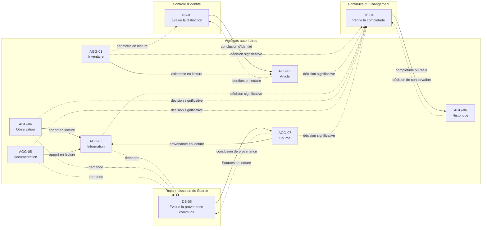

# Domain Service Analysis

## Purpose

Ce document évalue les cinq Domain Services candidats identifiés par l'Aggregate Design de Release 0.1. Il détermine si chacun porte une décision métier qui ne peut appartenir légitimement à aucun Aggregate existant.

L'analyse ne conçoit pas les services retenus. Elle établit uniquement leur nécessité, leur frontière de responsabilité et les autorités qu'ils devront respecter.

## Sources de l'analyse

L'analyse s'appuie sur :

- les invariants Produit de `22_DOMAIN_INVARIANTS.md` ;
- les Acceptance Criteria de `29_RELEASE_0.1_ACCEPTANCE.md` ;
- les autorités des Bounded Contexts définies dans `02_BOUNDED_CONTEXTS.md` ;
- les frontières de cohérence de `03_AGGREGATE_ANALYSIS.md` ;
- le modèle de propriété de `04_AGGREGATE_OWNERSHIP.md` ;
- les contrats métier de `05_AGGREGATE_DESIGN.md`.

## Critères de décision

Un candidat est conservé comme Domain Service seulement si les conditions suivantes sont toutes satisfaites :

1. la responsabilité correspond à une décision ou une règle métier réelle ;
2. cette décision exige la connaissance de plusieurs Aggregates indépendants ;
3. l'attribuer à un Aggregate lui donnerait une autorité sur des informations qu'il ne possède pas ;
4. la responsabilité ne consiste pas seulement à enchaîner des opérations déjà décidées ailleurs ;
5. le service peut rester sans identité, cycle de vie, état persistant ni Historique propre ;
6. le service ne remplace aucune décision appartenant à une Aggregate Root.

Un candidat est :

- **indispensable** si une règle métier inter-Aggregates resterait sans gardien en son absence ;
- **absorbé** si une Aggregate Root existante possède déjà la décision ;
- **supprimé** s'il ne représente aucune responsabilité métier autonome ;
- **reporté** si la responsabilité est réelle mais absente du périmètre 0.1.

## Synthèse des décisions

| Candidat | Décision | Motif déterminant |
| --- | --- | --- |
| Contrôle d'identité dans un Inventaire | **Indispensable** | La distinction d'une identité exige une comparaison à l'échelle d'AGG-01 sans transférer l'identité hors d'AGG-02. |
| Inclusion coordonnée | **Absorbé par AGG-02** | L'inclusion est déjà une décision d'AGG-02 ; vérifier une précondition externe ne crée pas une nouvelle autorité métier. |
| Arbitrage de connaissance | **Absorbé par AGG-03** | AGG-03 possède explicitement la position retenue, le conflit, l'incertitude et l'arbitrage. |
| Conservation coordonnée d'un Changement | **Indispensable** | L'achèvement d'un Changement significatif engage simultanément l'autorité de l'Aggregate source et celle d'AGG-06. |
| Reconnaissance d'une Source commune | **Indispensable** | La reconnaissance d'une provenance partagée exige de comparer plusieurs AGG-07 sans donner à l'une d'elles autorité sur les autres. |

## DS-01 — Contrôle d'identité dans un Inventaire

### Problème métier

Avant de reconnaître ou de corriger un Article, il faut établir que son unité de gestion reste distinguable des autres Articles actifs du même Inventaire. Cette décision ne peut être prise à partir du seul Article candidat : elle dépend de l'ensemble des identités pertinentes dans le périmètre.

### Aggregates et autorités concernés

- **AGG-01 Inventaire** possède l'identité et les limites du périmètre dans lequel la comparaison a un sens.
- **AGG-02 Article d'inventaire** possède chaque identité, sa granularité et son appartenance.
- **AGG-06 Historique** conserve ultérieurement une correction identitaire significative, sans participer à la décision.

### Invariants protégés

- `INV-ID-001` — Identité distincte ;
- `INV-ID-002` — Identité indépendante du contexte mutable ;
- `INV-EXI-001` — Inclusion explicite ;
- contribution à `INV-COH-002` en empêchant qu'une absence d'information soit compensée par une identité supposée.

### Pourquoi aucun Aggregate ne peut porter seul la responsabilité

AGG-01 ne possède pas les appartenances ni les identités des Articles. Lui confier la comparaison créerait une seconde autorité sur les membres de l'Inventaire.

Un AGG-02 ne peut décider seul qu'il est distinct de tous les autres AGG-02 : sa frontière ne contient ni les identités concurrentes ni une liste autoritaire des membres. Lui permettre de modifier ou de gouverner les autres Articles créerait un Aggregate surdimensionné et un cycle d'autorité.

AGG-06 explique le passé et ne peut jamais décider de l'identité courante.

La règle de distinction appartient donc au domaine, mais à aucune frontière d'état existante.

### Décisions du service

Le service détermine, pour une proposition d'identité dans un Inventaire donné, si les connaissances disponibles permettent de la considérer comme :

- distinguable des identités actives pertinentes ;
- incompatible avec une identité existante ;
- insuffisamment déterminée pour autoriser une décision.

Il ne reconnaît pas l'Article et ne corrige aucune identité.

### Décisions restant dans les Aggregates

- AGG-01 décide de l'existence et des limites du périmètre.
- Chaque AGG-02 décide de sa création ou de sa correction identitaire à partir d'une conclusion admissible.
- AGG-06 décide de la conservation de la continuité lorsque la correction est significative.

### Contrat analytique

- **Mission :** évaluer la distinction d'une identité d'Article dans un périmètre d'Inventaire sans posséder les identités comparées.
- **Responsabilités :** confronter l'unité proposée aux identités pertinentes ; appliquer les règles de granularité ; rendre explicite toute ambiguïté empêchant une reconnaissance.
- **Préconditions :** AGG-01 existe et est actif ; l'unité proposée est compréhensible ; les AGG-02 actifs pertinents sont consultables sans être modifiés.
- **Résultat attendu :** une conclusion métier motivée — distinguable, incompatible ou indéterminée — utilisable par AGG-02.
- **Aggregates coordonnés :** AGG-01 en lecture et plusieurs AGG-02 en lecture ; l'AGG-02 candidat conserve toute décision de modification.
- **Invariants préservés :** `INV-ID-001`, `INV-ID-002`, `INV-EXI-001`, `INV-COH-002`.

### Décision

**Indispensable pour Release 0.1.** L'absorption par AGG-01 dupliquerait l'autorité d'appartenance ; l'absorption par AGG-02 obligerait un Article à gouverner ses pairs. Le service devra rester une règle de comparaison sans état propre.

## DS-02 — Inclusion coordonnée

### Problème métier

Inclure un Article exige que l'Inventaire cible existe, que son périmètre soit admissible et que l'identité proposée soit distinguable avant que l'appartenance soit reconnue.

### Aggregates et autorités concernés

- **AGG-01 Inventaire** confirme l'existence et les limites du périmètre.
- **AGG-02 Article d'inventaire** possède l'identité et l'appartenance créées.
- **AGG-06 Historique** conserve le commencement de la continuité de l'Article.
- **DS-01**, s'il est sollicité séparément, évalue la distinction identitaire sans décider de l'inclusion.

### Invariants protégés

- `INV-ID-001` ;
- `INV-ID-002` ;
- `INV-EXI-001` ;
- `INV-EXI-002` ;
- contribution à `INV-HIS-001` et `INV-CHG-001`.

### Possibilité d'absorption

L'opération `OP-ITEM-001 — Inclure un Article` appartient déjà à AGG-02. Son contrat contient les préconditions externes nécessaires : existence d'AGG-01, périmètre admissible et identité distinguable.

AGG-01 n'a aucune décision d'appartenance à prendre. Il fournit seulement sa propre décision antérieure d'existence et une lecture de son état. AGG-06 prend séparément sa décision de conservation. La vérification d'identité relève de DS-01, pas d'un second service d'inclusion.

Une responsabilité qui se limiterait à obtenir ces conclusions puis à présenter la demande à AGG-02 ne porterait aucune règle métier supplémentaire. Elle deviendrait un simple enchaînement autour de l'Aggregate.

### Décisions du candidat

Aucune décision métier autonome n'est identifiée. Le candidat ne ferait que constater que des préconditions déjà décidées sont satisfaites.

### Décisions restant dans les Aggregates

- AGG-01 décide si l'Inventaire existe et demeure actif.
- AGG-02 décide si l'Article est reconnu et lui attribue son unique appartenance.
- AGG-06 décide si la création est correctement inscrite dans la continuité attendue.

### Contrat analytique

- **Mission candidate :** garantir qu'une inclusion n'est déclarée réussie qu'après satisfaction de toutes ses préconditions.
- **Responsabilités candidates :** réunir les décisions d'existence, de distinction et d'appartenance sans les produire.
- **Préconditions :** décision valide d'AGG-01 ; conclusion admissible de DS-01 ; proposition d'AGG-02 complète.
- **Résultat attendu :** succès ou refus de `OP-ITEM-001` selon le contrat d'AGG-02.
- **Aggregates coordonnés :** AGG-01, AGG-02 et, pour la continuité, AGG-06.
- **Invariants préservés :** ceux de l'opération AGG-02 ; aucun invariant supplémentaire n'est possédé par le candidat.

### Décision

**Absorbé par AGG-02 et supprimé de la liste des Domain Services.** L'inclusion demeure une opération de l'Aggregate propriétaire de l'appartenance. La coordination de ses préconditions ne constitue pas une responsabilité métier autonome.

## DS-03 — Arbitrage de connaissance

### Problème métier

Une Information peut être proposée, contredite ou rendue incertaine par plusieurs Observations, Documentations et Sources. Il faut déterminer la position courante sans altérer les apports qui motivent la décision.

### Aggregates et autorités concernés

- **AGG-03 Information d'inventaire** possède la question, la position retenue, le conflit, l'incertitude et l'arbitrage.
- **AGG-04 Observation** possède les constats contextualisés.
- **AGG-05 Documentation** possède les explications contextualisées.
- **AGG-07 Source** possède l'identité des provenances partagées.
- **AGG-06 Historique** conserve les arbitrages significatifs après leur reconnaissance.

### Invariants protégés

- `INV-TRA-001` ;
- `INV-OBS-002` ;
- `INV-COH-001` ;
- `INV-COH-002` ;
- `INV-CHG-001` et `INV-HIS-001` lorsqu'une position courante évolue.

### Possibilité d'absorption

AGG-03 a précisément été défini pour regrouper les propositions qui répondent à une même question et doivent être arbitrées ensemble. Les opérations `OP-INFO-001` à `OP-INFO-004` lui attribuent déjà toutes les décisions nécessaires : retenir, actualiser, déclarer un conflit et arbitrer.

AGG-04, AGG-05 et AGG-07 restent des références en lecture. Les rassembler pour examen ne crée aucune autorité supplémentaire et ne justifie pas un service distinct. Un service qui déciderait à la place d'AGG-03 deviendrait une autorité concurrente ; un service qui ne ferait que présenter les apports serait un mécanisme de consultation.

### Décisions du candidat

Aucune. Le candidat ne peut ni accepter une Information, ni fixer son incertitude, ni résoudre un conflit sans usurper l'autorité d'AGG-03.

### Décisions restant dans les Aggregates

- AGG-03 prend toutes les décisions sur la connaissance courante.
- AGG-04 et AGG-05 décident uniquement de leur propre contenu et de leur contexte.
- AGG-07 décide uniquement de l'identité de la Source.
- AGG-06 décide de conserver le Changement reconnu sans le réinterpréter.

### Contrat analytique

- **Mission candidate :** réunir les apports pertinents pour permettre l'examen d'une question de connaissance.
- **Responsabilités candidates :** consulter des références et les présenter sans les modifier.
- **Préconditions :** AGG-03 et les apports référencés sont identifiables.
- **Résultat attendu :** une vue des apports disponibles, sans décision métier nouvelle.
- **Aggregates coordonnés :** AGG-03, AGG-04, AGG-05 et AGG-07 en lecture.
- **Invariants préservés :** aucun invariant autonome ; AGG-03 protège les invariants de connaissance.

### Décision

**Absorbé par AGG-03 et supprimé de la liste des Domain Services.** L'arbitrage est le cœur de la responsabilité d'AGG-03. La collecte des apports ne doit pas être promue en service métier.

## DS-04 — Conservation coordonnée d'un Changement

### Problème métier

Une décision significative modifie un état courant possédé par AGG-01, AGG-02, AGG-03, AGG-04, AGG-05 ou AGG-07. Le Produit exige que l'état antérieur, la décision et son origine restent compréhensibles dans AGG-06. La décision courante ne doit pas être déclarée accomplie si cette continuité obligatoire n'est pas reconnue.

### Aggregates et autorités concernés

- **Aggregate source** : possède le sens de la décision et son nouvel état courant.
- **AGG-06 Historique** : possède la continuité, l'ordre métier et la représentation du passé.

Les deux autorités sont nécessaires et aucune ne peut modifier l'autre.

### Invariants protégés

- `INV-HIS-001` — Continuité des Changements significatifs ;
- `INV-CHG-001` — Changement explicite et justifié ;
- `INV-TRA-001` — Origine identifiable ;
- `INV-COH-002` lorsqu'un état antérieur ou une justification demeure inconnu.

### Pourquoi aucun Aggregate ne peut porter seul la responsabilité

L'Aggregate source ne peut posséder la continuité historique sans dupliquer AGG-06 et faire croître chaque frontière avec son passé. AGG-06 ne peut appliquer la décision courante ni décider seul de son sens, car il n'est pas l'autorité du présent.

Déclarer les deux décisions indépendantes autoriserait un état intermédiaire contraire au Produit : état courant modifié sans Historique cohérent, ou Historique annonçant un Changement non reconnu par sa source.

La responsabilité inter-Aggregates n'est pas de décider le contenu du Changement. Elle consiste à établir que les deux décisions autoritaires concordent et que le Changement métier peut être considéré comme complet.

### Décisions du service

Le service décide uniquement si une proposition de Changement satisfait la condition de complétude inter-Aggregates :

- la décision source est reconnue et qualifiée comme significative par son Aggregate ;
- AGG-06 accepte sa conservation dans la continuité du bon sujet ;
- les deux représentations concordent sur le sujet, l'origine, l'état antérieur et le sens de la décision.

Il refuse la complétude en cas de divergence. Il ne décide ni du nouvel état ni du contenu historique.

### Décisions restant dans les Aggregates

- L'Aggregate source décide du Changement courant, de sa justification et de son caractère significatif.
- AGG-06 décide si la continuité proposée est cohérente avec l'Historique existant.
- Aucun autre Aggregate ne peut confirmer, réécrire ou annuler ces décisions.

### Contrat analytique

- **Mission :** protéger la complétude métier d'un Changement significatif traversant l'autorité du présent et celle de l'Historique.
- **Responsabilités :** confronter les deux décisions ; vérifier leur concordance ; refuser tout succès partiel ou contradictoire.
- **Préconditions :** sujet reconnu ; décision significative proposée par l'Aggregate source ; état antérieur et origine identifiables ; AGG-06 concerné consultable.
- **Résultat attendu :** Changement complet reconnu par les deux Aggregates, ou refus explicite sans réussite métier partielle.
- **Aggregates coordonnés :** un Aggregate source parmi AGG-01 à AGG-05 ou AGG-07, et AGG-06.
- **Invariants préservés :** `INV-HIS-001`, `INV-CHG-001`, `INV-TRA-001`, `INV-COH-002`.

### Décision

**Indispensable pour Release 0.1.** Le service porte une règle de complétude métier entre deux autorités indépendantes. Il ne doit pas devenir le propriétaire du Changement, de l'état courant ou de l'Historique, ni être défini comme un mécanisme de séquencement technique.

## DS-05 — Reconnaissance d'une Source commune

### Problème métier

Une même provenance peut être utilisée par plusieurs Informations, Observations ou Documentations. Avant de reconnaître une nouvelle Source, il faut déterminer si elle correspond à une Source partagée existante, représente une provenance réellement distincte ou reste ambiguë.

### Aggregates et autorités concernés

- **AGG-07 Source** possède l'identité et le contexte commun de chaque provenance partagée.
- **AGG-03 Information d'inventaire**, **AGG-04 Observation** et **AGG-05 Documentation** référencent une Source sans la posséder.
- **AGG-06 Historique** conserve une correction significative de Source sans décider de son identité.

### Invariants protégés

- `INV-TRA-001` ;
- contribution à `INV-OBS-001` ;
- contribution à `INV-DOC-001` ;
- `INV-COH-002` lorsque la provenance ne peut être établie avec certitude.

### Pourquoi aucun Aggregate ne peut porter seul la responsabilité

Un AGG-07 décide de sa propre identité, mais sa frontière ne lui donne aucune autorité sur toutes les autres Sources. Le charger de rechercher et de gouverner ses éventuels équivalents transformerait une provenance en registre global caché.

AGG-03, AGG-04 et AGG-05 ne peuvent comparer puis fusionner des Sources : ils ne possèdent que leurs références. AGG-06 ne peut tirer une identité actuelle de ressemblances historiques.

La distinction d'une provenance partagée est donc une règle métier transversale comparable au contrôle d'identité des Articles, mais appliquée aux Sources.

### Décisions du service

Le service détermine si une proposition de provenance est :

- compatible avec une AGG-07 existante ;
- suffisamment distincte pour justifier une nouvelle Source ;
- ambiguë et donc impropre à une reconnaissance automatique.

Il ne crée, ne fusionne, ne corrige et ne supprime aucune Source.

### Décisions restant dans les Aggregates

- AGG-07 décide de reconnaître ou de corriger sa propre identité et son contexte commun.
- AGG-03, AGG-04 et AGG-05 décident de référencer une Source identifiée dans leurs propres opérations.
- AGG-06 décide de conserver une évolution significative déjà reconnue.

### Contrat analytique

- **Mission :** évaluer l'identité commune d'une provenance sans posséder les Sources comparées.
- **Responsabilités :** comparer une proposition aux AGG-07 pertinentes ; distinguer équivalence, distinction et ambiguïté ; empêcher la création de doubles autorités de provenance.
- **Préconditions :** proposition de provenance compréhensible ; AGG-07 pertinentes consultables ; aucune Information absente n'est supposée.
- **Résultat attendu :** conclusion motivée — Source existante compatible, nouvelle Source justifiée ou identité indéterminée.
- **Aggregates coordonnés :** plusieurs AGG-07 en lecture ; AGG-03, AGG-04 ou AGG-05 comme demandeur sans transfert d'autorité.
- **Invariants préservés :** `INV-TRA-001`, `INV-OBS-001`, `INV-DOC-001`, `INV-COH-002`.

### Décision

**Indispensable pour Release 0.1.** AGG-07 a été retenu parce qu'une Source peut être partagée et évoluer indépendamment. Une règle transversale est nécessaire pour empêcher que ce choix produise plusieurs autorités pour une même provenance.

## Dépendances entre Domain Services

### Modèle retenu

Les trois services conservés sont indépendants :

- DS-01 évalue l'identité des Articles dans AGG-01 ;
- DS-04 protège la complétude des Changements significatifs avec AGG-06 ;
- DS-05 évalue l'identité des Sources partagées.

Ils peuvent intervenir autour d'une même évolution métier, mais aucun ne dépend de la décision interne d'un autre Domain Service. Chaque résultat est adressé directement à l'Aggregate qui possède la décision finale.

### Dépendances interdites

- **DS-01 → DS-04 :** le contrôle d'identité ne peut décider qu'une correction est historiquement complète.
- **DS-04 → DS-01 ou DS-05 :** la continuité ne peut déduire l'identité présente à partir du passé.
- **DS-05 → DS-04 :** la reconnaissance d'une Source ne peut confirmer seule la conservation d'une correction significative.
- **DS-01 ↔ DS-05 :** identité d'Article et identité de Source sont deux responsabilités sans autorité commune.
- **Toute chaîne obligatoire de services :** elle créerait une autorité composite difficile à localiser et pourrait transformer les services en Aggregate caché.
- **Toute dépendance circulaire :** un résultat ne doit jamais exiger sa propre confirmation indirecte.
- **Tout état partagé entre services :** les informations durables appartiennent exclusivement aux Aggregates.

Si une même intention nécessite plusieurs conclusions, celles-ci restent indépendantes et sont présentées aux Aggregates autoritaires concernés. L'ordre de leur sollicitation n'est pas une règle métier de ces services.

## Diagramme des coordinations

Le diagramme ne comporte volontairement aucune liaison entre Domain Services. Les flèches directes AGG-01 → AGG-02 et AGG-04/05/07 → AGG-03 représentent les deux candidats absorbés par les Aggregate Roots autoritaires.

## Garde-fous pour le design ultérieur

Un Domain Service retenu ne devra jamais :

- posséder une identité ou un cycle de vie ;
- conserver des informations métier durables ;
- produire un Historique qui lui serait propre ;
- modifier directement une Aggregate Root ;
- reproduire les règles internes d'un Aggregate ;
- décider à la place d'AGG-02, AGG-03, AGG-06 ou AGG-07 ;
- coordonner un service conservé avec un autre ;
- devenir un registre global d'Articles ou de Sources ;
- prendre en charge la recherche, la présentation ou une simple transformation de données ;
- masquer une incertitude sous une réponse binaire injustifiée.

Toute responsabilité nécessitant un état propre devra être réexaminée comme candidat Aggregate plutôt qu'ajoutée au service. Toute responsabilité dépourvue de décision métier devra rester hors du domaine.

## Traçabilité des services conservés

| Domain Service | Bounded Contexts | Aggregates coordonnés | Invariants principaux | Acceptance Criteria concernés |
| --- | --- | --- | --- | --- |
| DS-01 Contrôle d'identité | BC-01 | AGG-01, plusieurs AGG-02 | `INV-ID-001`, `INV-ID-002`, `INV-EXI-001`, `INV-COH-002` | `AC-01-CAP-002`, `AC-01-CAP-009`, `AC-01-GLO-002`, `AC-01-GLO-007` |
| DS-04 Conservation coordonnée d'un Changement | BC-01 à BC-04 | Aggregate source, AGG-06 | `INV-HIS-001`, `INV-CHG-001`, `INV-TRA-001`, `INV-COH-002` | `AC-01-CAP-006`, `AC-01-CAP-011`, `AC-01-GLO-004`, `AC-01-GLO-007`, `AC-01-GLO-008`, `AC-01-GLO-009` |
| DS-05 Reconnaissance d'une Source commune | BC-02, BC-03 | AGG-03, AGG-04, AGG-05, plusieurs AGG-07 | `INV-TRA-001`, `INV-OBS-001`, `INV-DOC-001`, `INV-COH-002` | `AC-01-CAP-003`, `AC-01-CAP-005`, `AC-01-CAP-006`, `AC-01-GLO-003` |

## Conclusion

**READY FOR DOMAIN SERVICE DESIGN**

Trois Domain Services sont justifiés par des règles métier qui traversent plusieurs autorités sans pouvoir être absorbées par un Aggregate : contrôle d'identité, complétude historique d'un Changement et reconnaissance d'une Source commune.

Deux candidats sont écartés comme services autonomes : l'inclusion appartient à AGG-02 et l'arbitrage de connaissance appartient à AGG-03. Cette réduction évite les doubles autorités, les Aggregates cachés et les coordinations sans décision métier.

Les responsabilités, préconditions, résultats attendus, limites et dépendances interdites sont suffisamment établis pour ouvrir leur design sans choix technique.
