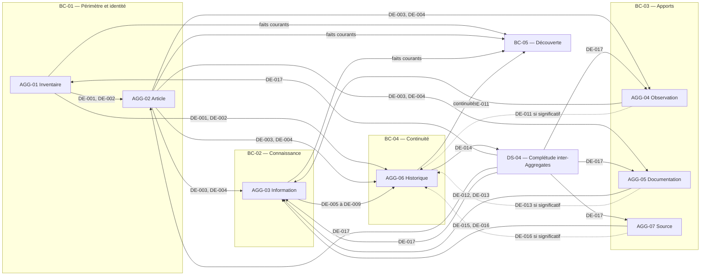

# Domain Events

## Purpose

Ce document identifie les faits métier significatifs reconnus par les Aggregates et Domain Services de Release 0.1. Il constitue le catalogue conceptuel des Domain Events du produit Inventaire.

Un Domain Event décrit un fait accompli au passé. Il n'exprime ni une intention, ni une demande, ni une étape d'exécution. Son existence signifie que l'autorité émettrice a pris sa décision et satisfait les invariants relevant de sa frontière.

## Sources

Le catalogue dérive exclusivement :

- des invariants Produit de `22_DOMAIN_INVARIANTS.md` ;
- des Acceptance Criteria de `29_RELEASE_0.1_ACCEPTANCE.md` ;
- des responsabilités définies dans `02_BOUNDED_CONTEXTS.md` ;
- des contrats d'Aggregates de `05_AGGREGATE_DESIGN.md` ;
- des décisions de `06_DOMAIN_SERVICE_ANALYSIS.md`.

## Règles de qualification

Un fait est retenu comme Domain Event seulement s'il :

- a été reconnu par une autorité métier identifiée ;
- résulte d'une décision réussie et non d'une simple tentative ;
- possède une signification durable pour le domaine ;
- peut expliquer un changement, une nouvelle existence ou une décision métier ;
- est nommé sans décrire la manière dont il a été produit.

Un refus, une consultation, une comparaison sans décision, une demande ou une préparation ne constitue pas un Domain Event. L'absence de fait reconnu ne doit jamais être présentée comme un événement accompli.

## Portée conceptuelle

Chaque événement est classé selon la portée de sa signification :

- **Interne à l'Aggregate :** utile uniquement à la cohérence de sa frontière ;
- **Interne au Bounded Context :** utile à plusieurs responsabilités du même contexte, sans signification contractuelle ailleurs ;
- **Partagé entre Contextes :** fait reconnu par une autorité et légitimement consommable par un autre contexte sans transfert d'autorité.

Le catalogue 0.1 ne retient aucun événement strictement interne à un Aggregate. Les détails purement internes restent des décisions de l'Aggregate et ne justifient pas un contrat événementiel. Les événements catalogués ont tous une utilité métier au-delà de leur frontière immédiate.

## Catalogue synthétique

| Identifiant | Nom canonique | Émetteur | Portée | Trace historique |
| --- | --- | --- | --- | --- |
| DE-001 | Inventaire créé | AGG-01 Inventaire | Partagé entre Contextes | Impérative — origine |
| DE-002 | Périmètre d'inventaire redéfini | AGG-01 Inventaire | Partagé entre Contextes | Impérative |
| DE-003 | Article inclus dans un inventaire | AGG-02 Article d'inventaire | Partagé entre Contextes | Impérative — origine |
| DE-004 | Identité d'article corrigée | AGG-02 Article d'inventaire | Partagé entre Contextes | Impérative |
| DE-005 | État initial de connaissance établi | AGG-03 Information d'inventaire | Partagé entre Contextes | Impérative — origine |
| DE-006 | Information d'inventaire actualisée | AGG-03 Information d'inventaire | Partagé entre Contextes | Impérative |
| DE-007 | Incertitude d'information déclarée | AGG-03 Information d'inventaire | Partagé entre Contextes | Impérative si l'état courant évolue |
| DE-008 | Conflit d'information déclaré | AGG-03 Information d'inventaire | Partagé entre Contextes | Impérative si l'état courant évolue |
| DE-009 | Arbitrage d'information rendu | AGG-03 Information d'inventaire | Partagé entre Contextes | Impérative |
| DE-010 | Observation enregistrée | AGG-04 Observation | Partagé entre Contextes | Intrinsèque à l'Observation |
| DE-011 | Observation corrigée | AGG-04 Observation | Partagé entre Contextes | Impérative si le sens évolue |
| DE-012 | Documentation enregistrée | AGG-05 Documentation | Partagé entre Contextes | Intrinsèque à la Documentation |
| DE-013 | Documentation corrigée | AGG-05 Documentation | Partagé entre Contextes | Impérative si le sens évolue |
| DE-014 | Changement conservé dans l'Historique | AGG-06 Historique | Partagé entre Contextes | Constitue la trace |
| DE-015 | Source reconnue | AGG-07 Source | Partagé entre Contextes | Intrinsèque à la Source |
| DE-016 | Source corrigée | AGG-07 Source | Partagé entre Contextes | Impérative si la compréhension évolue |
| DE-017 | Changement significatif complété | DS-04 Conservation coordonnée d'un Changement | Partagé entre Contextes | Référence la trace DE-014 |

## AGG-01 — Inventaire

### DE-001 — Inventaire créé

- **Déclencheur métier :** réussite de `OP-INV-001 — Créer un Inventaire`.
- **Émetteur :** AGG-01 Inventaire.
- **Signification métier :** un nouveau périmètre de connaissance possède désormais une identité, une finalité, des limites explicites et une existence reconnue.
- **Invariants déjà satisfaits :** `INV-EXI-001`, `INV-COH-002` pour l'état vide.
- **Conséquences métier :** des Articles peuvent désormais demander leur inclusion dans ce périmètre ; l'Inventaire peut être découvert comme existant et vide.
- **Consommateurs conceptuels :** AGG-02 pour vérifier le périmètre d'une future appartenance ; AGG-06 pour préserver l'origine ; BC-05 Découverte pour refléter l'existence.
- **Portée :** partagé de BC-01 vers BC-04 et BC-05.

### DE-002 — Périmètre d'inventaire redéfini

- **Déclencheur métier :** réussite de `OP-INV-002 — Redéfinir le périmètre`.
- **Émetteur :** AGG-01 Inventaire.
- **Signification métier :** la finalité ou les limites reconnues de l'Inventaire ont changé sans modifier implicitement ses Articles.
- **Invariants déjà satisfaits :** `INV-EXI-001`, `INV-CHG-001`, `INV-HIS-001`.
- **Conséquences métier :** les appartenances potentiellement concernées peuvent être réexaminées ; les représentations du périmètre doivent refléter la nouvelle définition.
- **Consommateurs conceptuels :** AGG-02 pour un éventuel réexamen sans modification automatique ; AGG-06 pour la continuité ; BC-05 pour la représentation courante.
- **Portée :** partagé de BC-01 vers BC-04 et BC-05.

## AGG-02 — Article d'inventaire

### DE-003 — Article inclus dans un inventaire

- **Déclencheur métier :** réussite de `OP-ITEM-001 — Inclure un Article` après conclusion admissible du contrôle d'identité.
- **Émetteur :** AGG-02 Article d'inventaire.
- **Signification métier :** une unité de gestion distinguable possède désormais une identité et une appartenance unique à un Inventaire.
- **Invariants déjà satisfaits :** `INV-ID-001`, `INV-ID-002`, `INV-EXI-001`, `INV-COH-002`.
- **Conséquences métier :** des Informations, Observations et Documentations peuvent désormais référencer l'Article ; sa continuité commence.
- **Consommateurs conceptuels :** AGG-03, AGG-04 et AGG-05 pour leurs futures références ; AGG-06 pour l'origine ; BC-05 pour la découverte.
- **Portée :** partagé de BC-01 vers BC-02, BC-03, BC-04 et BC-05.

### DE-004 — Identité d'article corrigée

- **Déclencheur métier :** réussite de `OP-ITEM-002 — Corriger l'identité` après contrôle de distinction.
- **Émetteur :** AGG-02 Article d'inventaire.
- **Signification métier :** la compréhension identitaire d'un Article a été rectifiée tout en conservant une seule identité courante et sa continuité.
- **Invariants déjà satisfaits :** `INV-ID-001`, `INV-ID-002`, `INV-EXI-001`, `INV-CHG-001`, `INV-HIS-001`.
- **Conséquences métier :** les références existantes continuent de désigner le même Article ; les représentations dérivées doivent refléter l'identité corrigée sans réécrire les états antérieurs.
- **Consommateurs conceptuels :** AGG-03, AGG-04 et AGG-05 comme référents en lecture ; AGG-06 pour la continuité ; BC-05 pour la découverte.
- **Portée :** partagé de BC-01 vers BC-02, BC-03, BC-04 et BC-05.

## AGG-03 — Information d'inventaire

### DE-005 — État initial de connaissance établi

- **Déclencheur métier :** réussite de `OP-INFO-001 — Retenir une Information initiale`.
- **Émetteur :** AGG-03 Information d'inventaire.
- **Signification métier :** une question déterminée sur un Article possède pour la première fois une position courante explicitement retenue, incertaine ou contestée.
- **Invariants déjà satisfaits :** `INV-TRA-001`, `INV-OBS-002`, `INV-COH-001`, `INV-COH-002`, et `INV-LOC-001` ou `INV-STA-001` lorsque pertinent.
- **Conséquences métier :** la connaissance courante devient consultable avec sa Source et son incertitude ; sa continuité commence.
- **Consommateurs conceptuels :** AGG-06 pour l'origine de la connaissance ; BC-05 pour la découverte et la consultation.
- **Portée :** partagé de BC-02 vers BC-04 et BC-05.

### DE-006 — Information d'inventaire actualisée

- **Déclencheur métier :** réussite de `OP-INFO-002 — Actualiser une Information`.
- **Émetteur :** AGG-03 Information d'inventaire.
- **Signification métier :** une nouvelle position, un nouveau degré d'incertitude ou la reconnaissance de l'inconnu remplace l'état courant antérieur pour une même question.
- **Invariants déjà satisfaits :** `INV-TRA-001`, `INV-OBS-002`, `INV-COH-001`, `INV-COH-002`, `INV-CHG-001`, `INV-HIS-001`.
- **Conséquences métier :** l'ancien état cesse d'être courant sans être réécrit ; la connaissance consultable doit refléter le nouvel arbitrage.
- **Consommateurs conceptuels :** AGG-06 pour la continuité ; BC-05 pour la représentation courante.
- **Portée :** partagé de BC-02 vers BC-04 et BC-05.

### DE-007 — Incertitude d'information déclarée

- **Déclencheur métier :** réussite de `OP-INFO-003 — Déclarer un conflit ou une incertitude` lorsque l'insuffisance reconnue concerne le degré de certitude.
- **Émetteur :** AGG-03 Information d'inventaire.
- **Signification métier :** une Information ne peut plus être présentée avec un degré de certitude supérieur à ce que ses Sources et apports permettent de soutenir.
- **Invariants déjà satisfaits :** `INV-TRA-001`, `INV-COH-001`, `INV-COH-002`.
- **Conséquences métier :** l'incertitude devient visible dans toute consultation de la connaissance ; aucune valeur certaine n'est inventée.
- **Consommateurs conceptuels :** AGG-06 si la position courante évolue significativement ; BC-05 pour préserver l'incertitude dans ses résultats.
- **Portée :** partagé de BC-02 vers BC-04 lorsque requis et vers BC-05.

### DE-008 — Conflit d'information déclaré

- **Déclencheur métier :** réussite de `OP-INFO-003 — Déclarer un conflit ou une incertitude` lorsque des propositions incompatibles sont reconnues.
- **Émetteur :** AGG-03 Information d'inventaire.
- **Signification métier :** plusieurs propositions relatives à une même question sont incompatibles et aucune ne peut masquer les autres comme si le conflit n'existait pas.
- **Invariants déjà satisfaits :** `INV-TRA-001`, `INV-COH-001`, `INV-COH-002`.
- **Conséquences métier :** le conflit et les propositions concernées deviennent visibles ; un arbitrage ultérieur peut être rendu sans altérer les apports.
- **Consommateurs conceptuels :** AGG-06 si l'état courant évolue significativement ; BC-05 pour rendre le conflit visible.
- **Portée :** partagé de BC-02 vers BC-04 lorsque requis et vers BC-05.

### DE-009 — Arbitrage d'information rendu

- **Déclencheur métier :** réussite de `OP-INFO-004 — Arbitrer un conflit`.
- **Émetteur :** AGG-03 Information d'inventaire.
- **Signification métier :** une décision explicite a retenu une position, maintenu le conflit ou reconnu l'inconnu après examen de propositions incompatibles.
- **Invariants déjà satisfaits :** `INV-TRA-001`, `INV-COH-001`, `INV-COH-002`, `INV-CHG-001`, `INV-HIS-001`.
- **Conséquences métier :** la position courante et l'incertitude résiduelle sont explicites ; les propositions écartées restent compréhensibles.
- **Consommateurs conceptuels :** AGG-06 pour conserver l'arbitrage ; BC-05 pour refléter la décision courante sans masquer les réserves.
- **Portée :** partagé de BC-02 vers BC-04 et BC-05.

## AGG-04 — Observation

### DE-010 — Observation enregistrée

- **Déclencheur métier :** réussite de `OP-OBS-001 — Enregistrer une Observation`.
- **Émetteur :** AGG-04 Observation.
- **Signification métier :** un constat contextualisé et sourcé à propos d'un Article est désormais conservé sans être présenté comme une conclusion.
- **Invariants déjà satisfaits :** `INV-TRA-001`, `INV-OBS-001`, `INV-OBS-002`, `INV-LOC-001`, `INV-COH-002`.
- **Conséquences métier :** l'Observation peut être consultée ou soumise à AGG-03 comme apport ; aucune Information n'est acceptée automatiquement.
- **Consommateurs conceptuels :** AGG-03 pour un éventuel examen ; BC-05 si l'Observation appartient aux informations découvrables de Release 0.1.
- **Portée :** partagé de BC-03 vers BC-02 et, selon la projection admise, BC-05.

### DE-011 — Observation corrigée

- **Déclencheur métier :** réussite de `OP-OBS-002 — Corriger une Observation`.
- **Émetteur :** AGG-04 Observation.
- **Signification métier :** le contenu ou le contexte reconnu d'un constat a été rectifié avec conservation du sens antérieur lorsque la correction est significative.
- **Invariants déjà satisfaits :** `INV-TRA-001`, `INV-OBS-001`, `INV-OBS-002`, `INV-CHG-001`, `INV-HIS-001` lorsque le sens évolue.
- **Conséquences métier :** AGG-03 peut devoir réexaminer une Information qui s'appuyait sur l'ancienne compréhension ; la correction ne réécrit pas silencieusement le passé.
- **Consommateurs conceptuels :** AGG-03 pour un réexamen éventuel ; AGG-06 lorsque le sens change ; BC-05 si une projection de l'Observation existe.
- **Portée :** partagé de BC-03 vers BC-02, BC-04 lorsque requis et éventuellement BC-05.

## AGG-05 — Documentation

### DE-012 — Documentation enregistrée

- **Déclencheur métier :** réussite de `OP-DOC-001 — Enregistrer une Documentation`.
- **Émetteur :** AGG-05 Documentation.
- **Signification métier :** une explication contextualisée et sourcée relative à un Article est désormais conservée sans devenir automatiquement une Information retenue.
- **Invariants déjà satisfaits :** `INV-TRA-001`, `INV-DOC-001`, `INV-COH-002`.
- **Conséquences métier :** la Documentation peut être consultée ou examinée par AGG-03 ; sa présence ne lui confère aucune autorité supplémentaire.
- **Consommateurs conceptuels :** AGG-03 pour un éventuel examen ; BC-05 si la Documentation appartient aux informations découvrables.
- **Portée :** partagé de BC-03 vers BC-02 et, selon la projection admise, BC-05.

### DE-013 — Documentation corrigée

- **Déclencheur métier :** réussite de `OP-DOC-002 — Corriger une Documentation`.
- **Émetteur :** AGG-05 Documentation.
- **Signification métier :** le contenu, le contexte ou le rattachement reconnu d'une explication a été rectifié.
- **Invariants déjà satisfaits :** `INV-TRA-001`, `INV-DOC-001`, `INV-COH-002`, `INV-CHG-001`, `INV-HIS-001` lorsque le sens évolue.
- **Conséquences métier :** AGG-03 peut devoir réexaminer une Information expliquée par l'ancienne version ; la continuité est préservée lorsque le sens change.
- **Consommateurs conceptuels :** AGG-03 pour un réexamen éventuel ; AGG-06 lorsque le sens change ; BC-05 si une projection documentaire existe.
- **Portée :** partagé de BC-03 vers BC-02, BC-04 lorsque requis et éventuellement BC-05.

## AGG-06 — Historique

### DE-014 — Changement conservé dans l'Historique

- **Déclencheur métier :** réussite de `OP-HIS-001 — Préserver un Changement reconnu`.
- **Émetteur :** AGG-06 Historique.
- **Signification métier :** une décision significative, son origine, son état antérieur et sa place dans la continuité du bon sujet sont désormais préservés.
- **Invariants déjà satisfaits :** `INV-TRA-001`, `INV-HIS-001`, `INV-CHG-001`.
- **Conséquences métier :** la décision source peut participer à une complétude inter-Aggregates ; le passé devient consultable sans devenir l'autorité du présent.
- **Consommateurs conceptuels :** DS-04 pour établir la complétude ; BC-05 pour la consultation de l'Historique ; l'Aggregate source comme confirmation de continuité sans transfert d'autorité.
- **Portée :** partagé de BC-04 vers le contexte source et BC-05.

## AGG-07 — Source

### DE-015 — Source reconnue

- **Déclencheur métier :** réussite de `OP-SRC-001 — Reconnaître une Source` après conclusion admissible sur son identité commune.
- **Émetteur :** AGG-07 Source.
- **Signification métier :** une provenance partagée possède désormais une identité et un contexte commun compréhensibles.
- **Invariants déjà satisfaits :** `INV-TRA-001`, `INV-COH-002`.
- **Conséquences métier :** AGG-03, AGG-04 et AGG-05 peuvent la référencer sans dupliquer son autorité.
- **Consommateurs conceptuels :** AGG-03, AGG-04 et AGG-05 comme utilisateurs potentiels de la provenance.
- **Portée :** partagé de BC-03 vers BC-02 ; utilisé également à l'intérieur de BC-03.

### DE-016 — Source corrigée

- **Déclencheur métier :** réussite de `OP-SRC-002 — Corriger une Source`.
- **Émetteur :** AGG-07 Source.
- **Signification métier :** l'identité ou le contexte commun d'une provenance partagée a été rectifié sans modifier rétroactivement les apports qui la référencent.
- **Invariants déjà satisfaits :** `INV-TRA-001`, `INV-CHG-001`, `INV-HIS-001`, `INV-COH-002` lorsque la correction est significative.
- **Conséquences métier :** les consommateurs comprennent la provenance corrigée ; toute Information dont l'interprétation pourrait changer peut être réexaminée séparément.
- **Consommateurs conceptuels :** AGG-03, AGG-04 et AGG-05 en lecture ; AGG-06 lorsque la compréhension historique évolue.
- **Portée :** partagé de BC-03 vers BC-02 et BC-04 lorsque requis.

## Domain Services

### DS-01 — Contrôle d'identité dans un Inventaire

DS-01 ne produit aucun Domain Event autonome en Release 0.1.

Ses conclusions — distinguable, incompatible ou indéterminée — sont des résultats d'évaluation adressés à AGG-02. Elles ne créent ni identité ni appartenance. Le fait métier publiable apparaît seulement lorsque AGG-02 reconnaît `DE-003 — Article inclus dans un inventaire` ou `DE-004 — Identité d'article corrigée`.

Émettre « identité contrôlée » ou « doublon recherché » transformerait une vérification en faux changement métier et concurrencerait l'autorité d'AGG-02.

### DS-04 — Conservation coordonnée d'un Changement

#### DE-017 — Changement significatif complété

- **Déclencheur métier :** DS-04 établit la concordance entre une décision significative reconnue par son Aggregate source et `DE-014 — Changement conservé dans l'Historique`.
- **Émetteur :** DS-04 Conservation coordonnée d'un Changement.
- **Signification métier :** les autorités du présent et de la continuité ont toutes deux reconnu le même Changement ; celui-ci peut être considéré comme complet.
- **Invariants déjà satisfaits :** `INV-TRA-001`, `INV-HIS-001`, `INV-CHG-001`, `INV-COH-002`.
- **Conséquences métier :** la décision significative peut être rendue visible comme accomplie ; aucune réussite partielle ne subsiste entre état courant et Historique.
- **Consommateurs conceptuels :** l'Aggregate source pour la confirmation de complétude ; BC-05 pour rendre consultables l'état courant et sa continuité cohérente.
- **Portée :** partagé entre le contexte de l'Aggregate source, BC-04 et BC-05.

DE-017 ne remplace ni le fait reconnu par l'Aggregate source ni DE-014. Il exprime uniquement leur concordance inter-Aggregates.

### DS-05 — Reconnaissance d'une Source commune

DS-05 ne produit aucun Domain Event autonome en Release 0.1.

Ses conclusions — Source existante compatible, nouvelle Source justifiée ou identité indéterminée — restent des résultats d'évaluation. Elles ne modifient aucune provenance. Le fait métier apparaît uniquement lorsque AGG-07 reconnaît `DE-015 — Source reconnue` ou `DE-016 — Source corrigée`.

Émettre « Source comparée » ou « ressemblance détectée » donnerait une existence durable à une analyse sans décision autoritaire et pourrait être confondu avec une reconnaissance de Source.

## Consommateurs conceptuels

Les consommateurs cités dans ce document sont exclusivement des responsabilités métier : Aggregates autoritaires, Domain Service de complétude ou Bounded Contexts ayant besoin du fait pour exercer leur propre responsabilité.

Consommer un événement autorise à :

- prendre connaissance du fait reconnu ;
- décider séparément selon sa propre autorité ;
- produire une représentation dérivée fidèle ;
- conserver une continuité lorsque l'invariant l'exige.

Consommer un événement n'autorise jamais à :

- modifier l'Aggregate émetteur ;
- réinterpréter son fait comme une autre décision ;
- compléter silencieusement une information absente ;
- transférer l'autorité au consommateur ;
- considérer une conséquence possible comme automatiquement accomplie.

## Événements exigeant une trace historique

### Trace impérative

Les événements suivants constituent une création fondatrice ou un Changement significatif et doivent être reliés à une continuité compréhensible :

- `DE-001 — Inventaire créé` ;
- `DE-002 — Périmètre d'inventaire redéfini` ;
- `DE-003 — Article inclus dans un inventaire` ;
- `DE-004 — Identité d'article corrigée` ;
- `DE-005 — État initial de connaissance établi` ;
- `DE-006 — Information d'inventaire actualisée` ;
- `DE-009 — Arbitrage d'information rendu` ;
- `DE-014 — Changement conservé dans l'Historique`, qui constitue lui-même la trace ;
- `DE-017 — Changement significatif complété`, qui référence la trace sans en créer une seconde.

### Trace conditionnelle

Les faits suivants exigent AGG-06 seulement lorsqu'ils modifient significativement la compréhension antérieure :

- `DE-007 — Incertitude d'information déclarée` ;
- `DE-008 — Conflit d'information déclaré` ;
- `DE-011 — Observation corrigée` ;
- `DE-013 — Documentation corrigée` ;
- `DE-016 — Source corrigée`.

### Traçabilité intrinsèque sans Changement historique automatique

Les créations suivantes conservent leur origine et leur contexte dans leur propre Aggregate. Elles ne produisent pas à elles seules un Changement de connaissance accepté :

- `DE-010 — Observation enregistrée` ;
- `DE-012 — Documentation enregistrée` ;
- `DE-015 — Source reconnue`.

Si l'un de ces faits conduit ultérieurement à une Information retenue ou actualisée, l'événement d'AGG-03 porte le Changement de connaissance correspondant.

## Événements rejetés

Les candidats suivants ne doivent pas exister dans le catalogue 0.1 :

| Candidat rejeté | Motif |
| --- | --- |
| Création demandée | Une intention n'est pas un fait accompli. |
| Inclusion demandée | La demande ne crée ni identité ni appartenance. |
| Identité contrôlée | DS-01 produit une conclusion d'évaluation ; AGG-02 seul reconnaît l'identité. |
| Doublon détecté | Une ressemblance ou incompatibilité observée ne constitue pas une identité autoritaire. |
| Source comparée | DS-05 n'est pas l'autorité d'une Source. |
| Nouvelle Source suggérée | Une suggestion ne signifie pas qu'AGG-07 a reconnu la Source. |
| Arbitrage demandé | La demande ne modifie pas la connaissance courante. |
| Observation consultée | La lecture ne change ni le constat ni sa signification. |
| Article affiché | La présentation ne constitue pas un fait métier nouveau. |
| Recherche effectuée | Une recherche n'altère aucune autorité du domaine. |
| Aucun résultat trouvé | L'absence de correspondance dans une recherche ne prouve aucune absence dans le monde réel. |
| Résultat de recherche actualisé | Une représentation dérivée n'est pas une décision métier. |
| Précondition satisfaite | Une vérification isolée n'a pas de signification durable indépendante de l'opération réussie. |
| Changement en cours | Un état intermédiaire ne doit pas être présenté comme un fait accompli. |
| Conservation demandée | Seul DE-014 confirme que l'Historique a accepté le Changement. |
| Opération refusée | Un refus peut être expliqué à l'utilisateur, mais ne représente pas un changement du domaine. |

## Diagramme des flux conceptuels

Les flèches représentent uniquement la disponibilité conceptuelle d'un fait pour une autre responsabilité métier. Elles n'impliquent ni modification automatique du consommateur, ni ordre d'exécution imposé.

## Questions ouvertes

Les questions suivantes ne bloquent pas Release 0.1 et devront être résolues uniquement lors de l'ouverture des capacités concernées :

1. **Archivage :** les faits d'archivage et de réactivation seront définis avec le cycle de vie correspondant, absent de 0.1.
2. **Evidence :** les faits relatifs au rôle probant seront définis avec cette capacité en 0.5 ; une Documentation ou Observation ne devient pas Evidence implicitement.
3. **Catalogues et Relations :** leurs événements dépendront de leurs futures autorités et ne doivent pas être anticipés.
4. **Import, Export et partage :** seuls les changements effectivement reconnus par les Aggregates pourront produire des Domain Events ; le transport ou la présentation ne seront pas des faits métier.
5. **Portée de la découverte :** la disponibilité des Observations et Documentations dans BC-05 devra rester cohérente avec le périmètre fonctionnel détaillé de la recherche, sans modifier leurs événements sources.

## Contrôles de cohérence

- Chaque événement est formulé comme un fait accompli.
- Chaque événement possède un émetteur disposant de l'autorité correspondante.
- Aucun événement ne permet à un consommateur de modifier l'autorité source.
- Les résultats de DS-01 et DS-05 restent des conclusions directes et ne deviennent pas de faux changements métier.
- DE-017 porte uniquement la complétude inter-Aggregates et ne duplique ni la décision source ni la continuité d'AGG-06.
- Les événements historiques correspondent aux exigences de `INV-HIS-001` et `INV-CHG-001`.
- Les opérations de lecture, de recherche, de présentation et les refus sont exclus du catalogue.
- Aucun fait futur n'est introduit dans le périmètre 0.1.

## Conclusion

**READY FOR USE CASE ANALYSIS**

Les dix-sept Domain Events de Release 0.1 décrivent des créations, changements, arbitrages et faits de continuité reconnus par leurs autorités métier. Les consommateurs conceptuels, portées et obligations historiques sont explicites.

Le catalogue évite les intentions, résultats de lecture, évaluations sans changement et états intermédiaires. Il peut donc soutenir l'analyse des interactions futures sans imposer de mécanisme technique ni déplacer l'autorité des Aggregates et Domain Services.
