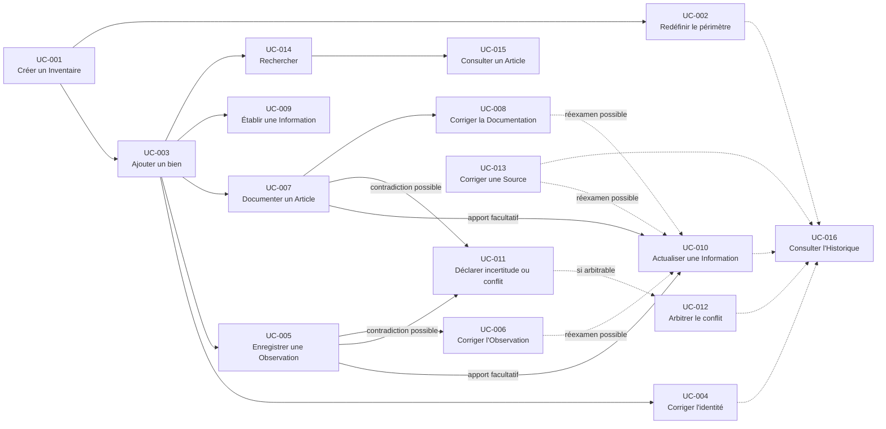

# Use Case Analysis

## Purpose

Ce document identifie les Use Cases de Release 0.1 à partir des objectifs utilisateur et des décisions métier déjà établies. Il délimite leur intention, leur résultat, leurs dépendances et leur traçabilité sans définir leur réalisation.

Un Use Case représente une intention utilisateur cohérente qui obtient un résultat métier reconnaissable. Un même Use Case peut solliciter plusieurs autorités, mais il conserve un seul objectif utilisateur et ne transfère jamais la décision d'un Aggregate à un autre.

## Sources

L'analyse dérive exclusivement :

- des Product Capabilities de `23_PRODUCT_CAPABILITIES.md` ;
- du périmètre 0.1 défini dans `24_RELEASE_SCOPE.md` ;
- des parcours de `25_USER_EXPERIENCE.md` ;
- des Acceptance Criteria de `29_RELEASE_0.1_ACCEPTANCE.md` ;
- des contrats d'Aggregates de `05_AGGREGATE_DESIGN.md` ;
- des Domain Services validés dans `06_DOMAIN_SERVICE_ANALYSIS.md` ;
- des Domain Events catalogués dans `07_DOMAIN_EVENTS.md`.

## Règles d'identification

Un Use Case est retenu lorsqu'il :

- répond à une intention compréhensible depuis le produit ;
- produit une décision métier observable ayant une valeur propre ;
- possède un début et un résultat observables ;
- respecte le périmètre d'une ou plusieurs capacités 0.1 ;
- laisse chaque Aggregate et Domain Service exercer uniquement son autorité ;
- ne présume aucune forme d'accès ou de présentation.

Une décision métier ne modifie pas nécessairement un état. Pour `UC-014`, `UC-015` et `UC-016`, elle détermine un résultat reconnu — correspondances pertinentes, connaissance courante ou continuité historique — sans produire de Changement ni de Domain Event.

Une opération interne n'est pas promue en Use Case si l'utilisateur ne la poursuit pas comme objectif autonome. Ainsi, préserver un Changement dans AGG-06, reconnaître une Source nécessaire à un apport ou évaluer une identité sont des décisions composantes de certains Use Cases, pas des Use Cases supplémentaires.

## Catalogue synthétique

| Identifiant | Nom canonique | Capacité principale | Nature du résultat |
| --- | --- | --- | --- |
| UC-001 | Créer un Inventaire | `CAP-001` | Nouvelle existence métier |
| UC-002 | Redéfinir le périmètre d'un Inventaire | `CAP-001` | Périmètre courant modifié |
| UC-003 | Ajouter un bien à un Inventaire | `CAP-002` | Nouvelle identité et appartenance |
| UC-004 | Corriger l'identité d'un Article | `CAP-002` | Identité courante corrigée |
| UC-005 | Enregistrer une Observation | `CAP-003` | Nouveau constat contextualisé |
| UC-006 | Corriger une Observation | `CAP-003` | Constat courant corrigé |
| UC-007 | Documenter un Article | `CAP-005` | Nouvelle explication contextualisée |
| UC-008 | Corriger une Documentation | `CAP-005` | Explication courante corrigée |
| UC-009 | Établir une Information initiale | `CAP-006` | Première position de connaissance |
| UC-010 | Actualiser une Information | `CAP-006` | Position courante modifiée |
| UC-011 | Déclarer une incertitude ou un conflit | `CAP-006` | Limite de connaissance explicitée |
| UC-012 | Arbitrer un conflit d'information | `CAP-006` | Arbitrage explicite |
| UC-013 | Corriger une Source commune | `CAP-003`, `CAP-005`, `CAP-006` | Provenance partagée corrigée |
| UC-014 | Rechercher dans un Inventaire | `CAP-009` | Correspondances ou absence explicite |
| UC-015 | Consulter un Article | `CAP-002`, `CAP-009` | Connaissance courante compréhensible |
| UC-016 | Consulter l'Historique | `CAP-011` | Continuité passée compréhensible |

## UC-001 — Créer un Inventaire

- **Objectif utilisateur :** établir un périmètre explicite dans lequel maintenir une connaissance cohérente relative à des biens.
- **Déclencheur :** l'utilisateur souhaite commencer un nouvel inventaire ou séparer une finalité distincte.
- **Résultat attendu :** un Inventaire vide mais valide existe, avec une finalité et des limites compréhensibles ; aucun Article n'est inclus implicitement.
- **Capacités Produit couvertes :** `CAP-001`.
- **Aggregates concernés :** AGG-01 comme autorité de création ; AGG-06 pour l'origine historique.
- **Domain Services éventuels :** DS-04 pour confirmer la complétude entre création reconnue et origine conservée.
- **Domain Events susceptibles d'être produits :** `DE-001`, `DE-014`, `DE-017`.
- **Critères d'acceptation associés :** `AC-01-CAP-001`, `AC-01-GLO-001`, `AC-01-GLO-008`, `AC-01-GLO-009`.

## UC-002 — Redéfinir le périmètre d'un Inventaire

- **Objectif utilisateur :** clarifier ou faire évoluer la finalité ou les limites d'un Inventaire existant sans modifier silencieusement ses Articles.
- **Déclencheur :** la définition courante du périmètre ne représente plus correctement l'intention de l'utilisateur.
- **Résultat attendu :** le nouveau périmètre est reconnu ; les appartenances restent inchangées tant qu'elles ne font pas l'objet de décisions séparées ; l'ancienne définition demeure compréhensible.
- **Capacités Produit couvertes :** `CAP-001` dans la continuité du périmètre créé.
- **Aggregates concernés :** AGG-01 comme autorité du périmètre ; AGG-02 uniquement comme source d'appartenances dérivées ; AGG-06 pour la continuité.
- **Domain Services éventuels :** DS-04 si la redéfinition est significative.
- **Domain Events susceptibles d'être produits :** `DE-002`, puis `DE-014` et `DE-017` pour une redéfinition significative.
- **Critères d'acceptation associés :** `AC-01-GLO-002`, `AC-01-GLO-007`, `AC-01-GLO-008`, `AC-01-GLO-009`.

## UC-003 — Ajouter un bien à un Inventaire

- **Objectif utilisateur :** reconnaître explicitement un bien individuel ou un ensemble volontairement indivisible comme Article appartenant à un Inventaire.
- **Déclencheur :** l'utilisateur souhaite faire entrer une unité de gestion identifiable dans le périmètre.
- **Résultat attendu :** un Article distinguable possède une identité et une appartenance unique ; les Informations absentes restent inconnues.
- **Capacités Produit couvertes :** `CAP-002`.
- **Aggregates concernés :** AGG-01 en lecture pour le périmètre ; AGG-02 comme autorité de l'identité et de l'appartenance ; autres AGG-02 pertinents en lecture ; AGG-06 pour l'origine.
- **Domain Services éventuels :** DS-01 pour la distinction identitaire ; DS-04 pour la complétude historique.
- **Domain Events susceptibles d'être produits :** `DE-003`, `DE-014`, `DE-017`.
- **Critères d'acceptation associés :** `AC-01-CAP-002`, `AC-01-GLO-002`, `AC-01-GLO-007`, `AC-01-GLO-008`, `AC-01-GLO-009`.

## UC-004 — Corriger l'identité d'un Article

- **Objectif utilisateur :** rectifier une identité mal comprise sans créer de doublon ni perdre la continuité de l'Article.
- **Déclencheur :** l'utilisateur constate que l'unité de gestion reconnue ou sa distinction est incorrecte.
- **Résultat attendu :** une seule identité courante reste active ; l'Article conserve son appartenance et ses références ; l'ancienne compréhension demeure explicable.
- **Capacités Produit couvertes :** `CAP-002`.
- **Aggregates concernés :** AGG-01 et les AGG-02 pertinents en lecture ; AGG-02 cible comme autorité ; AGG-06 pour la continuité.
- **Domain Services éventuels :** DS-01 pour réévaluer la distinction ; DS-04 pour confirmer la correction significative.
- **Domain Events susceptibles d'être produits :** `DE-004`, `DE-014`, `DE-017`.
- **Critères d'acceptation associés :** `AC-01-CAP-002`, `AC-01-GLO-002`, `AC-01-GLO-007`, `AC-01-GLO-009`.

## UC-005 — Enregistrer une Observation

- **Objectif utilisateur :** conserver fidèlement un constat contextualisé sans le transformer automatiquement en conclusion.
- **Déclencheur :** l'utilisateur observe un Article ou sa situation et juge le constat utile à préserver.
- **Résultat attendu :** une Observation reliée au bon Article, à son contexte et à une Source identifiable existe ; la connaissance retenue reste inchangée.
- **Capacités Produit couvertes :** `CAP-003`.
- **Aggregates concernés :** AGG-02 en lecture ; AGG-04 comme autorité du constat ; AGG-07 pour une provenance partagée.
- **Domain Services éventuels :** DS-05 si la provenance doit être rapprochée de Sources existantes.
- **Domain Events susceptibles d'être produits :** `DE-010` ; `DE-015` si une nouvelle Source commune est reconnue.
- **Critères d'acceptation associés :** `AC-01-CAP-003`, `AC-01-GLO-003`, `AC-01-GLO-005`, `AC-01-GLO-006`, `AC-01-GLO-009`.

## UC-006 — Corriger une Observation

- **Objectif utilisateur :** rectifier un constat ou son contexte sans falsifier ce qui avait été compris auparavant.
- **Déclencheur :** l'utilisateur identifie une erreur ou une imprécision dans une Observation existante.
- **Résultat attendu :** l'Observation corrigée reste contextualisée et sourcée ; son sens antérieur demeure accessible lorsque la correction est significative ; aucune Information n'est actualisée automatiquement.
- **Capacités Produit couvertes :** `CAP-003`.
- **Aggregates concernés :** AGG-02 et AGG-07 en lecture ; AGG-04 comme autorité ; AGG-03 comme destinataire possible d'une demande de réexamen ; AGG-06 lorsque le sens change.
- **Domain Services éventuels :** DS-04 pour une correction significative.
- **Domain Events susceptibles d'être produits :** `DE-011` ; `DE-014` et `DE-017` si le sens évolue significativement.
- **Critères d'acceptation associés :** `AC-01-CAP-003`, `AC-01-GLO-003`, `AC-01-GLO-005`, `AC-01-GLO-007`, `AC-01-GLO-009`.

## UC-007 — Documenter un Article

- **Objectif utilisateur :** conserver une explication utile relative à un Article sans dépendre de la seule mémoire ni donner au document une autorité automatique.
- **Déclencheur :** l'utilisateur dispose d'une explication contextualisée qui mérite d'être reliée durablement à l'Article.
- **Résultat attendu :** une Documentation sourcée est rattachée au bon Article et reste distincte d'une Observation, d'une Information retenue et d'un Élément probant.
- **Capacités Produit couvertes :** `CAP-005`.
- **Aggregates concernés :** AGG-02 en lecture ; AGG-05 comme autorité documentaire ; AGG-07 pour une provenance partagée.
- **Domain Services éventuels :** DS-05 si la provenance doit être rapprochée de Sources existantes.
- **Domain Events susceptibles d'être produits :** `DE-012` ; `DE-015` si une nouvelle Source commune est reconnue.
- **Critères d'acceptation associés :** `AC-01-CAP-005`, `AC-01-GLO-003`, `AC-01-GLO-006`, `AC-01-GLO-009`.

## UC-008 — Corriger une Documentation

- **Objectif utilisateur :** rectifier une explication, son contexte ou son rattachement sans effacer silencieusement son sens antérieur.
- **Déclencheur :** l'utilisateur constate qu'une Documentation existante est erronée ou insuffisamment contextualisée.
- **Résultat attendu :** la Documentation corrigée reste sourcée et rattachée au bon Article ; une évolution significative conserve sa continuité ; aucune Information n'est modifiée implicitement.
- **Capacités Produit couvertes :** `CAP-005`.
- **Aggregates concernés :** AGG-02 et AGG-07 en lecture ; AGG-05 comme autorité ; AGG-03 comme destinataire possible d'un réexamen ; AGG-06 si le sens change.
- **Domain Services éventuels :** DS-04 pour une correction significative.
- **Domain Events susceptibles d'être produits :** `DE-013` ; `DE-014` et `DE-017` si le sens évolue significativement.
- **Critères d'acceptation associés :** `AC-01-CAP-005`, `AC-01-GLO-003`, `AC-01-GLO-007`, `AC-01-GLO-009`.

## UC-009 — Établir une Information initiale

- **Objectif utilisateur :** reconnaître une première position explicite sur une question concernant un Article.
- **Déclencheur :** une connaissance initiale sourcée doit être retenue, déclarée incertaine ou reconnue comme contestée.
- **Résultat attendu :** une seule position courante est identifiable avec sa Source, son degré d'incertitude et les éventuelles alternatives incompatibles ; aucune absence n'est comblée artificiellement.
- **Capacités Produit couvertes :** `CAP-006`, avec contribution à la connaissance consultable attendue par `CAP-002`.
- **Aggregates concernés :** AGG-02 en lecture ; AGG-03 comme autorité de la connaissance ; AGG-04 et AGG-05 en lecture si leurs apports motivent la décision ; AGG-07 pour la provenance ; AGG-06 pour l'origine.
- **Domain Services éventuels :** DS-05 si une Source commune doit être reconnue ; DS-04 pour la complétude historique.
- **Domain Events susceptibles d'être produits :** `DE-005`, éventuellement `DE-015`, puis `DE-014` et `DE-017`.
- **Critères d'acceptation associés :** `AC-01-CAP-006`, `AC-01-GLO-003`, `AC-01-GLO-005`, `AC-01-GLO-006`, `AC-01-GLO-008`, `AC-01-GLO-009`.

## UC-010 — Actualiser une Information

- **Objectif utilisateur :** faire évoluer une Information retenue lorsque la connaissance disponible justifie une nouvelle position.
- **Déclencheur :** un nouveau constat, une explication, une correction, un changement de situation ou une décision explicite remet en cause l'état courant.
- **Résultat attendu :** la nouvelle position, sa Source et son incertitude sont explicites ; l'état antérieur et la justification restent compréhensibles.
- **Capacités Produit couvertes :** `CAP-006`.
- **Aggregates concernés :** AGG-02 en lecture ; AGG-03 comme autorité ; AGG-04, AGG-05 et AGG-07 en lecture selon les apports ; AGG-06 pour la continuité.
- **Domain Services éventuels :** DS-05 si une provenance commune doit être reconnue ; DS-04 pour la complétude du Changement.
- **Domain Events susceptibles d'être produits :** `DE-006`, éventuellement `DE-015`, puis `DE-014` et `DE-017`.
- **Critères d'acceptation associés :** `AC-01-CAP-006`, `AC-01-GLO-003`, `AC-01-GLO-004`, `AC-01-GLO-005`, `AC-01-GLO-006`, `AC-01-GLO-007`, `AC-01-GLO-009`.

## UC-011 — Déclarer une incertitude ou un conflit

- **Objectif utilisateur :** rendre visible qu'une Information ne peut pas être considérée comme certaine ou non contestée.
- **Déclencheur :** l'utilisateur reconnaît une insuffisance, une absence ou des propositions incompatibles concernant la même question.
- **Résultat attendu :** l'incertitude ou le conflit est explicite ; aucune proposition incompatible n'est présentée comme certaine par défaut ; l'absence reste inconnue.
- **Capacités Produit couvertes :** `CAP-006`.
- **Aggregates concernés :** AGG-03 comme autorité ; AGG-04, AGG-05 et AGG-07 en lecture lorsque leurs apports motivent la déclaration ; AGG-06 si l'état courant évolue significativement.
- **Domain Services éventuels :** DS-04 uniquement lorsqu'une trace historique devient obligatoire.
- **Domain Events susceptibles d'être produits :** `DE-007` ou `DE-008` ; `DE-014` et `DE-017` si l'état courant évolue significativement.
- **Critères d'acceptation associés :** `AC-01-CAP-006`, `AC-01-GLO-005`, `AC-01-GLO-006`, `AC-01-GLO-007`, `AC-01-GLO-009`.

## UC-012 — Arbitrer un conflit d'information

- **Objectif utilisateur :** rendre une décision explicite face à plusieurs propositions incompatibles sans supprimer leur existence passée.
- **Déclencheur :** un conflit déclaré dispose d'éléments suffisants pour retenir une position, maintenir le conflit ou reconnaître l'inconnu.
- **Résultat attendu :** la décision et l'incertitude résiduelle sont explicites ; les propositions écartées restent compréhensibles ; aucun apport n'est altéré.
- **Capacités Produit couvertes :** `CAP-006`.
- **Aggregates concernés :** AGG-03 comme autorité de l'arbitrage ; AGG-04, AGG-05 et AGG-07 en lecture ; AGG-06 pour la continuité.
- **Domain Services éventuels :** DS-04 pour la complétude historique. L'arbitrage lui-même reste dans AGG-03.
- **Domain Events susceptibles d'être produits :** `DE-009`, `DE-014`, `DE-017`.
- **Critères d'acceptation associés :** `AC-01-CAP-006`, `AC-01-GLO-003`, `AC-01-GLO-004`, `AC-01-GLO-005`, `AC-01-GLO-006`, `AC-01-GLO-007`, `AC-01-GLO-009`.

## UC-013 — Corriger une Source commune

- **Objectif utilisateur :** rectifier une provenance partagée erronée sans modifier rétroactivement les apports qui la référencent.
- **Déclencheur :** l'identité ou le contexte commun d'une Source reconnue apparaît incorrect ou ambigu.
- **Résultat attendu :** une seule Source courante reste autoritaire ; sa correction est compréhensible ; les Observations, Documentations et Informations conservent leurs propres décisions.
- **Capacités Produit couvertes :** `CAP-003`, `CAP-005` et `CAP-006` pour leur exigence commune de provenance identifiable.
- **Aggregates concernés :** plusieurs AGG-07 en lecture pour la distinction ; AGG-07 cible comme autorité ; AGG-03, AGG-04 et AGG-05 comme référents non modifiés ; AGG-06 si la compréhension évolue significativement.
- **Domain Services éventuels :** DS-05 pour éviter une identité de Source concurrente ; DS-04 pour une correction significative.
- **Domain Events susceptibles d'être produits :** `DE-016` ; `DE-014` et `DE-017` si la compréhension historique évolue.
- **Critères d'acceptation associés :** `AC-01-CAP-003`, `AC-01-CAP-005`, `AC-01-CAP-006`, `AC-01-GLO-003`, `AC-01-GLO-007`, `AC-01-GLO-009`.

## UC-014 — Rechercher dans un Inventaire

- **Objectif utilisateur :** retrouver un Article et la connaissance utile à partir d'éléments dont il dispose.
- **Déclencheur :** l'utilisateur cherche un bien précis, explore un besoin ou vérifie une Information.
- **Résultat attendu :** les correspondances pertinentes distinguent les Articles ; une absence de résultat reste explicite sans prétendre que le bien n'existe pas dans la réalité.
- **Capacités Produit couvertes :** `CAP-009`.
- **Aggregates concernés :** AGG-01, AGG-02 et AGG-03 comme autorités lues par BC-05 ; AGG-04 et AGG-05 seulement si leurs représentations sont admises dans le périmètre de découverte 0.1.
- **Domain Services éventuels :** aucun. La recherche ne protège aucun invariant nécessitant les Domain Services retenus.
- **Domain Events susceptibles d'être produits :** aucun ; rechercher ne constitue pas un Changement métier.
- **Critères d'acceptation associés :** `AC-01-CAP-009`, `AC-01-GLO-001`, `AC-01-GLO-002`, `AC-01-GLO-006`, `AC-01-GLO-008`, `AC-01-GLO-009`.

## UC-015 — Consulter un Article

- **Objectif utilisateur :** comprendre ce que l'Inventaire reconnaît actuellement à propos d'un Article et d'où provient cette connaissance.
- **Déclencheur :** l'utilisateur sélectionne un Article connu directement ou à l'issue d'une recherche.
- **Résultat attendu :** identité, appartenance, Informations retenues, Sources, incertitudes, conflits, Observations et Documentations disponibles sont distinguables selon leurs responsabilités respectives.
- **Capacités Produit couvertes :** `CAP-002` pour le caractère consultable de l'Article et `CAP-009` lorsqu'il est retrouvé par recherche.
- **Aggregates concernés :** AGG-01, AGG-02, AGG-03, AGG-04, AGG-05 et AGG-07 en lecture ; AGG-06 seulement si l'utilisateur poursuit vers l'Historique.
- **Domain Services éventuels :** aucun.
- **Domain Events susceptibles d'être produits :** aucun ; la consultation ne modifie aucune autorité.
- **Critères d'acceptation associés :** `AC-01-CAP-002`, `AC-01-CAP-009`, `AC-01-GLO-001`, `AC-01-GLO-002`, `AC-01-GLO-003`, `AC-01-GLO-005`, `AC-01-GLO-006`, `AC-01-GLO-008`.

## UC-016 — Consulter l'Historique

- **Objectif utilisateur :** comprendre comment et pourquoi un Inventaire, un Article ou sa connaissance actuelle a évolué.
- **Déclencheur :** l'utilisateur souhaite expliquer un Changement, retrouver un état antérieur ou vérifier une continuité.
- **Résultat attendu :** les Changements significatifs relient états antérieurs, décisions et état courant sans réactiver le passé ni confondre Historique et autorité présente.
- **Capacités Produit couvertes :** `CAP-011`.
- **Aggregates concernés :** AGG-06 comme autorité historique ; AGG-01, AGG-02, AGG-03, AGG-04, AGG-05 ou AGG-07 en lecture pour l'état courant correspondant.
- **Domain Services éventuels :** aucun ; DS-04 a déjà confirmé la complétude au moment du Changement.
- **Domain Events susceptibles d'être produits :** aucun ; consulter l'Historique n'est pas un Changement métier.
- **Critères d'acceptation associés :** `AC-01-CAP-011`, `AC-01-GLO-001`, `AC-01-GLO-004`, `AC-01-GLO-007`, `AC-01-GLO-008`, `AC-01-GLO-009`.

## Dépendances entre Use Cases

### Nature des dépendances

Les relations suivantes sont distinguées :

- **Précondition :** le résultat d'un Use Case doit déjà exister pour qu'un autre puisse commencer.
- **Contribution facultative :** un résultat peut motiver un autre Use Case sans le déclencher automatiquement.
- **Continuité :** un Use Case de consultation explique un Changement produit auparavant.
- **Accès :** un Use Case permet de retrouver le sujet d'un autre sans modifier son résultat.

### Use Cases autonomes

Les seize Use Cases sont autonomes dans leur intention : chacun possède un objectif et un résultat propres. L'autonomie ne signifie pas absence de préconditions métier. Par exemple, ajouter un bien exige un Inventaire existant, mais ne rejoue pas la création de cet Inventaire.

Les Use Cases de consultation `UC-014`, `UC-015` et `UC-016` sont autonomes et sans Changement métier. Ils exploitent des faits déjà reconnus.

### Parcours composés

Les compositions suivantes assemblent des Use Cases sans créer de nouvelle autorité :

1. **Commencer un inventaire utile :** `UC-001` → `UC-003` → `UC-009` ; `UC-005` ou `UC-007` peut fournir un apport initial.
2. **Enrichir puis réviser la connaissance :** `UC-005` ou `UC-007` → `UC-010` ou `UC-011` → éventuellement `UC-012`.
3. **Retrouver et comprendre :** `UC-014` → `UC-015` → éventuellement `UC-016`.
4. **Corriger sans perdre la continuité :** `UC-002`, `UC-004`, `UC-006`, `UC-008`, `UC-010`, `UC-012` ou `UC-013` → `UC-016` comme consultation ultérieure du Changement.

Ces parcours sont des enchaînements d'intentions distinctes. Aucun Use Case n'accomplit implicitement le suivant.

### Use Cases interdépendants

| Use Case source | Use Case lié | Relation | Règle |
| --- | --- | --- | --- |
| `UC-001` | `UC-003` | Précondition | Un Article ne peut appartenir à un Inventaire inexistant. |
| `UC-003` | `UC-005`, `UC-007`, `UC-009`, `UC-015` | Précondition | Les apports et la connaissance doivent référencer un Article reconnu. |
| `UC-005`, `UC-007` | `UC-009`, `UC-010`, `UC-011`, `UC-012` | Contribution facultative | Un apport peut motiver une décision de connaissance sans devenir automatiquement une conclusion. |
| `UC-006`, `UC-008`, `UC-013` | `UC-010`, `UC-011`, `UC-012` | Contribution facultative | Une correction peut justifier un réexamen, jamais une actualisation implicite. |
| `UC-011` | `UC-012` | Contribution facultative | Un conflit peut rester ouvert tant qu'aucun arbitrage explicite n'est possible. |
| `UC-014` | `UC-015` | Accès | La recherche permet de retrouver l'Article à consulter. |
| Use Case produisant un Changement significatif | `UC-016` | Continuité | L'Historique peut expliquer le Changement après sa complétude. |

## Use Cases volontairement exclus de Release 0.1

| Use Case exclu | Capacité | Justification |
| --- | --- | --- |
| Associer un Élément probant | `CAP-004` | Le rôle probant structuré appartient à Release 0.5 ; Source, Observation et Documentation restent distinctes en 0.1. |
| Organiser par Catalogues ou Catégories | `CAP-007` | L'organisation enrichit le parcours quotidien mais n'est pas nécessaire au cycle de valeur minimal. |
| Gérer des Relations métier | `CAP-008` | L'autorité des Relations n'appartient pas aux Aggregates 0.1. |
| Comparer des biens ou connaissances | `CAP-010` | La comparaison est une capacité d'analyse future et ne doit pas être simulée par la recherche. |
| Exporter un Inventaire | `CAP-012` | La restitution hors du contexte actif est différée à Release 0.5. |
| Partager un Inventaire | `CAP-013` | La diffusion n'est pas nécessaire au premier usage individuel fiable. |
| Archiver ou réactiver | `CAP-014` | Le cycle de vie correspondant est explicitement absent des contrats 0.1. |

L'import n'est pas une capacité admise dans le périmètre Produit 0.1 et ne constitue donc pas un Use Case candidat de cette Release.

Sont également exclus : déduire automatiquement une identité, résoudre automatiquement un conflit, hiérarchiser universellement les Sources, produire une connaissance exhaustive ou enregistrer toute activité indistincte. Ces intentions contrediraient les responsabilités et invariants existants.

## Matrice de traçabilité

| Capability | Use Case | Aggregate ou responsabilité | Domain Events possibles | Acceptance Criteria |
| --- | --- | --- | --- | --- |
| `CAP-001` | `UC-001` Créer un Inventaire | AGG-01, AGG-06 ; DS-04 | `DE-001`, `DE-014`, `DE-017` | `AC-01-CAP-001`, `AC-01-GLO-001`, `AC-01-GLO-008`, `AC-01-GLO-009` |
| `CAP-001` | `UC-002` Redéfinir le périmètre | AGG-01, AGG-02 en lecture, AGG-06 ; DS-04 si significatif | `DE-002`, `DE-014`, `DE-017` si significatif | `AC-01-GLO-002`, `AC-01-GLO-007`, `AC-01-GLO-008`, `AC-01-GLO-009` |
| `CAP-002` | `UC-003` Ajouter un bien | AGG-01 en lecture, AGG-02, AGG-06 ; DS-01, DS-04 | `DE-003`, `DE-014`, `DE-017` | `AC-01-CAP-002`, `AC-01-GLO-002`, `AC-01-GLO-007`, `AC-01-GLO-009` |
| `CAP-002` | `UC-004` Corriger l'identité | AGG-01 et AGG-02 en lecture, AGG-02 cible, AGG-06 ; DS-01, DS-04 | `DE-004`, `DE-014`, `DE-017` | `AC-01-CAP-002`, `AC-01-GLO-002`, `AC-01-GLO-007`, `AC-01-GLO-009` |
| `CAP-003` | `UC-005` Enregistrer une Observation | AGG-02 en lecture, AGG-04, AGG-07 ; DS-05 si nécessaire | `DE-010`, éventuellement `DE-015` | `AC-01-CAP-003`, `AC-01-GLO-003`, `AC-01-GLO-005`, `AC-01-GLO-006`, `AC-01-GLO-009` |
| `CAP-003` | `UC-006` Corriger une Observation | AGG-04, AGG-03 en lecture, AGG-06 ; DS-04 si significatif | `DE-011`, puis `DE-014`, `DE-017` si significatif | `AC-01-CAP-003`, `AC-01-GLO-003`, `AC-01-GLO-007`, `AC-01-GLO-009` |
| `CAP-005` | `UC-007` Documenter un Article | AGG-02 en lecture, AGG-05, AGG-07 ; DS-05 si nécessaire | `DE-012`, éventuellement `DE-015` | `AC-01-CAP-005`, `AC-01-GLO-003`, `AC-01-GLO-006`, `AC-01-GLO-009` |
| `CAP-005` | `UC-008` Corriger une Documentation | AGG-05, AGG-03 en lecture, AGG-06 ; DS-04 si significatif | `DE-013`, puis `DE-014`, `DE-017` si significatif | `AC-01-CAP-005`, `AC-01-GLO-003`, `AC-01-GLO-007`, `AC-01-GLO-009` |
| `CAP-006` | `UC-009` Établir une Information initiale | AGG-02 à AGG-07 selon apports ; DS-05 si nécessaire, DS-04 | `DE-005`, éventuellement `DE-015`, puis `DE-014`, `DE-017` | `AC-01-CAP-006`, `AC-01-GLO-003`, `AC-01-GLO-005`, `AC-01-GLO-006`, `AC-01-GLO-008`, `AC-01-GLO-009` |
| `CAP-006` | `UC-010` Actualiser une Information | AGG-03, apports en lecture, AGG-06 ; DS-05 si nécessaire, DS-04 | `DE-006`, éventuellement `DE-015`, puis `DE-014`, `DE-017` | `AC-01-CAP-006`, `AC-01-GLO-003` à `AC-01-GLO-007`, `AC-01-GLO-009` |
| `CAP-006` | `UC-011` Déclarer incertitude ou conflit | AGG-03, apports en lecture, AGG-06 si significatif ; DS-04 si requis | `DE-007` ou `DE-008`, puis `DE-014`, `DE-017` si significatif | `AC-01-CAP-006`, `AC-01-GLO-005`, `AC-01-GLO-006`, `AC-01-GLO-007`, `AC-01-GLO-009` |
| `CAP-006` | `UC-012` Arbitrer un conflit | AGG-03, apports en lecture, AGG-06 ; DS-04 | `DE-009`, `DE-014`, `DE-017` | `AC-01-CAP-006`, `AC-01-GLO-003` à `AC-01-GLO-007`, `AC-01-GLO-009` |
| `CAP-003`, `CAP-005`, `CAP-006` | `UC-013` Corriger une Source commune | AGG-07, référents en lecture, AGG-06 ; DS-05, DS-04 si significatif | `DE-016`, puis `DE-014`, `DE-017` si significatif | Critères des capacités concernées, `AC-01-GLO-003`, `AC-01-GLO-007`, `AC-01-GLO-009` |
| `CAP-009` | `UC-014` Rechercher | BC-05 lisant AGG-01, AGG-02, AGG-03 | Aucun | `AC-01-CAP-009`, `AC-01-GLO-001`, `AC-01-GLO-002`, `AC-01-GLO-006`, `AC-01-GLO-009` |
| `CAP-002`, `CAP-009` | `UC-015` Consulter un Article | AGG-01 à AGG-05 et AGG-07 en lecture | Aucun | `AC-01-CAP-002`, `AC-01-CAP-009`, `AC-01-GLO-001` à `AC-01-GLO-003`, `AC-01-GLO-005`, `AC-01-GLO-006`, `AC-01-GLO-008` |
| `CAP-011` | `UC-016` Consulter l'Historique | AGG-06 et état courant en lecture | Aucun | `AC-01-CAP-011`, `AC-01-GLO-001`, `AC-01-GLO-004`, `AC-01-GLO-007` à `AC-01-GLO-009` |

`AC-01-GLO-010` s'applique transversalement : aucun Use Case exclu ne doit être requis ou simulé par les seize Use Cases 0.1.

## Diagramme des principaux flux d'utilisation

Les flèches pleines expriment une précondition ou un parcours usuel. Les flèches discontinues expriment une possibilité, jamais un déclenchement automatique.

## Questions ouvertes

Les questions suivantes devront être tranchées pendant le Use Case Design sans étendre le Scope :

1. **Périmètre de découverte :** déterminer si les Observations et Documentations sont directement recherchables en 0.1 ou seulement accessibles depuis l'Article retrouvé.
2. **Signification d'un Changement :** préciser, pour chaque Use Case de correction, les conditions métier qui rendent DS-04 obligatoire, en conservant l'autorité de l'Aggregate source.
3. **Source commune :** préciser quand la reconnaissance d'une provenance reste une décision composante et quand `UC-013` doit être proposé comme intention autonome de correction.
4. **Information initiale minimale :** confirmer qu'une position explicitement inconnue ou incertaine suffit sans inventer un contenu de complétude.
5. **Consultation courante et historique :** préserver la distinction entre `UC-015` et `UC-016` tout en permettant une continuité compréhensible entre les deux résultats.

Ces questions concernent les contrats détaillés et non l'existence des Use Cases. Elles ne remettent pas en cause le catalogue 0.1.

## Contrôles de cohérence

- Les sept Product Capabilities de Release 0.1 sont couvertes.
- Chaque Use Case possède un objectif utilisateur et un résultat métier propre.
- Les opérations internes de Source et d'Historique ne sont pas transformées artificiellement en intentions utilisateur.
- DS-01, DS-04 et DS-05 restent dans les limites établies par leur analyse.
- Les Domain Events associés appartiennent uniquement aux autorités qui les reconnaissent.
- Les consultations ne produisent aucun faux Domain Event.
- Les contributions d'Observation et de Documentation ne modifient jamais automatiquement AGG-03.
- Les sept capacités exclues restent absentes et `AC-01-GLO-010` est respecté.
- Aucun choix de réalisation n'est introduit.

## Conclusion

**READY FOR USE CASE DESIGN**

Les seize Use Cases couvrent le cycle de valeur 0.1 : délimiter, inclure, constater, expliquer, actualiser, retrouver et comprendre l'évolution. Leurs résultats, autorités, événements et critères d'acceptation sont explicitement reliés.

Les dépendances distinguent préconditions, contributions facultatives, accès et continuité. Le catalogue peut donc être détaillé en contrats d'application sans modifier le domaine ni anticiper les capacités futures.
