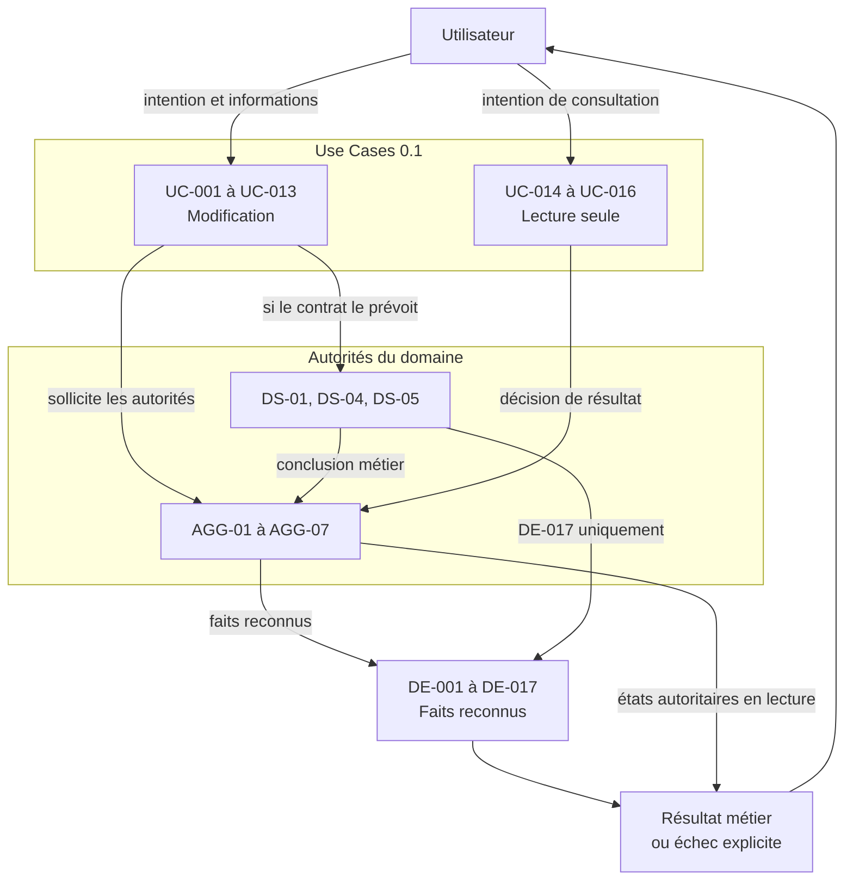

# Use Case Design

## Purpose

Ce document formalise les contrats applicatifs des seize Use Cases de Release 0.1. Chaque contrat relie une intention utilisateur aux autorités du domaine, aux validations nécessaires, aux faits métier reconnus et au résultat retourné.

Il décrit ce que l'application devra garantir autour du domaine sans attribuer à cette couche les décisions appartenant aux Aggregates ou aux Domain Services.

## Sources

Le design dérive exclusivement :

- des Product Capabilities de `23_PRODUCT_CAPABILITIES.md` ;
- des Acceptance Criteria de `29_RELEASE_0.1_ACCEPTANCE.md` ;
- des contrats d'Aggregates de `05_AGGREGATE_DESIGN.md` ;
- des Domain Services validés dans `06_DOMAIN_SERVICE_ANALYSIS.md` ;
- des Domain Events de `07_DOMAIN_EVENTS.md` ;
- des Use Cases identifiés dans `08_USE_CASE_ANALYSIS.md`.

## Conventions du contrat

### Nature

- **Modification :** le Use Case demande au domaine de reconnaître un nouvel état ou une nouvelle existence.
- **Lecture seule :** le Use Case demande une décision sur un résultat reconnu sans modifier l'état métier.

### Validations applicatives

Les validations applicatives vérifient uniquement que l'intention peut être présentée au domaine : informations attendues présentes, références résolubles, contexte de la demande identifiable et résultat demandé cohérent avec le Use Case choisi.

Elles ne déterminent jamais :

- l'identité métier ;
- l'appartenance ;
- la validité d'un état ;
- l'acceptation d'une Information ;
- la distinction ou l'équivalence d'une Source ;
- le caractère significatif d'un Changement ;
- la conformité à un invariant.

Ces décisions appartiennent exclusivement au domaine.

### Résultat et échec

Un résultat réussi contient uniquement des informations reconnues par leurs autorités. Un échec est explicite, ne produit aucun succès partiel et ne transforme jamais une Information absente en valeur supposée.

Les Domain Events attendus sont des faits susceptibles d'être reconnus lorsque le Use Case réussit. Aucun événement de réussite n'existe lorsque les préconditions ou invariants ne sont pas satisfaits.

## UC-001 — Créer un Inventaire

- **Nature :** Modification.
- **Mission :** transformer une intention de délimitation en Inventaire valide et historiquement identifiable.
- **Objectif utilisateur :** disposer d'un périmètre explicite pour maintenir une connaissance cohérente relative à des biens.
- **Déclencheur :** l'utilisateur souhaite commencer un Inventaire ou isoler une finalité distincte.
- **Préconditions :** la finalité et les limites proposées permettent de comprendre le périmètre recherché.
- **Validations applicatives :** vérifier la présence d'une intention, d'une finalité et de limites compréhensibles ; ne présumer aucun Article initial.
- **Aggregates sollicités :** AGG-01 pour la création ; AGG-06 pour l'origine.
- **Domain Services éventuels :** DS-04 pour confirmer la complétude entre création et continuité.
- **Décisions métier :** AGG-01 reconnaît l'identité, la finalité, les limites et l'existence ; AGG-06 reconnaît l'origine ; DS-04 reconnaît la complétude.
- **Domain Events attendus :** `DE-001`, `DE-014`, `DE-017`.
- **Résultat métier :** un Inventaire actif, valide et vide est reconnu.
- **Postconditions :** aucun Article n'est inclus implicitement ; le périmètre et son origine sont consultables.
- **Critères d'échec :** finalité ou limites insuffisantes pour distinguer le périmètre ; création partielle ; impossibilité de préserver l'origine.
- **Informations fournies par l'utilisateur :** intention, finalité et limites du périmètre.
- **Informations obtenues du domaine :** décision d'existence, identité reconnue et confirmation historique.
- **Informations renvoyées :** Inventaire reconnu, périmètre courant et confirmation de création complète.
- **Traçabilité :** `CAP-001` ; AGG-01, AGG-06 ; DS-04 ; `DE-001`, `DE-014`, `DE-017` ; `AC-01-CAP-001`, `AC-01-GLO-001`, `AC-01-GLO-008`, `AC-01-GLO-009`.

## UC-002 — Redéfinir le périmètre d'un Inventaire

- **Nature :** Modification.
- **Mission :** faire évoluer le périmètre reconnu sans altérer silencieusement les appartenances ni le passé.
- **Objectif utilisateur :** corriger ou préciser la finalité ou les limites d'un Inventaire existant.
- **Déclencheur :** le périmètre courant ne représente plus correctement l'intention de l'utilisateur.
- **Préconditions :** l'Inventaire existe et est actif ; une nouvelle définition et sa justification sont disponibles.
- **Validations applicatives :** résoudre l'Inventaire ciblé ; vérifier la présence de la nouvelle définition et de la justification ; distinguer cette intention d'une modification d'appartenance.
- **Aggregates sollicités :** AGG-01 comme autorité ; AGG-02 uniquement pour une lecture dérivée des appartenances concernées ; AGG-06 si la redéfinition est significative.
- **Domain Services éventuels :** DS-04 pour un Changement significatif.
- **Décisions métier :** AGG-01 accepte ou refuse le nouveau périmètre et qualifie sa portée ; AGG-06 accepte la continuité ; DS-04 confirme la complétude lorsque requise.
- **Domain Events attendus :** `DE-002` ; `DE-014` et `DE-017` lorsque le Changement est significatif.
- **Résultat métier :** le nouveau périmètre est reconnu sans modification implicite des Articles.
- **Postconditions :** une seule définition est courante ; l'ancienne reste compréhensible si le Changement est significatif ; les appartenances sont inchangées.
- **Critères d'échec :** Inventaire absent ou non admissible ; définition incohérente ; tentative de modifier des Articles par effet indirect ; continuité obligatoire non préservée.
- **Informations fournies par l'utilisateur :** Inventaire ciblé, nouvelle finalité ou limites et justification.
- **Informations obtenues du domaine :** périmètre courant, état de l'Inventaire, appartenances dérivées et décision de significativité.
- **Informations renvoyées :** périmètre reconnu, conséquences sans application automatique et confirmation de continuité éventuelle.
- **Traçabilité :** `CAP-001` ; AGG-01, AGG-02 en lecture, AGG-06 ; DS-04 ; `DE-002`, `DE-014`, `DE-017` ; `AC-01-GLO-002`, `AC-01-GLO-007`, `AC-01-GLO-008`, `AC-01-GLO-009`.

## UC-003 — Ajouter un bien à un Inventaire

- **Nature :** Modification.
- **Mission :** transformer une unité de gestion proposée en Article distinguable doté d'une appartenance unique.
- **Objectif utilisateur :** reconnaître explicitement un bien individuel ou un ensemble volontairement indivisible dans un Inventaire.
- **Déclencheur :** l'utilisateur souhaite faire entrer une unité de gestion dans le périmètre.
- **Préconditions :** l'Inventaire cible existe et est actif ; l'unité proposée est compréhensible.
- **Validations applicatives :** résoudre l'Inventaire ; vérifier que les informations nécessaires à la proposition d'identité sont présentes ; obtenir les Articles pertinents sans décider de leur similitude.
- **Aggregates sollicités :** AGG-01 en lecture ; AGG-02 cible et AGG-02 pertinents en lecture ; AGG-06 pour l'origine.
- **Domain Services éventuels :** DS-01 pour évaluer la distinction ; DS-04 pour la complétude historique.
- **Décisions métier :** DS-01 conclut distinguable, incompatible ou indéterminé ; AGG-02 reconnaît ou refuse l'identité et l'appartenance ; AGG-06 conserve l'origine ; DS-04 confirme la complétude.
- **Domain Events attendus :** `DE-003`, `DE-014`, `DE-017`.
- **Résultat métier :** un Article actif et distinguable appartient à un seul Inventaire.
- **Postconditions :** aucune Information absente n'est inventée ; les autres Aggregates peuvent référencer l'Article sans posséder son identité.
- **Critères d'échec :** Inventaire inexistant ; unité indéterminée ou incompatible ; double représentation active ; appartenance ambiguë ; origine non préservée.
- **Informations fournies par l'utilisateur :** Inventaire cible, description de l'unité de gestion et éléments utiles à sa distinction.
- **Informations obtenues du domaine :** existence du périmètre, identités pertinentes, conclusion de DS-01 et décision d'AGG-02.
- **Informations renvoyées :** Article reconnu, appartenance, identité courante et confirmation de continuité.
- **Traçabilité :** `CAP-002` ; AGG-01, AGG-02, AGG-06 ; DS-01, DS-04 ; `DE-003`, `DE-014`, `DE-017` ; `AC-01-CAP-002`, `AC-01-GLO-002`, `AC-01-GLO-007`, `AC-01-GLO-008`, `AC-01-GLO-009`.

## UC-004 — Corriger l'identité d'un Article

- **Nature :** Modification.
- **Mission :** rectifier l'identité courante d'un Article sans créer de doublon ni rompre sa continuité.
- **Objectif utilisateur :** corriger une unité de gestion précédemment mal comprise.
- **Déclencheur :** l'utilisateur identifie une erreur ou une ambiguïté dans l'identité reconnue.
- **Préconditions :** l'Article et son Inventaire existent ; la correction proposée et sa justification sont explicites.
- **Validations applicatives :** résoudre l'Article et son Inventaire ; vérifier la présence de la proposition et de la justification ; réunir les Articles pertinents sans décider de l'identité.
- **Aggregates sollicités :** AGG-01 et plusieurs AGG-02 en lecture ; AGG-02 cible comme autorité ; AGG-06 pour la continuité.
- **Domain Services éventuels :** DS-01 pour la distinction ; DS-04 pour la complétude.
- **Décisions métier :** DS-01 évalue la proposition ; AGG-02 décide de la correction et de la continuité identitaire ; AGG-06 conserve l'ancien état ; DS-04 confirme l'ensemble.
- **Domain Events attendus :** `DE-004`, `DE-014`, `DE-017`.
- **Résultat métier :** une seule identité corrigée reste courante pour le même Article.
- **Postconditions :** appartenance et références existantes demeurent valides sauf décision distincte ; l'ancienne compréhension reste explicable.
- **Critères d'échec :** Article absent ; proposition indéterminée ou concurrente ; correction sans justification ; double identité active ; perte de continuité.
- **Informations fournies par l'utilisateur :** Article ciblé, correction proposée et justification.
- **Informations obtenues du domaine :** identité courante, Inventaire, identités comparables, conclusion de DS-01 et Historique pertinent.
- **Informations renvoyées :** identité corrigée, continuité confirmée ou refus motivé.
- **Traçabilité :** `CAP-002` ; AGG-01, AGG-02, AGG-06 ; DS-01, DS-04 ; `DE-004`, `DE-014`, `DE-017` ; `AC-01-CAP-002`, `AC-01-GLO-002`, `AC-01-GLO-007`, `AC-01-GLO-009`.

## UC-005 — Enregistrer une Observation

- **Nature :** Modification.
- **Mission :** conserver un constat contextualisé et sourcé sans le confondre avec une conclusion.
- **Objectif utilisateur :** préserver ce qui a été constaté à propos d'un Article ou de sa situation.
- **Déclencheur :** l'utilisateur réalise ou rapporte une Observation utile.
- **Préconditions :** l'Article existe ; le constat, son contexte et sa provenance sont compréhensibles.
- **Validations applicatives :** résoudre l'Article ; vérifier la présence du constat, du contexte et de la provenance ; identifier si une Source commune est proposée sans décider de son équivalence.
- **Aggregates sollicités :** AGG-02 en lecture ; AGG-04 comme autorité ; AGG-07 si une Source partagée doit être reconnue.
- **Domain Services éventuels :** DS-05 pour évaluer la provenance commune.
- **Décisions métier :** DS-05 évalue la Source éventuelle ; AGG-07 reconnaît la Source si nécessaire ; AGG-04 reconnaît l'Observation et son rattachement.
- **Domain Events attendus :** `DE-010` ; `DE-015` si une nouvelle Source commune est reconnue.
- **Résultat métier :** une Observation contextualisée existe sans modifier la connaissance retenue.
- **Postconditions :** Article, Source, constat et contexte sont identifiables ; aucune conclusion n'est acceptée automatiquement.
- **Critères d'échec :** Article absent ; constat, contexte ou Source insuffisant ; provenance ambiguë ; tentative de présenter l'Observation comme Information retenue.
- **Informations fournies par l'utilisateur :** Article observé, constat, contexte et provenance.
- **Informations obtenues du domaine :** identité de l'Article, Sources pertinentes et conclusion éventuelle de DS-05.
- **Informations renvoyées :** Observation reconnue, Source associée et confirmation que la connaissance courante reste inchangée.
- **Traçabilité :** `CAP-003` ; AGG-02, AGG-04, AGG-07 ; DS-05 ; `DE-010`, `DE-015` ; `AC-01-CAP-003`, `AC-01-GLO-003`, `AC-01-GLO-005`, `AC-01-GLO-006`, `AC-01-GLO-009`.

## UC-006 — Corriger une Observation

- **Nature :** Modification.
- **Mission :** rectifier un constat ou son contexte sans falsifier la compréhension antérieure.
- **Objectif utilisateur :** corriger une Observation erronée ou imprécise.
- **Déclencheur :** l'utilisateur constate une erreur dans une Observation existante.
- **Préconditions :** l'Observation, son Article et sa Source existent ; la correction et sa justification sont explicites.
- **Validations applicatives :** résoudre les références ; vérifier la présence de la correction et de sa justification ; ne pas décider si le sens évolue.
- **Aggregates sollicités :** AGG-02 et AGG-07 en lecture ; AGG-04 comme autorité ; AGG-03 en lecture pour identifier un réexamen possible ; AGG-06 si nécessaire.
- **Domain Services éventuels :** DS-04 lorsque AGG-04 qualifie la correction de significative.
- **Décisions métier :** AGG-04 accepte ou refuse la correction et qualifie son effet sur le sens ; AGG-06 conserve l'ancien état si requis ; DS-04 confirme la complétude.
- **Domain Events attendus :** `DE-011` ; `DE-014` et `DE-017` si le sens évolue significativement.
- **Résultat métier :** l'Observation courante est corrigée ; un besoin de réexamen de connaissance peut être signalé sans actualisation implicite.
- **Postconditions :** provenance et contexte restent identifiables ; l'état antérieur est conservé lorsque requis ; AGG-03 reste inchangé.
- **Critères d'échec :** Observation absente ; correction injustifiée ; perte de contexte ou de Source ; réécriture silencieuse ; continuité obligatoire impossible.
- **Informations fournies par l'utilisateur :** Observation ciblée, correction et justification.
- **Informations obtenues du domaine :** Observation courante, Article, Source, éventuelles Informations référentes et décision de significativité.
- **Informations renvoyées :** Observation corrigée, statut de continuité et indication d'un éventuel réexamen séparé.
- **Traçabilité :** `CAP-003` ; AGG-02, AGG-03 en lecture, AGG-04, AGG-06, AGG-07 ; DS-04 ; `DE-011`, `DE-014`, `DE-017` ; `AC-01-CAP-003`, `AC-01-GLO-003`, `AC-01-GLO-005`, `AC-01-GLO-007`, `AC-01-GLO-009`.

## UC-007 — Documenter un Article

- **Nature :** Modification.
- **Mission :** conserver une explication contextualisée et sourcée sans lui conférer une autorité automatique.
- **Objectif utilisateur :** préserver une connaissance explicative utile relative à un Article.
- **Déclencheur :** l'utilisateur souhaite rattacher durablement une explication à un Article.
- **Préconditions :** l'Article existe ; l'explication, son contexte et sa provenance sont compréhensibles.
- **Validations applicatives :** résoudre l'Article ; vérifier la présence du contenu, du contexte et de la provenance ; distinguer l'intention documentaire d'une Observation ou d'une Information retenue.
- **Aggregates sollicités :** AGG-02 en lecture ; AGG-05 comme autorité ; AGG-07 si une Source partagée doit être reconnue.
- **Domain Services éventuels :** DS-05 pour évaluer la provenance commune.
- **Décisions métier :** DS-05 évalue la Source ; AGG-07 la reconnaît si nécessaire ; AGG-05 reconnaît la Documentation et son rattachement.
- **Domain Events attendus :** `DE-012` ; `DE-015` si une nouvelle Source commune est reconnue.
- **Résultat métier :** une Documentation contextualisée et sourcée est reliée au bon Article.
- **Postconditions :** son rôle reste distinct d'une Observation, d'une Information retenue et d'un Élément probant ; AGG-03 reste inchangé.
- **Critères d'échec :** Article absent ; contenu, contexte ou Source insuffisant ; provenance ambiguë ; tentative de conférer une autorité implicite à la Documentation.
- **Informations fournies par l'utilisateur :** Article, explication, contexte et provenance.
- **Informations obtenues du domaine :** identité de l'Article, Sources pertinentes et conclusion éventuelle de DS-05.
- **Informations renvoyées :** Documentation reconnue, Source associée et rôle documentaire explicite.
- **Traçabilité :** `CAP-005` ; AGG-02, AGG-05, AGG-07 ; DS-05 ; `DE-012`, `DE-015` ; `AC-01-CAP-005`, `AC-01-GLO-003`, `AC-01-GLO-006`, `AC-01-GLO-009`.

## UC-008 — Corriger une Documentation

- **Nature :** Modification.
- **Mission :** rectifier une explication ou son rattachement sans effacer silencieusement son sens antérieur.
- **Objectif utilisateur :** corriger une Documentation erronée ou insuffisamment contextualisée.
- **Déclencheur :** l'utilisateur identifie une erreur dans une Documentation existante.
- **Préconditions :** la Documentation, son Article et sa Source existent ; la correction et sa justification sont explicites.
- **Validations applicatives :** résoudre les références ; vérifier la présence de la correction et de la justification ; ne pas qualifier la significativité.
- **Aggregates sollicités :** AGG-02 et AGG-07 en lecture ; AGG-05 comme autorité ; AGG-03 en lecture pour un réexamen possible ; AGG-06 si nécessaire.
- **Domain Services éventuels :** DS-04 lorsque le sens évolue significativement.
- **Décisions métier :** AGG-05 accepte ou refuse la correction et qualifie son effet ; AGG-06 conserve l'ancien état si requis ; DS-04 confirme la complétude.
- **Domain Events attendus :** `DE-013` ; `DE-014` et `DE-017` si le sens évolue significativement.
- **Résultat métier :** la Documentation courante est corrigée sans modification implicite de la connaissance.
- **Postconditions :** contexte, Source et rattachement restent explicites ; l'état antérieur est conservé lorsque requis.
- **Critères d'échec :** Documentation absente ; correction injustifiée ; perte de provenance ; réécriture silencieuse ; continuité obligatoire impossible.
- **Informations fournies par l'utilisateur :** Documentation ciblée, correction et justification.
- **Informations obtenues du domaine :** Documentation courante, Article, Source, éventuelles Informations référentes et décision de significativité.
- **Informations renvoyées :** Documentation corrigée, continuité éventuelle et indication d'un réexamen séparé.
- **Traçabilité :** `CAP-005` ; AGG-02, AGG-03 en lecture, AGG-05, AGG-06, AGG-07 ; DS-04 ; `DE-013`, `DE-014`, `DE-017` ; `AC-01-CAP-005`, `AC-01-GLO-003`, `AC-01-GLO-007`, `AC-01-GLO-009`.

## UC-009 — Établir une Information initiale

- **Nature :** Modification.
- **Mission :** reconnaître une première position sourcée sur une question délimitée sans inventer de certitude.
- **Objectif utilisateur :** établir ce qui est actuellement retenu, incertain, contesté ou inconnu à propos d'un Article.
- **Déclencheur :** l'utilisateur souhaite formaliser une première connaissance sur une question déterminée.
- **Préconditions :** l'Article existe ; la question est délimitée ; une Source est identifiable ; les apports éventuels sont référencés sans être altérés.
- **Validations applicatives :** résoudre Article, Source et apports ; vérifier la présence de la question et de l'intention d'arbitrage ; ne pas compléter une valeur absente.
- **Aggregates sollicités :** AGG-02 en lecture ; AGG-03 comme autorité ; AGG-04 et AGG-05 en lecture si utilisés ; AGG-07 pour la provenance ; AGG-06 pour l'origine.
- **Domain Services éventuels :** DS-05 si une Source commune doit être reconnue ; DS-04 pour la complétude.
- **Décisions métier :** AGG-07 reconnaît éventuellement la Source ; AGG-03 établit la position initiale et son incertitude ; AGG-06 conserve l'origine ; DS-04 confirme la complétude.
- **Domain Events attendus :** `DE-005`, éventuellement `DE-015`, puis `DE-014` et `DE-017`.
- **Résultat métier :** une position initiale explicite existe pour la question, y compris lorsqu'elle reconnaît l'inconnu ou le conflit.
- **Postconditions :** une seule position courante est identifiable ; Source et incertitude sont visibles ; les apports restent autonomes.
- **Critères d'échec :** Article ou Source absent ; question indéterminée ; conclusion non justifiée ; alternatives incompatibles masquées ; continuité non préservée.
- **Informations fournies par l'utilisateur :** Article, question, proposition ou reconnaissance de l'inconnu, Source, incertitude et apports éventuels.
- **Informations obtenues du domaine :** état de l'Article, Source reconnue, apports référencés et Historique initial.
- **Informations renvoyées :** Information courante, provenance, incertitude, conflit éventuel et confirmation de continuité.
- **Traçabilité :** `CAP-006` ; AGG-02 à AGG-07 selon apports ; DS-05, DS-04 ; `DE-005`, `DE-015`, `DE-014`, `DE-017` ; `AC-01-CAP-006`, `AC-01-GLO-003`, `AC-01-GLO-005`, `AC-01-GLO-006`, `AC-01-GLO-008`, `AC-01-GLO-009`.

## UC-010 — Actualiser une Information

- **Nature :** Modification.
- **Mission :** faire évoluer la position courante sans perdre sa provenance, son incertitude ni son état antérieur.
- **Objectif utilisateur :** reconnaître une nouvelle compréhension justifiée à propos d'un Article.
- **Déclencheur :** un constat, une explication, une correction ou une décision remet en cause l'Information courante.
- **Préconditions :** l'Information, l'Article et la nouvelle Source existent ou peuvent être reconnus ; la justification est explicite.
- **Validations applicatives :** résoudre les références ; vérifier la présence de la nouvelle proposition, de la Source et de la justification ; réunir les apports sans les interpréter.
- **Aggregates sollicités :** AGG-02 en lecture ; AGG-03 comme autorité ; AGG-04, AGG-05 et AGG-07 en lecture selon les apports ; AGG-06 pour la continuité.
- **Domain Services éventuels :** DS-05 si une Source commune doit être reconnue ; DS-04 pour la complétude.
- **Décisions métier :** AGG-07 reconnaît éventuellement la Source ; AGG-03 accepte, refuse ou maintient la position et qualifie l'incertitude ; AGG-06 conserve l'ancien état ; DS-04 confirme la complétude.
- **Domain Events attendus :** `DE-006`, éventuellement `DE-015`, puis `DE-014` et `DE-017`.
- **Résultat métier :** une nouvelle Information courante est reconnue avec sa provenance et son incertitude.
- **Postconditions :** l'ancien état n'est plus courant mais reste compréhensible ; les apports sont inchangés ; aucune contradiction n'est masquée.
- **Critères d'échec :** Information ou Article absent ; Source non identifiable ; justification insuffisante ; certitude injustifiée ; conflit aplati ; perte de continuité.
- **Informations fournies par l'utilisateur :** Information ciblée, nouvelle proposition, Source, justification, incertitude et apports éventuels.
- **Informations obtenues du domaine :** état courant, apports, Source, alternatives incompatibles et Historique.
- **Informations renvoyées :** nouvelle position ou refus, provenance, incertitude, alternatives et continuité.
- **Traçabilité :** `CAP-006` ; AGG-02, AGG-03, AGG-04, AGG-05, AGG-06, AGG-07 ; DS-05, DS-04 ; `DE-006`, `DE-015`, `DE-014`, `DE-017` ; `AC-01-CAP-006`, `AC-01-GLO-003` à `AC-01-GLO-007`, `AC-01-GLO-009`.

## UC-011 — Déclarer une incertitude ou un conflit

- **Nature :** Modification.
- **Mission :** rendre explicite une limite de connaissance sans produire une réponse artificielle.
- **Objectif utilisateur :** signaler qu'une position manque de certitude ou que plusieurs propositions sont incompatibles.
- **Déclencheur :** l'utilisateur reconnaît une insuffisance, une absence ou un désaccord portant sur une même question.
- **Préconditions :** l'Information ou la question existe ; l'insuffisance ou les propositions incompatibles sont identifiables.
- **Validations applicatives :** résoudre la question et les apports ; vérifier que le type d'intention — incertitude, conflit ou inconnu — est explicite ; ne pas arbitrer la situation.
- **Aggregates sollicités :** AGG-03 comme autorité ; AGG-04, AGG-05 et AGG-07 en lecture lorsque pertinents ; AGG-06 si l'état courant évolue significativement.
- **Domain Services éventuels :** DS-04 seulement lorsque la modification exige une continuité historique.
- **Décisions métier :** AGG-03 reconnaît l'incertitude, le conflit ou l'inconnu et qualifie la significativité ; AGG-06 et DS-04 interviennent lorsque requis.
- **Domain Events attendus :** `DE-007` ou `DE-008` ; `DE-014` et `DE-017` si le Changement est significatif.
- **Résultat métier :** la limite de connaissance est visible et aucune proposition incompatible n'est présentée comme certaine par défaut.
- **Postconditions :** les apports restent distinguables ; le conflit peut demeurer ouvert ; aucune résolution automatique n'est produite.
- **Critères d'échec :** question absente ; apports non comparables ; intention ambiguë ; tentative d'inventer une position ; perte d'un état antérieur significatif.
- **Informations fournies par l'utilisateur :** question ou Information ciblée, nature de la limite, propositions concernées et justification.
- **Informations obtenues du domaine :** position courante, apports, Sources, conflit et Historique éventuel.
- **Informations renvoyées :** incertitude, conflit ou inconnu reconnu, propositions concernées et continuité éventuelle.
- **Traçabilité :** `CAP-006` ; AGG-03 à AGG-07 selon apports ; DS-04 si requis ; `DE-007`, `DE-008`, `DE-014`, `DE-017` ; `AC-01-CAP-006`, `AC-01-GLO-005`, `AC-01-GLO-006`, `AC-01-GLO-007`, `AC-01-GLO-009`.

## UC-012 — Arbitrer un conflit d'information

- **Nature :** Modification.
- **Mission :** reconnaître une décision explicite face à des propositions incompatibles sans effacer les alternatives.
- **Objectif utilisateur :** retenir une position, maintenir le conflit ou reconnaître l'inconnu après examen.
- **Déclencheur :** un conflit déclaré dispose d'éléments suffisants pour permettre une décision humaine explicite.
- **Préconditions :** le conflit, l'Information, les propositions et leurs Sources sont identifiables ; une justification est fournie.
- **Validations applicatives :** résoudre les références ; vérifier la présence de l'issue choisie et de la justification ; ne pas évaluer la vérité des propositions.
- **Aggregates sollicités :** AGG-03 comme autorité ; AGG-04, AGG-05 et AGG-07 en lecture ; AGG-06 pour la continuité.
- **Domain Services éventuels :** DS-04 pour la complétude. L'arbitrage ne relève d'aucun Domain Service.
- **Décisions métier :** AGG-03 rend l'arbitrage et fixe l'incertitude résiduelle ; AGG-06 conserve la décision et les alternatives ; DS-04 confirme la complétude.
- **Domain Events attendus :** `DE-009`, `DE-014`, `DE-017`.
- **Résultat métier :** une issue explicite est reconnue sans altération des apports ni disparition du conflit passé.
- **Postconditions :** position courante, alternatives et incertitude résiduelle sont cohérentes ; la justification reste consultable.
- **Critères d'échec :** conflit absent ; proposition ou Source introuvable ; justification insuffisante ; issue contradictoire ; suppression d'une alternative ; continuité impossible.
- **Informations fournies par l'utilisateur :** conflit ciblé, issue choisie et justification.
- **Informations obtenues du domaine :** position courante, propositions, Sources, apports et Historique.
- **Informations renvoyées :** arbitrage reconnu, position courante, incertitude résiduelle, alternatives et continuité.
- **Traçabilité :** `CAP-006` ; AGG-03, AGG-04, AGG-05, AGG-06, AGG-07 ; DS-04 ; `DE-009`, `DE-014`, `DE-017` ; `AC-01-CAP-006`, `AC-01-GLO-003` à `AC-01-GLO-007`, `AC-01-GLO-009`.

## UC-013 — Corriger une Source commune

- **Nature :** Modification.
- **Mission :** rectifier une provenance partagée sans dupliquer son autorité ni réécrire les apports qui la référencent.
- **Objectif utilisateur :** corriger l'identité ou le contexte commun d'une Source reconnue.
- **Déclencheur :** l'utilisateur constate que la provenance partagée est erronée ou ambiguë.
- **Préconditions :** la Source existe ; la correction et sa justification sont explicites ; les Sources comparables sont consultables.
- **Validations applicatives :** résoudre la Source ciblée ; vérifier la présence de la correction et de la justification ; réunir les Sources pertinentes sans décider de leur équivalence.
- **Aggregates sollicités :** plusieurs AGG-07 en lecture ; AGG-07 cible comme autorité ; AGG-03, AGG-04 et AGG-05 comme référents non modifiés ; AGG-06 si nécessaire.
- **Domain Services éventuels :** DS-05 pour la distinction de provenance ; DS-04 lorsque la compréhension évolue significativement.
- **Décisions métier :** DS-05 conclut sur l'identité commune ; AGG-07 accepte ou refuse la correction et qualifie son effet ; AGG-06 conserve l'ancien contexte si requis ; DS-04 confirme la complétude.
- **Domain Events attendus :** `DE-016` ; `DE-014` et `DE-017` si le Changement est significatif.
- **Résultat métier :** une seule Source corrigée reste autoritaire ; ses usages conservent leurs propres décisions.
- **Postconditions :** aucune Observation, Documentation ou Information n'est modifiée implicitement ; un réexamen séparé peut être indiqué.
- **Critères d'échec :** Source absente ; correction ambiguë ; équivalence indéterminée ; création d'une autorité concurrente ; réécriture d'un apport ; continuité requise impossible.
- **Informations fournies par l'utilisateur :** Source ciblée, correction et justification.
- **Informations obtenues du domaine :** Source courante, Sources comparables, usages dérivés, conclusion de DS-05 et Historique éventuel.
- **Informations renvoyées :** Source corrigée, usages potentiellement concernés sans modification, continuité et besoin de réexamen éventuel.
- **Traçabilité :** `CAP-003`, `CAP-005`, `CAP-006` ; AGG-03 à AGG-07 ; DS-05, DS-04 ; `DE-016`, `DE-014`, `DE-017` ; critères des capacités concernées, `AC-01-GLO-003`, `AC-01-GLO-007`, `AC-01-GLO-009`.

## UC-014 — Rechercher dans un Inventaire

- **Nature :** Lecture seule.
- **Mission :** déterminer les Articles correspondant à une intention de recherche sans modifier ni inventer la connaissance.
- **Objectif utilisateur :** retrouver un Article ou une Information utile à partir d'éléments connus.
- **Déclencheur :** l'utilisateur exprime une intention de recherche dans un Inventaire.
- **Préconditions :** l'Inventaire existe ; l'intention est suffisamment explicite pour être évaluée.
- **Validations applicatives :** résoudre l'Inventaire ; vérifier la présence de l'intention ; préserver les distinctions entre absence, inconnue et absence de correspondance.
- **Aggregates sollicités :** AGG-01, AGG-02, AGG-03 et AGG-05 en lecture par BC-05. AGG-04 reste accessible depuis l'Article mais n'est pas directement recherché en 0.1.
- **Domain Services éventuels :** aucun.
- **Décisions métier :** BC-05 interprète l'intention, sélectionne les correspondances pertinentes et reconnaît explicitement une absence de résultat sans conclure à l'inexistence réelle.
- **Domain Events attendus :** aucun.
- **Résultat métier :** ensemble de correspondances distinguables ou absence explicite de correspondance.
- **Postconditions :** aucune autorité du domaine n'est modifiée ; incertitudes et conflits restent visibles dans les résultats.
- **Critères d'échec :** Inventaire absent ; intention inexploitable ; identités confondues ; correspondance inventée ; absence de résultat présentée comme certitude sur le monde réel.
- **Informations fournies par l'utilisateur :** Inventaire et intention de recherche.
- **Informations obtenues du domaine :** périmètre, identités, Informations courantes et Documentations admises à la découverte.
- **Informations renvoyées :** correspondances pertinentes avec leurs distinctions, ou absence explicite.
- **Traçabilité :** `CAP-009` ; BC-05 lisant AGG-01, AGG-02, AGG-03, AGG-05 ; aucun Domain Service ; aucun Domain Event ; `AC-01-CAP-009`, `AC-01-GLO-001`, `AC-01-GLO-002`, `AC-01-GLO-006`, `AC-01-GLO-008`, `AC-01-GLO-009`.

## UC-015 — Consulter un Article

- **Nature :** Lecture seule.
- **Mission :** restituer la connaissance courante d'un Article en préservant l'autorité et la nature de chaque information.
- **Objectif utilisateur :** comprendre ce que l'Inventaire reconnaît actuellement à propos d'un Article et d'où cela provient.
- **Déclencheur :** l'utilisateur désigne un Article directement ou depuis une recherche.
- **Préconditions :** l'Article existe dans un Inventaire reconnu.
- **Validations applicatives :** résoudre l'Article ; réunir uniquement les informations autorisées ; ne pas confondre absence, inconnue, conflit et incertitude.
- **Aggregates sollicités :** AGG-01, AGG-02, AGG-03, AGG-04, AGG-05 et AGG-07 en lecture.
- **Domain Services éventuels :** aucun.
- **Décisions métier :** les autorités sources déterminent leurs états courants ; la consultation compose un résultat fidèle sans produire une nouvelle décision d'état.
- **Domain Events attendus :** aucun.
- **Résultat métier :** identité, appartenance, connaissance courante, Sources, incertitudes, conflits, Observations et Documentations sont compréhensibles et distincts.
- **Postconditions :** aucune information n'est modifiée ; l'Historique reste séparé de l'état courant.
- **Critères d'échec :** Article absent ; Source masquée ; rôles confondus ; incertitude ou conflit aplati ; contenu supposé présenté comme connu.
- **Informations fournies par l'utilisateur :** Article ciblé.
- **Informations obtenues du domaine :** états courants autoritaires et apports associés.
- **Informations renvoyées :** connaissance courante structurée par responsabilité, avec provenance et limites explicites.
- **Traçabilité :** `CAP-002`, `CAP-009` ; AGG-01 à AGG-05, AGG-07 ; aucun Domain Service ; aucun Domain Event ; `AC-01-CAP-002`, `AC-01-CAP-009`, `AC-01-GLO-001` à `AC-01-GLO-003`, `AC-01-GLO-005`, `AC-01-GLO-006`, `AC-01-GLO-008`.

## UC-016 — Consulter l'Historique

- **Nature :** Lecture seule.
- **Mission :** restituer la continuité des Changements significatifs sans confondre le passé avec l'autorité du présent.
- **Objectif utilisateur :** comprendre comment et pourquoi un Inventaire, un Article ou sa connaissance a évolué.
- **Déclencheur :** l'utilisateur désigne un sujet et demande à comprendre son évolution.
- **Préconditions :** le sujet existe ou possède une continuité historique reconnue.
- **Validations applicatives :** résoudre le sujet ; identifier l'Historique correspondant ; préserver l'ordre métier et la distinction entre état antérieur et état courant.
- **Aggregates sollicités :** AGG-06 comme autorité historique ; Aggregate source concerné en lecture pour l'état courant.
- **Domain Services éventuels :** aucun ; DS-04 est intervenu au moment des Changements significatifs.
- **Décisions métier :** AGG-06 détermine les Changements appartenant à la continuité du sujet ; l'Aggregate source détermine l'état courant.
- **Domain Events attendus :** aucun.
- **Résultat métier :** états antérieurs, décisions, Sources, justifications et état courant forment une évolution compréhensible.
- **Postconditions :** aucun état passé n'est réactivé ; aucun Changement n'est ajouté par la consultation.
- **Critères d'échec :** sujet et Historique non résolubles ; continuité incohérente ; état courant présenté comme historique ou inversement ; activité insignifiante présentée comme Changement métier.
- **Informations fournies par l'utilisateur :** sujet de l'Historique recherché.
- **Informations obtenues du domaine :** continuité AGG-06 et état courant de l'Aggregate source.
- **Informations renvoyées :** séquence compréhensible des Changements, états et justifications.
- **Traçabilité :** `CAP-011` ; AGG-06 et Aggregate source en lecture ; aucun Domain Service ; aucun Domain Event ; `AC-01-CAP-011`, `AC-01-GLO-001`, `AC-01-GLO-004`, `AC-01-GLO-007`, `AC-01-GLO-008`, `AC-01-GLO-009`.

## Répartition des validations

### Validations appartenant à l'application

- reconnaître le Use Case demandé et son résultat attendu ;
- vérifier que les informations explicitement requises sont présentes ;
- résoudre les références nécessaires avant de solliciter une décision ;
- réunir les Aggregates et lectures autoritaires requis sans modifier leur sens ;
- distinguer une absence de référence d'un refus métier ;
- présenter au bon Aggregate les conclusions des Domain Services ;
- empêcher qu'un échec soit rapporté comme succès partiel ;
- restituer le résultat et les faits reconnus sans les enrichir artificiellement.

### Validations appartenant au domaine

- existence et état admissible d'un Inventaire ou Article ;
- distinction des identités d'Articles par DS-01 et décision finale d'AGG-02 ;
- distinction des Sources communes par DS-05 et décision finale d'AGG-07 ;
- validité d'une Observation ou Documentation dans son contexte ;
- acceptation, incertitude, conflit et arbitrage d'une Information par AGG-03 ;
- caractère significatif d'un Changement par son Aggregate source ;
- cohérence de la continuité par AGG-06 ;
- complétude inter-Aggregates par DS-04 ;
- respect de tous les invariants Produit.

### Validations hors périmètre

- droits différenciés entre plusieurs profils agissant sur le même Inventaire ;
- règles de diffusion, partage ou publication ;
- admission d'éléments extérieurs par import ;
- classement par Catalogues ou Catégories ;
- rôle probant structuré ;
- comparaison, archivage et réactivation ;
- forme de représentation des informations échangées.

Ces validations ne doivent être ni simulées ni déduites des contrats 0.1.

## Classification lecture et modification

### Use Cases modifiant le domaine

`UC-001` à `UC-013` demandent une décision modifiant une autorité métier. Leur réussite peut produire un ou plusieurs Domain Events. Une correction sans Changement significatif produit le fait propre à l'Aggregate sans exiger systématiquement AGG-06 et DS-04.

### Use Cases en lecture seule

- `UC-014` — Rechercher dans un Inventaire ;
- `UC-015` — Consulter un Article ;
- `UC-016` — Consulter l'Historique.

Ils ne produisent aucun Domain Event, ne modifient aucun Aggregate et ne transforment aucune représentation dérivée en autorité.

## Responsabilités applicatives futures

Les futurs Application Services devront porter les responsabilités suivantes sans recevoir d'autorité métier propre :

1. recevoir une intention et sélectionner le contrat de Use Case correspondant ;
2. effectuer les validations applicatives définies par ce contrat ;
3. obtenir les Aggregates et informations autoritaires nécessaires ;
4. solliciter les Domain Services uniquement lorsque le contrat le prévoit ;
5. transmettre leurs conclusions aux Aggregate Roots qui conservent la décision finale ;
6. coordonner les décisions multiples exigées par un même résultat sans les fusionner ;
7. ne déclarer la réussite qu'après satisfaction de toutes les postconditions ;
8. recueillir les Domain Events reconnus sans en inventer ;
9. restituer le résultat métier ou un échec explicite ;
10. garantir qu'une consultation reste sans effet sur le domaine.

Cette liste définit des responsabilités, pas un découpage en composants. Plusieurs organisations restent possibles tant que chaque contrat et chaque autorité sont respectés.

## Matrice de traçabilité

| Use Case | Capabilities | Aggregates | Domain Services | Domain Events | Acceptance Criteria principaux |
| --- | --- | --- | --- | --- | --- |
| `UC-001` | `CAP-001` | AGG-01, AGG-06 | DS-04 | `DE-001`, `DE-014`, `DE-017` | `AC-01-CAP-001`, `AC-01-GLO-001`, `AC-01-GLO-008`, `AC-01-GLO-009` |
| `UC-002` | `CAP-001` | AGG-01, AGG-02 en lecture, AGG-06 | DS-04 si significatif | `DE-002`, `DE-014`, `DE-017` | `AC-01-GLO-002`, `AC-01-GLO-007` à `AC-01-GLO-009` |
| `UC-003` | `CAP-002` | AGG-01 en lecture, AGG-02, AGG-06 | DS-01, DS-04 | `DE-003`, `DE-014`, `DE-017` | `AC-01-CAP-002`, `AC-01-GLO-002`, `AC-01-GLO-007` à `AC-01-GLO-009` |
| `UC-004` | `CAP-002` | AGG-01 et AGG-02 en lecture, AGG-02 cible, AGG-06 | DS-01, DS-04 | `DE-004`, `DE-014`, `DE-017` | `AC-01-CAP-002`, `AC-01-GLO-002`, `AC-01-GLO-007`, `AC-01-GLO-009` |
| `UC-005` | `CAP-003` | AGG-02 en lecture, AGG-04, AGG-07 | DS-05 si nécessaire | `DE-010`, `DE-015` | `AC-01-CAP-003`, `AC-01-GLO-003`, `AC-01-GLO-005`, `AC-01-GLO-006`, `AC-01-GLO-009` |
| `UC-006` | `CAP-003` | AGG-02, AGG-03 en lecture, AGG-04, AGG-06, AGG-07 | DS-04 si significatif | `DE-011`, `DE-014`, `DE-017` | `AC-01-CAP-003`, `AC-01-GLO-003`, `AC-01-GLO-005`, `AC-01-GLO-007`, `AC-01-GLO-009` |
| `UC-007` | `CAP-005` | AGG-02 en lecture, AGG-05, AGG-07 | DS-05 si nécessaire | `DE-012`, `DE-015` | `AC-01-CAP-005`, `AC-01-GLO-003`, `AC-01-GLO-006`, `AC-01-GLO-009` |
| `UC-008` | `CAP-005` | AGG-02, AGG-03 en lecture, AGG-05, AGG-06, AGG-07 | DS-04 si significatif | `DE-013`, `DE-014`, `DE-017` | `AC-01-CAP-005`, `AC-01-GLO-003`, `AC-01-GLO-007`, `AC-01-GLO-009` |
| `UC-009` | `CAP-006` | AGG-02 à AGG-07 selon apports | DS-05 si nécessaire, DS-04 | `DE-005`, `DE-015`, `DE-014`, `DE-017` | `AC-01-CAP-006`, `AC-01-GLO-003`, `AC-01-GLO-005`, `AC-01-GLO-006`, `AC-01-GLO-008`, `AC-01-GLO-009` |
| `UC-010` | `CAP-006` | AGG-02 à AGG-07 selon apports | DS-05 si nécessaire, DS-04 | `DE-006`, `DE-015`, `DE-014`, `DE-017` | `AC-01-CAP-006`, `AC-01-GLO-003` à `AC-01-GLO-007`, `AC-01-GLO-009` |
| `UC-011` | `CAP-006` | AGG-03 à AGG-07 selon apports | DS-04 si significatif | `DE-007`, `DE-008`, `DE-014`, `DE-017` | `AC-01-CAP-006`, `AC-01-GLO-005` à `AC-01-GLO-007`, `AC-01-GLO-009` |
| `UC-012` | `CAP-006` | AGG-03 à AGG-07 | DS-04 | `DE-009`, `DE-014`, `DE-017` | `AC-01-CAP-006`, `AC-01-GLO-003` à `AC-01-GLO-007`, `AC-01-GLO-009` |
| `UC-013` | `CAP-003`, `CAP-005`, `CAP-006` | AGG-03 à AGG-07 | DS-05, DS-04 si significatif | `DE-016`, `DE-014`, `DE-017` | Critères des capacités concernées, `AC-01-GLO-003`, `AC-01-GLO-007`, `AC-01-GLO-009` |
| `UC-014` | `CAP-009` | BC-05 lisant AGG-01, AGG-02, AGG-03, AGG-05 | Aucun | Aucun | `AC-01-CAP-009`, `AC-01-GLO-001`, `AC-01-GLO-002`, `AC-01-GLO-006`, `AC-01-GLO-008`, `AC-01-GLO-009` |
| `UC-015` | `CAP-002`, `CAP-009` | AGG-01 à AGG-05, AGG-07 en lecture | Aucun | Aucun | `AC-01-CAP-002`, `AC-01-CAP-009`, `AC-01-GLO-001` à `AC-01-GLO-003`, `AC-01-GLO-005`, `AC-01-GLO-006`, `AC-01-GLO-008` |
| `UC-016` | `CAP-011` | AGG-06 et Aggregate source en lecture | Aucun | Aucun | `AC-01-CAP-011`, `AC-01-GLO-001`, `AC-01-GLO-004`, `AC-01-GLO-007` à `AC-01-GLO-009` |

`AC-01-GLO-010` demeure transversal et interdit de rendre une capacité exclue nécessaire à l'un de ces contrats.

## Diagramme conceptuel des interactions

Le diagramme représente des responsabilités et des décisions. Il ne prescrit ni découpage interne, ni ordre universel entre Aggregates et Domain Services. Seul le contrat de chaque Use Case détermine les autorités nécessaires.

## Questions ouvertes

Aucune question ne bloque l'étape suivante. Les cinq points ouverts par l'analyse sont résolus ainsi :

1. **Découverte 0.1 :** AGG-01, AGG-02, AGG-03 et AGG-05 alimentent directement la recherche ; les Observations sont consultées depuis l'Article, pas recherchées directement.
2. **Changement significatif :** l'application ne le qualifie jamais ; l'Aggregate source décide selon l'évolution du sens, de l'identité, du périmètre ou de la position courante.
3. **Source commune :** sa reconnaissance lors d'un apport reste composante ; `UC-013` devient autonome uniquement pour corriger une Source partagée déjà reconnue.
4. **Information initiale minimale :** une question délimitée peut reconnaître l'inconnu ou l'incertitude si sa Source est identifiable ; aucune valeur de complétude n'est inventée.
5. **Consultation et Historique :** `UC-015` restitue l'état courant ; `UC-016` restitue la continuité passée et référence l'état courant sans le posséder.

Les choix de représentation, d'organisation interne et de réalisation restent volontairement ouverts.

## Contrôles de cohérence

- Les seize Use Cases de l'analyse possèdent un contrat complet.
- Treize Use Cases modifient le domaine et trois restent en lecture seule.
- Les validations applicatives et métier sont séparées explicitement.
- Chaque décision demeure chez l'Aggregate ou le Domain Service autoritaire.
- Aucun événement de réussite n'est produit en cas d'échec.
- Les informations fournies, obtenues et renvoyées sont identifiées sans présumer leur représentation.
- Les sept capacités 0.1 et leurs Acceptance Criteria restent traçables.
- Les capacités exclues ne sont ni simulées ni requises.

## Conclusion

**READY FOR APPLICATION SERVICES**

Les seize contrats définissent une intention, des validations, des autorités, des décisions, des faits reconnus, un résultat, des postconditions et des échecs explicites. Deux équipes peuvent organiser différemment la future couche applicative tout en respectant les mêmes responsabilités et résultats métier.

Les responsabilités applicatives futures sont suffisamment délimitées pour ouvrir leur conception sans modifier le domaine ni introduire un choix de réalisation.
