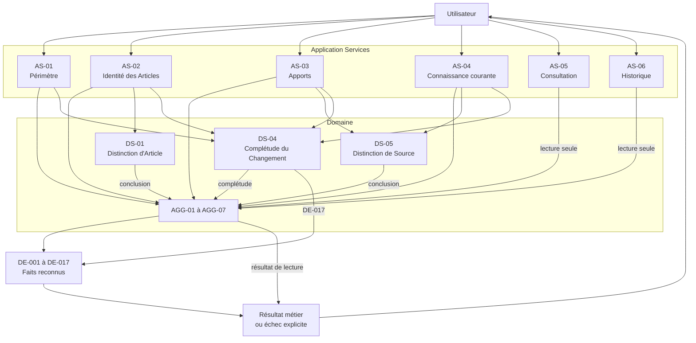

# Application Services

## Purpose

Ce document identifie les Application Services nécessaires pour porter les seize contrats de Use Case de Release 0.1. Il définit leurs responsabilités, leurs frontières et leurs coordinations sans déterminer leur réalisation.

Un Application Service reçoit une intention, prépare les autorités nécessaires, sollicite les décisions du domaine et restitue le résultat. Il ne possède aucune règle métier, aucune identité métier et aucun état faisant autorité.

## Sources

Le découpage dérive exclusivement :

- des Use Cases analysés dans `08_USE_CASE_ANALYSIS.md` ;
- des contrats définis dans `09_USE_CASE_DESIGN.md` ;
- des Aggregates de `05_AGGREGATE_DESIGN.md` ;
- des Domain Services validés dans `06_DOMAIN_SERVICE_ANALYSIS.md` ;
- des Domain Events de `07_DOMAIN_EVENTS.md`.

## Principes de découpage

Les Application Services sont regroupés par cohérence d'intentions et d'autorités, jamais par moyen de réalisation.

Le découpage respecte les règles suivantes :

1. un Use Case possède un seul Application Service responsable de son contrat ;
2. un Application Service peut porter plusieurs Use Cases lorsque leurs objectifs mobilisent les mêmes responsabilités applicatives ;
3. un Application Service ne devient jamais propriétaire d'un Aggregate ou d'une décision ;
4. deux Application Services ne s'appellent pas pour reconstituer un Use Case ;
5. une précondition issue d'un autre Use Case est lue dans le domaine, pas demandée au service qui l'a produite ;
6. les Domain Events sont observés après leur reconnaissance, jamais inventés par l'application ;
7. les services de lecture ne modifient aucun Aggregate et ne produisent aucun Domain Event.

## Catalogue synthétique

| Identifiant | Application Service | Use Cases portés | Nature |
| --- | --- | --- | --- |
| AS-01 | Périmètre d'inventaire | `UC-001`, `UC-002` | Modification |
| AS-02 | Identité des Articles | `UC-003`, `UC-004` | Modification |
| AS-03 | Apports de connaissance | `UC-005` à `UC-008`, `UC-013` | Modification |
| AS-04 | Connaissance courante | `UC-009` à `UC-012` | Modification |
| AS-05 | Consultation de l'inventaire | `UC-014`, `UC-015` | Lecture seule |
| AS-06 | Consultation de l'Historique | `UC-016` | Lecture seule |

## AS-01 — Périmètre d'inventaire

### Mission

Porter les intentions qui créent ou redéfinissent le périmètre d'un Inventaire sans acquérir d'autorité sur son identité, ses limites ou ses Articles.

### Responsabilités

- recevoir l'intention de créer ou de redéfinir un Inventaire ;
- vérifier la présence du périmètre proposé et de la justification requise ;
- obtenir AGG-01 et, lors d'une redéfinition, ses appartenances dérivées utiles ;
- présenter à AGG-01 la décision attendue ;
- coordonner la continuité obligatoire avec AGG-06 et DS-04 ;
- ne déclarer la réussite qu'après reconnaissance de toutes les postconditions ;
- restituer le périmètre courant et les conséquences sans modifier implicitement les Articles.

### Use Cases portés

- `UC-001 — Créer un Inventaire` ;
- `UC-002 — Redéfinir le périmètre d'un Inventaire`.

### Aggregates coordonnés

- AGG-01 comme autorité du périmètre ;
- AGG-02 uniquement en lecture dérivée lors d'un réexamen potentiel ;
- AGG-06 comme autorité de la continuité.

### Domain Services sollicités

- DS-04 pour confirmer la complétude des créations et redéfinitions significatives.

### Domain Events susceptibles d'être observés

- `DE-001 — Inventaire créé` ;
- `DE-002 — Périmètre d'inventaire redéfini` ;
- `DE-014 — Changement conservé dans l'Historique` ;
- `DE-017 — Changement significatif complété`.

### Informations reçues

- intention de créer ou de redéfinir ;
- Inventaire ciblé lorsque celui-ci existe déjà ;
- finalité, limites et justification applicables.

### Informations transmises aux Aggregates et Domain Services

- proposition de périmètre complète ;
- référence de l'Inventaire concerné ;
- justification de la redéfinition ;
- demande de conservation lorsqu'AGG-01 qualifie le Changement de significatif.

### Informations retournées

- Inventaire et périmètre reconnus ;
- confirmation de création ou de redéfinition ;
- conséquences à examiner sans application automatique ;
- échec explicite si une décision ou une continuité est refusée.

### Frontière

AS-01 ne décide ni de la validité du périmètre, ni de la significativité, ni de l'appartenance des Articles. Il ne conserve aucune liste de membres et ne transforme aucune conséquence en modification implicite.

## AS-02 — Identité des Articles

### Mission

Porter les intentions d'inclusion et de correction identitaire tout en laissant AGG-02 posséder l'identité et l'appartenance.

### Responsabilités

- recevoir une proposition d'unité de gestion ou de correction ;
- résoudre l'Inventaire et les Articles pertinents ;
- vérifier la présence des informations et justifications attendues ;
- solliciter DS-01 sans interpréter lui-même les ressemblances ;
- transmettre la conclusion de distinction à l'AGG-02 autoritaire ;
- coordonner AGG-06 et DS-04 pour la continuité ;
- restituer l'identité reconnue, l'appartenance ou le refus motivé.

### Use Cases portés

- `UC-003 — Ajouter un bien à un Inventaire` ;
- `UC-004 — Corriger l'identité d'un Article`.

### Aggregates coordonnés

- AGG-01 en lecture pour l'existence du périmètre ;
- plusieurs AGG-02 en lecture pour la comparaison, puis l'AGG-02 cible comme autorité ;
- AGG-06 pour l'origine ou la correction historique.

### Domain Services sollicités

- DS-01 pour la distinction identitaire ;
- DS-04 pour la complétude du Changement.

### Domain Events susceptibles d'être observés

- `DE-003 — Article inclus dans un inventaire` ;
- `DE-004 — Identité d'article corrigée` ;
- `DE-014` ;
- `DE-017`.

### Informations reçues

- Inventaire cible ou Article à corriger ;
- description de l'unité de gestion ;
- éléments utiles à la distinction ;
- justification d'une correction.

### Informations transmises aux Aggregates et Domain Services

- périmètre reconnu ;
- proposition d'identité ;
- identités pertinentes en lecture ;
- conclusion de DS-01 ;
- décision source à conserver dans AGG-06.

### Informations retournées

- Article reconnu ou identité corrigée ;
- appartenance courante ;
- continuité confirmée ;
- ambiguïté ou incompatibilité explicitement reconnue en cas d'échec.

### Frontière

AS-02 ne déduit aucune identité, ne fusionne aucun Article et ne décide d'aucune appartenance. Il ne conserve ni registre d'identités ni état comparatif durable.

## AS-03 — Apports de connaissance

### Mission

Porter les intentions relatives aux Observations, Documentations et Sources communes sans transformer un apport en connaissance retenue.

### Responsabilités

- distinguer l'intention d'observer, documenter ou corriger une provenance ;
- résoudre l'Article, l'apport et la Source concernés ;
- vérifier la présence du contenu, du contexte, de la provenance et des justifications nécessaires ;
- solliciter DS-05 lorsque l'identité d'une Source commune doit être évaluée ;
- transmettre les décisions finales à AGG-04, AGG-05 ou AGG-07 selon leur autorité ;
- coordonner AGG-06 et DS-04 pour les corrections significatives ;
- signaler un possible réexamen de connaissance sans modifier AGG-03 ;
- restituer l'apport reconnu et son rôle explicite.

### Use Cases portés

- `UC-005 — Enregistrer une Observation` ;
- `UC-006 — Corriger une Observation` ;
- `UC-007 — Documenter un Article` ;
- `UC-008 — Corriger une Documentation` ;
- `UC-013 — Corriger une Source commune`.

### Aggregates coordonnés

- AGG-02 en lecture pour l'Article ;
- AGG-03 en lecture uniquement pour identifier un réexamen possible ;
- AGG-04 comme autorité des Observations ;
- AGG-05 comme autorité des Documentations ;
- un ou plusieurs AGG-07 pour la provenance ;
- AGG-06 lorsque la continuité est requise.

### Domain Services sollicités

- DS-05 pour la distinction d'une Source commune ;
- DS-04 pour une correction significative.

### Domain Events susceptibles d'être observés

- `DE-010 — Observation enregistrée` ;
- `DE-011 — Observation corrigée` ;
- `DE-012 — Documentation enregistrée` ;
- `DE-013 — Documentation corrigée` ;
- `DE-015 — Source reconnue` ;
- `DE-016 — Source corrigée` ;
- `DE-014` et `DE-017` lorsqu'une correction est significative.

### Informations reçues

- Article et intention d'apport ;
- constat ou explication ;
- contexte et provenance ;
- apport ou Source ciblé lors d'une correction ;
- correction et justification.

### Informations transmises aux Aggregates et Domain Services

- références autoritaires résolues ;
- contenu et contexte fournis sans interprétation ;
- proposition de Source et conclusion éventuelle de DS-05 ;
- correction et justification ;
- demande de continuité après qualification par l'Aggregate source.

### Informations retournées

- Observation, Documentation ou Source reconnue ;
- provenance associée ;
- rôle métier de l'apport ;
- confirmation de continuité éventuelle ;
- indication d'un réexamen possible, jamais résultat d'un arbitrage implicite.

### Frontière

AS-03 ne décide pas qu'un apport est vrai, probant ou accepté. Il ne modifie jamais AGG-03 et ne convertit pas une correction en actualisation automatique.

## AS-04 — Connaissance courante

### Mission

Porter les intentions qui établissent, actualisent, contestent ou arbitrent une Information tout en maintenant AGG-03 comme unique autorité de la connaissance courante.

### Responsabilités

- recevoir la question, la proposition, l'incertitude, le conflit ou l'arbitrage demandé ;
- résoudre Article, Information, Sources et apports concernés ;
- vérifier que l'intention et sa justification sont complètes ;
- solliciter DS-05 uniquement lorsqu'une Source commune doit être reconnue ;
- présenter les apports à AGG-03 sans les interpréter ni les modifier ;
- coordonner AGG-06 et DS-04 pour toute décision significative ;
- restituer la position, la provenance, l'incertitude, les alternatives et la continuité.

### Use Cases portés

- `UC-009 — Établir une Information initiale` ;
- `UC-010 — Actualiser une Information` ;
- `UC-011 — Déclarer une incertitude ou un conflit` ;
- `UC-012 — Arbitrer un conflit d'information`.

### Aggregates coordonnés

- AGG-02 en lecture pour l'Article ;
- AGG-03 comme autorité de la connaissance ;
- AGG-04 et AGG-05 en lecture pour les apports ;
- AGG-07 pour la provenance ;
- AGG-06 pour la continuité.

### Domain Services sollicités

- DS-05 lorsqu'une provenance commune doit être distinguée ;
- DS-04 pour la complétude historique.

DS-01 n'est jamais sollicité : une décision de connaissance ne corrige pas l'identité de l'Article.

### Domain Events susceptibles d'être observés

- `DE-005 — État initial de connaissance établi` ;
- `DE-006 — Information d'inventaire actualisée` ;
- `DE-007 — Incertitude d'information déclarée` ;
- `DE-008 — Conflit d'information déclaré` ;
- `DE-009 — Arbitrage d'information rendu` ;
- `DE-015` si une Source est reconnue ;
- `DE-014` et `DE-017` selon l'obligation historique.

### Informations reçues

- Article et question de connaissance ;
- Information courante ciblée le cas échéant ;
- proposition, Source, incertitude, conflit ou issue d'arbitrage ;
- références vers les apports ;
- justification.

### Informations transmises aux Aggregates et Domain Services

- question et intention explicites ;
- proposition sans acceptation préalable ;
- Sources et apports résolus en lecture ;
- conclusion éventuelle de DS-05 ;
- justification de la décision demandée ;
- demande de continuité après décision d'AGG-03.

### Informations retournées

- position courante ou refus ;
- provenance et incertitude ;
- conflit et alternatives ;
- arbitrage explicite ;
- continuité historique confirmée lorsque requise.

### Frontière

AS-04 ne compare pas la crédibilité des apports, ne choisit aucune position et ne résout aucun conflit. Il ne masque jamais l'inconnu et n'accepte aucune Information en dehors d'AGG-03.

## AS-05 — Consultation de l'inventaire

### Mission

Porter les intentions de recherche et de consultation courante sans transformer une représentation de lecture en autorité.

### Responsabilités

- recevoir une intention de recherche ou la désignation d'un Article ;
- résoudre l'Inventaire ou l'Article concerné ;
- obtenir les informations courantes auprès de leurs autorités ;
- demander à BC-05 de déterminer les correspondances pertinentes ;
- préserver les distinctions entre connaissance, Observation, Documentation, Source, conflit, incertitude et inconnu ;
- restituer une absence de correspondance sans conclure à l'inexistence réelle ;
- garantir l'absence de modification du domaine.

### Use Cases portés

- `UC-014 — Rechercher dans un Inventaire` ;
- `UC-015 — Consulter un Article`.

### Aggregates coordonnés

- AGG-01, AGG-02, AGG-03 et AGG-05 en lecture pour la recherche ;
- AGG-01 à AGG-05 et AGG-07 en lecture pour la consultation d'un Article ;
- BC-05 pour la décision de correspondance.

### Domain Services sollicités

Aucun. Les Domain Services 0.1 protègent des décisions de modification qui n'appartiennent pas à la consultation.

### Domain Events susceptibles d'être observés

Aucun pendant ces Use Cases. Les faits déjà reconnus déterminent l'état consulté, mais la lecture n'en produit pas de nouveau.

### Informations reçues

- Inventaire et intention de recherche ;
- ou Article désigné pour consultation.

### Informations transmises aux Aggregates et Domain Services

- intention de correspondance à BC-05 ;
- références du périmètre ou de l'Article ;
- aucune proposition de modification.

### Informations retournées

- correspondances distinguables ou absence explicite ;
- connaissance courante d'un Article ;
- Sources, incertitudes, conflits, Observations et Documentations disponibles selon leurs responsabilités.

### Frontière

AS-05 ne corrige aucune connaissance, n'invente aucune correspondance et ne déduit aucune identité. L'Historique détaillé reste sous le contrat d'AS-06.

## AS-06 — Consultation de l'Historique

### Mission

Porter l'intention de comprendre la continuité d'un sujet sans modifier le passé ni l'état courant.

### Responsabilités

- recevoir le sujet dont l'évolution doit être comprise ;
- résoudre AGG-06 et l'Aggregate source correspondant ;
- obtenir la continuité et l'état courant sans fusionner leurs autorités ;
- préserver l'ordre métier des Changements ;
- distinguer les états antérieurs de l'état courant ;
- restituer une évolution compréhensible sans créer de Changement.

### Use Cases portés

- `UC-016 — Consulter l'Historique`.

### Aggregates coordonnés

- AGG-06 comme autorité historique ;
- AGG-01, AGG-02, AGG-03, AGG-04, AGG-05 ou AGG-07 en lecture selon le sujet courant.

### Domain Services sollicités

Aucun. DS-04 est intervenu lors de la reconnaissance des Changements significatifs et ne doit pas être rejoué pendant la consultation.

### Domain Events susceptibles d'être observés

Aucun nouveau Domain Event. Les Changements conservés, notamment ceux représentés par `DE-014`, constituent le contenu métier consulté.

### Informations reçues

- sujet d'Historique recherché.

### Informations transmises aux Aggregates et Domain Services

- référence du sujet ;
- demande de continuité en lecture ;
- aucune décision de modification ou de réactivation.

### Informations retournées

- séquence des Changements significatifs ;
- états antérieurs, Sources et justifications ;
- état courant référencé sans transfert d'autorité.

### Frontière

AS-06 ne reconstruit pas un état courant autoritaire à partir du passé, ne réactive aucun état et ne transforme pas une activité insignifiante en Changement métier.

## Couverture des Use Cases

| Use Case | Application Service responsable | Couverture |
| --- | --- | --- |
| `UC-001` | AS-01 | Création du périmètre |
| `UC-002` | AS-01 | Redéfinition du périmètre |
| `UC-003` | AS-02 | Inclusion d'un Article |
| `UC-004` | AS-02 | Correction identitaire |
| `UC-005` | AS-03 | Création d'Observation |
| `UC-006` | AS-03 | Correction d'Observation |
| `UC-007` | AS-03 | Création de Documentation |
| `UC-008` | AS-03 | Correction de Documentation |
| `UC-009` | AS-04 | Information initiale |
| `UC-010` | AS-04 | Actualisation de connaissance |
| `UC-011` | AS-04 | Incertitude ou conflit |
| `UC-012` | AS-04 | Arbitrage |
| `UC-013` | AS-03 | Correction de Source commune |
| `UC-014` | AS-05 | Recherche |
| `UC-015` | AS-05 | Consultation courante |
| `UC-016` | AS-06 | Consultation historique |

Chaque Use Case possède exactement un Application Service responsable. Aucun contrat n'est partagé entre plusieurs services.

## Répartition des responsabilités

### Responsabilités de l'application

- reconnaître l'intention et sélectionner le Use Case correspondant ;
- effectuer les validations applicatives prévues par son contrat ;
- obtenir les Aggregates et informations autoritaires requis ;
- solliciter les Domain Services seulement lorsque les conditions du contrat sont réunies ;
- transmettre leurs conclusions à l'Aggregate propriétaire de la décision ;
- coordonner plusieurs décisions sans les fusionner ;
- vérifier que toutes les postconditions sont reconnues avant d'annoncer la réussite ;
- observer les Domain Events produits par le domaine ;
- retourner le résultat métier ou un échec explicite ;
- préserver l'absence d'effet des Use Cases de lecture.

### Responsabilités restant dans le domaine

- identité, appartenance et existence ;
- validité des Observations et Documentations ;
- reconnaissance et distinction des Sources ;
- position courante, incertitude, conflit et arbitrage ;
- qualification du Changement significatif ;
- continuité historique ;
- complétude entre décision courante et Historique ;
- émission des Domain Events ;
- respect des invariants.

### Responsabilités interdites aux Application Services

- prendre ou corriger une décision métier ;
- posséder un état autoritaire ;
- reproduire un invariant ;
- inventer, renommer ou réinterpréter un Domain Event ;
- modifier directement l'état d'un autre Application Service ;
- masquer un refus ou une incertitude ;
- transformer une consultation en modification ;
- devenir un registre d'Inventaires, d'Articles, de Sources ou de Changements.

## Politique d'orchestration

**Un Application Service ne prend jamais de décision métier. Il orchestre uniquement des décisions prises par les Aggregates et les Domain Services.**

Cette politique implique que :

- l'application peut constater qu'une information requise manque, mais seul le domaine décide si la proposition est admissible ;
- l'application choisit quel contrat solliciter, mais jamais le résultat de ce contrat ;
- l'application présente une conclusion de DS-01 ou DS-05 à l'Aggregate concerné, sans la convertir elle-même en identité ;
- l'application coordonne AGG-06 et DS-04, sans qualifier elle-même le Changement ;
- l'application observe les faits reconnus, sans les produire à la place de leur autorité ;
- toute règle réutilisée pour décider doit rester dans le domaine, pas migrer dans un Application Service.

## Coordinations

| Application Service | Coordination principale | Décisions qui restent séparées |
| --- | --- | --- |
| AS-01 | AGG-01 ↔ AGG-06 via DS-04 | Périmètre par AGG-01 ; continuité par AGG-06 ; complétude par DS-04 |
| AS-02 | AGG-01 et AGG-02 consultés par DS-01, puis AGG-02 ↔ AGG-06 via DS-04 | Distinction par DS-01 ; identité par AGG-02 ; continuité par AGG-06 |
| AS-03 | AGG-02, AGG-04/05/07 et, si nécessaire, AGG-06 | Apport par son Aggregate ; Source par AGG-07 ; significativité par l'Aggregate source |
| AS-04 | AGG-03 avec apports en lecture, puis AGG-03 ↔ AGG-06 via DS-04 | Arbitrage par AGG-03 ; apports inchangés ; continuité par AGG-06 |
| AS-05 | BC-05 avec autorités en lecture | Correspondances par BC-05 ; états courants par leurs Aggregates |
| AS-06 | AGG-06 avec Aggregate source en lecture | Passé par AGG-06 ; présent par l'Aggregate source |

Une coordination réussie n'autorise jamais un Application Service à modifier plusieurs Aggregate Roots directement. Chaque modification reste une décision explicite de son autorité.

## Dépendances entre Application Services

### Modèle retenu

Les six Application Services ne possèdent aucune dépendance directe entre eux.

Les relations entre Use Cases passent par les états reconnus du domaine :

- AS-02 lit l'Inventaire créé par un Use Case d'AS-01, sans appeler AS-01 ;
- AS-03 lit l'Article reconnu par AS-02, sans dépendre d'AS-02 ;
- AS-04 lit les apports reconnus par AS-03, sans lui demander de les produire ;
- AS-05 consulte les autorités courantes, pas les services qui les ont sollicitées ;
- AS-06 consulte AGG-06 et les états courants, pas AS-01 à AS-05.

### Dépendances interdites

- appel direct d'un Application Service à un autre ;
- partage d'un état mutable entre services ;
- délégation d'une partie d'un Use Case à un second Application Service ;
- cycle de dépendances entre familles de Use Cases ;
- utilisation d'un résultat de lecture comme autorité de modification ;
- dépendance à l'ordre historique des services plutôt qu'à l'état du domaine ;
- émission d'un Domain Event par un service de lecture.

Si un parcours utilisateur combine plusieurs Use Cases, chaque contrat s'achève explicitement avant que l'intention suivante soit engagée. Le parcours ne crée pas un nouveau pouvoir transversal.

## Responsabilités pressenties pour de futurs Ports

Certaines responsabilités applicatives nécessiteront ultérieurement une frontière explicite avec des mécanismes extérieurs à l'application. Les besoins pressentis sont :

1. obtenir et rendre durable l'état autoritaire des Aggregate Roots ;
2. garantir qu'une coordination reconnue comme complète ne laisse pas de décision métier partielle ;
3. obtenir les représentations de lecture nécessaires à la recherche et à la consultation ;
4. rendre disponibles les Domain Events reconnus aux responsabilités qui peuvent légitimement les consommer ;
5. retrouver un Aggregate ou un Historique à partir de son identité métier ;
6. conserver le contenu documentaire sans transférer l'autorité de la Documentation ;
7. signaler explicitement l'indisponibilité d'une information nécessaire sans inventer de résultat.

Cette liste identifie uniquement des responsabilités candidates. Elle ne nomme, ne structure et ne définit aucun Port. Leur nécessité, leur direction et leur granularité devront être démontrées pendant la prochaine analyse.

## Matrice de traçabilité

| Application Service | Use Cases | Aggregates principaux | Domain Services | Domain Events observables | Capabilities |
| --- | --- | --- | --- | --- | --- |
| AS-01 | `UC-001`, `UC-002` | AGG-01, AGG-06 | DS-04 | `DE-001`, `DE-002`, `DE-014`, `DE-017` | `CAP-001` |
| AS-02 | `UC-003`, `UC-004` | AGG-01, AGG-02, AGG-06 | DS-01, DS-04 | `DE-003`, `DE-004`, `DE-014`, `DE-017` | `CAP-002` |
| AS-03 | `UC-005` à `UC-008`, `UC-013` | AGG-02 à AGG-07 selon le Use Case | DS-05, DS-04 si requis | `DE-010` à `DE-016`, `DE-014`, `DE-017` selon le Use Case | `CAP-003`, `CAP-005`, `CAP-006` |
| AS-04 | `UC-009` à `UC-012` | AGG-02 à AGG-07 selon les apports | DS-05 si requis, DS-04 | `DE-005` à `DE-009`, `DE-014`, `DE-015`, `DE-017` | `CAP-006` |
| AS-05 | `UC-014`, `UC-015` | AGG-01 à AGG-05, AGG-07 en lecture ; BC-05 | Aucun | Aucun nouveau fait | `CAP-002`, `CAP-009` |
| AS-06 | `UC-016` | AGG-06 et Aggregate source en lecture | Aucun | Aucun nouveau fait | `CAP-011` |

## Diagramme conceptuel des interactions

L'absence de flèche entre AS-01 et AS-06 est intentionnelle : les Application Services partagent le domaine comme source d'autorité, jamais leur état ni leur contrôle.

## Contrôles de cohérence

- Les seize Use Cases sont couverts une seule fois.
- Les six Application Services possèdent chacun une mission distincte.
- Aucun service ne possède d'information métier durable.
- Les décisions restent explicitement attribuées aux Aggregates et Domain Services.
- Les services de lecture ne produisent aucun Domain Event.
- Aucune dépendance directe entre Application Services n'est admise.
- Les responsabilités candidates pour de futurs Ports sont identifiées sans contrat anticipé.
- Le découpage reste indépendant de tout choix de réalisation.

## Conclusion

**READY FOR PORT ANALYSIS**

Six Application Services suffisent pour porter les seize Use Cases de Release 0.1 avec des frontières claires : périmètre, identité, apports, connaissance courante, consultation et Historique.

Leurs informations reçues, coordinations, décisions déléguées, résultats et dépendances interdites sont explicites. Les besoins de frontières futures sont identifiés sans préjuger de leur forme, ce qui permet d'ouvrir l'analyse des Ports sans déplacer l'autorité du domaine.
