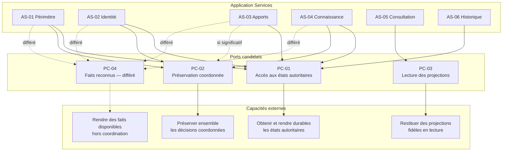

# Port Analysis

## Purpose

Ce document identifie les Ports candidats nécessaires aux six Application Services de Release 0.1. Il analyse les capacités extérieures dont l'application dépend sans déterminer leur forme ni leur réalisation.

Un Port exprime un besoin stable de l'application envers une capacité qu'elle ne possède pas. Il ne représente ni une décision métier, ni l'autorité d'un Aggregate, ni un choix de réalisation.

## Sources

L'analyse dérive exclusivement :

- des contrats de Use Case de `09_USE_CASE_DESIGN.md` ;
- des six Application Services de `10_APPLICATION_SERVICES.md` ;
- des autorités définies dans `05_AGGREGATE_DESIGN.md` ;
- des Domain Services de `06_DOMAIN_SERVICE_ANALYSIS.md` ;
- des Domain Events de `07_DOMAIN_EVENTS.md`.

## Critères d'admission

Une responsabilité devient un Port candidat seulement si :

1. un ou plusieurs Application Services en dépendent pour accomplir leur contrat ;
2. la capacité n'appartient ni à l'application ni au domaine ;
3. son absence empêche un résultat ou une garantie explicitement attendue ;
4. son contrat peut rester stable lorsque sa réalisation change ;
5. elle ne décide aucun invariant, aucune identité et aucun état métier ;
6. elle ne duplique pas une autre frontière candidate.

Une responsabilité transversale à tous les Ports, comme signaler un échec, devient une garantie commune et non un Port autonome.

## Capacités externes nécessaires

### CE-01 — Accéder aux états autoritaires

- **Mission :** permettre à l'application d'obtenir un Aggregate ou un Historique par son identité métier et de rendre durable un nouvel état déjà reconnu par son autorité.
- **Pourquoi elle est externe :** l'application coordonne les décisions mais ne possède pas la conservation durable des états ; le domaine définit leur validité mais ne détermine pas comment ils sont retrouvés entre deux intentions.
- **Qui en dépend :** AS-01, AS-02, AS-03, AS-04 et AS-06 ; AS-05 utilise plutôt les projections de lecture.
- **Pourquoi aucun Aggregate ou Domain Service ne peut la porter :** un Aggregate possède son état mais ne doit pas rechercher, reconstituer ou conserver les autres Aggregate Roots. Un Domain Service ne possède aucun état durable.

### CE-02 — Préserver une coordination complète

- **Mission :** garantir que plusieurs décisions reconnues comme formant un même résultat métier deviennent durables ensemble ou qu'aucune ne soit présentée comme accomplie.
- **Pourquoi elle est externe :** DS-04 décide de la complétude métier, mais ni lui ni l'application ne possèdent la capacité de préserver ensemble les états de plusieurs autorités.
- **Qui en dépend :** AS-01, AS-02, AS-03 et AS-04 lorsque DS-04 intervient.
- **Pourquoi aucun Aggregate ou Domain Service ne peut la porter :** attribuer cette garantie à un Aggregate lui donnerait autorité sur les autres frontières ; l'attribuer à DS-04 lui donnerait un état et une responsabilité extérieure à sa décision métier.

### CE-03 — Lire des projections fidèles

- **Mission :** fournir les informations dérivées nécessaires à la recherche et à la consultation sans les transformer en autorité.
- **Pourquoi elle est externe :** AS-05 doit consulter des vues transversales sans charger ni modifier chaque Aggregate comme s'il s'agissait d'une seule frontière métier.
- **Qui en dépend :** AS-05 pour `UC-014` et `UC-015`.
- **Pourquoi aucun Aggregate ou Domain Service ne peut la porter :** aucun Aggregate ne possède la vue combinée de l'Inventaire ; BC-05 décide des correspondances mais ne devient pas propriétaire des états sources ; les Domain Services retenus protègent d'autres décisions.

### CE-04 — Rendre disponibles les faits reconnus au-delà de la coordination

- **Mission :** permettre à des responsabilités légitimes de prendre connaissance des Domain Events après leur reconnaissance complète.
- **Pourquoi elle est externe :** les Application Services peuvent observer les faits produits pendant leur propre coordination, mais ne possèdent pas leur disponibilité ultérieure hors de cette intention.
- **Qui en dépend :** potentiellement AS-01 à AS-04 lorsque des consommateurs futurs ne participent pas à la coordination courante.
- **Pourquoi aucun Aggregate ou Domain Service ne peut la porter :** l'émetteur reconnaît le fait mais ne gouverne pas tous ses consommateurs ; DS-04 reconnaît uniquement `DE-017` et ne doit pas devenir un diffuseur général.

Cette capacité est réelle mais non nécessaire au cycle de valeur immédiat de Release 0.1. Les consommateurs 0.1 peuvent s'appuyer sur les états autoritaires et les projections obtenues à la demande.

## Analyse des sept responsabilités pressenties

| N° | Responsabilité issue de `10_APPLICATION_SERVICES.md` | Décision | Justification |
| --- | --- | --- | --- |
| R-01 | Obtenir et rendre durable l'état autoritaire des Aggregate Roots | **Conservée et renommée** | Devient la responsabilité centrale de PC-01 — Accès aux états autoritaires. |
| R-02 | Garantir l'absence de décision partielle dans une coordination complète | **Conservée séparément** | La garantie inter-Aggregates diffère de l'accès individuel aux états et justifie PC-02. |
| R-03 | Obtenir les représentations nécessaires à la recherche et à la consultation | **Conservée séparément** | Une lecture dérivée ne doit pas être confondue avec l'accès aux états autoritaires ; elle justifie PC-03. |
| R-04 | Rendre les Domain Events disponibles aux consommateurs légitimes | **Conservée mais différée** | La capacité justifie PC-04, sans être obligatoire pour le périmètre immédiat 0.1. |
| R-05 | Retrouver un Aggregate ou un Historique par son identité métier | **Fusionnée avec R-01** | Retrouver et rendre durable concernent la même frontière d'accès aux états autoritaires. |
| R-06 | Conserver le contenu documentaire sans transférer son autorité | **Fusionnée avec R-01** | En 0.1, aucun besoin indépendant d'AGG-05 ne justifie une frontière spécifique ; son contenu fait partie de l'état autoritaire de Documentation. |
| R-07 | Signaler explicitement l'indisponibilité d'une information nécessaire | **Supprimée comme Port** | Il s'agit d'une garantie d'échec commune à tous les Ports, pas d'une capacité externe autonome. |

### Responsabilités fusionnées

R-01, R-05 et R-06 forment une seule responsabilité cohérente : accéder aux états autoritaires. Les séparer créerait trois frontières répondant à la même question — obtenir ou préserver l'état appartenant à un Aggregate — sans responsabilité métier distincte.

La fusion documentaire vaut uniquement pour Release 0.1. Une future capacité possédant un cycle de vie indépendant du contenu pourrait justifier une nouvelle analyse, mais ce besoin n'existe pas aujourd'hui.

### Responsabilité conservée séparément

R-02 n'est pas fusionnée avec R-01. L'accès à un état individuel et la garantie qu'un ensemble de décisions soit préservé comme un seul résultat sont deux responsabilités distinctes. Les confondre rendrait la frontière d'accès responsable de la complétude métier décidée par DS-04.

R-03 reste séparée parce qu'une projection est dérivée et ne doit jamais être utilisée comme état autoritaire.

### Responsabilité supprimée

R-07 ne devient pas un Port. Chaque Port doit signaler explicitement absence, indisponibilité, résultat incomplet ou refus de préservation selon sa propre mission. Un « Port d'erreur » autonome ne fournirait aucune capacité et masquerait la responsabilité du Port réellement en échec.

## PC-01 — Port candidat d'accès aux états autoritaires

### Mission

Permettre d'obtenir et de rendre durable l'état d'une Aggregate Root ou d'un Historique à partir d'une identité métier, sans décider de cet état.

### Application Services consommateurs

- AS-01 — Périmètre d'inventaire ;
- AS-02 — Identité des Articles ;
- AS-03 — Apports de connaissance ;
- AS-04 — Connaissance courante ;
- AS-06 — Consultation de l'Historique.

AS-05 peut utiliser PC-01 uniquement lorsqu'un état autoritaire précis est requis ; ses recherches et consultations ordinaires dépendent de PC-03.

### Nature de la responsabilité

Accès à l'état autoritaire, en lecture et en préservation, sans propriété métier.

### Informations échangées

- identité métier de l'Aggregate ou du sujet historique ;
- état autoritaire reconnu ;
- nouvelle version métier déjà validée par l'Aggregate ;
- absence explicite ou impossibilité de rendre l'état durable.

Aucune représentation n'est prescrite.

### Garanties attendues

- l'état retourné correspond à l'identité demandée ;
- l'absence est distinguée d'un état vide ou inconnu ;
- aucun état n'est modifié pendant une lecture ;
- seul un état déjà reconnu par son Aggregate peut devenir durable ;
- un état antérieur n'est pas remplacé silencieusement par un état non autoritaire ;
- l'Historique et l'état courant conservent leurs autorités distinctes.

### Échecs possibles

- identité non trouvée ;
- état indisponible ou incomplet ;
- identité et état incohérents ;
- impossibilité de rendre durable une décision reconnue ;
- impossibilité de confirmer l'état faisant autorité.

### Classification

- **Release 0.1 : obligatoire.**
- **Lecture seule : non.** Le Port candidat couvre lecture et préservation d'états déjà décidés.

### Limites

PC-01 ne crée, ne corrige et ne valide aucun Aggregate. Il ne choisit jamais quelle version métier doit prévaloir et ne produit aucun Domain Event.

## PC-02 — Port candidat de préservation coordonnée

### Mission

Garantir qu'un ensemble de décisions déclaré complet par DS-04 soit rendu durable comme un tout indivisible du point de vue métier.

### Application Services consommateurs

- AS-01 pour la création et les redéfinitions significatives ;
- AS-02 pour l'inclusion et la correction identitaire ;
- AS-03 pour les corrections significatives d'apports ou de Sources ;
- AS-04 pour les décisions significatives de connaissance.

### Nature de la responsabilité

Préservation d'une coordination reconnue, sans décision sur son contenu.

### Informations échangées

- décisions reconnues par les Aggregate Roots concernées ;
- décision de conservation reconnue par AGG-06 ;
- conclusion de complétude de DS-04 ;
- confirmation globale de préservation ou échec global.

### Garanties attendues

- aucune décision composante n'est présentée comme durable si l'ensemble ne peut pas l'être ;
- les identités des Aggregates concernés restent inchangées ;
- la conclusion de DS-04 est respectée sans être réinterprétée ;
- un échec est global, explicite et ne produit pas de réussite partielle ;
- PC-02 n'ajoute aucune décision absente de la coordination.

### Échecs possibles

- coordination incomplète ;
- divergence entre décision source et continuité historique ;
- impossibilité de préserver l'ensemble ;
- perte de l'une des décisions composantes ;
- confirmation globale impossible.

### Classification

- **Release 0.1 : obligatoire** pour tout Use Case sollicitant DS-04.
- **Lecture seule : non.**

### Limites

PC-02 ne qualifie pas le Changement, ne décide pas de la continuité et ne remplace pas DS-04. Il garantit uniquement la préservation extérieure d'une complétude déjà reconnue par le domaine.

## PC-03 — Port candidat de lecture des projections

### Mission

Fournir à AS-05 des informations dérivées fidèles permettant à BC-05 de décider des correspondances et de composer la consultation courante.

### Application Services consommateurs

- AS-05 — Consultation de l'inventaire.

### Nature de la responsabilité

Lecture dérivée et transversale, sans modification ni autorité.

### Informations échangées

- périmètre ou Article désigné ;
- intention de lecture sans interprétation externe ;
- projections d'identité, d'appartenance, de connaissance courante et de Documentation ;
- provenance, incertitude, conflit et absence explicitement représentés ;
- état de disponibilité et de complétude de la projection.

### Garanties attendues

- chaque information dérivée reste reliée à son autorité source ;
- deux identités distinctes ne sont pas fusionnées ;
- conflit, incertitude et inconnu ne sont pas aplatis ;
- une projection absente ou incomplète est signalée ;
- la lecture ne modifie aucun Aggregate ;
- BC-05 conserve la décision de correspondance.

### Échecs possibles

- projection indisponible ;
- projection incomplète sans signalement possible ;
- identité source non traçable ;
- état dérivé incohérent avec ses autorités déclarées ;
- périmètre de lecture non résoluble.

### Classification

- **Release 0.1 : obligatoire** pour `UC-014` et `UC-015`.
- **Lecture seule : oui.**

### Limites

PC-03 ne recherche pas à la place de BC-05, ne décide pas de la pertinence et ne devient jamais une source d'écriture. Une projection ne peut pas être transmise à un Aggregate comme vérité autoritaire.

## PC-04 — Port candidat de mise à disposition des faits reconnus

### Mission

Rendre les Domain Events reconnus accessibles à des consommateurs légitimes qui ne participent pas à la coordination courante.

### Application Services consommateurs

- AS-01 à AS-04 lorsque la disponibilité d'un fait doit dépasser le Use Case courant.

AS-05 et AS-06 ne produisent aucun nouveau Domain Event.

### Nature de la responsabilité

Mise à disposition de faits déjà reconnus, sans décision ni modification du fait source.

### Informations échangées

- Domain Event canonique ;
- émetteur autoritaire ;
- sujet métier concerné ;
- relation éventuelle avec la complétude `DE-017` ;
- confirmation ou échec de mise à disposition.

### Garanties attendues

- seul un fait reconnu après réussite complète est accepté ;
- nom, émetteur et signification restent inchangés ;
- aucun consommateur n'acquiert l'autorité de l'émetteur ;
- l'échec de mise à disposition est explicite ;
- aucun fait supplémentaire n'est inventé.

### Échecs possibles

- fait non reconnu ou incomplet ;
- émetteur non identifiable ;
- signification altérée ;
- consommateur non légitime ;
- mise à disposition impossible.

### Classification

- **Release 0.1 : différé.** Aucun consommateur extérieur à la coordination immédiate n'est indispensable aux Acceptance Criteria 0.1.
- **Lecture seule : non applicable.** Le Port ne lit ni ne modifie un Aggregate ; il rend un fait reconnu disponible.

### Limites

PC-04 ne déclenche aucune modification métier, ne garantit aucun résultat consommateur et ne devient pas un Historique parallèle. Sa nécessité devra être réévaluée lorsqu'un consommateur hors coordination sera admis.

## Ports obligatoires, différés et en lecture seule

| Port candidat | Statut 0.1 | Lecture seule | Justification |
| --- | --- | --- | --- |
| PC-01 — Accès aux états autoritaires | Obligatoire | Non | Tous les Use Cases de modification et la consultation historique doivent retrouver les autorités ; les décisions reconnues doivent devenir durables. |
| PC-02 — Préservation coordonnée | Obligatoire lorsque DS-04 intervient | Non | Les invariants historiques interdisent une réussite métier partielle. |
| PC-03 — Lecture des projections | Obligatoire | Oui | Recherche et consultation nécessitent une lecture transversale non autoritaire. |
| PC-04 — Mise à disposition des faits reconnus | Différé | Non applicable | Aucun consommateur hors coordination n'est requis par le Scope 0.1. |

Aucun autre Port en lecture seule n'est nécessaire. AS-06 consulte AGG-06 et l'état courant via PC-01, car l'Historique est une autorité du domaine et non une projection dérivée.

## Matrice Application Service → Port candidat → responsabilité externe

| Application Service | Port candidat | Responsabilité externe | Obligation 0.1 |
| --- | --- | --- | --- |
| AS-01 | PC-01 | Obtenir et rendre durable AGG-01 et AGG-06 | Obligatoire |
| AS-01 | PC-02 | Préserver création ou redéfinition significative avec sa continuité | Obligatoire selon le Use Case |
| AS-01 | PC-04 | Rendre les faits disponibles hors coordination | Différé |
| AS-02 | PC-01 | Obtenir AGG-01, AGG-02 et AGG-06 puis rendre durables les états reconnus | Obligatoire |
| AS-02 | PC-02 | Préserver identité ou appartenance avec leur continuité | Obligatoire |
| AS-02 | PC-04 | Rendre les faits disponibles hors coordination | Différé |
| AS-03 | PC-01 | Obtenir et rendre durables AGG-02 à AGG-07 selon l'apport | Obligatoire |
| AS-03 | PC-02 | Préserver une correction significative avec sa continuité | Obligatoire lorsque DS-04 intervient |
| AS-03 | PC-04 | Rendre les faits disponibles hors coordination | Différé |
| AS-04 | PC-01 | Obtenir et rendre durables connaissance, apports, Source et Historique | Obligatoire |
| AS-04 | PC-02 | Préserver une décision de connaissance avec sa continuité | Obligatoire |
| AS-04 | PC-04 | Rendre les faits disponibles hors coordination | Différé |
| AS-05 | PC-03 | Obtenir les projections nécessaires à la recherche et à la consultation | Obligatoire, lecture seule |
| AS-06 | PC-01 | Obtenir AGG-06 et l'état courant du sujet | Obligatoire, lecture seule dans ce service |

## Dépendances interdites

### Autorité

- un Port ne prend aucune décision métier ;
- un Port ne valide, ne contourne et ne modifie aucun invariant ;
- un Port ne crée, ne corrige et ne supprime aucune Aggregate Root de sa propre initiative ;
- un Port ne choisit jamais entre deux états métier concurrents ;
- un Port ne transforme pas une projection en autorité ;
- un Port ne réinterprète pas un Domain Event.

### Dépendances

- aucun Port ne dépend d'un autre Port pour définir sa mission ;
- PC-02 ne délègue pas sa garantie à PC-01 ;
- PC-03 ne modifie pas un état par l'intermédiaire de PC-01 ;
- PC-04 ne déclenche pas automatiquement un Use Case ;
- un Application Service ne contourne pas un Aggregate en écrivant directement par un Port ;
- un Domain Service ne sollicite pas directement un Port ;
- aucune dépendance circulaire n'est admise entre application, Port et domaine.

### Échecs

- un Port ne masque jamais une indisponibilité sous un état vide ;
- un Port ne transforme pas un échec de préservation en réussite partielle ;
- un Port ne complète pas une information absente ;
- un Port ne produit pas de valeur de remplacement prétendument autoritaire ;
- un Port différé ne doit pas devenir une précondition cachée de Release 0.1.

## Diagramme conceptuel

Les flèches représentent des dépendances de capacité. Elles ne donnent aucune autorité aux Ports sur les Application Services, Aggregates ou Domain Services.

## Risques identifiés

| Risque | Conséquence | Garde-fou |
| --- | --- | --- |
| PC-01 devient une autorité métier | Les décisions quittent les Aggregates | Accepter uniquement des états déjà reconnus et ne jamais arbitrer entre eux. |
| PC-02 est fusionné prématurément avec PC-01 | La complétude inter-Aggregates devient implicite | Conserver deux missions distinctes pendant le design. |
| PC-03 devient une source d'écriture | Une projection concurrence l'état autoritaire | Imposer une responsabilité strictement en lecture. |
| PC-04 devient obligatoire sans consommateur réel | Complexité sans valeur 0.1 | Maintenir son statut différé jusqu'à admission d'un besoin démontré. |
| Multiplication de Ports par Aggregate | Frontières instables guidées par la structure interne | Conserver PC-01 comme capacité commune tant qu'aucune garantie distincte n'est démontrée. |
| Échec masqué par une valeur de remplacement | Faux succès et perte de confiance | Faire de l'échec explicite une garantie de chaque Port. |
| Dépendance Port à Port | Couplage et responsabilité illisible | Exiger que chaque Application Service coordonne ses Ports sans chaîne entre eux. |

## Contrôles de cohérence

- Les sept responsabilités pressenties ont chacune une décision explicite.
- Quatre Ports candidats couvrent les capacités externes démontrées.
- Trois Ports sont obligatoires en 0.1 ; un reste différé.
- PC-03 est le seul Port strictement en lecture.
- Aucun Port ne possède une décision ou un invariant.
- Aucun Port ne dépend d'un autre Port.
- Les six Application Services sont couverts par la matrice.
- Les responsabilités supprimées sont conservées comme garanties lorsqu'elles restent nécessaires.
- Le découpage ne dépend d'aucun choix de réalisation.

## Conclusion

**READY FOR PORT DESIGN**

L'analyse réduit sept responsabilités pressenties à quatre Ports candidats cohérents : accès aux états autoritaires, préservation coordonnée, lecture des projections et mise à disposition différée des faits reconnus.

PC-01, PC-02 et PC-03 sont nécessaires à Release 0.1. PC-04 est légitime mais différé faute de consommateur extérieur indispensable. Les missions, consommateurs, informations, garanties, échecs et dépendances interdites sont suffisamment définis pour ouvrir le Port Design sans choix de réalisation.
