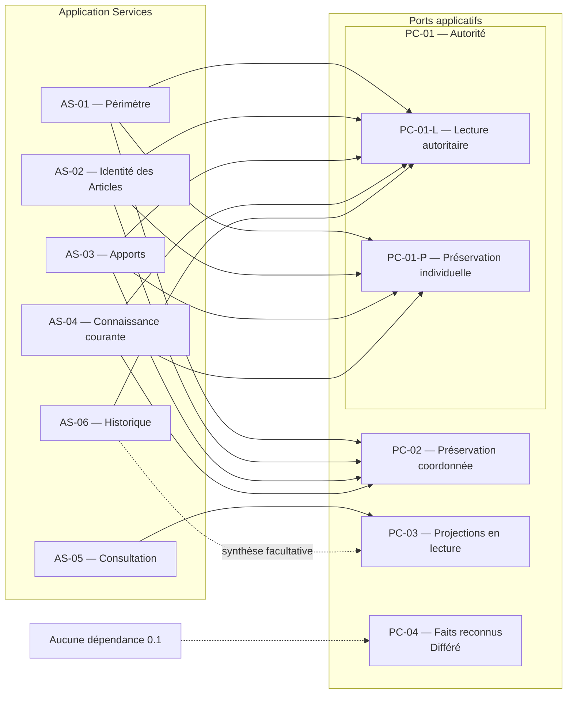

# Port Design

## Purpose

Ce document formalise les contrats par lesquels les six Application Services de Release 0.1 expriment leurs besoins envers des capacités qu'ils ne possèdent pas. Un Port appartient à l'application : il définit un besoin, ses garanties et ses échecs, sans déterminer comment ce besoin est réalisé.

Les contrats préservent l'autorité du domaine. Ils ne prennent aucune décision métier, ne modifient aucun invariant et ne transforment jamais un résultat absent, incomplet ou indisponible en succès.

## Sources et portée

Le design dérive exclusivement :

- des Aggregates définis dans `05_AGGREGATE_DESIGN.md` ;
- des Domain Services évalués dans `06_DOMAIN_SERVICE_ANALYSIS.md` ;
- des faits métier définis dans `07_DOMAIN_EVENTS.md` ;
- des contrats applicatifs de `09_USE_CASE_DESIGN.md` ;
- des six Application Services de `10_APPLICATION_SERVICES.md` ;
- des quatre Ports candidats de `11_PORT_ANALYSIS.md` ;
- des invariants de `22_DOMAIN_INVARIANTS.md` ;
- des capacités de `23_PRODUCT_CAPABILITIES.md` ;
- des critères de `29_RELEASE_0.1_ACCEPTANCE.md` ;
- des contraintes de `30_ARCHITECTURE_CONSTRAINTS.md`.

Quatre Ports canoniques sont retenus. PC-01 reste un Port unique comportant deux contrats de nature distincte. Cette subdivision interne ne crée ni une famille de Ports par Aggregate ni une nouvelle autorité.

## Principes de design

1. Un contrat exprime une intention applicative stable et non un moyen de réalisation.
2. Toute décision métier est prise avant l'appel de préservation, par l'Aggregate ou le Domain Service qui en détient l'autorité.
3. Une lecture autoritaire, une lecture dérivée, une préservation et une mise à disposition de faits restent explicitement séparées.
4. L'absence, l'invalidité, l'indisponibilité et l'incomplétude ont des significations distinctes.
5. Aucun échec n'est masqué par une valeur inventée, un résultat vide ambigu ou une réussite partielle.
6. Un Port ne dépend ni d'un Application Service ni d'un autre Port.
7. Un contrat ne gagne aucune responsabilité du seul fait qu'une future réalisation pourrait la rendre commode.

## PC-01 — Accès aux états autoritaires

### Identité et mission

- **Identifiant canonique :** PC-01.
- **Nom canonique français :** Accès aux états autoritaires.
- **Alias anglais :** Authoritative State Access.
- **Mission :** permettre à l'application d'établir l'existence d'une Aggregate Root, d'obtenir son état autoritaire ou sa continuité historique, puis de préserver individuellement un état déjà reconnu par son autorité métier.
- **Nature :** Port sortant obligatoire pour Release 0.1, organisé en un contrat de lecture seule et un contrat de préservation.

### Décision de subdivision

PC-01 reste un Port canonique unique, et non une famille de Ports. Il est composé de deux contrats :

- **PC-01-L — Lecture des états autoritaires**, pour établir l'existence et restituer l'état détenu par une autorité métier ;
- **PC-01-P — Préservation individuelle des états autoritaires**, pour rendre durable un état déjà reconnu par une seule Aggregate Root.

Cette séparation est fondée sur la nature de l'intention, non sur l'Aggregate concerné. Elle empêche un contrat de lecture de produire un effet et rend visible la différence entre préservation individuelle et cohérence inter-Aggregates. Les mêmes contrats valent pour AGG-01 à AGG-07 ; aucune famille parallèle par Aggregate n'est justifiée en Release 0.1.

### Responsabilités incluses

- établir explicitement l'existence ou l'absence d'une Aggregate Root à partir de son identité métier ;
- restituer l'état autoritaire correspondant exactement à l'identité demandée ;
- restituer AGG-06 comme autorité de continuité temporelle, sans reconstruire le présent depuis le passé ;
- préserver individuellement un état déjà reconnu par AGG-01 à AGG-07 ;
- conserver le contenu appartenant à AGG-05 comme partie de son état autoritaire ;
- distinguer une absence reconnue d'une indisponibilité ou d'un échec non classifiable ;
- signaler un conflit lorsqu'un état plus récent empêche la préservation demandée.

### Responsabilités exclues

- créer, corriger, compléter, fusionner ou arbitrer un état métier ;
- déterminer la validité d'une identité, d'une Information, d'une Source ou d'un Changement ;
- reconstruire une information manquante ;
- fournir une projection comme substitut de l'état autoritaire ;
- garantir à lui seul la complétude d'une décision impliquant plusieurs Aggregates ;
- transformer le contenu documentaire en autorité sur la connaissance ;
- produire, interpréter ou modifier un Domain Event.

### Consommateurs et Use Cases

- **PC-01-L :** AS-01 à AS-04 et AS-06 ; `UC-001` à `UC-013`, puis `UC-016`.
- **PC-01-P :** AS-01 à AS-04 ; `UC-001` à `UC-013`.
- **AS-05 :** ne dépend pas de PC-01 pour ses consultations ordinaires ; il utilise PC-03.

### Informations reçues

- une identité métier et l'autorité recherchée ;
- pour une lecture historique, le sujet et le périmètre temporel reconnus par le Use Case ;
- pour une préservation, l'identité de l'Aggregate, son état reconnu et la continuité attendue avec l'état précédemment obtenu ;
- le contenu documentaire reconnu par AGG-05 lorsqu'il appartient à l'état à préserver.

### Informations restituées

- existence ou absence explicite ;
- état autoritaire correspondant à l'identité demandée ;
- continuité historique détenue par AGG-06 ;
- confirmation de préservation de l'état reconnu ;
- échec explicite accompagné de sa catégorie conceptuelle.

### Garanties attendues

- identité demandée et état restitué correspondent ;
- l'absence n'est jamais représentée comme indisponibilité, état vide ou succès ;
- une lecture ne modifie aucun état ;
- seul un état reconnu par son Aggregate peut être préservé ;
- un état plus récent n'est jamais remplacé silencieusement ;
- l'état courant et l'Historique conservent leurs autorités distinctes ;
- le contenu de Documentation est conservé fidèlement sans acquérir l'autorité d'AGG-03 ;
- toute préservation non confirmée interrompt le résultat de modification concerné.

### Échecs reconnus

`PF-01` Absence reconnue, `PF-02` Référence invalide, `PF-03` Indisponibilité, `PF-04` Impossibilité de préserver, `PF-05` Conflit avec un état plus récent, `PF-08` Violation d'une garantie de cohérence et `PF-09` Échec non classifiable.

### Comportements interdits

- inventer une valeur lorsque l'état est absent ou inaccessible ;
- présenter une demande de préservation comme réussie sans confirmation ;
- choisir l'état qui doit prévaloir ;
- modifier une Aggregate Root de sa propre initiative ;
- confondre l'Historique avec une projection de consultation ;
- inclure implicitement plusieurs autorités dans une préservation individuelle.

### Contraintes et responsabilités concernées

- **Produit :** `CAP-001`, `CAP-002`, `CAP-003`, `CAP-005`, `CAP-006`, `CAP-011` ; critères associés et `AC-01-GLO-002` à `AC-01-GLO-009` selon le Use Case.
- **Invariants :** `INV-ID-001`, `INV-ID-002`, `INV-EXI-001`, `INV-EXI-002`, `INV-TRA-001`, `INV-OBS-001`, `INV-OBS-002`, `INV-DOC-001`, `INV-HIS-001`, `INV-LOC-001`, `INV-CHG-001`, `INV-STA-001`, `INV-COH-001`, `INV-COH-002` selon l'Aggregate.
- **Architecture :** `ARC-CON-001`, `ARC-CON-002`, `ARC-CON-003`, `ARC-CON-005`, `ARC-CON-006`, `ARC-CON-008`, `ARC-CON-009`, `ARC-CON-014`, `ARC-CON-015`, `ARC-CON-016`, `ARC-CON-017`.

## PC-02 — Préservation coordonnée

### Identité et mission

- **Identifiant canonique :** PC-02.
- **Nom canonique français :** Préservation coordonnée.
- **Alias anglais :** Coordinated Preservation.
- **Mission :** préserver comme un résultat métier indivisible l'ensemble complet d'états reconnus par plusieurs Aggregates et déclaré complet par DS-04.
- **Nature :** Port sortant conditionnel, obligatoire en Release 0.1 chaque fois qu'un Use Case sollicite DS-04.

### Responsabilités incluses

- recevoir l'ensemble des états reconnus composant une même décision métier ;
- recevoir la conclusion de complétude produite par DS-04 ;
- vérifier que tous les éléments déclarés nécessaires à cette complétude sont présents ;
- préserver l'ensemble comme un résultat indivisible du point de vue métier ;
- confirmer la préservation complète ou signaler un échec global ;
- empêcher qu'une partie soit présentée comme le résultat accompli du Use Case.

### Responsabilités exclues

- décider si un Changement est significatif ;
- décider quels états doivent évoluer ou quel contenu ils doivent porter ;
- corriger un Aggregate ou compléter une décision incomplète ;
- inventer un Changement, une continuité ou une relation entre états ;
- fusionner des états non reconnus ;
- remplacer PC-01 pour l'obtention ou la préservation individuelle des autorités ;
- masquer une préservation partielle ou la convertir en réussite.

### Consommateurs et Use Cases

- **AS-01 :** `UC-001`, `UC-002` lorsque la redéfinition est significative ;
- **AS-02 :** `UC-003`, `UC-004` ;
- **AS-03 :** `UC-006`, `UC-008`, `UC-013` lorsqu'une correction est significative ;
- **AS-04 :** `UC-009`, `UC-010`, `UC-011` lorsqu'une décision est significative, `UC-012`.

Lorsqu'un de ces Use Cases sollicite PC-02, PC-01-L reste utilisé pour les lectures individuelles préalables, mais PC-01-P n'est pas appelé séparément pour les états composant le même résultat coordonné. Ces états sont présentés une seule fois à PC-02.

### Informations reçues

- les identités des Aggregate Roots concernées ;
- leurs états reconnus à préserver ;
- l'état reconnu par AGG-06 portant la continuité attendue ;
- la conclusion de DS-04 décrivant l'ensemble complet ;
- la continuité attendue avec les états autoritaires précédents.

### Informations restituées

- confirmation que l'ensemble déclaré complet a été préservé ;
- ou échec global identifiant la catégorie de non-préservation, sans exposer de faux succès partiel.

### Garanties attendues

- aucun élément composant n'est omis de l'ensemble déclaré complet ;
- tous les états préservés sont ceux reconnus par leurs autorités respectives ;
- la conclusion de DS-04 n'est ni enrichie ni réinterprétée ;
- la réussite n'est confirmée que si la cohérence inter-Aggregates attendue est satisfaite ;
- toute impossibilité portant sur un composant produit un échec du résultat coordonné ;
- les identités et responsabilités des Aggregates demeurent distinctes.

### Échecs reconnus

`PF-02` Référence invalide, `PF-03` Indisponibilité, `PF-04` Impossibilité de préserver, `PF-05` Conflit avec un état plus récent, `PF-08` Violation d'une garantie de cohérence et `PF-09` Échec non classifiable.

### Comportements interdits

- prendre ou corriger une décision métier ;
- compléter un ensemble que DS-04 n'a pas reconnu complet ;
- confirmer un sous-ensemble comme réussite du Use Case ;
- modifier l'ordre causal ou la signification des états ;
- devenir l'autorité de l'Historique ;
- déléguer sa garantie globale à PC-01.

### Contraintes et responsabilités concernées

- **Produit :** `CAP-001`, `CAP-002`, `CAP-003`, `CAP-005`, `CAP-006` ; `AC-01-GLO-003`, `AC-01-GLO-004`, `AC-01-GLO-007`, `AC-01-GLO-008`, `AC-01-GLO-009`.
- **Invariants :** `INV-TRA-001`, `INV-HIS-001`, `INV-CHG-001`, `INV-COH-001`, `INV-COH-002` et les invariants déjà satisfaits par chaque état composant.
- **Architecture :** `ARC-CON-002`, `ARC-CON-003`, `ARC-CON-005`, `ARC-CON-006`, `ARC-CON-008`, `ARC-CON-015`, `ARC-CON-016`, `ARC-CON-017`.

## PC-03 — Lecture des projections

### Identité et mission

- **Identifiant canonique :** PC-03.
- **Nom canonique français :** Lecture des projections.
- **Alias anglais :** Projection Reading.
- **Mission :** restituer des informations dérivées, traçables et explicitement non autoritaires pour la recherche et la consultation.
- **Nature :** Port sortant obligatoire et strictement en lecture seule pour Release 0.1.

### Responsabilités incluses

- restituer une synthèse du périmètre et du contenu d'un Inventaire ;
- restituer des projections candidates selon les critères métier reconnus par `UC-014` ;
- restituer la projection d'un Article, de sa connaissance courante, de ses apports et de sa Documentation pour `UC-015` ;
- restituer une synthèse historique lorsque celle-ci complète la navigation, sans remplacer AGG-06 ;
- préserver dans chaque restitution les identités, origines, incertitudes, contradictions et absences connues ;
- signaler explicitement aucun résultat, indisponibilité, incomplétude, invalidité ou écart connu avec l'état autoritaire.

### Responsabilités exclues

- modifier le domaine ou demander sa modification ;
- devenir une source de vérité ou une autorité de décision ;
- décider de la pertinence finale d'une correspondance à la place de BC-05 ;
- arbitrer une contradiction ou compléter une information absente ;
- réécrire l'Historique ;
- fournir une projection comme état d'entrée d'une décision autoritaire ;
- masquer l'ancienneté ou l'incomplétude d'une projection.

### Consommateurs et Use Cases

- **AS-05 :** `UC-014`, `UC-015` ;
- **AS-06 :** `UC-016` uniquement pour une synthèse de navigation facultative ; la continuité faisant autorité est lue par PC-01-L.

### Informations reçues

- identité d'un Inventaire, d'un Article ou d'un sujet historique ;
- critères métier reconnus par le Use Case ;
- intention de synthèse, de recherche ou de consultation ;
- périmètre de lecture demandé.

### Informations restituées

- projections, synthèses et regroupements ;
- candidats à une correspondance que BC-05 doit encore qualifier ;
- connaissance courante dérivée avec sa provenance, ses incertitudes et ses contradictions ;
- synthèse historique explicitement distincte de l'autorité d'AGG-06 ;
- état de disponibilité, de complétude et d'écart connu de la projection.

### Garanties attendues

- aucune lecture ne modifie le domaine ;
- toute information reste reliée à son autorité source identifiable ;
- deux identités distinctes ne sont pas fusionnées ;
- inconnu, absence, incertitude et contradiction restent distincts ;
- une projection vide est distinguée d'une projection indisponible ;
- une projection incomplète ne peut pas être présentée comme complète ;
- un écart connu avec l'état autoritaire est visible ;
- les critères de recherche ne sont pas enrichis par une interprétation extérieure au domaine.

### Échecs reconnus

`PF-01` Absence reconnue, `PF-02` Référence invalide, `PF-03` Indisponibilité, `PF-06` Projection indisponible, `PF-07` Projection incomplète, `PF-08` Violation d'une garantie de cohérence et `PF-09` Échec non classifiable.

### Comportements interdits

- écrire, corriger ou préserver un état ;
- décider qu'une projection est vraie ;
- inventer une information ou supprimer un conflit ;
- alimenter une décision d'Aggregate comme si la projection était autoritaire ;
- reconstruire le présent depuis une projection historique ;
- annoncer une recherche exhaustive lorsque la projection est incomplète.

### Contraintes et responsabilités concernées

- **Produit :** `CAP-002`, `CAP-009`, `CAP-011` ; `AC-01-CAP-002`, `AC-01-CAP-009`, `AC-01-CAP-011`, `AC-01-GLO-001` à `AC-01-GLO-009` selon la consultation.
- **Invariants :** `INV-ID-001`, `INV-EXI-001`, `INV-TRA-001`, `INV-HIS-001`, `INV-CHG-001`, `INV-COH-001`, `INV-COH-002` ; ils sont reflétés, jamais décidés, par la projection.
- **Architecture :** `ARC-CON-001`, `ARC-CON-002`, `ARC-CON-003`, `ARC-CON-006`, `ARC-CON-008`, `ARC-CON-009`, `ARC-CON-013`, `ARC-CON-014`, `ARC-CON-015`, `ARC-CON-016`, `ARC-CON-017`.

## PC-04 — Mise à disposition des faits reconnus

### Identité et mission future

- **Identifiant canonique :** PC-04.
- **Nom canonique français :** Mise à disposition des faits reconnus.
- **Alias anglais :** Recognized Fact Availability.
- **Mission future :** rendre un Domain Event déjà reconnu accessible à un consommateur métier légitime qui ne participe pas à la coordination courante.
- **Nature :** Port sortant différé ; aucune dépendance de Release 0.1.

### Responsabilités incluses lors d'une future activation

- recevoir un fait métier reconnu après la réussite complète de la décision qui l'a produit ;
- préserver son nom canonique, son émetteur, son sujet et sa signification ;
- rendre explicite l'acceptation ou l'impossibilité de mise à disposition ;
- préserver la distinction entre le fait et les réactions ultérieures de ses consommateurs.

### Responsabilités exclues

- créer, modifier, interpréter, enrichir ou supprimer un Domain Event ;
- décider si un fait doit exister ;
- déclencher implicitement une nouvelle décision métier ;
- garantir le résultat d'un consommateur futur ;
- conditionner la réussite d'un Use Case 0.1 ;
- devenir l'autorité de l'Historique ou une seconde trace de continuité.

### Consommateurs et Use Cases

Aucun Application Service et aucun Use Case de Release 0.1 ne consomme PC-04. AS-01 à AS-04 pourraient en dépendre dans une Release future uniquement si un besoin validé exige qu'un fait demeure disponible hors de la coordination qui l'a produit.

### Informations reçues

- Domain Event canonique déjà reconnu ;
- identité de son émetteur autoritaire et de son sujet métier ;
- confirmation que la décision productrice est complète ;
- destination métier légitime admise par le futur besoin.

### Informations restituées

- confirmation de mise à disposition sans interprétation du fait ;
- ou échec explicite de mise à disposition.

### Garanties minimales

- aucun fait n'est accepté avant la réussite complète de sa décision source ;
- le fait demeure inchangé et relié à son émetteur ;
- aucun consommateur n'acquiert l'autorité de l'émetteur ;
- l'échec de mise à disposition est explicite ;
- la réussite d'un Use Case 0.1 reste indépendante de PC-04.

### Échecs reconnus

`PF-02` Référence invalide, `PF-03` Indisponibilité, `PF-08` Violation d'une garantie de cohérence et `PF-09` Échec non classifiable. Leur application précise devra être confirmée lors de l'activation du Port.

### Comportements interdits

- créer, modifier ou interpréter un Domain Event ;
- faire dépendre la réussite d'un Use Case 0.1 d'un consommateur extérieur à sa coordination ;
- présenter la disponibilité d'un fait comme preuve de sa validité ;
- devenir l'autorité de l'Historique ;
- inventer un destinataire ou une réaction métier.

### Conditions d'activation

PC-04 ne peut être activé que si une capacité et ses critères d'acceptation exigent explicitement qu'un fait reconnu soit disponible au-delà de la coordination courante, qu'un consommateur métier légitime soit identifié et que cette disponibilité ne transfère aucune autorité. La commodité ou l'anticipation d'un besoin futur ne suffit pas.

### Contraintes concernées

- **Produit :** aucune capacité ni aucun critère de Release 0.1. Une future activation devra être reliée à une capacité et à des critères explicitement admis.
- **Architecture :** une future activation devra préserver au minimum `ARC-CON-001`, `ARC-CON-002`, `ARC-CON-003`, `ARC-CON-011`, `ARC-CON-015` et `ARC-CON-017`, ainsi que les invariants déjà satisfaits par le Domain Event source.

## Opérations conceptuelles

### OP-01 — Établir l'existence d'une autorité

- **Port :** PC-01-L.
- **Nom métier :** Établir l'existence d'une autorité.
- **Intention applicative :** savoir si l'Aggregate Root désignée existe avant de poursuivre une intention qui en dépend.
- **Informations nécessaires :** identité métier et autorité attendue.
- **Résultat attendu :** existence ou absence reconnue, sans état inventé.
- **Échecs explicites :** `PF-02`, `PF-03`, `PF-09` ; `PF-01` est le résultat d'absence reconnu.
- **Garanties :** absence et indisponibilité sont distinctes ; aucune création implicite.
- **Application Services consommateurs :** AS-01 à AS-04, AS-06.
- **Use Cases concernés :** `UC-002` à `UC-013`, `UC-016` ; `UC-001` vérifie l'absence de l'identité proposée.

### OP-02 — Obtenir un état autoritaire

- **Port :** PC-01-L.
- **Nom métier :** Obtenir un état autoritaire.
- **Intention applicative :** présenter à une décision métier l'état détenu par l'Aggregate Root compétente.
- **Informations nécessaires :** identité métier et autorité demandée.
- **Résultat attendu :** état autoritaire correspondant exactement à l'identité.
- **Échecs explicites :** `PF-01`, `PF-02`, `PF-03`, `PF-08`, `PF-09`.
- **Garanties :** fidélité, absence d'effet, identité non fusionnée, aucune substitution par une projection.
- **Application Services consommateurs :** AS-01 à AS-04, AS-06.
- **Use Cases concernés :** `UC-002` à `UC-013`, `UC-016`.

### OP-03 — Obtenir une continuité historique autoritaire

- **Port :** PC-01-L.
- **Nom métier :** Obtenir une continuité historique autoritaire.
- **Intention applicative :** consulter AGG-06 comme autorité du passé significatif d'un sujet.
- **Informations nécessaires :** identité du sujet et périmètre temporel reconnu.
- **Résultat attendu :** continuité historique autoritaire et liens vers les états concernés.
- **Échecs explicites :** `PF-01`, `PF-02`, `PF-03`, `PF-08`, `PF-09`.
- **Garanties :** ordre intelligible, origine traçable, aucune réécriture du passé, aucune reconstruction du présent.
- **Application Services consommateurs :** AS-06 ; AS-01 à AS-04 uniquement lorsqu'ils doivent lire une continuité préalable.
- **Use Cases concernés :** `UC-016` ; conditionnellement `UC-002`, `UC-004`, `UC-006`, `UC-008`, `UC-010` à `UC-013`.

### OP-04 — Préserver un état reconnu

- **Port :** PC-01-P.
- **Nom métier :** Préserver un état reconnu.
- **Intention applicative :** rendre durable la décision d'une Aggregate Root lorsque cette décision ne requiert pas une garantie inter-Aggregates.
- **Informations nécessaires :** identité, état reconnu et continuité attendue avec l'état antérieur.
- **Résultat attendu :** confirmation de préservation de cet état unique.
- **Échecs explicites :** `PF-02`, `PF-03`, `PF-04`, `PF-05`, `PF-08`, `PF-09`.
- **Garanties :** état inchangé, autorité préservée, conflit récent visible, aucun succès silencieux.
- **Application Services consommateurs :** AS-01 à AS-04.
- **Use Cases concernés :** `UC-002`, `UC-005` à `UC-008`, `UC-011`, `UC-013` lorsqu'une préservation individuelle suffit et que DS-04 n'intervient pas.

### OP-05 — Préserver une décision coordonnée

- **Port :** PC-02.
- **Nom métier :** Préserver une décision coordonnée.
- **Intention applicative :** rendre durable le résultat complet reconnu par plusieurs Aggregates et DS-04.
- **Informations nécessaires :** états reconnus, continuité portée par AGG-06, conclusion de complétude de DS-04 et états antérieurs attendus.
- **Résultat attendu :** confirmation globale de préservation ou échec global.
- **Échecs explicites :** `PF-02`, `PF-03`, `PF-04`, `PF-05`, `PF-08`, `PF-09`.
- **Garanties :** complétude, indivisibilité métier, absence de perte et absence de succès partiel.
- **Application Services consommateurs :** AS-01 à AS-04.
- **Use Cases concernés :** `UC-001`, `UC-003`, `UC-004`, `UC-009`, `UC-010`, `UC-012` ; conditionnellement `UC-002`, `UC-006`, `UC-008`, `UC-011`, `UC-013`.

### OP-06 — Obtenir une synthèse d'Inventaire

- **Port :** PC-03.
- **Nom métier :** Obtenir une synthèse d'Inventaire.
- **Intention applicative :** présenter le périmètre et les éléments d'un Inventaire sans charger chaque autorité comme une seule unité.
- **Informations nécessaires :** identité de l'Inventaire et périmètre de consultation.
- **Résultat attendu :** synthèse traçable des Articles et de leur compréhension courante.
- **Échecs explicites :** `PF-01`, `PF-02`, `PF-03`, `PF-06`, `PF-07`, `PF-08`, `PF-09`.
- **Garanties :** lecture seule, identités préservées, complétude annoncée, origines accessibles.
- **Application Services consommateurs :** AS-05.
- **Use Cases concernés :** `UC-014`, `UC-015`.

### OP-07 — Obtenir des candidats de recherche

- **Port :** PC-03.
- **Nom métier :** Obtenir des candidats de recherche.
- **Intention applicative :** fournir à BC-05 des projections candidates correspondant aux critères reconnus par le Use Case.
- **Informations nécessaires :** Inventaire concerné et critères métier admis.
- **Résultat attendu :** ensemble de candidats, ou absence reconnue de candidat, avec état de complétude.
- **Échecs explicites :** `PF-02`, `PF-03`, `PF-06`, `PF-07`, `PF-08`, `PF-09`.
- **Garanties :** aucun résultat inventé, aucune fusion d'identités, absence de candidat distincte d'une projection indisponible, qualification finale laissée à BC-05.
- **Application Services consommateurs :** AS-05.
- **Use Cases concernés :** `UC-014`.

### OP-08 — Obtenir une projection d'Article

- **Port :** PC-03.
- **Nom métier :** Obtenir une projection d'Article et de sa connaissance courante.
- **Intention applicative :** présenter ensemble l'identité, l'appartenance, la connaissance courante, les apports et la Documentation d'un Article.
- **Informations nécessaires :** identité de l'Article et Inventaire de consultation.
- **Résultat attendu :** projection traçable conservant origine, incertitude, contradiction et absence.
- **Échecs explicites :** `PF-01`, `PF-02`, `PF-03`, `PF-06`, `PF-07`, `PF-08`, `PF-09`.
- **Garanties :** aucune autorité transférée, aucun arbitrage, contenu documentaire fidèle, état de complétude visible.
- **Application Services consommateurs :** AS-05.
- **Use Cases concernés :** `UC-015`.

### OP-09 — Obtenir une projection historique

- **Port :** PC-03.
- **Nom métier :** Obtenir une projection historique.
- **Intention applicative :** faciliter la navigation dans les Changements sans remplacer la continuité détenue par AGG-06.
- **Informations nécessaires :** sujet, périmètre temporel et intention de synthèse.
- **Résultat attendu :** projection chronologique explicitement dérivée.
- **Échecs explicites :** `PF-01`, `PF-02`, `PF-03`, `PF-06`, `PF-07`, `PF-08`, `PF-09`.
- **Garanties :** lecture seule, origine conservée, aucune réécriture, caractère non autoritaire explicite.
- **Application Services consommateurs :** AS-06.
- **Use Cases concernés :** `UC-016`, à titre complémentaire ; OP-03 reste obligatoire.

### OP-10 — Rendre un fait reconnu disponible

- **Port :** PC-04.
- **Nom métier :** Rendre un fait reconnu disponible.
- **Intention applicative :** permettre à un futur consommateur légitime de prendre connaissance d'un fait après la réussite complète de sa décision source.
- **Informations nécessaires :** Domain Event reconnu, émetteur, sujet et confirmation de complétude.
- **Résultat attendu :** confirmation de mise à disposition ou échec explicite.
- **Échecs explicites :** `PF-02`, `PF-03`, `PF-08`, `PF-09`.
- **Garanties :** fait inchangé, émetteur traçable, aucune autorité transférée, aucun effet sur la réussite du Use Case source.
- **Application Services consommateurs :** aucun en Release 0.1.
- **Use Cases concernés :** aucun en Release 0.1.

## Modèle conceptuel des échecs

Un échec de Port décrit un résultat applicatif reconnu. Il ne constitue ni une décision métier ni une explication de réalisation. Tous les échecs bloquants sont présentables à l'utilisateur dans un langage adapté à son intention, sans lui exposer une cause étrangère au produit.

| Identifiant | Échec | Présentable à l'utilisateur | Interrompt le Use Case | Nouvelle tentative | Conversion en succès |
| --- | --- | --- | --- | --- | --- |
| PF-01 | Absence reconnue | Oui, comme absence explicite | Oui si l'existence est une précondition ; non si l'absence est le résultat recherché | Après création reconnue ou nouvelle intention | Jamais, sauf lorsque l'absence est elle-même le résultat attendu |
| PF-02 | Référence invalide | Oui | Oui | Après correction de la référence | Jamais |
| PF-03 | Indisponibilité | Oui | Oui lorsque la capacité est requise | Possible lorsque la capacité redevient disponible | Jamais |
| PF-04 | Impossibilité de préserver | Oui | Oui | Après nouvelle vérification de l'état et de la cause | Jamais |
| PF-05 | Conflit avec un état plus récent | Oui | Oui | Après relecture autoritaire et nouvelle décision métier | Jamais ; l'ancienne décision n'est pas rejouée silencieusement |
| PF-06 | Projection indisponible | Oui | Oui pour une consultation qui en dépend | Possible lorsque la projection redevient disponible | Jamais |
| PF-07 | Projection incomplète | Oui | Oui pour tout résultat annoncé comme complet | Après restauration de la complétude ou avec une intention acceptant explicitement une vue partielle | Jamais comme résultat complet |
| PF-08 | Violation d'une garantie de cohérence | Oui, comme impossibilité de garantir la cohérence | Oui | Seulement après suppression de la cause et nouvelle évaluation | Jamais |
| PF-09 | Échec non classifiable | Oui, sans inventer une cause | Oui | Non présumée ; elle exige une nouvelle évaluation | Jamais |

Règles communes :

- une absence reconnue ne doit jamais masquer une indisponibilité ;
- une nouvelle tentative ne réutilise pas silencieusement une décision devenue obsolète ;
- un échec non classifiable ne peut pas être requalifié arbitrairement pour permettre la poursuite ;
- une information partielle reste partielle, même si elle est utile ;
- un Application Service décide de l'interruption selon le contrat du Use Case, jamais en altérant la catégorie de l'échec.

## Séparation des responsabilités

| Nature | Contrat | Ce qu'il fournit | Ce qu'il ne fournit jamais |
| --- | --- | --- | --- |
| Lecture autoritaire | PC-01-L | Existence, état autoritaire, continuité détenue par AGG-06 | Projection, décision métier, effet de préservation |
| Préservation individuelle | PC-01-P | Confirmation d'un état reconnu par une seule Aggregate Root | Lecture dérivée, complétude inter-Aggregates, décision métier |
| Préservation coordonnée | PC-02 | Confirmation indivisible d'un ensemble reconnu complet | Décision de complétude, accès individuel, succès partiel |
| Lecture dérivée | PC-03 | Projections, synthèses, regroupements et candidats de recherche | Autorité, écriture, arbitrage, reconstruction inventive |
| Mise à disposition différée | PC-04 | Disponibilité future d'un fait déjà reconnu | Création ou interprétation du fait, Historique, condition de succès 0.1 |

Aucun contrat ne peut mélanger silencieusement lecture autoritaire, lecture de projection, décision métier, préservation ou mise à disposition. Lorsqu'un Use Case a besoin de plusieurs natures, l'Application Service les coordonne explicitement et laisse chaque décision au domaine.

## Règles de dépendance

- les Application Services dépendent uniquement des Ports nécessaires à leurs Use Cases ;
- les Ports ne dépendent pas des Application Services ;
- les Ports ne dépendent pas les uns des autres ;
- PC-03 ne fournit jamais l'état autoritaire utilisé pour une décision métier ;
- PC-04 ne conditionne aucun résultat de Release 0.1 ;
- PC-02 ne remplace ni la lecture ni la préservation individuelle de PC-01 ;
- PC-01 ne garantit pas la complétude inter-Aggregates portée par PC-02 ;
- un Domain Service ne dépend pas directement d'un Port ; l'Application Service présente aux Ports les décisions déjà reconnues ;
- aucune dépendance circulaire n'est admise entre application, domaine et Ports.

## Matrice des Ports

| Port ou contrat | Application Services consommateurs | Use Cases | Opérations conceptuelles | Garanties dominantes | Échecs reconnus | Release |
| --- | --- | --- | --- | --- | --- | --- |
| PC-01-L | AS-01 à AS-04, AS-06 | `UC-001` à `UC-013`, `UC-016` selon besoin de lecture | OP-01 à OP-03 | Autorité, identité, absence explicite, lecture sans effet | PF-01 à PF-03, PF-08, PF-09 | 0.1 obligatoire |
| PC-01-P | AS-01 à AS-04 | `UC-002`, `UC-005` à `UC-008`, `UC-011`, `UC-013` lorsqu'aucune coordination DS-04 n'est requise | OP-04 | État reconnu inchangé, conflit visible, confirmation explicite | PF-02 à PF-05, PF-08, PF-09 | 0.1 obligatoire |
| PC-02 | AS-01 à AS-04 | Use Cases sollicitant DS-04 | OP-05 | Complétude et absence de succès partiel | PF-02 à PF-05, PF-08, PF-09 | 0.1 obligatoire sous condition |
| PC-03 | AS-05, AS-06 pour une synthèse facultative | `UC-014`, `UC-015`, complément de `UC-016` | OP-06 à OP-09 | Lecture seule, traçabilité, complétude visible, non-autorité | PF-01 à PF-03, PF-06 à PF-09 | 0.1 obligatoire pour `UC-014` et `UC-015` |
| PC-04 | Aucun | Aucun | OP-10 | Fait inchangé, émetteur traçable, aucun effet sur le résultat source | PF-02, PF-03, PF-08, PF-09 | Différé |

## Matrice de couverture des Use Cases

| Use Case | Port requis | Nature de l'usage | État autoritaire ou projection | Échec bloquant principal |
| --- | --- | --- | --- | --- |
| `UC-001` | PC-01-L, PC-02 | Vérifier l'identité proposée puis préserver création et origine comme un ensemble | Autoritaire | Référence invalide, impossibilité de préserver, violation de cohérence |
| `UC-002` | PC-01-L puis PC-01-P, ou PC-02 si significatif | Lire le périmètre puis préserver sa redéfinition selon sa portée | Autoritaire | Absence, conflit récent, échec de préservation coordonnée |
| `UC-003` | PC-01-L, PC-02 | Lire l'Inventaire puis préserver inclusion et origine comme un ensemble | Autoritaire | Absence, référence invalide, violation de cohérence |
| `UC-004` | PC-01-L, PC-02 | Lire les identités puis préserver correction et continuité comme un ensemble | Autoritaire | Absence, conflit récent, échec de préservation coordonnée |
| `UC-005` | PC-01-L, PC-01-P | Lire l'Article et préserver Observation et Source reconnues | Autoritaire | Absence, impossibilité de préserver, indisponibilité |
| `UC-006` | PC-01-L puis PC-01-P, ou PC-02 si significatif | Lire l'Observation puis préserver correction et éventuelle continuité | Autoritaire | Absence, conflit récent, violation de cohérence |
| `UC-007` | PC-01-L, PC-01-P | Lire l'Article et préserver Documentation et Source reconnues | Autoritaire | Absence, impossibilité de préserver, indisponibilité |
| `UC-008` | PC-01-L puis PC-01-P, ou PC-02 si significatif | Lire la Documentation puis préserver correction et éventuelle continuité | Autoritaire | Absence, conflit récent, violation de cohérence |
| `UC-009` | PC-01-L, PC-02 | Lire les apports puis préserver connaissance initiale et origine comme un ensemble | Autoritaire | Référence invalide, échec de préservation coordonnée |
| `UC-010` | PC-01-L, PC-02 | Lire l'état courant puis préserver actualisation et continuité comme un ensemble | Autoritaire | Absence, conflit récent, échec de préservation coordonnée |
| `UC-011` | PC-01-L puis PC-01-P, ou PC-02 si significatif | Lire l'état courant puis préserver incertitude ou conflit | Autoritaire | Absence, conflit récent, violation de cohérence |
| `UC-012` | PC-01-L, PC-02 | Lire apports et état courant puis préserver arbitrage et continuité comme un ensemble | Autoritaire | Absence, conflit récent, échec de préservation coordonnée |
| `UC-013` | PC-01-L puis PC-01-P, ou PC-02 si significatif | Lire la Source commune puis préserver correction et effets reconnus | Autoritaire | Référence invalide, conflit récent, violation de cohérence |
| `UC-014` | PC-03 | Obtenir synthèse et candidats de recherche | Projection | Projection indisponible ou incomplète |
| `UC-015` | PC-03 | Obtenir la projection courante d'un Article | Projection | Référence invalide, projection indisponible ou incomplète |
| `UC-016` | PC-01-L ; PC-03 facultatif | Lire l'Historique autoritaire et, éventuellement, une synthèse | Autoritaire ; projection seulement en complément | Absence, indisponibilité, violation de cohérence historique |

Les 16 Use Cases possèdent ainsi une frontière externe explicite. PC-04 n'intervient dans aucun d'eux.

## Diagramme conceptuel des dépendances

Les flèches vont de l'Application Service vers le Port dont il exprime le besoin. L'absence de flèche vers PC-04 est une décision de Release 0.1, non un oubli.

## Traçabilité des opérations

| Opération | Use Cases | Capacités et critères | Autorités ou coordinations | Invariants et contraintes dominants |
| --- | --- | --- | --- | --- |
| OP-01 | `UC-001` à `UC-013`, `UC-016` selon précondition | Capacités associées ; `AC-01-GLO-002`, `AC-01-GLO-008`, `AC-01-GLO-009` | AGG-01 à AGG-07 | `INV-ID-001`, `INV-EXI-001`, `INV-COH-002` ; `ARC-CON-002`, `ARC-CON-006` |
| OP-02 | `UC-002` à `UC-013`, `UC-016` | `CAP-001` à `CAP-006`, `CAP-011` selon le Use Case | AGG-01 à AGG-07 | Invariants propres à l'Aggregate ; `ARC-CON-002`, `ARC-CON-015`, `ARC-CON-017` |
| OP-03 | `UC-016` et lectures préalables significatives | `CAP-011`, `AC-01-CAP-011`, `AC-01-GLO-004` | AGG-06 | `INV-HIS-001`, `INV-CHG-001` ; `ARC-CON-015`, `ARC-CON-016` |
| OP-04 | `UC-001` à `UC-013` selon décision individuelle | Critères de la capacité concernée ; `AC-01-GLO-007`, `AC-01-GLO-009` | AGG-01 à AGG-07 | Invariants propres à l'Aggregate ; `ARC-CON-005`, `ARC-CON-006`, `ARC-CON-017` |
| OP-05 | `UC-001`, `UC-003`, `UC-004`, `UC-009`, `UC-010`, `UC-012` et cas significatifs | `CAP-001`, `CAP-002`, `CAP-003`, `CAP-005`, `CAP-006` ; `AC-01-GLO-004`, `AC-01-GLO-007` à `AC-01-GLO-009` | DS-04, AGG-06 et Aggregates sources | `INV-TRA-001`, `INV-HIS-001`, `INV-CHG-001`, `INV-COH-001`, `INV-COH-002` ; `ARC-CON-005`, `ARC-CON-006`, `ARC-CON-015`, `ARC-CON-016` |
| OP-06 | `UC-014`, `UC-015` | `CAP-002`, `CAP-009` ; `AC-01-CAP-002`, `AC-01-CAP-009` | BC-05 et autorités sources en lecture | `INV-ID-001`, `INV-EXI-001`, `INV-COH-002` ; `ARC-CON-008`, `ARC-CON-009`, `ARC-CON-013` |
| OP-07 | `UC-014` | `CAP-009`, `AC-01-CAP-009` | BC-05 | `INV-ID-001`, `INV-COH-001`, `INV-COH-002` ; `ARC-CON-008`, `ARC-CON-009`, `ARC-CON-015` |
| OP-08 | `UC-015` | `CAP-002`, `CAP-009` ; critères associés et `AC-01-GLO-003`, `AC-01-GLO-005`, `AC-01-GLO-006` | AGG-01 à AGG-05, AGG-07 en lecture | `INV-TRA-001`, `INV-DOC-001`, `INV-COH-001`, `INV-COH-002` ; `ARC-CON-001`, `ARC-CON-014`, `ARC-CON-015` |
| OP-09 | `UC-016` en complément | `CAP-011`, `AC-01-CAP-011` | AGG-06 comme source ; projection non autoritaire | `INV-HIS-001`, `INV-CHG-001` ; `ARC-CON-015`, `ARC-CON-016` |
| OP-10 | Aucun en 0.1 | Aucune capacité ni critère 0.1 | Émetteurs de `DE-001` à `DE-017` lors d'une future activation | Invariants déjà satisfaits par le fait ; `ARC-CON-001`, `ARC-CON-011`, `ARC-CON-015`, `ARC-CON-017` |

## Risques

| Risque | Cause | Impact | Règle de prévention |
| --- | --- | --- | --- |
| Port générique sans sens applicatif | Regrouper toute capacité extérieure sous un contrat unique | Frontières illisibles et garanties invérifiables | Conserver quatre missions distinctes et rattacher chaque opération à des Use Cases |
| Un Port par Aggregate | Confondre structure du domaine et besoin applicatif | Multiplication de contrats équivalents et couplage aux frontières actuelles | PC-01 reste une famille par nature d'intention, valable pour toutes les Aggregate Roots |
| PC-01 trop large | Mélanger lecture et préservation dans le même contrat | Effets implicites et responsabilités ambiguës | Séparer PC-01-L de PC-01-P sans créer de nouvelles autorités |
| Redondance entre PC-01 et PC-02 | Traiter une coordination comme une suite de préservations individuelles | Perte de la garantie de complétude inter-Aggregates | Réserver PC-02 aux ensembles déclarés complets par DS-04 ; PC-01 reste individuel |
| Projection utilisée comme vérité métier | Employer PC-03 pour alimenter une décision d'Aggregate | Autorité dérivée et décisions contradictoires | Interdire PC-03 dans toute entrée autoritaire ; relire par PC-01-L |
| Préservation partielle présentée comme complète | Confirmer séparément des composants d'une même décision | Historique incohérent et faux succès | PC-02 confirme l'ensemble ou échoue globalement |
| Absence confondue avec indisponibilité | Utiliser une valeur vide commune | Création erronée, perte ou message trompeur | Distinguer PF-01, PF-03, PF-06 et PF-07 dans tous les contrats concernés |
| Activation prématurée de PC-04 | Anticiper un consommateur non admis | Complexité sans valeur et nouvelle dépendance de succès | Exiger une capacité, un critère et un consommateur métier validés avant activation |
| Contrats dictés par une réalisation future | Décrire les opérations selon un moyen pressenti | Instabilité lorsque le moyen change | Définir uniquement intentions, informations métier, garanties et échecs |
| Logique métier déplacée dans un Port | Faire qualifier, arbitrer ou corriger par une capacité extérieure | Perte d'autorité des Aggregates et Domain Services | Toute décision précède le Port et reste traçable à AGG-01 à AGG-07 ou DS-01, DS-04, DS-05 |

## Décisions de design

1. PC-01 reste un Port canonique unique, structuré en deux contrats : PC-01-L et PC-01-P. Il ne devient pas une famille de Ports par Aggregate.
2. PC-02 reçoit uniquement un ensemble d'états déjà reconnus et la conclusion de complétude de DS-04 ; il confirme une préservation globale ou un échec global.
3. PC-03 demeure strictement séparé de PC-01 et ne peut alimenter aucune décision autoritaire.
4. Les neuf échecs PF-01 à PF-09 constituent le vocabulaire conceptuel commun ; chaque contrat n'en admet que le sous-ensemble pertinent.
5. OP-01 à OP-09 couvrent les besoins externes de Release 0.1. OP-10 documente uniquement la frontière future de PC-04.
6. PC-04 reste différé et absent des dépendances des six Application Services en Release 0.1.
7. Le présent design ne propose aucune réalisation des Ports.

## Contrôles de préparation

- **Couverture :** les 16 Use Cases sont reliés à au moins un contrat obligatoire ; les Use Cases de modification distinguent accès individuel et préservation coordonnée lorsque DS-04 intervient.
- **Autorité :** toute décision demeure dans AGG-01 à AGG-07, DS-01, DS-04, DS-05 ou BC-05 selon sa responsabilité ; aucun Port ne décide.
- **Échecs :** absence, invalidité, indisponibilité, impossibilité, conflit, incomplétude et rupture de cohérence sont explicitement représentés.
- **Séparation :** lecture autoritaire, préservation individuelle, préservation coordonnée, projection et mise à disposition future ont des contrats distincts.
- **Release :** PC-01, PC-02 et PC-03 couvrent Release 0.1 ; PC-04 demeure différé et ne conditionne aucun Use Case.
- **Indépendance :** les contrats découlent des intentions, invariants, critères d'acceptation et contraintes du produit, sans présumer de leur réalisation.

## Conclusion

**READY FOR ADAPTER ANALYSIS**

Les besoins externes des 16 Use Cases sont couverts par des contrats minimaux et explicites. L'autorité métier reste dans le domaine, les échecs ne peuvent pas être convertis en faux succès, PC-04 est effectivement différé et les contrats restent indépendants de toute technologie. L'analyse suivante peut étudier les réalisations possibles sans rouvrir les décisions de Port Design.
