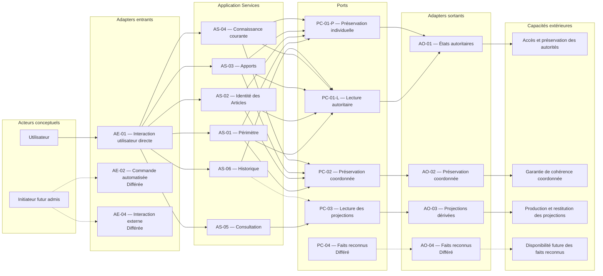

# Adapter Analysis

## Purpose

Ce document identifie les familles d'Adapters nécessaires pour exposer les 16 Use Cases et réaliser les Ports de Release 0.1. L'analyse part exclusivement des contrats applicatifs : elle décrit les responsabilités extérieures attendues, sans choisir leur moyen de réalisation.

Un Adapter traduit une intention ou une capacité extérieure vers une frontière définie par l'application. Il préserve les garanties de cette frontière, restitue ses échecs sans les interpréter et demeure remplaçable sans changement du domaine, des Use Cases ou des Ports.

## Sources et portée

L'analyse dérive exclusivement :

- des critères d'acceptation de `29_RELEASE_0.1_ACCEPTANCE.md` ;
- des contraintes produit de `30_ARCHITECTURE_CONSTRAINTS.md` ;
- des contrats des 16 Use Cases de `09_USE_CASE_DESIGN.md` ;
- des responsabilités des six Application Services de `10_APPLICATION_SERVICES.md` ;
- des Ports candidats de `11_PORT_ANALYSIS.md` ;
- des contrats de Port et du modèle d'échec de `12_PORT_DESIGN.md`.

Elle distingue les Adapters entrants, qui rendent une intention accessible à l'application, et les Adapters sortants, qui réalisent les capacités demandées par les Ports. Elle ne conçoit aucune réalisation.

## Principes d'admission

Une famille d'Adapters est admise seulement si :

1. un Application Service ou un Port possède un besoin explicite qu'elle réalise ;
2. sa mission reste stable lorsque sa réalisation change ;
3. elle ne prend aucune décision métier et ne modifie aucun invariant ;
4. elle ne redéfinit ni un Use Case ni un contrat de Port ;
5. elle rend les échecs du contrat explicites ;
6. elle peut être remplacée sans modification de l'application ou du domaine ;
7. son existence évite une ambiguïté d'autorité ou de responsabilité.

La commodité, la proximité avec un Aggregate ou l'anticipation d'un besoin futur ne suffisent pas à créer une famille.

## Décisions synthétiques

La convention `AE` identifie une famille d'Adapters entrants et `AO` une famille d'Adapters sortants. Elle évite toute confusion avec les identifiants `AS-01` à `AS-06` déjà attribués aux Application Services.

| Identifiant | Famille candidate | Type | Décision Release 0.1 |
| --- | --- | --- | --- |
| AE-01 | Interaction utilisateur directe | Entrant | Obligatoire ; expose les 16 Use Cases |
| AE-02 | Commande automatisée | Entrant | Différée ; aucun Use Case 0.1 ne l'exige |
| AE-03 | Traitement local autonome | Entrant | Non retenue comme famille distincte |
| AE-04 | Interaction externe future | Entrant | Différée |
| AO-01 | États autoritaires | Sortant | Obligatoire ; réalise PC-01-L et PC-01-P par deux responsabilités visibles |
| AO-02 | Préservation coordonnée | Sortant | Obligatoire lorsque DS-04 intervient ; réalise PC-02 |
| AO-03 | Projections dérivées | Sortant | Obligatoire ; réalise PC-03 |
| AO-04 | Mise à disposition des faits reconnus | Sortant | Différée avec PC-04 |

## Adapters entrants

### AE-01 — Interaction utilisateur directe

- **Mission :** traduire une intention explicitement exprimée par un utilisateur vers l'Application Service qui porte le Use Case concerné, puis restituer son résultat sans en changer le sens.
- **Use Cases accessibles :** `UC-001` à `UC-016`.
- **Informations reçues :** intention choisie, identités métier désignées, informations nécessaires au Use Case, apports fournis par l'utilisateur et critères de consultation reconnus.
- **Validations restant applicatives :** présence des informations requises par le contrat, possibilité d'identifier l'intention et son destinataire applicatif, cohérence de la demande avec les préconditions du Use Case. Les validations d'identité, de connaissance, de significativité et de continuité restent dans le domaine.
- **Résultats restitués :** résultat métier confirmé, état autoritaire ou projection explicitement qualifiée selon le Use Case, refus applicatif ou métier, et échec de Port traduit sans perte de catégorie.
- **Échecs présentés :** absence, référence invalide, indisponibilité, impossibilité de préserver, conflit plus récent, projection indisponible ou incomplète, violation de cohérence et échec non classifiable lorsque pertinents.
- **Responsabilités interdites :** choisir une décision métier, compléter une intention incomplète par supposition, transformer une projection en autorité, masquer une incertitude, relancer silencieusement une décision devenue obsolète ou convertir un échec en succès.
- **Statut :** obligatoire en Release 0.1.

Une seule famille entrante suffit pour Release 0.1 : les différences entre créer, modifier, rechercher et consulter sont déjà portées par les Use Cases et les Application Services. Les reproduire sous forme de familles entrantes distinctes créerait une seconde classification sans responsabilité nouvelle.

### AE-02 — Commande automatisée

- **Mission future :** transmettre une intention préalablement définie sans interaction utilisateur au moment de son déclenchement.
- **Use Cases accessibles :** aucun en Release 0.1 ; toute future association devra être admise explicitement.
- **Informations reçues :** intention complète, autorité de déclenchement reconnue et informations exigées par le futur Use Case.
- **Validations restant applicatives :** toutes les préconditions et validations du Use Case ; l'absence d'interaction immédiate ne les réduit pas.
- **Résultats restitués :** même résultat métier et mêmes catégories d'échec que l'intention équivalente explicitement admise.
- **Échecs présentés :** au futur initiateur légitime, sans silence ni requalification.
- **Responsabilités interdites :** inventer une intention, choisir son moment selon une règle métier non définie, réessayer une décision obsolète, contourner une confirmation requise ou élargir le Scope.
- **Statut :** différé ; aucune capacité ni aucun critère 0.1 ne le requiert.

### AE-03 — Traitement local autonome

- **Mission analysée :** déclencher localement une activité sans intention utilisateur courante.
- **Use Cases accessibles :** aucun.
- **Informations reçues :** aucune information n'est légitimement attendue tant qu'une intention autonome n'est pas définie.
- **Validations restant applicatives :** non applicables en l'absence de Use Case.
- **Résultats restitués :** aucun résultat contractuel reconnu.
- **Échecs présentés :** aucun modèle d'échec propre n'est admis.
- **Décision :** non retenue comme famille distincte en Release 0.1.
- **Justification :** le caractère local est une contrainte d'usage, pas une intention applicative. Sans Use Case autonome, cette famille n'aurait ni mission propre ni résultat métier distinct et risquerait d'introduire un comportement implicite.
- **Condition de réexamen :** admission future d'un Use Case dont le déclenchement autonome constitue une exigence produit explicite.
- **Responsabilités interdites :** déduire une intention de l'état, modifier le domaine en arrière-plan ou présenter une activité interne comme une décision utilisateur.

### AE-04 — Interaction externe future

- **Mission future :** traduire l'intention d'un acteur conceptuel extérieur au contexte d'usage courant vers un Use Case explicitement ouvert à cette interaction.
- **Use Cases accessibles :** aucun en Release 0.1.
- **Informations reçues :** intention, identité métier et éléments autorisés par un futur contrat produit.
- **Validations restant applicatives :** mêmes préconditions que pour toute autre entrée, complétées uniquement par les limites reconnues du futur contexte d'interaction.
- **Résultats restitués :** résultat du Use Case et échecs explicites, sans exposition d'une information hors de son périmètre autorisé.
- **Responsabilités interdites :** acquérir l'autorité du domaine, contourner la confidentialité, modifier le sens des concepts ou imposer une représentation à l'application.
- **Statut :** différé ; le Scope 0.1 n'admet aucune interaction extérieure nécessaire.

## Adapters sortants

### AO-01 — États autoritaires

- **Mission :** réaliser PC-01-L et PC-01-P en donnant accès aux états possédés par les Aggregate Roots et en préservant individuellement les états qu'elles ont déjà reconnus.
- **Ports réalisés :** PC-01-L et PC-01-P.
- **Responsabilités incluses :** établir l'existence ou l'absence ; restituer l'état autoritaire demandé ; restituer AGG-06 comme autorité de continuité ; préserver un état reconnu ; détecter un conflit avec un état plus récent ; confirmer ou refuser explicitement la préservation.
- **Responsabilités exclues :** créer ou corriger un état ; choisir entre deux décisions ; garantir la cohérence de plusieurs Aggregate Roots ; fournir une projection comme vérité ; reconstruire une information manquante ; produire ou interpréter un Domain Event.
- **Informations reçues :** identité et autorité attendue pour PC-01-L ; identité, état reconnu et continuité attendue pour PC-01-P.
- **Informations restituées :** existence, absence, état autoritaire, continuité historique, confirmation de préservation ou échec catégorisé.
- **Garanties à respecter :** identité exacte, distinction absence–indisponibilité, lecture sans effet, fidélité de l'état, détection des conflits récents, aucune invention et aucune réussite silencieuse.
- **Échecs à traduire :** `PF-01`, `PF-02`, `PF-03`, `PF-04`, `PF-05`, `PF-08`, `PF-09` selon le contrat appelé.
- **Risque de transfert d'autorité :** élevé si l'Adapter choisit l'état à conserver, corrige une divergence ou reconstitue une valeur ; ces comportements sont interdits.
- **Statut :** obligatoire en Release 0.1.

#### Lecture et préservation dans une même famille

Une même famille peut satisfaire PC-01-L et PC-01-P parce que les deux contrats portent sur la même responsabilité extérieure : rendre accessible l'état possédé par une autorité métier. Les deux responsabilités doivent néanmoins rester visibles et invocables séparément :

- la lecture ne produit aucun effet ;
- la préservation reçoit seulement un état déjà reconnu ;
- un droit de lecture n'implique jamais une capacité de préservation ;
- un échec de préservation ne modifie pas le résultat d'une lecture préalable ;
- aucun contrat mixte ne peut lire, choisir puis préserver de sa propre initiative.

La famille commune évite une duplication de l'identité, de l'absence, de l'indisponibilité et de la détection de conflit. Elle ne fusionne pas les deux contrats applicatifs.

#### Conservation du contenu documentaire

La conservation du contenu appartenant à AGG-05 relève de la même famille AO-01. Ce contenu fait partie de l'état autoritaire de Documentation ; sa nature ne crée pas une responsabilité applicative distincte en Release 0.1.

Une famille spécialisée n'est donc pas admise. AO-01 doit préserver fidèlement le contenu sans l'interpréter, le résumer, le corriger ni lui attribuer l'autorité d'AGG-03. Une réévaluation ne serait justifiée que par une future responsabilité produit possédant un cycle de vie et des garanties autonomes.

### AO-02 — Préservation coordonnée

- **Mission :** réaliser PC-02 en préservant comme un résultat métier indivisible l'ensemble d'états reconnu complet par les Aggregates concernés et DS-04.
- **Port réalisé :** PC-02.
- **Responsabilités incluses :** recevoir l'ensemble complet ; vérifier la présence de ses composants déclarés ; préserver les états reconnus et la continuité d'AGG-06 comme un tout ; confirmer la complétude préservée ou signaler un échec global ; détecter les conflits avec des états plus récents.
- **Responsabilités exclues :** créer ou qualifier un Changement ; décider de la complétude ; corriger un état ; fusionner des états non reconnus ; relancer silencieusement ; annoncer une réussite partielle.
- **Informations reçues :** identités, états reconnus, continuité historique attendue, états antérieurs attendus et conclusion de complétude de DS-04.
- **Informations restituées :** confirmation globale de préservation ou échec global catégorisé.
- **Garanties à respecter :** indivisibilité métier, absence de perte, fidélité des états, continuité historique, conflit explicite et aucune interprétation de DS-04.
- **Échecs à traduire :** `PF-02`, `PF-03`, `PF-04`, `PF-05`, `PF-08`, `PF-09`.
- **Risque de transfert d'autorité :** critique si l'Adapter complète l'ensemble, crée le Changement ou arbitre une divergence ; ces comportements sont interdits.
- **Statut :** obligatoire lorsque DS-04 intervient en Release 0.1.

#### Nécessité d'une famille propre

PC-02 exige une famille propre. Une succession contrôlée d'appels à la responsabilité PC-01-P ne garantit pas que le résultat inter-Aggregates sera préservé complètement et pourrait rendre visible un succès partiel. AO-02 doit donc porter directement la garantie globale de PC-02.

AO-01 et AO-02 peuvent être fournis par une même capacité extérieure générale de conservation, mais leurs Adapters, leurs confirmations et leurs échecs demeurent contractuellement distincts. AO-02 ne dépend pas d'AO-01 et ne le pilote pas.

### AO-03 — Projections dérivées

- **Mission :** réaliser PC-03 en construisant ou restituant les projections nécessaires à la recherche et à la consultation, tout en maintenant leur caractère dérivé.
- **Port réalisé :** PC-03.
- **Responsabilités incluses :** fournir synthèses, regroupements, candidats de recherche, consultation détaillée, connaissance courante dérivée et projection historique complémentaire ; déclarer disponibilité, complétude, ancienneté pertinente et écart connu avec une autorité source.
- **Responsabilités exclues :** modifier le domaine ; devenir une autorité ; arbitrer une contradiction ; inventer une information ; réécrire l'Historique ; alimenter une décision autoritaire ; présenter une projection obsolète comme certaine.
- **Informations reçues :** identité du périmètre ou du sujet, intention de consultation et critères métier déjà reconnus par le Use Case.
- **Informations restituées :** projection, synthèse, regroupement ou ensemble de candidats, avec origine et état de complétude ; ou échec explicite.
- **Garanties à respecter :** lecture seule, traçabilité vers les autorités sources, identités distinctes, incertitudes et contradictions visibles, aucun résultat distinct d'une indisponibilité, incomplétude explicite.
- **Échecs à traduire :** `PF-01`, `PF-02`, `PF-03`, `PF-06`, `PF-07`, `PF-08`, `PF-09`.
- **Risque de transfert d'autorité :** critique si une projection devient l'entrée d'une décision métier ou si l'Adapter corrige silencieusement un écart ; ces usages sont interdits.
- **Statut :** obligatoire pour `UC-014` et `UC-015` ; facultatif dans `UC-016`, qui conserve PC-01-L comme accès historique autoritaire.

#### Production, conservation, lecture et reconstruction

Pour Release 0.1, une seule famille AO-03 suffit à réaliser le résultat attendu par PC-03. Le contrat exige une projection fidèle et qualifiée, non une manière particulière de l'obtenir.

- **Production :** peut appartenir à AO-03 si elle dérive uniquement des autorités identifiables et n'ajoute aucune décision.
- **Conservation éventuelle :** ne justifie pas une famille autonome ; elle ne change ni l'autorité ni les garanties.
- **Lecture :** constitue la responsabilité exposée à PC-03.
- **Reconstruction :** peut être une manière de rétablir une projection indisponible ou incomplète, mais ne peut pas inventer une source ni être présentée comme un nouvel état autoritaire.

Séparer ces activités en familles distinctes sans exigence supplémentaire multiplierait les frontières et rendrait leur complétude plus difficile à comprendre. Une future séparation exigerait une responsabilité applicative distincte, pas seulement une autre manière de produire la même projection.

### AO-04 — Mise à disposition des faits reconnus

- **Mission future :** réaliser PC-04 en rendant un Domain Event déjà reconnu disponible au-delà de la coordination qui l'a produit.
- **Port réalisé :** PC-04.
- **Responsabilités incluses lors d'une future activation :** recevoir un fait reconnu et sa confirmation de complétude ; préserver son nom, son émetteur, son sujet et sa signification ; confirmer ou refuser explicitement sa mise à disposition.
- **Responsabilités exclues :** créer, modifier, enrichir, interpréter ou supprimer un fait ; décider de son destinataire métier ; déclencher une décision ; devenir l'autorité de l'Historique ; conditionner un résultat 0.1.
- **Informations reçues :** fait canonique, émetteur, sujet, complétude reconnue et futur destinataire légitime.
- **Informations restituées :** confirmation de mise à disposition ou échec explicite.
- **Garanties minimales :** fait inchangé, origine traçable, aucune autorité transférée, aucun effet sur la réussite de la décision source.
- **Échecs à traduire :** `PF-02`, `PF-03`, `PF-08`, `PF-09`, à confirmer lors de l'activation de PC-04.
- **Risque de transfert d'autorité :** l'Adapter pourrait devenir un Historique parallèle ou interpréter les faits ; les deux responsabilités sont interdites.
- **Statut :** différé.

L'activation exige simultanément une capacité admise, des critères d'acceptation, un consommateur métier légitime et la confirmation que sa disponibilité ne transfère aucune autorité. Aucune de ces conditions n'est satisfaite par le Scope 0.1.

## Composition et regroupements

### Regroupements acceptables

1. **PC-01-L et PC-01-P dans AO-01 :** même responsabilité extérieure sur les états autoritaires, avec deux contrats visibles et strictement séparés.
2. **États ordinaires et contenu de Documentation dans AO-01 :** AGG-05 possède ce contenu ; aucune responsabilité autonome ne justifie une famille supplémentaire.
3. **Production et lecture des projections dans AO-03 :** acceptables tant que la production reste une dérivation traçable, que son état est qualifié et qu'aucune autorité n'est acquise.
4. **Une famille entrante AE-01 pour les 16 Use Cases :** les intentions restent distinguées par leurs contrats applicatifs, non par des familles d'entrée artificielles.

### Regroupements interdits

1. **AO-01 avec AO-02 sous un contrat unique :** la préservation individuelle et la garantie globale répondent à deux questions différentes.
2. **AO-01 avec AO-03 :** l'état autoritaire et la projection dérivée ne peuvent partager une frontière ambiguë.
3. **AO-02 comme composition d'appels à PC-01-P :** une suite de confirmations individuelles ne prouve pas la réussite globale.
4. **AO-03 avec AO-04 :** construire une représentation et mettre un fait reconnu à disposition possèdent des garanties et des temporalités différentes.
5. **Un Adapter universel entrant et sortant :** il mélangerait intention, orchestration, autorité, projection et préservation.
6. **Un Adapter par Aggregate :** aucune différence de responsabilité extérieure ne le justifie en 0.1.
7. **Une dépendance entre Adapters :** chaque famille réalise directement son contrat et ne délègue pas sa garantie à une autre.

## Modèle d'échec appliqué aux Adapters

L'Adapter détecte seulement ce qui relève de la capacité extérieure qu'il traduit. Il restitue au Port la catégorie reconnue et les éléments nécessaires pour l'identifier, sans déduire une décision métier ni expliquer une cause non établie.

| Échec | Ce que l'Adapter peut détecter | Ce qu'il restitue au Port | Ce qu'il ne doit pas interpréter | Interruption | Nouvelle tentative explicite | Jamais converti en succès |
| --- | --- | --- | --- | --- | --- | --- |
| `PF-01` Absence reconnue | Aucun état ou aucun sujet ne correspond à l'identité dans l'autorité interrogée | Absence explicite et identité concernée | L'absence comme inexistence métier définitive ou indisponibilité | Si l'existence est une précondition | Après création reconnue ou nouvelle intention | Oui, sauf si l'absence est le résultat attendu du contrat |
| `PF-02` Référence invalide | La référence ne désigne pas le type d'autorité ou le sujet attendu | Invalidité explicite et référence concernée | La correction à appliquer ou la validité métier de l'identité | Toujours | Après correction explicite | Oui |
| `PF-03` Indisponibilité | La capacité extérieure ne peut actuellement fournir le contrat | Indisponibilité distincte de l'absence | L'état supposé pendant l'indisponibilité | Toujours si le Port est requis | Lorsque la capacité est de nouveau disponible | Oui |
| `PF-04` Impossibilité de préserver | Aucune confirmation fiable de préservation ne peut être fournie | Échec de préservation et périmètre concerné | La décision métier comme incorrecte | Toujours | Après relecture et décision explicite de réessayer | Oui |
| `PF-05` Conflit avec un état plus récent | L'état attendu par la demande n'est plus l'état autoritaire courant | Conflit et nécessité d'une nouvelle lecture | Quel état doit prévaloir ou comment fusionner | Toujours | Après PC-01-L et nouvelle décision métier | Oui |
| `PF-06` Projection indisponible | La projection demandée ne peut pas être restituée | Indisponibilité de la projection | L'absence du sujet ou son état autoritaire | Toujours pour la consultation concernée | Lorsque la projection redevient disponible | Oui |
| `PF-07` Projection incomplète | La projection existe mais ne couvre pas les éléments attendus | Incomplétude et périmètre affecté | Les valeurs manquantes ou leur signification | Si le résultat doit être complet | Après rétablissement de la complétude ; une vue partielle exige une intention explicite | Oui comme résultat complet |
| `PF-08` Violation d'une garantie de cohérence | Une identité, une continuité, une complétude ou une origine ne peut être garantie | Garantie non satisfaite et périmètre concerné | Une correction, un arbitrage ou une nouvelle règle | Toujours | Après suppression de la cause et nouvelle évaluation | Oui |
| `PF-09` Échec non classifiable | Un échec réel ne correspond à aucune catégorie reconnue | Échec non classifiable sans cause inventée | Toute cause, gravité ou possibilité de reprise non établie | Toujours | Non présumée | Oui |

Règles communes :

- un Adapter entrant présente l'échec sans changer sa catégorie ;
- un Adapter sortant ne transforme jamais absence, indisponibilité ou incomplétude en valeur vide ambiguë ;
- une nouvelle tentative est une nouvelle intention explicite, jamais une répétition silencieuse ;
- un état partiellement préservé ne peut pas être annoncé comme résultat complet ;
- un échec non classifiable reste bloquant jusqu'à une nouvelle évaluation.

## Familles minimales de Release 0.1

Les familles obligatoires sont :

- **AE-01**, pour rendre les 16 Use Cases accessibles à l'utilisateur ;
- **AO-01**, pour PC-01-L et PC-01-P ;
- **AO-02**, chaque fois que DS-04 impose PC-02 ;
- **AO-03**, pour PC-03 dans `UC-014` et `UC-015`.

Les familles différées sont :

- **AE-02**, faute de commande automatisée admise ;
- **AE-04**, faute d'interaction extérieure admise ;
- **AO-04**, parce que PC-04 est différé.

AE-03 n'est ni obligatoire ni différée comme réalisation : elle est rejetée comme famille autonome tant qu'aucun Use Case de traitement autonome n'existe.

## Matrice des familles d'Adapters

| Famille | Type | Port ou Application Service concerné | Responsabilité | Garanties dominantes | Échecs | Release |
| --- | --- | --- | --- | --- | --- | --- |
| AE-01 | Entrant | AS-01 à AS-06 | Traduire l'intention utilisateur et restituer le résultat | Intention explicite, aucune décision, catégorie d'échec conservée | Tous selon le Use Case | 0.1 obligatoire |
| AE-02 | Entrant | Aucun en 0.1 | Transmettre une future intention automatisée admise | Même contrat que le Use Case, aucun contournement | À dériver du futur Use Case | Différé |
| AE-03 | Entrant | Aucun | Aucun contrat autonome reconnu | Ne pas inventer un comportement implicite | Non applicable | Non retenu |
| AE-04 | Entrant | Aucun en 0.1 | Traduire une future intention extérieure autorisée | Confidentialité, périmètre et sens préservés | À dériver du futur Use Case | Différé |
| AO-01 | Sortant | PC-01-L, PC-01-P ; AS-01 à AS-04, AS-06 consommateurs | Lire et préserver individuellement les états autoritaires | Identité, fidélité, absence explicite, conflit visible | PF-01 à PF-05, PF-08, PF-09 selon contrat | 0.1 obligatoire |
| AO-02 | Sortant | PC-02 ; AS-01 à AS-04 consommateurs | Préserver un résultat inter-Aggregates complet | Indivisibilité, continuité, aucun succès partiel | PF-02 à PF-05, PF-08, PF-09 | 0.1 obligatoire sous condition |
| AO-03 | Sortant | PC-03 ; AS-05 et AS-06 facultativement | Restituer des projections dérivées | Lecture seule, traçabilité, complétude et ancienneté visibles | PF-01 à PF-03, PF-06 à PF-09 | 0.1 obligatoire pour `UC-014`, `UC-015` |
| AO-04 | Sortant | PC-04 | Rendre un futur fait reconnu disponible | Fait inchangé, émetteur traçable, aucune autorité transférée | PF-02, PF-03, PF-08, PF-09 à confirmer | Différé |

## Matrice de couverture des Use Cases

| Use Case | Adapter entrant nécessaire | Ports sollicités | Adapters sortants nécessaires | Résultat attendu | Échec bloquant principal |
| --- | --- | --- | --- | --- | --- |
| `UC-001` | AE-01 | PC-01-L, PC-02 | AO-01, AO-02 | Inventaire et origine préservés comme un ensemble | Référence invalide, impossibilité de préserver, violation de cohérence |
| `UC-002` | AE-01 | PC-01-L puis PC-01-P, ou PC-02 si significatif | AO-01 ; AO-02 si significatif | Périmètre redéfini avec continuité requise | Absence, conflit récent, échec de préservation coordonnée |
| `UC-003` | AE-01 | PC-01-L, PC-02 | AO-01, AO-02 | Article inclus et origine préservée | Absence, référence invalide, violation de cohérence |
| `UC-004` | AE-01 | PC-01-L, PC-02 | AO-01, AO-02 | Identité corrigée avec continuité | Absence, conflit récent, échec de préservation coordonnée |
| `UC-005` | AE-01 | PC-01-L, PC-01-P | AO-01 | Observation et Source reconnues préservées | Absence, impossibilité de préserver, indisponibilité |
| `UC-006` | AE-01 | PC-01-L puis PC-01-P, ou PC-02 si significatif | AO-01 ; AO-02 si significatif | Observation corrigée avec éventuelle continuité | Absence, conflit récent, violation de cohérence |
| `UC-007` | AE-01 | PC-01-L, PC-01-P | AO-01 | Documentation et Source reconnues préservées | Absence, impossibilité de préserver, indisponibilité |
| `UC-008` | AE-01 | PC-01-L puis PC-01-P, ou PC-02 si significatif | AO-01 ; AO-02 si significatif | Documentation corrigée avec éventuelle continuité | Absence, conflit récent, violation de cohérence |
| `UC-009` | AE-01 | PC-01-L, PC-02 | AO-01, AO-02 | Information initiale et origine préservées | Référence invalide, échec de préservation coordonnée |
| `UC-010` | AE-01 | PC-01-L, PC-02 | AO-01, AO-02 | Information actualisée avec continuité | Absence, conflit récent, échec de préservation coordonnée |
| `UC-011` | AE-01 | PC-01-L puis PC-01-P, ou PC-02 si significatif | AO-01 ; AO-02 si significatif | Incertitude ou conflit explicitement préservé | Absence, conflit récent, violation de cohérence |
| `UC-012` | AE-01 | PC-01-L, PC-02 | AO-01, AO-02 | Arbitrage et continuité préservés | Absence, conflit récent, échec de préservation coordonnée |
| `UC-013` | AE-01 | PC-01-L puis PC-01-P, ou PC-02 si significatif | AO-01 ; AO-02 si significatif | Source commune corrigée et effets reconnus préservés | Référence invalide, conflit récent, violation de cohérence |
| `UC-014` | AE-01 | PC-03 | AO-03 | Résultats de recherche qualifiés | Projection indisponible ou incomplète |
| `UC-015` | AE-01 | PC-03 | AO-03 | Projection courante et traçable de l'Article | Référence invalide, projection indisponible ou incomplète |
| `UC-016` | AE-01 | PC-01-L ; PC-03 facultatif | AO-01 ; AO-03 facultatif | Historique autoritaire, complété éventuellement d'une synthèse | Absence, indisponibilité, violation de cohérence historique |

## Matrice de décision par Port

| Port | Familles candidates | Possibilité de regroupement | Risques | Décision proposée |
| --- | --- | --- | --- | --- |
| PC-01-L | AO-01 lecture | Avec PC-01-P dans une même famille, contrats séparés | Lecture produisant un effet ; projection substituée à l'autorité | Retenir AO-01 avec responsabilité de lecture explicite |
| PC-01-P | AO-01 préservation | Avec PC-01-L dans une même famille, contrats séparés | Décision ou correction déplacée dans l'Adapter | Retenir AO-01 avec responsabilité de préservation explicite |
| PC-02 | AO-02 ; composition de PC-01-P analysée | Aucun regroupement contractuel avec PC-01-P | Succès partiel, conflit masqué, continuité perdue | Retenir AO-02 comme famille propre ; rejeter la composition d'appels individuels |
| PC-03 | AO-03 production et lecture ; familles séparées analysées | Regrouper production, conservation éventuelle, lecture et reconstruction sous la même mission de projection | Projection devenue autoritaire ou ancienneté masquée | Retenir une famille AO-03 unique tant qu'aucune responsabilité autonome n'est admise |
| PC-04 | AO-04 future | Aucun regroupement avec AO-03 | Historique parallèle, interprétation du fait, activation prématurée | Différer AO-04 avec PC-04 |

## Diagramme conceptuel

Les flèches pleines décrivent les dépendances nécessaires ou possibles en Release 0.1. Les flèches pointillées identifient des usages facultatifs ou différés ; elles ne créent aucune dépendance actuelle.

## Traçabilité

| Famille | Ports ou Application Services | Use Cases | Critères et contraintes dominants |
| --- | --- | --- | --- |
| AE-01 | AS-01 à AS-06 | `UC-001` à `UC-016` | Tous les critères associés ; `ARC-CON-001`, `ARC-CON-002`, `ARC-CON-003`, `ARC-CON-008`, `ARC-CON-013` |
| AE-02 | Aucun en 0.1 | Aucun | Aucun critère 0.1 ; future admission requise |
| AE-03 | Aucun | Aucun | Rejet fondé sur l'absence de capacité et de critère |
| AE-04 | Aucun en 0.1 | Aucun | `ARC-CON-001`, `ARC-CON-002`, `ARC-CON-011`, `ARC-CON-015` lors d'une future admission |
| AO-01 | PC-01-L, PC-01-P ; AS-01 à AS-04, AS-06 | `UC-001` à `UC-013`, `UC-016` selon contrat | Critères des capacités `CAP-001`, `CAP-002`, `CAP-003`, `CAP-005`, `CAP-006`, `CAP-011` ; `ARC-CON-002`, `ARC-CON-003`, `ARC-CON-005`, `ARC-CON-006`, `ARC-CON-014` à `ARC-CON-017` |
| AO-02 | PC-02 ; AS-01 à AS-04 | Use Cases sollicitant DS-04 | `AC-01-GLO-004`, `AC-01-GLO-007` à `AC-01-GLO-009` ; `ARC-CON-005`, `ARC-CON-006`, `ARC-CON-015`, `ARC-CON-016` |
| AO-03 | PC-03 ; AS-05, AS-06 facultativement | `UC-014`, `UC-015`, complément de `UC-016` | `AC-01-CAP-009`, `AC-01-CAP-011`, `AC-01-GLO-001` à `AC-01-GLO-009` selon consultation ; `ARC-CON-001`, `ARC-CON-003`, `ARC-CON-008`, `ARC-CON-009`, `ARC-CON-013` à `ARC-CON-017` |
| AO-04 | PC-04 | Aucun en 0.1 | Aucun critère 0.1 ; future capacité et futurs critères requis |

## Risques

| Risque | Cause | Impact | Règle de prévention |
| --- | --- | --- | --- |
| Adapter devenant une autorité métier | Il choisit, corrige ou complète un état | Double autorité et invariants contournés | Recevoir uniquement une décision reconnue et restituer le résultat sans arbitrage |
| Logique métier déplacée dans un Adapter | Une traduction devient qualification ou décision | Domaine appauvri et comportements divergents | Toute décision reste dans les Aggregates, Domain Services ou BC-05 |
| Adapter universel mélangeant plusieurs Ports | Recherche de mutualisation sans frontière contractuelle | Lecture, préservation, projection et diffusion deviennent ambiguës | Limiter chaque famille à une responsabilité extérieure et conserver les contrats visibles |
| Un Adapter par Aggregate sans besoin | Le découpage copie les Aggregate Roots | Multiplication et couplage inutile | AO-01 couvre les autorités par nature d'accès, pas par Aggregate |
| État autoritaire confondu avec projection | AO-03 alimente une décision ou AO-01 retourne une vue dérivée | Décision fondée sur une information non autoritaire | Toute décision relit par PC-01-L ; AO-03 reste réservé aux consultations |
| Lecture confondue avec préservation | AO-01 choisit et préserve pendant une lecture | Effet implicite et impossibilité de vérifier l'intention | Maintenir deux responsabilités séparées pour PC-01-L et PC-01-P |
| Succès partiel masqué | PC-02 est simulé par des préservations individuelles | Historique et états sources divergent | AO-02 confirme l'ensemble ou restitue un échec global |
| Indisponibilité confondue avec absence | Une incapacité d'accès est rendue comme absence | Création erronée ou information trompeuse | Traduire séparément PF-01, PF-03 et PF-06 |
| Projection obsolète présentée comme certaine | L'ancienneté ou l'écart connu est supprimé | Compréhension fausse et arbitrage induit | AO-03 qualifie complétude, origine et écart ; aucune certitude inventée |
| Dépendance entre Adapters | Une famille délègue sa garantie à une autre | Couplage circulaire et responsabilité diluée | Chaque Adapter réalise directement le contrat de son Port |
| Contrat influencé par une technologie anticipée | La frontière copie un mécanisme pressenti | Instabilité et choix prématuré | Décrire seulement mission, informations métier, garanties et échecs |
| Activation prématurée de PC-04 | La diffusion est ajoutée sans consommateur admis | Complexité inutile et nouvelle dépendance de succès | Exiger capacité, critères et consommateur légitime avant activation |

## Contrôles de préparation

- **Ports obligatoires :** PC-01-L et PC-01-P disposent d'AO-01 ; PC-02 dispose d'AO-02 ; PC-03 dispose d'AO-03.
- **Exposition :** AE-01 donne accès aux 16 Use Cases et conserve leurs validations applicatives et métier.
- **Échecs :** les neuf catégories PF-01 à PF-09 possèdent une règle de détection, de restitution, d'interruption et de reprise explicite.
- **Autorité :** aucun Adapter ne décide d'une identité, d'une connaissance, d'un Changement, d'une correspondance ou d'une continuité.
- **Projections :** AO-03 reste strictement non autoritaire et ne peut alimenter une décision métier.
- **PC-04 :** AO-04 reste différé et absent des dépendances de Release 0.1.
- **Indépendance :** les familles résultent des Ports, Use Cases, critères et contraintes ; aucune technologie n'a déterminé leurs frontières.

## Conclusion

**READY FOR ADAPTER DESIGN**

Chaque Port obligatoire dispose d'au moins une famille d'Adapters candidate, les 16 Use Cases peuvent être exposés par AE-01 et les neuf échecs demeurent explicites. Les responsabilités autoritaires, coordonnées et dérivées restent séparées ; PC-04 et son Adapter demeurent différés. Le design détaillé des Adapters peut commencer sans modifier les contrats applicatifs ni introduire de choix technologique.
