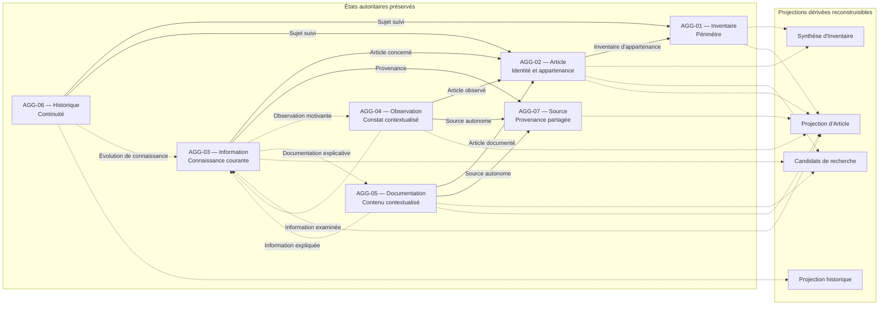

# Persistence Conceptual Model

## Purpose

Ce document définit le modèle conceptuel de persistance de Release 0.1. Il précise ce qui doit être préservé pour que les états reconnus par le Domaine restent identifiables, cohérents, traçables et restaurables.

Le modèle réalise les responsabilités établies par l'architecture certifiée. Il ne modifie ni les autorités métier, ni les frontières des Aggregates, ni les contrats des Ports. Il laisse libres les moyens de réalisation dès lors qu'ils respectent les mêmes garanties.

## Scope

Le périmètre couvre :

- les états autoritaires d'AGG-01 à AGG-07 ;
- leurs identités métier et leurs références reconnues ;
- la préservation individuelle et coordonnée exprimée par PC-01-P et PC-02 ;
- la lecture autoritaire exprimée par PC-01-L ;
- les projections de Release 0.1 lues par PC-03 ;
- la continuité, la restauration et la reconstruction définies par `14_BUSINESS_CONTINUITY_AND_RECOVERY.md`.

PC-04 reste différé et n'appartient pas au modèle de persistance de Release 0.1. Les capacités postérieures à cette Release sont également exclues.

## Principes

1. L'état reconnu par une Aggregate Root est la seule autorité sur les informations qu'elle possède.
2. Une identité métier est préservée avec l'état qu'elle désigne et reste indépendante de sa future représentation.
3. Une référence préservée ne transfère jamais l'autorité de l'Aggregate référencé.
4. Une projection peut être reconstruite ou conservée pour la consultation, mais elle reste remplaçable et non autoritaire.
5. Une valeur calculée est recalculée depuis ses autorités sources ; elle ne remplace pas les informations qui l'expliquent.
6. AGG-06 est un état autoritaire à préserver intégralement, jamais une projection à reconstituer.
7. Le contenu possédé par AGG-05 appartient à l'état métier et doit être préservé fidèlement avec son contexte et son rattachement.
8. Toute préservation confirmée correspond exactement à un état déjà reconnu par le Domaine.
9. Une décision coordonnée est préservée comme un ensemble métier indivisible ou n'est pas déclarée préservée.
10. Une restauration rétablit des états déjà reconnus ; elle ne prend aucune nouvelle décision métier.

## États autoritaires

### AGG-01 — Inventaire

- **État autoritaire :** identité de l'Inventaire, existence reconnue, finalité et limites du périmètre.
- **Identité métier :** identité propre de l'Inventaire.
- **Références :** aucune référence autoritaire vers les Articles ; leur appartenance forme une projection dérivée d'AGG-02. Une relation de consultation vers AGG-06 ne transfère aucune autorité.
- **À préserver :** l'état autoritaire complet, son sens au point de continuité retenu et les informations qualifiant sa portée.
- **Reconstructible :** ensemble des Articles appartenant à l'Inventaire et synthèses de son contenu.
- **Dérivé :** nombre d'Articles et autres regroupements de consultation.
- **Interdiction :** reconstruire la finalité, les limites ou l'existence depuis les Articles, l'Historique ou une projection.

### AGG-02 — Article d'inventaire

- **État autoritaire :** identité de l'Article, définition de son unité de gestion, appartenance unique à un Inventaire et état de cycle de vie reconnu lorsqu'il est applicable.
- **Identité métier :** identité distincte de l'Article, indépendante des informations mutables qui le décrivent.
- **Références :** référence forte vers AGG-01 pour l'Inventaire d'appartenance ; les liens inverses vers la connaissance, les apports et l'Historique sont dérivés pour la consultation.
- **À préserver :** identité, granularité, appartenance, état reconnu et référence à l'Inventaire.
- **Reconstructible :** connaissance actuelle, Emplacement, Statut, Observations et Documentation présentés autour de l'Article.
- **Dérivé :** toute vue consolidée de l'Article.
- **Interdiction :** reconstruire l'identité depuis un contenu descriptif, une ressemblance, un classement ou une localisation.

### AGG-03 — Information d'inventaire

- **État autoritaire :** question de connaissance, position courante, provenance, arbitrage, incertitude et conflit reconnus.
- **Identité métier :** unité de connaissance définie par l'Article concerné et la question dont les propositions doivent être arbitrées ensemble.
- **Références :** référence forte vers AGG-02 ; référence forte vers AGG-07 ou vers l'apport qui porte la provenance ; références faibles vers AGG-04 et AGG-05 lorsque leurs apports motivent la décision ; relation dérivée vers AGG-06 pour le passé.
- **À préserver :** l'état complet, toutes les références nécessaires à sa provenance et la distinction entre retenu, incertain, contesté et inconnu.
- **Reconstructible :** présentation de la provenance et vues de consultation de la connaissance courante.
- **Dérivé :** indicateurs de complétude et regroupements de positions.
- **Interdiction :** reconstruire la connaissance acceptée depuis les seuls apports, l'Historique ou une projection.

### AGG-04 — Observation

- **État autoritaire :** identité de l'Observation, constat, contexte, Article concerné et provenance reconnue.
- **Identité métier :** identité propre du constat, stable à travers une correction explicite et distincte de l'identité de l'Article.
- **Références :** référence forte vers AGG-02 ; référence forte vers AGG-07 lorsque la Source est autonome ; référence faible vers AGG-03 lorsque l'Observation examine une Information.
- **À préserver :** constat, contexte, rattachement, provenance et identité de l'Observation.
- **Reconstructible :** effet présenté sur la connaissance retenue et liens de navigation vers les décisions qui l'utilisent.
- **Dérivé :** toute interprétation ou indication de confiance qui ne constitue pas une décision d'AGG-03.
- **Interdiction :** reconstruire le constat depuis la connaissance courante, la Documentation ou l'Historique.

### AGG-05 — Documentation

- **État autoritaire :** identité de la Documentation, contenu, contexte, Article concerné, rattachement et provenance reconnus.
- **Identité métier :** identité propre de l'explication documentée, stable à travers une correction explicite.
- **Références :** référence forte vers AGG-02 ; référence forte vers AGG-07 lorsque la Source est autonome ; référence faible vers AGG-03 lorsqu'une Information est explicitement expliquée.
- **À préserver :** contenu intégral, contexte, rattachement, provenance, identité et références.
- **Reconstructible :** usages, liens de consultation, indicateurs de présence et résumés non autoritaires.
- **Dérivé :** toute vue ou synthèse du contenu.
- **Interdiction :** reconstruire ou remplacer le contenu depuis un résumé, une Source, une projection ou la connaissance courante.

### AGG-06 — Historique

- **État autoritaire :** identité de l'Historique, sujet suivi, continuité, ordre métier, Changements significatifs, états antérieurs nécessaires, origine et justification.
- **Identité métier :** identité de la continuité attachée à un Inventaire ou à un Article reconnu.
- **Références :** référence forte vers AGG-01 ou AGG-02 comme sujet ; référence vers l'autorité ayant reconnu chaque Changement ; référence faible vers AGG-03 lorsqu'une évolution de connaissance est concernée.
- **À préserver :** l'Historique complet, son ordre, ses états antérieurs, ses origines et toutes les références nécessaires à son intelligibilité.
- **Reconstructible :** uniquement les synthèses historiques destinées à la navigation.
- **Dérivé :** durée, nombre de Changements et autres regroupements de consultation.
- **Interdiction :** recalculer le passé depuis l'état courant, une projection ou les Domain Events.

### AGG-07 — Source

- **État autoritaire :** identité et contexte commun d'une provenance partagée.
- **Identité métier :** identité de la Source autonome, distinguée des apports qui l'utilisent.
- **Références :** aucune référence autoritaire vers les usages ; les liens vers AGG-03, AGG-04 et AGG-05 sont dérivés depuis leurs références.
- **À préserver :** identité, contexte commun et compatibilité avec toutes les références qui la désignent.
- **Reconstructible :** liste des apports et Informations qui utilisent la Source.
- **Dérivé :** nombre d'utilisations et regroupements de provenance.
- **Interdiction :** reconstruire la Source depuis ses usages ou maintenir simultanément une Source autonome et une provenance modifiable dans chaque apport.

AGG-07 n'existe que lorsque l'autonomie et la réutilisation de la Source sont reconnues. Sinon, la provenance est préservée comme propriété d'AGG-04 ou d'AGG-05, et AGG-03 référence l'apport qui établit l'origine.

## Identités métier

| Aggregate | Identité utilisée pour le retrouver | Unicité | Stabilité et cycle de vie | Référencement |
| --- | --- | --- | --- | --- |
| AGG-01 | Identité de l'Inventaire | Une identité désigne un seul Inventaire | Reconnue lors de la création ; une redéfinition du périmètre ne crée pas une seconde identité | Référencée par AGG-02 et AGG-06 |
| AGG-02 | Identité distincte de l'Article | Un Article ne possède qu'une identité active et une appartenance courante | Reconnue à l'inclusion ; toute correction reste explicable et ne crée pas deux représentations actives | Référencée par AGG-03, AGG-04, AGG-05 et AGG-06 |
| AGG-03 | Article concerné et question de connaissance reconnue | Une même question sur un même Article possède une seule autorité courante | Reconnue à l'ouverture de la question ; les arbitrages font évoluer l'état sans changer silencieusement son sujet | Référencée par les apports lorsqu'ils visent cette Information et par AGG-06 lors d'un Changement |
| AGG-04 | Identité de l'Observation | Un constat reconnu reste distinguable de tout autre apport | Reconnue à l'enregistrement ; une correction conserve la continuité de la même Observation | Référencée faiblement par AGG-03 et historiquement par AGG-06 si nécessaire |
| AGG-05 | Identité de la Documentation | Une explication reconnue reste distinguable de tout autre apport | Reconnue à l'enregistrement ; une correction conserve la continuité de la même Documentation | Référencée faiblement par AGG-03 et historiquement par AGG-06 si nécessaire |
| AGG-06 | Identité de la continuité d'un sujet suivi | Un Historique reconnu désigne une continuité déterminée | Ouvert au premier Changement significatif puis enrichi sans réécriture ni suppression | Référence son sujet et les autorités sources ; peut être consulté depuis ceux-ci |
| AGG-07 | Identité de la Source autonome | Une provenance partagée possède une seule autorité | Reconnue lorsque son autonomie est démontrée ; une correction reste explicable et ne fusionne pas silencieusement deux Sources | Référencée par AGG-03, AGG-04 et AGG-05 lorsque le modèle autonome s'applique |

Les identités métier sont des éléments de sens. Leur représentation future peut varier sans changer leur unicité, leur stabilité, leur cycle de vie ou les autorités qui les reconnaissent.

## Références entre Aggregates

Une référence est préservée avec l'Aggregate qui en est propriétaire. Lors d'une restauration, toute référence enregistrée doit désigner une autorité présente et compatible. Une relation dérivée est reconstruite après admission de l'ensemble et n'est jamais utilisée pour réparer une référence autoritaire.

| Aggregate référent | Autorité référencée | Nature | Propriété et obligation | Cohérence attendue | Effet lors d'une restauration |
| --- | --- | --- | --- | --- | --- |
| AGG-01 | AGG-02 | Dérivée | Appartenance possédée par AGG-02 ; aucune liste modifiable dans AGG-01 | La vue reflète toutes les appartenances admises | Reconstruire depuis AGG-02 |
| AGG-02 | AGG-01 | Forte | AGG-02 possède la référence d'appartenance ; elle est obligatoire | L'Inventaire existe et l'Article n'a qu'une appartenance courante | Restaurer avec AGG-02 et vérifier AGG-01 |
| AGG-03 | AGG-02 | Forte | AGG-03 possède la référence au sujet ; elle est obligatoire | L'Article est reconnu et n'est pas redéfini par l'Information | Restaurer avec AGG-03 et vérifier AGG-02 |
| AGG-03 | AGG-07 ou apport sourcé | Forte | AGG-03 possède le lien vers la provenance retenue ; il est obligatoire | Une seule autorité de provenance est désignée | Restaurer le lien et son autorité selon le modèle retenu |
| AGG-03 | AGG-04 | Faible | Référence possédée par AGG-03 lorsqu'une Observation motive l'arbitrage | L'Observation reste autonome et non décisionnelle | Restaurer le lien s'il existe et vérifier sa cible |
| AGG-03 | AGG-05 | Faible | Référence possédée par AGG-03 lorsqu'une Documentation explique l'arbitrage | La Documentation reste autonome et non décisionnelle | Restaurer le lien s'il existe et vérifier sa cible |
| AGG-04 | AGG-02 | Forte | AGG-04 possède le rattachement à l'Article ; il est obligatoire | Le constat concerne un Article reconnu | Restaurer avec AGG-04 et vérifier AGG-02 |
| AGG-04 | AGG-07 | Forte si autonome | AGG-04 possède le lien ; sinon la provenance est incluse dans son état | Un seul modèle de provenance est actif | Restaurer la Source et le lien, ou la provenance incluse |
| AGG-04 | AGG-03 | Faible | Référence facultative vers l'Information examinée | L'Observation peut exister sans acceptation | Restaurer le lien s'il existe et vérifier sa cible |
| AGG-05 | AGG-02 | Forte | AGG-05 possède le rattachement à l'Article ; il est obligatoire | Le contenu explique un objet reconnu | Restaurer avec AGG-05 et vérifier AGG-02 |
| AGG-05 | AGG-07 | Forte si autonome | AGG-05 possède le lien ; sinon la provenance est incluse dans son état | Un seul modèle de provenance est actif | Restaurer la Source et le lien, ou la provenance incluse |
| AGG-05 | AGG-03 | Faible | Référence facultative vers l'Information expliquée | La Documentation peut concerner l'Article seul | Restaurer le lien s'il existe et vérifier sa cible |
| AGG-06 | AGG-01 ou AGG-02 | Forte | AGG-06 possède la référence vers son sujet ; elle est obligatoire | La continuité reste attachée au même sujet | Restaurer l'Historique avec le sujet correspondant |
| AGG-06 | Autorité source du Changement | Forte | AGG-06 conserve l'origine reconnue de chaque Changement | Le sens historique reste attribuable à son autorité source | Restaurer l'origine et vérifier sa compatibilité |
| AGG-06 | AGG-03 | Faible | Référence présente lorsqu'une Information est concernée | L'état historique ne devient pas l'état courant | Restaurer le lien sans reconstruire le présent |
| AGG-07 | AGG-03, AGG-04, AGG-05 | Dérivée | Les usages appartiennent aux Aggregates consommateurs | La liste ne devient pas une seconde autorité | Reconstruire depuis les références restaurées |

Toute relation absente de cette matrice reste sans référence métier justifiée en Release 0.1.

## Modèle de préservation

### À préserver

- les états autoritaires complets d'AGG-01 à AGG-07 ;
- les identités métier de chaque Aggregate Root ;
- les références fortes et faibles effectivement reconnues ;
- les appartenances et la provenance selon leur autorité unique ;
- les inconnus, incertitudes, conflits et arbitrages ;
- le contenu documentaire intégral, son contexte et son rattachement ;
- l'Historique complet et ordonné ;
- la portée et la fraîcheur nécessaires pour qualifier un ensemble restaurable.

### À reconstruire

- les synthèses d'Inventaire ;
- les candidats de recherche ;
- les projections de consultation d'un Article ;
- les présentations dérivées de la connaissance courante ;
- les synthèses historiques de navigation ;
- les relations inverses et listes d'usages dérivées.

### À recalculer

- les nombres d'Articles ou d'utilisations ;
- les regroupements de consultation ;
- les indicateurs de présence ;
- les indicateurs de complétude qui peuvent être expliqués uniquement depuis les états autoritaires disponibles.

Un calcul ne peut jamais transformer une absence en information, supprimer une contradiction ou produire un arbitrage.

### À ignorer comme état durable

- l'état temporaire d'une coordination applicative ;
- une intention non confirmée ;
- une réponse ou un échec déjà présenté par un Port ;
- un résultat de recherche isolé ;
- une conclusion intermédiaire non reconnue par une Aggregate Root ;
- un Domain Event considéré comme moyen de recréer un état.

## Continuité et restauration

Le modèle applique les décisions de `14_BUSINESS_CONTINUITY_AND_RECOVERY.md` :

1. L'ensemble autoritaire est restauré comme un tout cohérent avant de redevenir disponible.
2. Chaque Aggregate Root attendue apparaît une seule fois dans la portée déclarée.
3. Les identités et références sont compatibles et entièrement résolues.
4. AGG-06 correspond aux états courants et conserve leur continuité sans modification.
5. Le contenu d'AGG-05 est présent, fidèle, contextualisé et rattaché.
6. Les inconnus, incertitudes et contradictions restent inchangés.
7. Aucun état plus récent n'est remplacé silencieusement.
8. Aucune information manquante n'est déduite pour compléter l'ensemble.
9. Les projections restent indisponibles ou explicitement incomplètes jusqu'à leur reconstruction.
10. Aucun Domain Event n'est rejoué, recréé ou réémis.

La responsabilité de continuité décide de l'admission ou du refus de l'ensemble. Elle ne modifie aucun état et ne devient l'autorité d'aucun Aggregate.

## Projections de Release 0.1

| Projection | Origine | Sources autoritaires | Traitement conceptuel | Justification |
| --- | --- | --- | --- | --- |
| Synthèse d'Inventaire | OP-06 de PC-03 | AGG-01 pour le périmètre ; AGG-02 pour les appartenances ; AGG-03 et AGG-05 pour la compréhension courante | Reconstruite ; une conservation dérivée éventuelle reste remplaçable | Présenter le périmètre sans créer une liste d'appartenance concurrente |
| Candidats de recherche | OP-07 de PC-03 | AGG-01 à AGG-05 et AGG-07 selon les critères | Reconstruits ; leur disponibilité et leur complétude restent explicites | Accélérer la découverte sans décider de la correspondance finale ni de la vérité |
| Projection d'Article | OP-08 de PC-03 | AGG-01 à AGG-05 et AGG-07 selon le contenu présenté | Reconstruite ; toute conservation reste strictement dérivée | Présenter identité, appartenance, connaissance, apports et Documentation sans fusionner leurs autorités |
| Projection historique | OP-09 de PC-03 | AGG-06, avec références aux autorités concernées | Reconstruite et facultative ; jamais substituée à AGG-06 | Faciliter la navigation sans devenir la continuité historique |

Toutes les projections sont non autoritaires. Une projection conservée pour la disponibilité reste exclue de l'ensemble restaurable, peut être abandonnée puis reconstruite et doit exposer sa provenance, sa fraîcheur, sa complétude et tout écart connu.

## Historique

AGG-06 protège la continuité temporelle et possède :

- l'identité de l'Historique ;
- le sujet suivi ;
- l'ordre métier des Changements significatifs ;
- les états antérieurs nécessaires ;
- l'origine et la justification de chaque Changement ;
- les liens vers les autorités qui ont reconnu les décisions.

Ces informations sont conservées sans réécriture. Elles ne sont jamais recalculées depuis le présent, reconstituées depuis les Domain Events ou remplacées par une projection historique. Une rectification produit une nouvelle continuité explicable ; elle ne modifie pas rétroactivement un Changement antérieur.

La restauration est refusée si AGG-06 est absent, incomplet, désordonné ou incompatible avec les états courants de la portée considérée.

## Contrats de Port et garanties de persistance

### PC-01-L — Lecture des états autoritaires

- **États concernés :** AGG-01 à AGG-07, dont AGG-06 comme autorité de continuité.
- **Garanties nécessaires :** identité et état correspondent ; existence, absence et indisponibilité restent distinctes ; la lecture est sans effet ; l'Historique n'est pas remplacé par une synthèse ; le contenu d'AGG-05 est restitué fidèlement.

### PC-01-P — Préservation individuelle

- **États concernés :** état reconnu par une seule Aggregate Root lorsque sa décision ne requiert pas de cohérence inter-Aggregates.
- **Garanties nécessaires :** état préservé sans modification ; continuité attendue avec l'état précédemment lu ; état plus récent jamais remplacé silencieusement ; confirmation explicite ; aucun succès si la préservation n'est pas complète.

### PC-02 — Préservation coordonnée

- **États concernés :** ensemble des états reconnus par plusieurs Aggregates, AGG-06 compris lorsque la continuité est exigée, et conclusion de complétude de DS-04.
- **Garanties nécessaires :** ensemble complet, identités distinctes, cohérence des références, indivisibilité métier, confirmation globale ou échec global, aucun sous-ensemble présenté comme résultat accompli.

### PC-03 — Lecture des projections

- **États concernés :** synthèses, candidats de recherche, projection d'Article et projection historique.
- **Garanties nécessaires :** lecture seule, provenance identifiable, identités non fusionnées, inconnus et contradictions préservés, disponibilité et complétude explicites, écart connu visible, aucune utilisation comme état autoritaire.

## Préservation atomique des invariants

L'atomicité décrite ici est uniquement métier : aucune décision ne peut être considérée accomplie si une partie de l'état nécessaire à son sens manque.

| Aggregate | Invariants dominants | Ensemble devant rester atomique du point de vue métier |
| --- | --- | --- |
| AGG-01 | `INV-EXI-001`, `INV-EXI-002` ; contribution à `INV-CHG-001`, `INV-HIS-001` | Identité, existence, finalité et limites apparaissent ensemble ; une redéfinition significative inclut la continuité reconnue |
| AGG-02 | `INV-ID-001`, `INV-ID-002`, `INV-EXI-001`, `INV-EXI-002` ; contribution à `INV-CHG-001`, `INV-HIS-001` | Identité, unité de gestion, appartenance et référence valide à AGG-01 ; une correction ne laisse jamais deux identités ou appartenances actives |
| AGG-03 | `INV-TRA-001`, `INV-OBS-002`, `INV-LOC-001`, `INV-STA-001`, `INV-COH-001`, `INV-COH-002` ; contribution à `INV-CHG-001`, `INV-HIS-001` | Question, position courante, provenance, arbitrage, incertitude et conflit évoluent comme une seule décision cohérente |
| AGG-04 | `INV-TRA-001`, `INV-OBS-001`, `INV-OBS-002`, `INV-LOC-001`, `INV-COH-002` | Identité, constat, contexte, Article et provenance sont tous présents et cohérents ; une correction significative conserve sa continuité |
| AGG-05 | `INV-TRA-001`, `INV-DOC-001`, `INV-COH-002` | Identité, contenu intégral, contexte, rattachement et provenance sont préservés ensemble ; une correction significative conserve sa continuité |
| AGG-06 | `INV-TRA-001`, `INV-HIS-001`, `INV-CHG-001` | Sujet, Changement, état antérieur nécessaire, origine, justification et ordre métier sont ajoutés sans altérer le passé |
| AGG-07 | `INV-TRA-001` ; contribution à `INV-OBS-001`, `INV-DOC-001` | Identité et contexte commun sont cohérents avec toutes les références ; le modèle autonome ou inclus reste exclusif |

Lorsqu'une décision significative exige l'évolution d'un Aggregate source et d'AGG-06, ou de plusieurs autorités, DS-04 détermine la complétude et PC-02 préserve l'ensemble comme un résultat métier indivisible.

## Matrice des états

| Aggregate | État autoritaire | Identité métier | Références principales | Préservation | Reconstruction | Projection |
| --- | --- | --- | --- | --- | --- | --- |
| AGG-01 | Existence, finalité, limites | Inventaire | AGG-02 dérivée ; AGG-06 en consultation | Intégrale | Membres et regroupements | Synthèse d'Inventaire |
| AGG-02 | Identité, unité, appartenance, état admis | Article | AGG-01 forte | Intégrale avec appartenance | Connaissance et apports associés | Vue d'Article et appartenance inverse |
| AGG-03 | Question, position, provenance, arbitrage, incertitude, conflit | Information sur un Article et une question | AGG-02 et provenance fortes ; AGG-04/05 faibles | Intégrale avec références | Présentation et regroupements | Connaissance courante dérivée |
| AGG-04 | Constat, contexte, Article, provenance | Observation | AGG-02 forte ; AGG-07 forte si autonome ; AGG-03 faible | Intégrale | Effets et liens de navigation | Apport présenté avec l'Article |
| AGG-05 | Contenu, contexte, rattachement, provenance | Documentation | AGG-02 forte ; AGG-07 forte si autonome ; AGG-03 faible | Intégrale, contenu compris | Usages, résumés et liens | Documentation présentée avec l'Article |
| AGG-06 | Continuité, ordre, états antérieurs, origine | Historique d'un sujet | AGG-01/02 fortes ; autorité source ; AGG-03 faible | Intégrale, jamais recalculée | Synthèse seulement | Projection historique facultative |
| AGG-07 | Identité et contexte commun | Source autonome | Usages dérivés | Intégrale si l'Aggregate existe | Liste d'usages | Provenance présentée aux consommateurs |

## Matrice des Ports

| Port | Aggregates ou états concernés | Informations concernées | Garanties attendues |
| --- | --- | --- | --- |
| PC-01-L | AGG-01 à AGG-07 | Identité, existence, état autoritaire, continuité d'AGG-06, contenu d'AGG-05 | Correspondance exacte, absence explicite, lecture sans effet, fidélité, aucune projection substituée |
| PC-01-P | Une Aggregate Root reconnue | Identité, état reconnu, continuité attendue avec l'état antérieur | État inchangé, conflit visible, confirmation explicite, aucun faux succès |
| PC-02 | Plusieurs Aggregate Roots et AGG-06 selon DS-04 | États reconnus, références, continuité et conclusion de complétude | Ensemble complet, cohérence, indivisibilité métier, confirmation ou échec global |
| PC-03 | Projections issues d'AGG-01 à AGG-07 | Synthèses, candidats, vue d'Article, synthèse historique | Lecture seule, provenance, complétude, fraîcheur, non-autorité et écarts visibles |

## Diagramme conceptuel

Les flèches pleines représentent les références fortes préservées avec leur propriétaire. Les flèches en pointillés représentent les références faibles. Les flèches vers les projections indiquent uniquement une origine de reconstruction.

## Risques

| Risque | Cause | Impact | Prévention conceptuelle |
| --- | --- | --- | --- |
| Confusion entre identité métier et représentation de persistance | L'identité est définie par commodité de réalisation plutôt que par le Domaine | Identités instables, fusion ou duplication d'Aggregates | Préserver l'identité reconnue par l'Aggregate et traiter toute représentation comme remplaçable |
| Projection conservée comme autorité | Une vue de consultation est utilisée lorsque l'état source est absent | Décision prise depuis une information ancienne ou incomplète | Exclure les projections de l'ensemble autoritaire et imposer PC-01-L pour toute décision métier |
| État dérivé restauré comme vérité | Une synthèse disponible remplace l'autorité manquante | Reconstruction inventive et perte de provenance | Restaurer uniquement les autorités puis reconstruire les dérivés |
| Historique incomplet | AGG-06 est omis, tronqué, réordonné ou recalculé | Présent inexplicable et violation de la continuité | Préserver AGG-06 intégralement et refuser tout ensemble incompatible |
| Références incohérentes | Une cible manque, est dupliquée ou ne correspond plus à la référence | État orphelin ou sens altéré | Restaurer les références avec leur propriétaire et vérifier toutes les cibles avant admission |
| Duplication des états autoritaires | Une même information devient modifiable dans plusieurs Aggregates ou dans une projection | Décisions contradictoires et autorité indéterminée | Maintenir la propriété exclusive définie par AGG-01 à AGG-07 et reconstruire les vues inverses |
| Perte d'un invariant métier | Une partie d'une décision est confirmée séparément | État reconnu mais incohérent | Respecter les ensembles atomiques métier et utiliser PC-02 lorsque DS-04 exige une complétude inter-Aggregates |
| Modèle de Source ambigu | Une provenance est à la fois autonome et incluse dans un apport | Deux autorités concurrentes sur la même Source | Appliquer un seul modèle par Source et vérifier cette exclusivité lors de la préservation et de la restauration |
| Projection périmée présentée comme complète | La fraîcheur ou l'écart avec les autorités n'est pas visible | Recherche ou consultation trompeuse | Exposer disponibilité, fraîcheur, complétude et écart conformément à PC-03 |
| Contenu documentaire orphelin | Le contenu, le contexte, la provenance ou le rattachement sont dissociés | Perte de sens et rupture de `INV-DOC-001` | Préserver AGG-05 comme un état complet et refuser une restauration incomplète |

## Risques résiduels

- La forme concrète permettant de représenter les identités et références reste à définir pendant le Persistence Mapping.
- La croissance durable d'AGG-06 devra être prise en charge sans affaiblir son ordre ni sa complétude.
- La conservation éventuelle de projections pour améliorer leur disponibilité devra rester strictement subordonnée à leur reconstruction et à leur caractère non autoritaire.
- Le choix conditionnel entre Source autonome et provenance incluse devra être rendu explicite pour chaque Source sans créer un troisième modèle.

Ces risques concernent la réalisation du modèle, pas ses autorités ni ses responsabilités.

## Conclusion

**READY FOR PERSISTENCE MAPPING**

Les sept Aggregates possèdent un état autoritaire, une identité métier, des références et des règles de préservation explicites. Les états à préserver, reconstruire, recalculer ou ignorer sont séparés. AGG-06 et le contenu d'AGG-05 sont intégrés à l'ensemble autoritaire, les projections restent non autoritaires et les quatre contrats de Port disposent de garanties conceptuelles suffisantes.

Le Persistence Mapping peut maintenant définir des représentations concrètes sans modifier les autorités, les invariants, la continuité ou les contrats certifiés.
