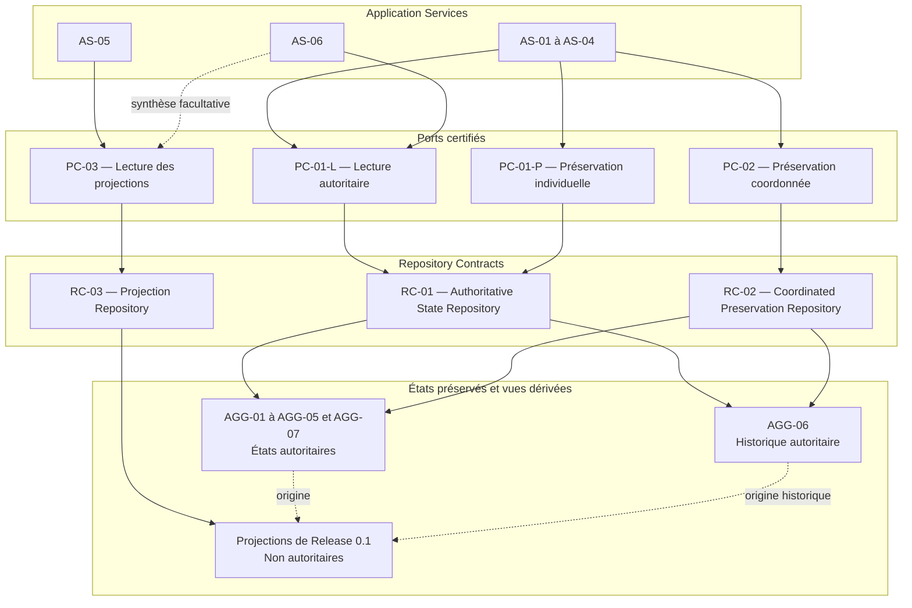

# Repository Contracts

## Purpose

Ce document définit les contrats conceptuels des Repository nécessaires à Release 0.1. Ces contrats réalisent les besoins exprimés par PC-01, PC-02 et PC-03 sans acquérir d'autorité métier et sans imposer de moyen de réalisation.

Ils établissent les opérations, garanties et échecs que toute réalisation devra respecter. Ils ne modifient ni les Aggregates, ni les invariants, ni les décisions de continuité, ni les contrats certifiés des Ports.

## Scope

Le périmètre couvre :

- la lecture et la préservation individuelle des états autoritaires d'AGG-01 à AGG-07 ;
- la préservation coordonnée des décisions reconnues complètes par DS-04 ;
- la lecture des quatre projections de Release 0.1 ;
- les garanties particulières d'AGG-05 et d'AGG-06 ;
- les catégories d'échec déjà définies par les Ports.

PC-04 reste différé. Aucun contrat de Repository n'est créé pour lui en Release 0.1.

## Principes

1. Un Repository réalise un besoin de Port ; il ne définit pas un besoin métier.
2. Un Repository ne reconnaît, ne corrige, ne complète et n'arbitre aucun état.
3. Un Repository reçoit uniquement des états déjà reconnus par leurs autorités métier.
4. Un Repository ne modifie aucun invariant et ne transforme aucun échec en succès.
5. Lecture autoritaire, préservation individuelle, préservation coordonnée et lecture dérivée restent séparées.
6. Un Repository ne devient pas une autorité sur les états qu'il manipule.
7. Un Repository ne dépend pas de la structure interne future d'un Aggregate.
8. Les contrats restent identiques lorsque leur réalisation change.
9. Une projection ne peut jamais alimenter une décision comme si elle était autoritaire.
10. L'Historique et le contenu documentaire conservent les garanties définies par leurs Aggregates.

## Identification des Repository Contracts

Trois contrats sont nécessaires.

### RC-01 — Authoritative State Repository

RC-01 réalise la famille PC-01 : lecture autoritaire par PC-01-L et préservation individuelle par PC-01-P. Il concerne AGG-01 à AGG-07 parce que PC-01 définit un contrat commun fondé sur la nature de l'intention, non un contrat différent pour chaque Aggregate.

RC-01 n'est pas universel : il exclut la préservation coordonnée, les projections, la diffusion de faits et toute décision métier.

### RC-02 — Coordinated Preservation Repository

RC-02 réalise PC-02. Il préserve comme un résultat métier indivisible un ensemble d'états déjà reconnus et déclaré complet par DS-04.

Son existence est justifiée par une garantie que RC-01 ne possède pas : aucun composant d'une décision inter-Aggregates ne peut être confirmé séparément comme résultat accompli.

RC-02 ne possède aucun état et ne décide pas quels composants doivent former l'ensemble. Il applique seulement la complétude reçue.

### RC-03 — Projection Repository

RC-03 réalise PC-03. Il restitue les synthèses, candidats de recherche et projections nécessaires à la consultation de Release 0.1.

Son existence est justifiée par la séparation obligatoire entre lecture autoritaire et lecture dérivée. RC-03 reste strictement en lecture et ne peut ni produire une décision métier, ni préserver un état autoritaire.

### Décisions de découpage

- Aucun Repository par Aggregate n'est justifié : PC-01 impose les mêmes intentions et garanties à AGG-01 jusqu'à AGG-07.
- Aucun Repository unique n'est justifié : les garanties de PC-01, PC-02 et PC-03 sont de natures incompatibles et doivent rester visibles.
- Aucun Repository spécifique à AGG-05 n'est créé : RC-01 porte la garantie de fidélité du contenu documentaire.
- Aucun Repository spécifique à AGG-06 n'est créé : RC-01 porte la lecture de la continuité et sa préservation autorisée, tandis que RC-02 protège toute continuité liée à une décision coordonnée.
- Aucun contrat n'est anticipé pour les capacités différées.

## RC-01 — Authoritative State Repository

### Mission

Établir l'existence d'une Aggregate Root, restituer son état autoritaire ou sa continuité historique, puis préserver individuellement un état déjà reconnu par une seule autorité métier.

### Ports réalisés

- PC-01-L — Lecture des états autoritaires ;
- PC-01-P — Préservation individuelle des états autoritaires.

### Aggregates concernés

AGG-01 à AGG-07. AGG-06 reste l'autorité de la continuité et AGG-05 reste propriétaire de son contenu.

### États manipulés

- identités métier ;
- existence ou absence reconnue ;
- états autoritaires complets ;
- références possédées par chaque Aggregate ;
- continuité historique d'AGG-06 ;
- contenu, contexte, provenance et rattachement d'AGG-05 ;
- continuité attendue avec l'état précédemment obtenu lors d'une préservation.

### Garanties

- l'identité demandée correspond exactement à l'état restitué ;
- absence, indisponibilité et état vide ne sont jamais confondus ;
- une lecture ne produit aucun effet ;
- aucune projection n'est substituée à une autorité absente ;
- seul un état déjà reconnu peut être préservé ;
- l'état reçu est préservé sans interprétation ni modification ;
- un état plus récent n'est jamais remplacé silencieusement ;
- toute absence de confirmation interdit de déclarer la préservation réussie ;
- AGG-05 est restitué et préservé avec son contenu intégral ;
- AGG-06 est restitué comme autorité et ses Changements antérieurs ne sont jamais réécrits.

### Échecs

- `PF-01` — Absence reconnue ;
- `PF-02` — Référence invalide ;
- `PF-03` — Indisponibilité ;
- `PF-04` — Impossibilité de préserver ;
- `PF-05` — Conflit avec un état plus récent ;
- `PF-08` — Violation d'une garantie de cohérence ;
- `PF-09` — Échec non classifiable.

`PF-01` constitue un résultat explicite pour une vérification d'existence. Il devient un échec seulement lorsque l'intention exige qu'une autorité existe.

### Responsabilités exclues

- décider de l'existence, de l'identité ou du contenu d'un Aggregate ;
- corriger ou enrichir un état ;
- fusionner deux identités ;
- arbitrer une Information ;
- reconstruire une autorité manquante ;
- garantir la complétude d'une décision inter-Aggregates ;
- produire ou interpréter une projection ;
- créer, rejouer ou interpréter un Domain Event.

## RC-02 — Coordinated Preservation Repository

### Mission

Préserver comme un résultat indivisible l'ensemble complet d'états reconnus par plusieurs Aggregates et qualifié complet par DS-04.

### Port réalisé

PC-02 — Préservation coordonnée.

### Aggregates concernés

Tout sous-ensemble d'AGG-01 à AGG-07 explicitement désigné par la décision source et DS-04. AGG-06 est inclus chaque fois que la continuité d'un Changement significatif fait partie du résultat.

### États manipulés

- identités des Aggregate Roots concernées ;
- états reconnus à préserver ;
- références nécessaires à leur cohérence ;
- état d'AGG-06 portant la continuité attendue ;
- conclusion de complétude de DS-04 ;
- continuité attendue avec les états autoritaires précédents.

### Garanties

- tous les composants déclarés nécessaires sont présents ;
- chaque état provient de son autorité métier ;
- les identités et références sont compatibles ;
- la conclusion de DS-04 n'est ni enrichie ni réinterprétée ;
- l'ensemble est confirmé intégralement ou produit un échec global ;
- aucune partie n'est présentée comme résultat accompli ;
- aucun composant plus récent n'est remplacé silencieusement ;
- les responsabilités des Aggregates restent distinctes après préservation.

### Échecs

- `PF-02` — Référence invalide ;
- `PF-03` — Indisponibilité ;
- `PF-04` — Impossibilité de préserver ;
- `PF-05` — Conflit avec un état plus récent ;
- `PF-08` — Violation d'une garantie de cohérence ou de complétude ;
- `PF-09` — Échec non classifiable.

### Responsabilités exclues

- déterminer si un Changement est significatif ;
- choisir les états qui doivent évoluer ;
- déclarer un ensemble complet à la place de DS-04 ;
- compléter un composant manquant ;
- corriger une référence ;
- convertir une réussite partielle en réussite globale ;
- remplacer la lecture ou la préservation individuelle de PC-01.

## RC-03 — Projection Repository

### Mission

Restituer des informations dérivées, traçables et explicitement non autoritaires pour la recherche et la consultation.

### Port réalisé

PC-03 — Lecture des projections.

### Aggregates concernés

AGG-01 à AGG-07 comme autorités sources selon la projection demandée. RC-03 ne les modifie et ne les possède jamais.

### États manipulés

- synthèse d'Inventaire ;
- candidats de recherche ;
- projection d'Article et de sa connaissance courante ;
- projection historique facultative ;
- provenance, fraîcheur, complétude et écarts connus de chaque projection.

### Garanties

- toute restitution est sans effet sur le Domaine ;
- chaque information reste reliée à une autorité source identifiable ;
- deux identités distinctes ne sont jamais fusionnées ;
- absence, inconnu, incertitude et contradiction restent distincts ;
- une projection indisponible n'est pas présentée comme vide ;
- une projection incomplète n'est pas présentée comme complète ;
- tout écart connu avec l'état autoritaire reste visible ;
- une projection historique ne remplace jamais AGG-06 ;
- le contenu documentaire est présenté fidèlement sans devenir l'autorité d'AGG-03.

### Échecs

- `PF-01` — Absence reconnue ;
- `PF-02` — Référence invalide ;
- `PF-03` — Indisponibilité ;
- `PF-06` — Projection indisponible ;
- `PF-07` — Projection incomplète ;
- `PF-08` — Violation d'une garantie de cohérence ;
- `PF-09` — Échec non classifiable.

### Responsabilités exclues

- modifier ou préserver un état autoritaire ;
- décider qu'une projection est vraie ;
- qualifier définitivement une correspondance à la place du Domaine ;
- arbitrer une contradiction ;
- compléter une information absente ;
- reconstruire le présent depuis une projection historique ;
- alimenter une décision d'Aggregate comme si la projection était autoritaire.

## Opérations conceptuelles

### ROP-01 — Établir l'existence d'une autorité

- **Intention :** déterminer si l'Aggregate Root désignée existe avant une décision qui en dépend.
- **Informations nécessaires :** identité métier et autorité attendue.
- **Informations retournées :** existence ou absence reconnue.
- **Garanties :** aucune création implicite ; absence et indisponibilité distinctes ; aucun effet.
- **Échecs :** `PF-02`, `PF-03`, `PF-09` ; `PF-01` exprime l'absence reconnue.
- **Port et Repository :** PC-01-L, RC-01.

### ROP-02 — Obtenir un état autoritaire

- **Intention :** restituer à une décision métier l'état détenu par l'Aggregate Root compétente.
- **Informations nécessaires :** identité métier et autorité demandée.
- **Informations retournées :** état autoritaire correspondant ou absence explicite.
- **Garanties :** correspondance exacte, fidélité, aucune projection substituée, aucun effet.
- **Échecs :** `PF-01`, `PF-02`, `PF-03`, `PF-08`, `PF-09`.
- **Port et Repository :** PC-01-L, RC-01.

### ROP-03 — Obtenir une continuité historique autoritaire

- **Intention :** consulter AGG-06 comme autorité du passé significatif d'un sujet.
- **Informations nécessaires :** identité du sujet et périmètre temporel reconnu par l'intention.
- **Informations retournées :** continuité historique autoritaire et références vers les états concernés.
- **Garanties :** ordre intelligible, origine traçable, aucune réécriture et aucune reconstruction du présent.
- **Échecs :** `PF-01`, `PF-02`, `PF-03`, `PF-08`, `PF-09`.
- **Port et Repository :** PC-01-L, RC-01.

### ROP-04 — Préserver un état reconnu

- **Intention :** rendre durable la décision d'une seule Aggregate Root lorsque DS-04 n'exige pas de résultat coordonné.
- **Informations nécessaires :** identité, état reconnu et continuité attendue avec l'état antérieur.
- **Informations retournées :** confirmation de préservation ou échec explicite.
- **Garanties :** état inchangé, autorité préservée, conflit récent visible, aucun faux succès.
- **Échecs :** `PF-02`, `PF-03`, `PF-04`, `PF-05`, `PF-08`, `PF-09`.
- **Port et Repository :** PC-01-P, RC-01.

### ROP-05 — Préserver une décision coordonnée

- **Intention :** rendre durable le résultat complet reconnu par plusieurs Aggregates et DS-04.
- **Informations nécessaires :** identités, états reconnus, références, continuité d'AGG-06 lorsqu'elle est requise, conclusion de complétude et états antérieurs attendus.
- **Informations retournées :** confirmation globale ou échec global.
- **Garanties :** complétude, cohérence, indivisibilité métier, absence de perte et de succès partiel.
- **Échecs :** `PF-02`, `PF-03`, `PF-04`, `PF-05`, `PF-08`, `PF-09`.
- **Port et Repository :** PC-02, RC-02.

### ROP-06 — Obtenir une synthèse d'Inventaire

- **Intention :** présenter le périmètre et les éléments d'un Inventaire sans transformer leur regroupement en autorité.
- **Informations nécessaires :** identité de l'Inventaire et périmètre de consultation.
- **Informations retournées :** synthèse traçable des Articles et de leur compréhension courante.
- **Garanties :** identités préservées, complétude annoncée, origines accessibles, lecture sans effet.
- **Échecs :** `PF-01`, `PF-02`, `PF-03`, `PF-06`, `PF-07`, `PF-08`, `PF-09`.
- **Port et Repository :** PC-03, RC-03.

### ROP-07 — Obtenir des candidats de recherche

- **Intention :** restituer les candidats correspondant aux critères déjà reconnus par le Use Case.
- **Informations nécessaires :** Inventaire concerné et critères métier admis.
- **Informations retournées :** candidats ou absence reconnue, avec disponibilité et complétude.
- **Garanties :** aucune identité fusionnée, aucun candidat inventé, qualification finale laissée au Domaine.
- **Échecs :** `PF-02`, `PF-03`, `PF-06`, `PF-07`, `PF-08`, `PF-09`.
- **Port et Repository :** PC-03, RC-03.

### ROP-08 — Obtenir une projection d'Article

- **Intention :** présenter ensemble l'identité, l'appartenance, la connaissance courante, les apports et la Documentation d'un Article.
- **Informations nécessaires :** identité de l'Article et Inventaire de consultation.
- **Informations retournées :** projection traçable conservant origine, incertitude, contradiction et absence.
- **Garanties :** aucune autorité transférée, aucun arbitrage, contenu documentaire fidèle, complétude visible.
- **Échecs :** `PF-01`, `PF-02`, `PF-03`, `PF-06`, `PF-07`, `PF-08`, `PF-09`.
- **Port et Repository :** PC-03, RC-03.

### ROP-09 — Obtenir une projection historique

- **Intention :** faciliter la navigation dans les Changements sans remplacer AGG-06.
- **Informations nécessaires :** sujet, périmètre temporel et intention de synthèse.
- **Informations retournées :** projection chronologique explicitement dérivée.
- **Garanties :** origine conservée, aucune réécriture, caractère facultatif et non autoritaire explicite.
- **Échecs :** `PF-01`, `PF-02`, `PF-03`, `PF-06`, `PF-07`, `PF-08`, `PF-09`.
- **Port et Repository :** PC-03, RC-03.

Ces opérations sont des intentions conceptuelles. Elles ne prescrivent aucune forme d'appel ni représentation des informations.

## Cohérence des préservations

### Préservation d'un Aggregate

RC-01 participe à la préservation d'un Aggregate uniquement après que sa Root a reconnu un état cohérent. ROP-04 préserve ensemble toutes les informations qui protègent les invariants de cet état : identité, propriétés exclusives, références possédées, incertitudes, conflits et contenu le cas échéant.

Une partie de l'état ne peut pas être confirmée indépendamment lorsque son absence changerait le sens de l'Aggregate.

### Préservation coordonnée

RC-02 est obligatoire lorsqu'une décision fait intervenir DS-04. ROP-05 reçoit l'ensemble complet déjà reconnu et applique les garanties de PC-02.

Les composants de cet ensemble ne sont pas préservés séparément par ROP-04 comme s'ils constituaient plusieurs réussites indépendantes. La confirmation porte sur l'ensemble ou l'échec porte sur l'ensemble.

RC-02 ne fusionne pas les Aggregates : leurs identités, états et autorités restent distincts au sein du résultat coordonné.

## Lecture des projections

RC-03 couvre exactement les quatre opérations de projection prévues par PC-03 : synthèse d'Inventaire, candidats de recherche, projection d'Article et projection historique.

Il est interdit :

- d'utiliser RC-03 pour vérifier une précondition autoritaire ;
- d'utiliser une projection comme état d'entrée d'une décision métier ;
- de masquer son indisponibilité, son ancienneté ou son incomplétude ;
- de corriger une autorité depuis une projection ;
- de préserver une projection comme si elle appartenait à un Aggregate.

Toute décision nécessitant l'état actuel d'une Aggregate Root utilise PC-01-L et RC-01.

## Historique

RC-01 restitue AGG-06 par ROP-03 et préserve uniquement un état d'Historique déjà reconnu. RC-02 inclut AGG-06 lorsqu'une décision significative exige une continuité coordonnée.

Aucune opération ne peut :

- modifier un Changement antérieur ;
- réordonner la continuité ;
- remplacer l'origine d'une décision ;
- calculer le passé depuis l'état courant ;
- reconstituer AGG-06 depuis des Domain Events ;
- substituer ROP-09 à ROP-03.

L'ajout d'une continuité reconnue produit un nouvel état autoritaire d'AGG-06. Il ne réécrit jamais les éléments antérieurs.

## Documentation

Le contenu documentaire appartient à AGG-05. RC-01 doit restituer et préserver ensemble :

- l'identité de la Documentation ;
- son contenu intégral ;
- son contexte ;
- son rattachement ;
- sa provenance ;
- ses références reconnues.

Une correction significative impliquant AGG-06 relève de RC-02 lorsque DS-04 en reconnaît la complétude.

RC-03 peut présenter le contenu dans une projection d'Article, mais ne peut ni le résumer comme remplacement, ni lui attribuer l'autorité d'AGG-03. Un contenu absent, altéré ou orphelin ne peut pas être présenté comme une Documentation complète.

## Matrice des Repository Contracts

| Repository | Ports réalisés | Aggregates | Opérations | Garanties dominantes |
| --- | --- | --- | --- | --- |
| RC-01 — Authoritative State Repository | PC-01-L, PC-01-P | AGG-01 à AGG-07 | ROP-01 à ROP-04 | Correspondance d'identité, fidélité, lecture sans effet, préservation individuelle confirmée, conflit visible, AGG-05 complet, AGG-06 non réécrit |
| RC-02 — Coordinated Preservation Repository | PC-02 | Sous-ensemble explicite d'AGG-01 à AGG-07 selon DS-04 | ROP-05 | Complétude reçue, cohérence des références, indivisibilité métier, confirmation ou échec global |
| RC-03 — Projection Repository | PC-03 | AGG-01 à AGG-07 comme sources uniquement | ROP-06 à ROP-09 | Lecture seule, traçabilité, non-autorité, disponibilité, fraîcheur, complétude et écarts visibles |

## Matrice de réalisation des Ports

| Port | Repository | Responsabilités réalisées | Échecs reconnus |
| --- | --- | --- | --- |
| PC-01-L | RC-01 | Existence, état autoritaire, continuité d'AGG-06, absence explicite | `PF-01`, `PF-02`, `PF-03`, `PF-08`, `PF-09` |
| PC-01-P | RC-01 | Préservation individuelle d'un état déjà reconnu, continuité attendue, confirmation explicite | `PF-02`, `PF-03`, `PF-04`, `PF-05`, `PF-08`, `PF-09` |
| PC-02 | RC-02 | Préservation indivisible d'un ensemble déclaré complet par DS-04 | `PF-02`, `PF-03`, `PF-04`, `PF-05`, `PF-08`, `PF-09` |
| PC-03 | RC-03 | Synthèses, recherche et projections traçables en lecture | `PF-01`, `PF-02`, `PF-03`, `PF-06`, `PF-07`, `PF-08`, `PF-09` |

## Diagramme conceptuel

Les flèches vers les états expriment les responsabilités des contrats. Elles ne transfèrent aucune autorité aux Repository.

## Risques

| Risque | Cause | Impact | Prévention |
| --- | --- | --- | --- |
| Repository devenant métier | Une opération commence à arbitrer, corriger ou compléter un état | Autorité déplacée hors des Aggregates et invariants contournés | Accepter uniquement des états déjà reconnus et retourner des résultats sans interprétation métier |
| Repository universel | Lecture, préservation coordonnée et projections sont regroupées par commodité | Garanties incompatibles masquées et responsabilités confondues | Maintenir RC-01, RC-02 et RC-03 séparés par nature de Port |
| Repository par Aggregate sans justification | Le découpage reproduit mécaniquement AGG-01 à AGG-07 | Multiplication de contrats équivalents et dépendance inutile à la structure actuelle | Utiliser RC-01 commun tant que les intentions et garanties de PC-01 restent identiques |
| Lecture utilisée comme autorité | RC-03 alimente une décision d'Aggregate | Décision fondée sur un état dérivé, ancien ou incomplet | Réserver PC-01-L et RC-01 aux préconditions autoritaires |
| Écriture hors contrat | Un état est modifié ou confirmé sans PC-01-P ou PC-02 | Préservation non traçable, conflit récent masqué ou succès partiel | Toute préservation passe par ROP-04 ou ROP-05 et exige une confirmation explicite |
| Duplication des responsabilités | RC-01 et RC-02 confirment séparément les composants d'une même décision | Plusieurs résultats incompatibles pour une seule intention | Lorsque DS-04 intervient, réserver la confirmation globale à RC-02 |
| Historique réécrit | Une opération remplace ou réordonne des Changements antérieurs | Rupture de continuité et présent inexplicable | Autoriser seulement la préservation d'un nouvel état reconnu d'AGG-06 et vérifier l'absence d'altération |
| Documentation dégradée | Le contenu est dissocié de son contexte ou remplacé par une vue dérivée | Perte de sens et violation de l'autorité d'AGG-05 | Préserver l'état complet par RC-01 ou RC-02 et limiter RC-03 à une restitution fidèle |

## Contrôles de préparation

- Les besoins de PC-01-L et PC-01-P sont entièrement réalisés par RC-01.
- La garantie inter-Aggregates de PC-02 est isolée dans RC-02.
- Les quatre projections de PC-03 sont couvertes par RC-03.
- Les neuf opérations conceptuelles correspondent aux opérations OP-01 à OP-09 du Port Design.
- AGG-05 conserve son contenu autoritaire sans contrat spécifique redondant.
- AGG-06 reste non réinscriptible et distinct de sa projection historique.
- Aucun Repository ne prend de décision métier ou ne dépend d'un choix de réalisation.
- Aucun besoin de Release 0.1 ne justifie un quatrième Repository Contract.

## Conclusion

**READY FOR PERSISTENCE IMPLEMENTATION**

RC-01, RC-02 et RC-03 réalisent respectivement l'accès individuel aux autorités, la préservation coordonnée et la lecture des projections. Leurs neuf opérations couvrent les besoins certifiés des Ports, conservent les autorités d'AGG-01 à AGG-07 et rendent explicites les garanties propres à AGG-05 et AGG-06.

Plusieurs réalisations peuvent désormais satisfaire ces contrats sans modifier leurs missions, leurs garanties, leurs échecs ou les décisions de l'architecture certifiée.
