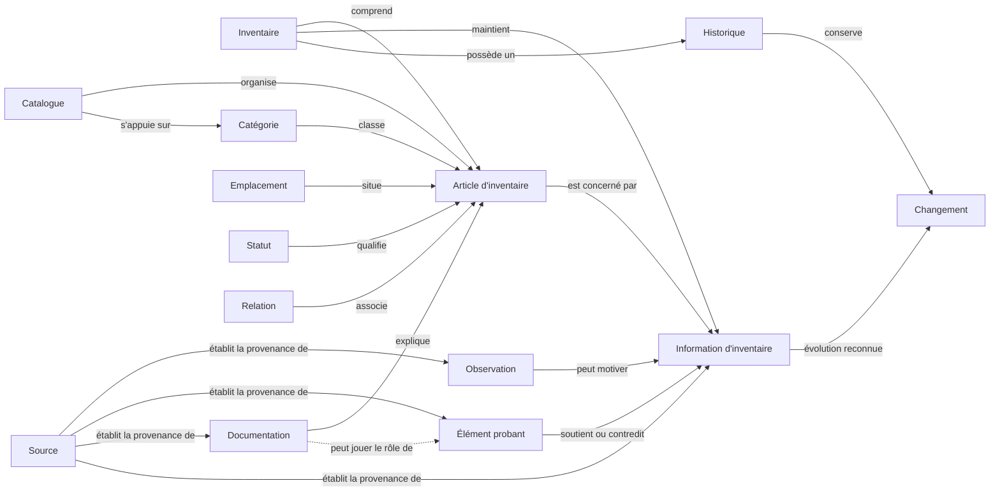

# Blueprint du domaine Inventaire

Ce document décrit le domaine métier d'Inventaire. Il précise le sens, les responsabilités et les frontières de ses objets fondamentaux, sans définir leur représentation technique.

## Vision du domaine

### Qu'est-ce qu'un inventaire ?

Un Inventaire est une connaissance organisée, délimitée et maintenue à propos d'un ensemble de biens réels. Il établit quels biens relèvent du périmètre considéré et rassemble ce qui permet de les reconnaître, de les situer et de comprendre leur contexte.

Un Inventaire n'est ni l'ensemble physique des biens ni la réalité elle-même. Il en constitue une représentation explicite, maintenue à partir d'Observations, de Sources, d'Éléments probants, de Documentation et de décisions humaines.

### Pourquoi existe-t-il ?

Un inventaire existe pour préserver une compréhension partagée de biens qui ne peut pas reposer durablement sur la seule mémoire. Il rend cette connaissance consultable, explicable et transmissible.

### Quels problèmes résout-il ?

- L'incertitude sur ce qui appartient réellement à un ensemble de biens.
- La difficulté à retrouver un article ou à comprendre son contexte.
- La dispersion des observations, documents et éléments probants.
- La perte d'information lorsque le temps passe ou que les personnes changent.
- La confusion entre ce qui est constaté, supposé, documenté ou encore inconnu.
- L'absence d'explication sur les évolutions de la connaissance de l'inventaire.

### Quels résultats produit-il ?

- Une vue délimitée et compréhensible des articles inventoriés.
- Une connaissance consultable de leur identité, de leur situation et de leur état.
- Une organisation cohérente facilitant leur découverte.
- Une distinction explicite entre information étayée, information incertaine et information inconnue.
- Une continuité permettant de comprendre les changements significatifs dans le temps.

### Quelles sont ses limites ?

- Il décrit la réalité connue sans garantir que cette connaissance est complète ou définitive.
- Il ne remplace ni l'observation directe ni le jugement de l'utilisateur.
- Il ne transforme pas une hypothèse ou un document en vérité par leur seule présence.
- Il ne définit pas un mode de classement universel valable pour tous les usages.
- Il ne couvre pas la gestion générale d'une organisation, sa comptabilité, ses achats ou sa logistique.
- Il ne présume pas de la manière dont ses informations seront présentées ou conservées.

## Objets métier fondamentaux

Les termes français constituent le langage produit canonique. Les libellés anglais assurent uniquement la traçabilité.

### Inventaire — Inventory

#### Purpose

Délimiter et maintenir la connaissance relative à un ensemble de biens réels.

#### Responsibility

Porter le périmètre, la connaissance acceptée, les incertitudes explicites et la cohérence d'ensemble des Articles d'inventaire.

#### Interactions

L'Inventaire comprend des Articles d'inventaire, maintient des Informations d'inventaire, peut être organisé par des Catalogues et conserve un Historique des Changements significatifs.

#### Hors Scope

Les biens réels eux-mêmes, leur possession juridique, leur valeur comptable, les achats et la conduite générale des opérations.

### Article d'inventaire — Inventory Item

#### Purpose

Représenter, dans un Inventaire déterminé, une unité de gestion que l'utilisateur reconnaît comme distincte.

#### Responsibility

Préserver l'identité métier et la connaissance utile d'un bien individuel ou d'un ensemble volontairement géré comme indivisible.

#### Interactions

Un Article appartient à un seul Inventaire à un instant donné. Après son inclusion, sa connaissance peut évoluer par des Observations, Informations, Éléments probants, Documentation, Emplacements, Statuts et Relations sans changer son identité. L'archivage préserve cette identité ; la réactivation la reprend. Un transfert ou une décomposition produit de nouvelles représentations tout en conservant la continuité dans l'Historique.

#### Hors Scope

Sa représentation technique, l'appartenance simultanée à plusieurs Inventaires et toute supposition automatique sur sa nature, sa granularité ou son usage.

### Information d'inventaire

#### Purpose

Exprimer un énoncé contextualisé conservé à propos d'un Inventaire ou d'un Article d'inventaire.

#### Responsibility

Porter l'unité de connaissance susceptible d'être explicitement retenue, contestée ou remplacée, avec une Source identifiable.

#### Interactions

Une Information peut être motivée par une Observation, soutenue ou contredite par des Éléments probants et expliquée par de la Documentation. Les Informations actuellement retenues constituent la connaissance acceptée ; leur évolution significative produit un Changement conservé dans l'Historique.

#### Hors Scope

Se confondre avec un constat, une justification, un document, un Statut synthétique ou une vérité indépendante de son contexte.

### Observation

#### Purpose

Consigner ce qui a été constaté à propos de l'Inventaire ou d'un Article d'inventaire dans un contexte donné.

#### Responsibility

Préserver un constat et sa Source sans le présenter, à lui seul, comme une Information acceptée ou une vérité définitive.

#### Interactions

Une Observation porte sur un objet du domaine, peut motiver une Information d'inventaire et peut conduire à reconnaître un Changement après arbitrage explicite.

#### Hors Scope

La décision automatique, l'interprétation définitive et la garantie d'exactitude.

### Source

#### Purpose

Identifier l'origine d'une Observation, d'une Information d'inventaire, d'un Élément probant ou d'une Documentation.

#### Responsibility

Établir la provenance nécessaire à la traçabilité sans attribuer automatiquement exactitude ou autorité.

#### Interactions

Une même Source peut être associée à plusieurs éléments. Chaque élément conserve sa propre responsabilité et peut recevoir une appréciation différente malgré une origine commune.

#### Hors Scope

Prouver une affirmation, décider de la connaissance retenue ou remplacer le contenu dont elle indique l'origine.

### Élément probant — Evidence

#### Purpose

Donner un fondement identifiable à une Information d'inventaire ou à l'interprétation d'une Observation.

#### Responsibility

Permettre d'évaluer pourquoi une Information est soutenue, nuancée ou contestée, sans décider de son acceptation.

#### Interactions

Un Élément probant possède une Source et une relation explicite avec ce qu'il soutient ou contredit. Une Observation ou une Documentation peut jouer ce rôle dans un contexte déterminé. Plusieurs Éléments probants peuvent soutenir des conclusions différentes.

#### Hors Scope

La preuve absolue, la décision à la place de l'utilisateur et la suppression de toute incertitude.

### Documentation

#### Purpose

Expliquer et préserver la connaissance utile à la compréhension de l'Inventaire et de ses Articles d'inventaire.

#### Responsibility

Rassembler un contenu intelligible, doté d'une Source, replacé dans son contexte et distingué de l'objet qu'il décrit.

#### Interactions

La Documentation décrit des objets du domaine et contribue à rendre leur Historique compréhensible. Lorsqu'elle est explicitement utilisée pour soutenir ou contredire une Information, elle joue également le rôle d'Élément probant pour cette relation précise.

#### Hors Scope

Faire autorité par sa seule existence, remplacer les biens décrits ou garantir la validité permanente de son contenu.

### Relation — Relationship

#### Purpose

Exprimer une association métier significative entre des objets du domaine.

#### Responsibility

Préserver le sens d'un lien nécessaire à la compréhension de l'inventaire.

#### Interactions

Une Relation relie notamment des Articles d'inventaire ou les replace dans un contexte commun. Elle peut préserver la continuité entre des représentations appartenant à des Inventaires distincts du même contexte, être expliquée par de la Documentation et évoluer par un Changement.

#### Hors Scope

Déduire automatiquement une dépendance, une propriété, une hiérarchie ou une causalité qui n'a pas été explicitement établie.

### Emplacement — Location

#### Purpose

Situer un Article d'inventaire dans un lieu ou un contexte reconnu par l'utilisateur.

#### Responsibility

Exprimer où un article est attendu ou a été observé, tout en permettant à l'incertitude de rester visible.

#### Interactions

Un Emplacement situe des Articles d'inventaire. Une Observation peut confirmer ou contester cette situation, et un déplacement reconnu constitue un Changement.

#### Hors Scope

La surveillance en temps réel, la preuve de présence permanente et la définition d'un système universel de localisation.

### Statut — Status

#### Purpose

Exprimer un état métier significatif retenu à un moment donné pour un objet du domaine.

#### Responsibility

Rendre cet état compréhensible sans masquer son contexte, son niveau d'incertitude ni son évolution possible.

#### Interactions

Un Statut qualifie notamment un Article d'inventaire. Il synthétise des Informations retenues, peut être réévalué à partir d'Observations et son évolution peut être conservée comme un Changement dans l'Historique.

#### Hors Scope

Les états purement techniques, les conclusions implicites et l'idée qu'un statut résume toute la connaissance disponible.

### Catégorie — Category

#### Purpose

Exprimer un regroupement de sens partagé entre des Articles d'inventaire.

#### Responsibility

Faciliter la compréhension et la découverte des articles selon une distinction utile aux utilisateurs.

#### Interactions

Une Catégorie classe des Articles d'inventaire et peut contribuer à l'organisation proposée par un Catalogue.

#### Hors Scope

Imposer une classification universelle, définir à elle seule l'identité d'un article ou remplacer le périmètre de l'Inventaire.

### Catalogue — Catalog

#### Purpose

Offrir une organisation cohérente des Articles d'inventaire pour un besoin de consultation déterminé.

#### Responsibility

Présenter une lecture organisée de l'inventaire sans modifier son périmètre ni l'identité de ses articles.

#### Interactions

Un Catalogue organise des Articles d'inventaire et peut s'appuyer sur des Catégories. Plusieurs Catalogues peuvent proposer des lectures différentes d'un même Inventaire.

#### Hors Scope

Déterminer ce qui appartient à l'Inventaire, devenir une copie concurrente de ses Informations ou imposer une organisation unique.

### Historique — History

#### Purpose

Préserver la compréhension des évolutions significatives de l'Inventaire et de ses objets.

#### Responsibility

Relier les Changements dans le temps afin d'expliquer comment les Informations actuellement retenues ont été obtenues.

#### Interactions

L'Historique conserve des Changements concernant notamment les Articles, leur identité, leur appartenance, leurs Informations, leurs Emplacements, leurs Statuts ou leurs Relations, avec le contexte disponible.

#### Hors Scope

Enregistrer toute activité indistinctement, constituer un journal technique ou garantir qu'aucun événement réel n'a été omis.

### Changement — Change

#### Purpose

Exprimer une évolution reconnue de la réalité inventoriée ou de la connaissance acceptée à son sujet.

#### Responsibility

Rendre explicite ce qui a évolué et préserver le sens de cette évolution.

#### Interactions

Un Changement peut résulter d'une Observation et d'un arbitrage, affecter une Information ou un autre objet du domaine et être conservé dans l'Historique. Il ne supprime pas les Sources, Éléments probants ou Documentation qui expliquent l'état antérieur.

#### Hors Scope

Les opérations techniques, les variations sans signification métier et la réécriture silencieuse du passé.

## Diagramme conceptuel

Le diagramme représente des proximités et responsabilités métier. Il ne prescrit ni structure, ni cardinalité, ni enchaînement obligatoire.

