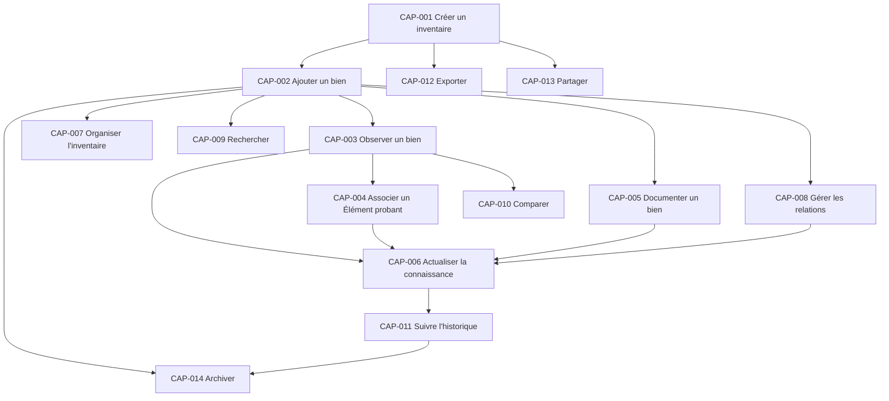

# Capacités produit

Ce document décrit ce qu'un utilisateur doit pouvoir accomplir avec Inventaire. Une capacité exprime un résultat métier durable : elle ne présume ni de sa forme, ni de son parcours d'utilisation, ni de sa réalisation technique.

Les invariants cités renvoient à `22_DOMAIN_INVARIANTS.md`, qui reste la référence des règles métier. La présence d'une capacité dans ce document ne détermine pas la version dans laquelle elle sera disponible.

## Capacités fondamentales

### CAP-001 — Créer un inventaire

- **Nom :** Créer un inventaire.
- **Objectif :** établir un périmètre dans lequel la connaissance relative à un ensemble de biens réels sera maintenue comme un tout cohérent.
- **Valeur apportée à l'utilisateur :** disposer d'un contexte explicite pour savoir quels biens relèvent de la connaissance maintenue et dans quel but.
- **Objets métier concernés :** Inventaire, Article d'inventaire, Historique.
- **Pourquoi elle existe :** aucune connaissance d'article ne peut être interprétée correctement sans périmètre d'appartenance.
- **Quand elle est utilisée :** lorsqu'un utilisateur commence un nouvel ensemble d'inventaire ou sépare des périmètres ayant des finalités distinctes.
- **Invariants à respecter :** `INV-EXI-001`, `INV-TRA-001`, `INV-COH-002`.
- **Hors Scope :** décider automatiquement quels biens inclure, définir une structure technique ou imposer un mode universel d'inventaire.

### CAP-002 — Ajouter un bien

- **Nom :** Ajouter un bien à l'inventaire.
- **Objectif :** reconnaître explicitement une unité de gestion distincte comme Article d'inventaire appartenant à un seul Inventaire.
- **Valeur apportée à l'utilisateur :** rendre le bien visible et lui associer progressivement une connaissance fiable.
- **Objets métier concernés :** Inventaire, Article d'inventaire, Information d'inventaire, Source, Observation, Historique.
- **Pourquoi elle existe :** un bien doit être distingué et inclus avant que sa connaissance puisse être organisée durablement.
- **Quand elle est utilisée :** lorsqu'un bien individuel ou un ensemble volontairement indivisible entre dans le périmètre, ou lorsqu'une telle unité déjà présente est reconnue pour la première fois.
- **Invariants à respecter :** `INV-ID-001`, `INV-ID-002`, `INV-EXI-001`, `INV-TRA-001`.
- **Hors Scope :** inventer les Informations manquantes, déduire l'identité à la place de l'utilisateur ou représenter simultanément la même unité active dans plusieurs Inventaires.

### CAP-003 — Observer un bien

- **Nom :** Observer un bien.
- **Objectif :** préserver un constat contextualisé et sa Source à propos d'un Article d'inventaire ou de sa situation.
- **Valeur apportée à l'utilisateur :** distinguer ce qui a réellement été constaté de ce qui est supposé ou accepté comme interprétation.
- **Objets métier concernés :** Article d'inventaire, Information d'inventaire, Source, Observation, Emplacement, Statut, Élément probant.
- **Pourquoi elle existe :** la connaissance de l'inventaire doit pouvoir évoluer à partir de la réalité observée.
- **Quand elle est utilisée :** lors d'une inspection, d'une vérification, d'une découverte ou lorsqu'un constat antérieur doit être reconsidéré.
- **Invariants à respecter :** `INV-TRA-001`, `INV-OBS-001`, `INV-OBS-002`, `INV-LOC-001`, `INV-COH-002`.
- **Hors Scope :** convertir automatiquement un constat en Information retenue, garantir son exactitude ou imposer une méthode d'observation.

### CAP-004 — Associer un Élément probant

- **Nom :** Associer un élément probant.
- **Objectif :** relier un Élément probant doté d'une Source à l'Information ou à l'interprétation d'Observation qu'il soutient, nuance ou contredit.
- **Valeur apportée à l'utilisateur :** comprendre sur quoi repose une information et apprécier son niveau de confiance.
- **Objets métier concernés :** Élément probant, Source, Information d'inventaire, Observation, Documentation, Article d'inventaire.
- **Pourquoi elle existe :** une affirmation explicable est plus durable et plus facile à réexaminer qu'une affirmation sans origine.
- **Quand elle est utilisée :** lorsqu'un élément disponible apporte un appui, une nuance ou une contradiction explicite à une Information existante.
- **Invariants à respecter :** `INV-TRA-001`, `INV-EVD-001`, `INV-EVD-002`, `INV-EVD-003`.
- **Hors Scope :** déclarer automatiquement une Information vraie, hiérarchiser universellement les Éléments probants ou supprimer les éléments contradictoires.

### CAP-005 — Documenter un bien

- **Nom :** Documenter un bien.
- **Objectif :** préserver une explication utile, contextualisée et dotée d'une Source concernant un Article d'inventaire.
- **Valeur apportée à l'utilisateur :** retrouver la connaissance nécessaire sans dépendre de la mémoire ou de sources dispersées.
- **Objets métier concernés :** Documentation, Source, Article d'inventaire, Élément probant, Relation, Historique.
- **Pourquoi elle existe :** l'identification seule ne suffit pas toujours à comprendre un bien, son contexte ou les raisons d'une interprétation.
- **Quand elle est utilisée :** lorsqu'une information explicative mérite d'être conservée, reliée au bien ou transmise.
- **Invariants à respecter :** `INV-TRA-001`, `INV-DOC-001`, `INV-COH-002`.
- **Hors Scope :** faire d'un document une vérité ou un Élément probant automatique, remplacer l'Observation du bien ou imposer une forme documentaire.

### CAP-006 — Actualiser la connaissance

- **Nom :** Actualiser la connaissance d'un bien.
- **Objectif :** faire évoluer explicitement les Informations retenues à propos d'un Article d'inventaire lorsque la connaissance disponible le justifie.
- **Valeur apportée à l'utilisateur :** disposer d'un état courant compréhensible sans perdre les raisons ni les états antérieurs.
- **Objets métier concernés :** Article d'inventaire, Information d'inventaire, Observation, Élément probant, Documentation, Emplacement, Statut, Changement, Historique.
- **Pourquoi elle existe :** la réalité et sa compréhension évoluent ; un inventaire utile doit pouvoir refléter ces évolutions sans réécrire silencieusement le passé.
- **Quand elle est utilisée :** après un nouveau constat, un arbitrage, un déplacement, une requalification ou toute évolution métier significative.
- **Invariants à respecter :** `INV-TRA-001`, `INV-HIS-001`, `INV-CHG-001`, `INV-STA-001`, `INV-COH-001`, `INV-COH-002`.
- **Hors Scope :** retenir une Information sans arbitrage, modifier sans trace, résoudre automatiquement les conflits ou enregistrer des variations dépourvues de signification métier.

## Capacités d'organisation

### CAP-007 — Organiser un inventaire

- **Nom :** Organiser un inventaire.
- **Objectif :** proposer des lectures cohérentes des Articles d'inventaire au moyen de Catalogues et de Catégories utiles.
- **Valeur apportée à l'utilisateur :** parcourir et comprendre l'inventaire selon des regroupements adaptés à ses besoins.
- **Objets métier concernés :** Inventaire, Article d'inventaire, Catalogue, Catégorie.
- **Pourquoi elle existe :** un inventaire devient difficile à consulter lorsque ses articles ne disposent d'aucune organisation intelligible.
- **Quand elle est utilisée :** lorsqu'un utilisateur souhaite regrouper, classer ou présenter les articles selon un sens partagé.
- **Invariants à respecter :** `INV-ID-002`, `INV-CAT-001`, `INV-COH-001`.
- **Hors Scope :** modifier le périmètre de l'Inventaire, imposer une classification unique ou confondre classement et identité.

### CAP-008 — Gérer les relations

- **Nom :** Gérer les relations entre objets du domaine.
- **Objectif :** exprimer et faire évoluer des associations métier dont le sens est explicite, y compris celles qui préservent une continuité entre Inventaires.
- **Valeur apportée à l'utilisateur :** comprendre les liens utiles entre des biens et leur contexte sans devoir les déduire.
- **Objets métier concernés :** Relation, Article d'inventaire, Documentation, Changement, Historique.
- **Pourquoi elle existe :** certains biens ne peuvent être compris correctement lorsqu'ils sont considérés isolément.
- **Quand elle est utilisée :** lorsqu'une association apporte une information durable ou lorsqu'un lien existant évolue.
- **Invariants à respecter :** `INV-REL-001`, `INV-REL-002`, `INV-CHG-001`, `INV-HIS-001`.
- **Hors Scope :** créer une implication cachée, déduire une causalité ou imposer une taxonomie universelle des relations.

## Capacités de consultation et d'analyse

### CAP-009 — Rechercher

- **Nom :** Rechercher dans un inventaire.
- **Objectif :** retrouver les Articles d'inventaire et la connaissance pertinente à partir d'une intention compréhensible par l'utilisateur.
- **Valeur apportée à l'utilisateur :** réduire le temps nécessaire pour répondre à une question sur ce qui existe et ce qui est connu.
- **Objets métier concernés :** Inventaire, Article d'inventaire, Catalogue, Catégorie, Emplacement, Statut, Documentation.
- **Pourquoi elle existe :** une connaissance qui ne peut pas être retrouvée au moment utile perd l'essentiel de sa valeur.
- **Quand elle est utilisée :** lorsqu'un utilisateur cherche un bien précis, explore un besoin ou vérifie une information.
- **Invariants à respecter :** `INV-ID-001`, `INV-EXI-001`, `INV-COH-001`, `INV-COH-002`.
- **Hors Scope :** inventer des correspondances, masquer l'incertitude, modifier la connaissance ou prescrire une technique de recherche.

### CAP-010 — Comparer

- **Nom :** Comparer des biens ou des connaissances.
- **Objectif :** mettre en regard des Articles d'inventaire, Observations ou Informations afin d'en comprendre les ressemblances, différences et contradictions.
- **Valeur apportée à l'utilisateur :** soutenir une appréciation éclairée sans confondre similarité et identité.
- **Objets métier concernés :** Article d'inventaire, Observation, Élément probant, Documentation, Statut, Catégorie.
- **Pourquoi elle existe :** distinguer des biens proches ou évaluer des informations concurrentes nécessite une vue comparative explicite.
- **Quand elle est utilisée :** lors d'une identification, d'un arbitrage, d'un choix ou de l'examen d'informations contradictoires.
- **Invariants à respecter :** `INV-ID-001`, `INV-OBS-002`, `INV-EVD-002`, `INV-EVD-003`, `INV-COH-001`.
- **Hors Scope :** décider à la place de l'utilisateur, déclarer deux biens identiques par similarité ou transformer une comparaison en preuve.

### CAP-011 — Suivre l'historique

- **Nom :** Suivre l'historique d'un inventaire ou d'un bien.
- **Objectif :** comprendre les Changements significatifs qui ont conduit à la connaissance actuelle.
- **Valeur apportée à l'utilisateur :** expliquer une évolution, retrouver un état antérieur et apprécier la continuité des informations.
- **Objets métier concernés :** Historique, Changement, Inventaire, Article d'inventaire, Information d'inventaire, Source, Emplacement, Statut, Relation.
- **Pourquoi elle existe :** l'état courant est insuffisant lorsque l'utilisateur doit comprendre pourquoi une information a changé.
- **Quand elle est utilisée :** lors d'une vérification, d'un désaccord, d'une comparaison temporelle ou d'un besoin d'explication.
- **Invariants à respecter :** `INV-TRA-001`, `INV-HIS-001`, `INV-CHG-001`.
- **Hors Scope :** enregistrer toute activité indistinctement, constituer une surveillance ou réécrire les états antérieurs.

## Capacités de continuité et de diffusion

### CAP-012 — Exporter

- **Nom :** Exporter la connaissance d'un inventaire.
- **Objectif :** obtenir une restitution cohérente et délimitée des informations que l'utilisateur choisit de sortir du contexte actif du produit.
- **Valeur apportée à l'utilisateur :** conserver, transférer ou exploiter sa connaissance sans dépendre d'un seul contexte d'utilisation.
- **Objets métier concernés :** Inventaire et les objets du domaine compris dans le périmètre exporté.
- **Pourquoi elle existe :** une connaissance durable doit pouvoir être restituée sans perdre son sens ni son contexte essentiel.
- **Quand elle est utilisée :** pour préserver une copie intelligible, transmettre un périmètre ou poursuivre un usage ailleurs.
- **Invariants à respecter :** `INV-TRA-001`, `INV-EVD-003`, `INV-DOC-001`, `INV-COH-001`, `INV-COH-002`.
- **Hors Scope :** définir un format, garantir les capacités du contexte destinataire ou transformer une restitution en nouvelle autorité concurrente.

### CAP-013 — Partager

- **Nom :** Partager la connaissance d'un inventaire.
- **Objectif :** rendre une compréhension délimitée de l'Inventaire accessible à d'autres personnes sans en altérer le sens.
- **Valeur apportée à l'utilisateur :** permettre une consultation commune et réduire la dépendance à une connaissance individuelle.
- **Objets métier concernés :** Inventaire, Article d'inventaire, Information d'inventaire, Source, Documentation, Élément probant, Catalogue, Historique.
- **Pourquoi elle existe :** les petites équipes ont besoin d'une compréhension commune, explicable et cohérente.
- **Quand elle est utilisée :** lorsqu'une autre personne doit consulter, vérifier ou comprendre tout ou partie de l'inventaire.
- **Invariants à respecter :** `INV-TRA-001`, `INV-EVD-002`, `INV-DOC-001`, `INV-COH-001`, `INV-COH-002`.
- **Hors Scope :** définir des rôles, des autorisations, un canal de diffusion ou transférer implicitement l'autorité sur la connaissance.

### CAP-014 — Archiver

- **Nom :** Archiver un Article d'inventaire ou un Inventaire.
- **Objectif :** retirer un Article ou un Inventaire de l'usage courant tout en préservant son identité, sa connaissance et son Historique.
- **Valeur apportée à l'utilisateur :** conserver un inventaire actuel sans effacer la mémoire des biens ou périmètres qui ne sont plus actifs.
- **Objets métier concernés :** Inventaire, Article d'inventaire, Information d'inventaire, Source, Statut, Changement, Historique, Documentation, Relation.
- **Pourquoi elle existe :** la sortie de l'usage courant ne doit pas être confondue avec l'absence passée ou justifier la perte de connaissance.
- **Quand elle est utilisée :** lorsqu'un bien ou un inventaire n'est plus actif, tout en restant pertinent pour la continuité et la traçabilité.
- **Invariants à respecter :** `INV-EXI-002`, `INV-TRA-001`, `INV-HIS-001`, `INV-CHG-001`, `INV-CAT-001`.
- **Hors Scope :** supprimer l'existence historique, transférer implicitement un Article vers un autre Inventaire, définir une durée de conservation ou décider automatiquement qu'un objet doit être archivé.

## Cartographie des capacités

Une flèche indique qu'une capacité utilise un contexte métier établi par une autre capacité. Elle ne représente ni un parcours obligatoire, ni un ordre d'exécution, ni une dépendance technique.

## Frontières et questions ouvertes

Les capacités établissent des résultats utilisateur, mais laissent volontairement ouverts :

- le contenu minimal nécessaire pour considérer un Inventaire ou un Article d'inventaire comme utilisable ;
- le niveau de confiance relatif des Éléments probants qui peuvent être associés ;
- les dimensions selon lesquelles une comparaison est pertinente ;
- le périmètre de connaissance inclus lors d'un partage ou d'un export ;
- la distinction future entre consultation partagée et contribution partagée ;
- les critères détaillés distinguant transfert, décomposition et correction d'identité ;
- la capacité à traiter plusieurs Inventaires comme un ensemble de consultation ;
- la répartition de ces capacités entre les futures versions du produit.

Ces questions ne modifient ni le sens des capacités ni les invariants applicables. Elles devront être arbitrées avant de détailler les Features correspondantes.
