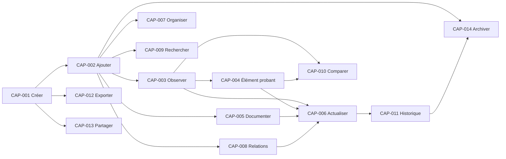

# Périmètre fonctionnel des Releases

Ce document définit les paliers de valeur fonctionnelle visés pour Inventaire. Il ne fixe ni calendrier, ni ordre de développement, ni solution de réalisation.

Les périmètres sont cumulatifs : une Release conserve les capacités des Releases précédentes et ajoute un ensemble cohérent. Lorsqu'une Release officielle sera préparée, sa Release Specification devra adopter un périmètre explicite ; elle deviendra alors la source canonique du Scope de cette Release.

## Principes de découpage

- Chaque Release doit permettre un usage réel et autonome dans son périmètre.
- Une capacité incluse est disponible comme capacité produit, même si son utilisation reste facultative dans un inventaire particulier.
- Une capacité exclue est volontairement différée et ne doit pas être simulée.
- Les invariants du domaine s'appliquent à toutes les Releases, indépendamment des capacités disponibles.
- Une Release plus riche ne doit pas invalider la connaissance créée avec une Release antérieure.

## Release 0.1 — Premier produit utilisable

### Objectif

Permettre à une personne de constituer un inventaire simple, d'y reconnaître des biens, de faire évoluer leur connaissance et de les retrouver sans perdre la trace des changements significatifs.

### Valeur utilisateur

L'utilisateur peut remplacer une connaissance dispersée ou mémorielle par un inventaire limité mais fiable, consultable et durablement compréhensible.

### Capacités incluses

- `CAP-001` — Créer un inventaire.
- `CAP-002` — Ajouter un bien.
- `CAP-003` — Observer un bien.
- `CAP-005` — Documenter un bien.
- `CAP-006` — Actualiser la connaissance.
- `CAP-009` — Rechercher.
- `CAP-011` — Suivre l'historique.

### Capacités exclues

- `CAP-004` — Associer un Élément probant.
- `CAP-007` — Organiser un inventaire.
- `CAP-008` — Gérer les relations.
- `CAP-010` — Comparer.
- `CAP-012` — Exporter.
- `CAP-013` — Partager.
- `CAP-014` — Archiver.

### Justification

Ce périmètre contient le cycle de valeur minimal : délimiter, inclure, constater, expliquer, actualiser, retrouver et comprendre l'évolution. Retirer l'une de ces capacités empêcherait soit de constituer l'inventaire, soit de lui faire confiance, soit d'en tirer une valeur pratique.

Les capacités exclues enrichissent la fiabilité, l'organisation, l'analyse ou la diffusion, mais ne sont pas indispensables pour qu'une personne gère un premier inventaire de taille limitée.

La traçabilité reste obligatoire en 0.1 : toute Information retenue possède une Source identifiable. Une Observation directe, une Documentation contextualisée ou un arbitrage explicite peut établir cette provenance sans proposer encore l'association complémentaire d'un Élément probant.

### Pourquoi chaque capacité apparaît à cette étape

- **Créer un inventaire** établit le périmètre sans lequel aucun article ne peut être interprété.
- **Ajouter un bien** produit la première connaissance concrète de ce qui appartient à ce périmètre.
- **Observer un bien** permet d'ancrer la connaissance dans des constats contextualisés.
- **Documenter un bien** préserve les explications qui ne peuvent pas rester dans la seule mémoire.
- **Actualiser la connaissance** maintient l'inventaire utile lorsque la compréhension ou la réalité évolue.
- **Rechercher** transforme la connaissance conservée en information retrouvable au moment nécessaire.
- **Suivre l'historique** empêche l'actualisation de devenir une réécriture silencieuse du passé.

## Release 0.5 — Produit utilisable au quotidien

### Objectif

Permettre un usage régulier sur un inventaire qui grandit, évolue et nécessite davantage de justification, d'organisation et de continuité.

### Valeur utilisateur

L'utilisateur peut maintenir un inventaire vivant dans le temps, comprendre les liens entre ses biens, traiter les sorties de l'usage courant et conserver une restitution indépendante de son contexte actif.

### Capacités incluses

- `CAP-001` — Créer un inventaire.
- `CAP-002` — Ajouter un bien.
- `CAP-003` — Observer un bien.
- `CAP-004` — Associer un Élément probant.
- `CAP-005` — Documenter un bien.
- `CAP-006` — Actualiser la connaissance.
- `CAP-007` — Organiser un inventaire.
- `CAP-008` — Gérer les relations.
- `CAP-009` — Rechercher.
- `CAP-011` — Suivre l'historique.
- `CAP-012` — Exporter.
- `CAP-014` — Archiver.

Les nouvelles capacités par rapport à la Release 0.1 sont `CAP-004`, `CAP-007`, `CAP-008`, `CAP-012` et `CAP-014`.

### Capacités exclues

- `CAP-010` — Comparer.
- `CAP-013` — Partager.

### Justification

L'usage quotidien fait apparaître des besoins absents d'un petit inventaire initial : justifier une information au-delà d'un constat direct, parcourir un volume croissant, exprimer les liens utiles, retirer proprement les éléments inactifs et préserver la continuité hors du contexte courant.

La comparaison structurée et le partage sont différés car ils supposent une connaissance suffisamment riche, cohérente et stable pour éviter de diffuser ou de rapprocher des informations mal interprétées.

### Pourquoi chaque capacité apparaît à cette étape

- **Associer un Élément probant** devient nécessaire lorsque des Informations doivent être soutenues, nuancées ou contredites explicitement dans la durée, au-delà de leur simple provenance.
- **Organiser un inventaire** maintient sa lisibilité lorsque le nombre et la diversité des articles augmentent.
- **Gérer les relations** restitue le contexte des biens qui ne peuvent plus être compris isolément.
- **Exporter** garantit que la connaissance quotidienne peut être restituée sans dépendre d'un seul contexte d'usage.
- **Archiver** permet de conserver un inventaire actuel sans effacer les biens ou périmètres sortis de l'usage courant.

## Release 1.0 — Produit complet selon la vision actuelle

### Objectif

Offrir l'ensemble cohérent des capacités actuellement reconnues comme nécessaires pour constituer, comprendre, analyser, préserver et partager un inventaire.

### Valeur utilisateur

Une personne ou une petite équipe peut utiliser Inventaire comme référence durable, depuis l'observation initiale d'un bien jusqu'à l'analyse et au partage d'une connaissance explicitement contextualisée.

### Capacités incluses

- `CAP-001` — Créer un inventaire.
- `CAP-002` — Ajouter un bien.
- `CAP-003` — Observer un bien.
- `CAP-004` — Associer un Élément probant.
- `CAP-005` — Documenter un bien.
- `CAP-006` — Actualiser la connaissance.
- `CAP-007` — Organiser un inventaire.
- `CAP-008` — Gérer les relations.
- `CAP-009` — Rechercher.
- `CAP-010` — Comparer.
- `CAP-011` — Suivre l'historique.
- `CAP-012` — Exporter.
- `CAP-013` — Partager.
- `CAP-014` — Archiver.

### Capacités exclues

Aucune capacité approuvée dans `23_PRODUCT_CAPABILITIES.md` n'est exclue. Toute capacité future reste hors Scope tant qu'une décision produit ne l'a pas admise et affectée à une Release.

### Justification

La Release 1.0 matérialise la vision actuelle sans prétendre rendre le produit définitivement exhaustif. Elle complète le socle quotidien par l'analyse comparative et la diffusion d'une compréhension commune, deux usages qui exigent des fondations sémantiques et historiques stabilisées.

### Pourquoi chaque capacité apparaît à cette étape

Les capacités des Releases 0.1 et 0.5 conservent les responsabilités justifiées à leurs étapes respectives.

- **Comparer** apparaît lorsque l'Inventaire possède suffisamment d'Articles, d'Observations et d'Éléments probants pour rendre les rapprochements utiles sans confondre similarité et identité.
- **Partager** apparaît lorsque la connaissance, ses incertitudes et son historique peuvent être transmis sans perdre leur sens ni créer une autorité concurrente.

## Dépendances entre capacités

Une dépendance indique qu'une capacité a besoin d'un contexte métier produit par une autre. Elle ne représente pas une séquence d'utilisation ni un plan de développement.

### Dépendances structurantes

- Créer un inventaire précède toute capacité portant sur son contenu.
- Ajouter un bien établit l'objet nécessaire à l'observation, à la documentation, à l'organisation, aux relations, à la recherche et à l'archivage.
- Actualiser la connaissance s'appuie sur des constats ou explications et rend l'historique nécessaire.
- Comparer devient pleinement pertinent avec des Observations et des Éléments probants distinguables.
- Archiver dépend d'une connaissance identifiable et d'une continuité historique suffisante.
- Exporter et partager dépendent d'un Inventaire délimité ; ils ne dépendent pas l'un de l'autre.

## Capacités indispensables et capacités optionnelles

### Strictement indispensables

Pour tout premier produit utilisable, les capacités `CAP-001`, `CAP-002`, `CAP-003`, `CAP-005`, `CAP-006`, `CAP-009` et `CAP-011` sont indissociables. Elles constituent le minimum fonctionnel de la Release 0.1.

Pour qualifier une Release 0.5 ou 1.0, toutes les capacités déclarées incluses dans son Scope sont également obligatoires. Une capacité incluse ne peut pas être remplacée par une promesse ou une simulation.

### Optionnelles selon l'usage

Associer un Élément probant, organiser, créer des Relations, comparer, exporter, partager ou archiver ne sont pas des actions nécessaires pour chaque Article d'inventaire. Leur usage dépend du contexte réel de l'utilisateur.

Cette utilisation contextuelle ne rend pas leur disponibilité optionnelle dans une Release qui les inclut. Une capacité est soit comprise dans le Scope de la Release, soit explicitement exclue.

## Questions ouvertes

- Quel minimum de connaissance rend un Article d'inventaire suffisamment utilisable dans la Release 0.1 ?
- Quelle connaissance doit obligatoirement accompagner un export pour en préserver le sens ?
- Le partage de la Release 1.0 couvre-t-il seulement la consultation ou également la contribution à une connaissance commune ?
- Quelles conditions distinguent l'archivage d'un article, sa sortie du périmètre et son existence devenue incertaine ?
- Quelles dimensions de comparaison apportent une valeur générale sans imposer une interprétation métier particulière ?

Ces questions devront être fermées dans les spécifications de Release ou dans les travaux produit concernés, sans modifier les invariants déjà établis.
