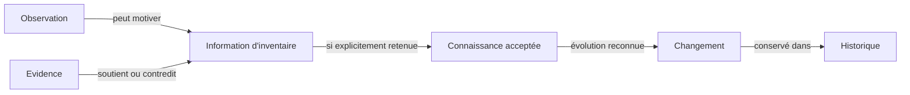

# Domain Semantic Decisions

**Status :** Accepted

Ce document formalise les décisions sémantiques nécessaires pour stabiliser le domaine Inventaire. Il ne remplace pas les documents produit existants : il fournit la base explicite de leur future mise en cohérence.

Les termes français sont les termes produit canoniques. Les libellés anglais sont conservés comme équivalents de traçabilité.

## DSD-001 — Définition d'Inventory

### Contexte

Le langage ubiquitaire définit actuellement l'Inventaire comme un ensemble de biens, tandis que le Blueprint du domaine le décrit comme une connaissance organisée à propos de ces biens. Cette divergence confond la réalité observée et sa représentation dans le produit.

### Options étudiées

1. **Inventory comme ensemble réel de biens.** L'Inventory serait la collection physique elle-même ; la connaissance conservée ne serait qu'une représentation secondaire.
2. **Inventory comme liste de représentations.** L'Inventory serait uniquement une collection d'Inventory Items, sans responsabilité explicite sur le sens ou la cohérence de leur connaissance.
3. **Inventory comme connaissance délimitée.** L'Inventory serait l'ensemble organisé et maintenu des connaissances relatives à un périmètre explicite de biens réels.

### Décision retenue

Un **Inventaire — Inventory** est une connaissance organisée, délimitée et maintenue à propos d'un ensemble de biens réels.

Il porte :

- le périmètre des biens dont la connaissance relève de cet Inventaire ;
- la cohérence des Articles d'inventaire qui les représentent ;
- la connaissance actuellement retenue et les incertitudes explicites ;
- la continuité permettant d'expliquer les évolutions significatives.

L'Inventaire n'est ni l'ensemble physique des biens, ni une simple liste, ni la garantie que sa connaissance est complète. Les biens existent indépendamment de lui ; l'Inventaire exprime ce que l'utilisateur connaît et retient à leur sujet dans un périmètre donné.

### Justification

Cette définition est la seule qui rende cohérents les principes « la réalité avant sa représentation », « l'inconnu reste inconnu » et la traçabilité de la connaissance. Elle explique également pourquoi deux Inventaires peuvent décrire des périmètres différents sans prétendre modifier la réalité.

### Conséquences

- L'appartenance à un Inventaire est une appartenance au périmètre de connaissance, pas une déclaration de propriété juridique.
- Une erreur dans l'Inventaire ne modifie pas le bien réel ; elle modifie seulement la connaissance retenue.
- Un Inventaire vide reste un Inventaire valide dès lors que son périmètre est explicite.
- Le terme « ensemble de biens » doit être réservé à la réalité concernée, pas utilisé comme définition complète de l'Inventaire.
- Les Catalogues restent des lectures organisées d'un Inventaire et ne définissent pas son périmètre.

### Documents impactés

- `README.md`
- `00_PRODUCT_VISION.md`
- `20_UBIQUITOUS_LANGUAGE.md`
- `21_INVENTORY_DOMAIN.md`
- `22_DOMAIN_INVARIANTS.md`
- `23_PRODUCT_CAPABILITIES.md`
- `25_USER_EXPERIENCE.md`
- `40_ARCHITECTURE_VISION.md`
- `50_DECISIONS.md`

## DSD-002 — Définition d'Inventory Item

### Contexte

Les invariants exigent qu'un Inventory Item soit distinct et conserve son identité lorsque sa Location, son Status, sa Category ou sa Documentation évolue. La granularité, l'appartenance à plusieurs Inventaires et le cycle de vie conceptuel restaient toutefois ouverts.

### Options étudiées

1. **Toujours un bien physique individuel.** Chaque Article d'inventaire représenterait exactement un objet individuel, même lorsque l'utilisateur ne souhaite gérer qu'un ensemble.
2. **Une quantité homogène sans identité propre.** Un Article pourrait seulement représenter une catégorie et une quantité, sans continuité individuelle.
3. **Une unité de gestion explicitement choisie.** Un Article représenterait un bien individuel ou un ensemble volontairement géré comme une seule unité, avec une identité stable dans un Inventaire déterminé.
4. **Une identité globale partagée par plusieurs Inventaires.** Le même Article appartiendrait simultanément à plusieurs Inventaires.

### Décision retenue

Un **Article d'inventaire — Inventory Item** est la représentation, dans un Inventaire déterminé, d'une unité de gestion que l'utilisateur reconnaît comme distincte et dont il souhaite maintenir la connaissance dans le temps.

#### Identité

L'identité métier exprime la continuité de la même unité de gestion au sein du même Inventaire. Elle est validée par l'utilisateur et ne dépend pas uniquement d'un nom, d'une Location, d'un Status, d'une Category, d'un Catalog, d'une Documentation ou d'une Evidence.

Un futur identifiant de réalisation pourra aider à référencer l'Article, mais il ne définira pas à lui seul son identité métier.

#### Granularité

L'unité de gestion peut être :

- un bien individuel, lorsque sa distinction apporte une valeur durable ;
- un ensemble de biens, lorsque l'utilisateur choisit explicitement de le gérer comme une unité indivisible et que distinguer ses membres n'apporte pas de valeur dans ce contexte.

Un même bien ne doit pas être simultanément représenté comme membre actif d'un ensemble et comme Article individuel dans le même Inventaire. Si un ensemble est décomposé, l'Article représentant l'ensemble cesse d'être actif, de nouveaux Articles sont reconnus et la continuité reste expliquée dans l'Historique.

#### Appartenance

Un Article d'inventaire appartient à un seul Inventaire à un instant donné. Les vues alternatives du même périmètre sont exprimées par des Catalogues et des Catégories, pas par une appartenance multiple.

Un transfert vers un autre Inventaire met fin à l'appartenance active dans l'Inventaire d'origine et crée une nouvelle représentation dans l'Inventaire de destination. La continuité entre les deux représentations doit rester explicable par une Relation et leur Historique lorsque les deux Inventaires relèvent du même contexte produit.

Deux contextes autonomes peuvent décrire séparément le même bien réel ; leurs Articles ne sont pas considérés identiques sans arbitrage explicite.

#### Cycle de vie conceptuel

1. **Avant inclusion :** un bien réel n'est pas encore un Article d'inventaire.
2. **Inclusion :** l'utilisateur reconnaît une unité distincte et l'inclut explicitement dans un Inventaire.
3. **Vie active :** la connaissance, la Location, le Status, les Relations et la Documentation peuvent évoluer sans changer l'identité de l'Article.
4. **Archivage :** l'Article quitte l'usage courant, mais son identité, sa connaissance et son Historique sont préservés.
5. **Réactivation :** un Article archivé peut revenir à l'usage courant sans recevoir une nouvelle identité métier.
6. **Transfert, décomposition ou correction :** les anciennes représentations ne sont pas réécrites ni réutilisées silencieusement ; la transition reste expliquée par des Changements et l'Historique.

La suppression sans trace n'appartient pas au cycle de vie métier normal.

### Justification

L'unité de gestion concilie les besoins d'un inventaire d'objets individuels et ceux d'un inventaire de lots sans imposer une précision inutile. L'appartenance unique limite les conflits d'autorité et permet aux Catalogues de remplir leur rôle de vues multiples. Le cycle non destructif respecte les invariants d'identité, de traçabilité et d'Historique.

### Conséquences

- La quantité ne définit pas à elle seule un Article ; elle dépend du choix de granularité.
- Fusionner, séparer ou transférer des Articles constitue un Changement métier significatif.
- Archiver n'efface ni l'existence passée ni la connaissance associée.
- Les doublons doivent être arbitrés comme des conflits d'identité, pas simplement masqués.
- Les Relations peuvent préserver une continuité entre des représentations successives ou appartenant à des Inventaires distincts du même contexte.

### Documents impactés

- `20_UBIQUITOUS_LANGUAGE.md`
- `21_INVENTORY_DOMAIN.md`
- `22_DOMAIN_INVARIANTS.md`
- `23_PRODUCT_CAPABILITIES.md`
- `24_RELEASE_SCOPE.md`
- `25_USER_EXPERIENCE.md`
- `50_DECISIONS.md`

## DSD-003 — Siège de la connaissance acceptée

### Contexte

Observation, Evidence, Documentation, Status, Change et History décrivent différents aspects de la connaissance. Aucun objet du Blueprint ne portait explicitement l'énoncé que l'utilisateur retient comme compréhension actuelle. Le concept `Information d'inventaire` existe cependant déjà dans le langage ubiquitaire.

### Options étudiées

1. **Faire d'Observation la connaissance acceptée.** Tout constat deviendrait immédiatement la compréhension courante.
2. **Faire de Status le conteneur de la connaissance.** Le Status résumerait tout ce qui est retenu à propos d'un Article.
3. **Créer un nouveau concept de Claim ou de Knowledge.** Un nouvel objet porterait chaque affirmation acceptée.
4. **Stabiliser Information d'inventaire.** Le concept existant porterait l'énoncé conservé ; son acceptation explicite déterminerait s'il appartient à la connaissance courante.

### Décision retenue

Aucun nouveau concept n'est créé.

Une **Information d'inventaire** est un énoncé contextualisé conservé à propos d'un Inventaire ou d'un Article d'inventaire. Lorsqu'elle est explicitement retenue par l'utilisateur comme compréhension courante, elle participe à la **connaissance acceptée** de l'Inventaire.

La connaissance acceptée n'est pas un objet métier supplémentaire. Elle est l'ensemble des Informations d'inventaire actuellement retenues, accompagné des incertitudes et conflits qui doivent rester visibles.

Chaque responsabilité reste distincte :

- **Observation :** préserve ce qui a été constaté dans un contexte ; elle peut motiver une Information d'inventaire mais ne l'impose pas.
- **Evidence :** soutient ou contredit une Information d'inventaire ou l'interprétation d'une Observation ; elle n'accepte aucune conclusion.
- **Information d'inventaire :** porte l'énoncé susceptible d'être retenu, contesté ou remplacé.
- **Status :** synthétise un état métier déterminé ; il ne remplace pas les Informations qui l'expliquent.
- **Changement :** exprime l'évolution reconnue d'une Information retenue, d'un état ou d'une autre responsabilité métier.
- **Historique :** conserve la continuité des Changements et permet de comprendre les connaissances antérieures ; il n'est pas le siège de la connaissance courante.

Le mouvement conceptuel est le suivant, sans constituer une séquence obligatoire :

### Justification

`Information d'inventaire` possède déjà la responsabilité sémantique nécessaire. La stabiliser évite un synonyme et sépare correctement constat, justification, énoncé retenu et continuité temporelle. La connaissance acceptée reste une vue conceptuelle de l'état courant, non une nouvelle abstraction à gouverner.

### Conséquences

- Toute connaissance acceptée doit être exprimable comme Information d'inventaire et avoir une Source identifiable.
- Une Observation nouvelle ne remplace jamais automatiquement une Information retenue.
- Des Evidence contradictoires peuvent coexister autour d'une même Information.
- Un arbitrage modifiant la connaissance retenue produit un Changement compréhensible dans l'Historique.
- Une Information insuffisamment fondée reste incertaine ou contestée ; elle n'est pas promue silencieusement.
- Le Blueprint du domaine devra intégrer Information d'inventaire parmi ses objets fondamentaux existants.

### Documents impactés

- `10_PRODUCT_PRINCIPLES.md`
- `20_UBIQUITOUS_LANGUAGE.md`
- `21_INVENTORY_DOMAIN.md`
- `22_DOMAIN_INVARIANTS.md`
- `23_PRODUCT_CAPABILITIES.md`
- `24_RELEASE_SCOPE.md`
- `25_USER_EXPERIENCE.md`
- `40_ARCHITECTURE_VISION.md`
- `50_DECISIONS.md`

## DSD-004 — Responsabilités de Source, Evidence et Documentation

### Contexte

Source appartient au langage initial. Evidence et Documentation appartiennent au Blueprint du domaine. Leur relation n'établissait pas clairement si un document est une preuve, si une preuve est une source ou si ces termes sont interchangeables.

### Options étudiées

1. **Fusionner les trois concepts.** Tout contenu associé à un Article serait à la fois Source, Evidence et Documentation.
2. **Les rendre mutuellement exclusifs.** Un même élément ne pourrait remplir qu'une seule responsabilité.
3. **Distinguer les responsabilités et autoriser les rôles contextuels.** Chaque concept répondrait à une question différente ; un même élément pourrait remplir plusieurs rôles seulement lorsque chaque relation est explicite.

### Décision retenue

Les trois concepts restent distincts.

#### Source — « D'où cela vient-il ? »

Une **Source** est l'origine identifiable d'une Observation, d'une Information d'inventaire, d'une Evidence ou d'une Documentation.

Elle établit la provenance. Elle n'est ni une garantie d'exactitude, ni un élément probant par nature, ni le contenu explicatif lui-même. Une origine connue peut être peu fiable ; une origine inconnue rend l'information insuffisamment traçable.

#### Evidence — « Sur quoi cette appréciation repose-t-elle ? »

Une **Evidence — Élément probant** est un élément identifiable explicitement utilisé pour soutenir, nuancer ou contredire une Information d'inventaire ou l'interprétation d'une Observation.

Elle possède une Source et une relation explicite avec ce qu'elle permet d'évaluer. Elle n'est ni une vérité, ni une décision, ni nécessairement un document. Une Observation ou une Documentation peut jouer le rôle d'Evidence dans un contexte déterminé, mais ce rôle doit être explicite.

#### Documentation — « Qu'est-ce qui permet de comprendre durablement ? »

Une **Documentation** est un contenu conservé pour expliquer un Inventaire, un Article d'inventaire ou un élément de leur contexte.

Elle possède une Source. Elle n'est pas automatiquement une Evidence et ne fait pas autorité par sa seule présence. Lorsqu'une Documentation est explicitement utilisée pour soutenir ou contredire une Information, elle joue également le rôle d'Evidence pour cette relation précise.

#### Relations retenues

- Toute Observation, Evidence, Documentation ou Information retenue doit avoir une Source identifiable.
- Une Source peut être commune à plusieurs éléments sans leur conférer la même fiabilité.
- Une Evidence doit toujours préciser ce qu'elle soutient, nuance ou contredit.
- Une Documentation peut expliquer sans prouver.
- Un même élément peut être Documentation et Evidence, mais ces responsabilités ne se confondent pas.
- La présence d'une Source ou d'une Evidence ne remplace jamais l'arbitrage explicite de la connaissance retenue.

### Justification

Cette séparation donne une réponse stable à trois besoins distincts : provenance, justification et compréhension. Autoriser les rôles contextuels reflète la réalité sans créer de copies ni déclarer qu'un document est toujours probant.

### Conséquences

- La Release 0.1 peut respecter la traçabilité sans proposer la capacité complète d'association d'Evidence : une Observation ou une Documentation contextualisée possède déjà une Source.
- La capacité Evidence de la Release 0.5 ajoute la justification explicite d'une Information, pas sa simple provenance.
- L'expérience doit distinguer l'origine d'une information de ce qui la soutient.
- Les conflits entre Evidence restent visibles même lorsque leurs Sources sont connues.
- La Documentation n'est jamais promue automatiquement en connaissance acceptée.

### Documents impactés

- `20_UBIQUITOUS_LANGUAGE.md`
- `21_INVENTORY_DOMAIN.md`
- `22_DOMAIN_INVARIANTS.md`
- `23_PRODUCT_CAPABILITIES.md`
- `24_RELEASE_SCOPE.md`
- `25_USER_EXPERIENCE.md`
- `50_DECISIONS.md`

## Concepts stabilisés

- Inventaire — Inventory
- Article d'inventaire — Inventory Item
- Information d'inventaire
- Observation
- Source
- Evidence — Élément probant
- Documentation
- Status — Statut
- Change — Changement
- History — Historique
- Catalog — Catalogue
- Category — Catégorie
- Relationship — Relation

## Concepts ajoutés

Aucun.

`Information d'inventaire` existait déjà dans le langage ubiquitaire. La présente décision lui attribue la responsabilité qui manquait dans le Blueprint du domaine. « Connaissance acceptée » désigne l'ensemble des Informations actuellement retenues ; ce n'est pas un concept métier autonome.

## Ordre de mise en cohérence recommandé

1. Mettre à jour le langage ubiquitaire avec les définitions canoniques et les équivalents terminologiques.
2. Aligner le Blueprint du domaine et son diagramme.
3. Ajuster les invariants d'identité, d'existence, de traçabilité, d'Evidence, de Documentation, de Changement et d'Historique.
4. Aligner les capacités, les périmètres de Release et les parcours UX.
5. Mettre à jour les résumés et la vision d'architecture sans y dupliquer les règles métier.
6. Enregistrer les décisions dans le registre produit.
7. Réévaluer les constats P0 sémantiques dans une Readiness Review.

## Préparation à l'architecture technique

Les décisions sémantiques PDR-001 à PDR-004 sont résolues au niveau décisionnel. L'architecture technique n'est toutefois **pas encore prête à commencer**.

Les documents canoniques doivent d'abord être alignés sur ces décisions. Les autres blocages P0 de la Product Design Review restent également ouverts : réconciliation de la Roadmap, décision sur Import, Acceptance Criteria de la Release 0.1 et définition des qualités produit qui devront guider l'architecture.
