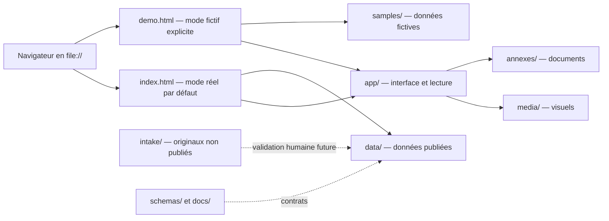

# Architecture

> **Statut documentaire : spécification spécialisée.** Ce document décrit l'architecture générale dans le cadre du [Scope canonique](02_SCOPE.md). Les décisions acceptées du [registre ADR canonique](15_DECISIONS.md) prévalent sur toute formulation descriptive et toute évolution structurante doit y être enregistrée avant de modifier cette architecture.

## Vue d'ensemble

AtelierCatalog V1 est une application statique sans build. `index.html` charge CSS, données JavaScript réelles puis modules applicatifs par balises `<script>` relatives. Elle fonctionne directement sous `file://` : aucun `fetch()` n'est utilisé pour les collections principales, car son comportement sur fichiers locaux varie selon les navigateurs.

`demo.html` est un second point d'entrée explicite réservé au développement. Il charge les structures équivalentes de `samples/`, dans un espace de noms séparé, et affiche en permanence une bannière de démonstration. `index.html` reste le comportement par défaut ; aucun choix mémorisé ni paramètre caché ne peut le basculer en mode fictif.

## Responsabilités et frontières

- `app/css` définit la présentation ; `app/js` orchestre, lit les collections et rend l'UI.
- `data` expose `window.AtelierCatalogData` avec `catalogs`, `inventory`, `locations` et `projects`. Ces fichiers sont une représentation de publication V1, pas le modèle métier lui-même.
- `samples` expose les quatre mêmes collections dans `window.AtelierCatalogSampleData`. Seul `demo.html` charge cet espace de noms ; aucune donnée fictive n'est copiée ou fusionnée avec le réel.
- `media` et `annexes` stockent les actifs publiés ; `intake` conserve les entrants avant décision ; `samples` reste hors données réelles.
- `schemas` décrit les structures fondamentales sans imposer toutes les catégories ; `docs` porte les règles ; `tests` les vérifications ; `tools` accueillera des aides optionnelles.

Les composants UI ne contiennent aucune donnée métier. Ils reçoivent des collections et traitent les notes comme du texte. Les identifiants, relations et concepts documentés doivent survivre à un changement de stockage.

## Pourquoi sans framework

La surface initiale est petite ; HTML, CSS et JavaScript natifs réduisent dépendances, build, risques d'obsolescence et contraintes de déplacement. Cette décision pourra être réévaluée si la complexité mesurée de l'interface l'exige sans sacrifier l'ouverture locale.

## Migration future

Une couche de lecture isole le consommateur UI de la représentation globale. Une future source JSON, IndexedDB, SQLite, API locale, application desktop ou administration peut implémenter le même modèle et générer les fichiers publiés. La migration doit prévoir version de schéma, validation, sauvegarde, conversion déterministe et retour arrière ; aucune de ces solutions n'est introduite maintenant.

## Limites connues

Les scripts globaux ne permettent pas l'édition transactionnelle, le contrôle d'accès, les requêtes complexes ni la concurrence. De gros catalogues augmenteront temps de chargement et mémoire. Les règles de sécurité `file://` et l'ouverture des annexes varient selon le navigateur.

## Architecture invariants

- aucune ressource distante obligatoire ;
- aucun chemin absolu ;
- aucune donnée métier codée dans les composants UI ;
- aucune dépendance à l'emplacement physique du dossier ;
- aucune donnée d'exemple dans l'inventaire réel ;
- mode réel chargé par défaut et mode fictif activé uniquement par `demo.html` ;
- aucun chargement simultané des espaces de noms réel et fictif ;
- aucune modification automatique des originaux dans `intake/` ;
- aucun serveur, build ou framework obligatoire en V1 ;
- scripts de données chargés avant les scripts applicatifs.
