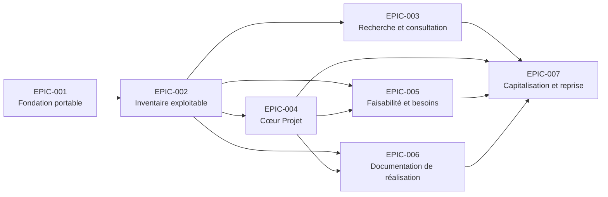

# Roadmap

> **Autorité documentaire : canonique pour la planification.** Ce document est l'unique registre des Epics et possède leurs identifiants, leurs noms, leur ordre et leurs statuts. Il organise la réalisation du [Scope canonique](02_SCOPE.md), sans le modifier, et respecte la [Vision](product/30_PRODUCT_VISION.md) ainsi que les [décisions d'architecture](15_DECISIONS.md). Aucun autre document ne peut créer, renommer, renuméroter ou redéfinir une Epic.

Chaque Epic possède exactement un des statuts suivants : `Planned`, `In Progress`, `Completed` ou `Deferred`. Les Features ci-dessous regroupent uniquement des Stories et responsabilités déjà documentées ; leur réorganisation ne crée, ne supprime et ne modifie aucune capacité. La présence d'un élément dans la Roadmap ne suffit pas à déclarer sa disponibilité.

## Parcours V1

La planification suit désormais le parcours utilisateur : connaître le matériel, retrouver un article, préparer un projet, vérifier sa faisabilité, documenter sa réalisation puis retrouver les connaissances acquises. L'inventaire constitue la fondation ; le projet organise la valeur produite à partir de cette fondation.

Les capacités d'intelligence générative, de reconnaissance automatique, de synchronisation avec des boutiques, d'estimation automatique des prix et de collaboration multi-utilisateurs restent hors V1. Elles ne sont affectées à aucune Epic V1.

## Ordre recommandé de développement

| Ordre | Epic | Résultat utilisateur | Statut |
| --- | --- | --- | --- |
| 1 | EPIC-001 — Fondation portable | Ouvrir une base locale fiable et transportable. | Completed |
| 2 | EPIC-002 — Inventaire exploitable | Connaître, reconnaître et localiser son matériel. | In Progress |
| 3 | EPIC-003 — Recherche et consultation | Retrouver rapidement un article pertinent. | In Progress |
| 4 | EPIC-004 — Cœur Projet | Créer un projet et lui associer les composants utilisés. | Planned |
| 5 | EPIC-005 — Faisabilité et besoins | Distinguer immédiatement le disponible du manquant. | Planned |
| 6 | EPIC-006 — Documentation de réalisation | Réunir les schémas, photos et documents du projet. | Planned |
| 7 | EPIC-007 — Capitalisation et reprise | Retrouver les composants, projets et documents liés. | Planned |
| Après V1 | EPIC-008 à EPIC-010 | Capacités différées sans effet sur le parcours V1. | Deferred |

EPIC-003 peut avancer dès que le catalogue minimal d'EPIC-002 est disponible. Après EPIC-004, EPIC-005 et EPIC-006 peuvent être réalisées indépendamment ; EPIC-007 les réunit dans le parcours de consultation final.

## Dépendances entre Epics

Les Epics différées dépendent d'un modèle V1 stabilisé, mais aucune Epic V1 ne dépend d'elles.

## Traçabilité du Scope V1

Les identifiants renvoient exclusivement au [Scope canonique](02_SCOPE.md). Cette matrice n'en reproduit aucune exigence et attribue chaque identifiant V1 à une seule Epic.

| Epic | Scope IDs | V1 | Statut |
| --- | --- | --- | --- |
| EPIC-001 | S-001, S-002, S-022, S-023, S-035 | Oui | Completed |
| EPIC-002 | S-003, S-005, S-006, S-009, S-012, S-014, S-016 à S-021, S-024 à S-026, S-032, S-034, S-036, S-037 | Oui | In Progress |
| EPIC-003 | S-004, S-007, S-008, S-027 à S-030 | Oui | In Progress |
| EPIC-004 | S-015 | Oui | Planned |
| EPIC-005 | S-013 | Oui | Planned |
| EPIC-006 | S-010, S-011, S-031 | Oui | Planned |
| EPIC-007 | S-033, S-038 | Oui | Planned |
| EPIC-008 | HV1-014, HV1-015 | Non | Deferred |
| EPIC-009 | HV1-013 | Non | Deferred |
| EPIC-010 | HV1-016 à HV1-018 | Non | Deferred |
| Aucune Epic planifiée | HV1-001 à HV1-012, HV1-019 à HV1-022 | Non | — |

## EPIC-001 — Fondation portable

**Status: Completed.**

**Objectif produit.** Fournir un socle local, portable et honnête sur son état.

**Valeur utilisateur.** L'atelier peut être ouvert, copié et consulté sans dépendance extérieure.
**Features contenues.**

- **EPIC-001-F01 — Socle local** : structure initiale, données vides et page minimale (anciennement EPIC-001-S01).
- **EPIC-001-F02 — Vérification de portabilité** : exécution de la checklist sur une copie et consignation des environnements vérifiés (anciennement EPIC-001-S02).

**Dépendances.** Aucune.

**Justification.** Toute capacité V1 dépend d'une base locale fiable ; cette Epic reste volontairement indépendante du domaine.

## EPIC-002 — Inventaire exploitable

**Status: In Progress.**

**Objectif produit.** Permettre à l'utilisateur de connaître, reconnaître et localiser le matériel qu'il possède.

**Valeur utilisateur.** L'inventaire devient une fondation compréhensible pour préparer les projets, sans prendre la place du projet.
**Features contenues.**

- **EPIC-002-F01 — Premier inventaire** : premier lancement guidé et accès au workflow photo (anciennement EPIC-002-S01).
- **EPIC-002-F02 — Démonstration distincte** : exemples explicites, séparés des données réelles et réversibles (anciennement EPIC-002-S02).
- **EPIC-002-F03 — Vue d'ensemble** : tableau de bord, cartes et tableau, y compris pour un inventaire vide (anciennement EPIC-002-S03 et EPIC-002-S04).
- **EPIC-002-F04 — Consultation d'un article** : ouverture par identifiant et présentation structurée de l'identité, du statut, des spécifications, de la confiance et des sources (anciennement EPIC-002-S05 et EPIC-004-S01, S02, S05).
- **EPIC-002-F05 — Localisation** : emplacement, arborescence et répartition multi-emplacements (anciennement EPIC-004-S04 et EPIC-007-S02, S03).

**Dépendances.** EPIC-001.

**Justification.** Le projet ne peut évaluer ni utiliser du matériel qui n'est pas d'abord identifiable et localisable. Les informations de quantité sont volontairement traitées par EPIC-005, où elles produisent leur valeur dans le parcours Projet.

## EPIC-003 — Recherche et consultation

**Status: In Progress.**

**Objectif produit.** Retrouver un article sans parcourir tout l'inventaire.

**Valeur utilisateur.** Le matériel pertinent reste accessible au moment de préparer ou de reprendre un projet.
**Features contenues.**

- **EPIC-003-F01 — Recherche principale** : recherche persistante et normalisée sur les informations déjà prévues (anciennement EPIC-003-S01 et S02).
- **EPIC-003-F02 — Accès rapides et filtres** : catégories, accès rapides, filtres simples et réinitialisation (anciennement EPIC-003-S03 et S04).
- **EPIC-003-F03 — Résultats maîtrisés** : tri déterministe et distinction entre inventaire vide et absence de résultat (anciennement EPIC-003-S05 et S06).

**Dépendances.** EPIC-002, dès que son catalogue minimal est disponible.

**Justification.** La recherche est utile avant même que le modèle Projet soit disponible et devient ensuite un point d'entrée vers les usages projet.

## EPIC-004 — Cœur Projet

**Status: Planned.**

**Objectif produit.** Créer et consulter un projet, puis lui associer les composants utilisés avec leur rôle et leur quantité.

**Valeur utilisateur.** Le maker prépare sa réalisation autour d'un contexte concret plutôt qu'autour d'une simple liste de stock.
**Features contenues.**

- **EPIC-004-F01 — Projets** : liste et création d'un projet à partir de la représentation déjà documentée (anciennement EPIC-006-S01).
- **EPIC-004-F02 — Fiche projet** : consultation du contexte et des informations du projet (anciennement EPIC-006-S02).
- **EPIC-004-F03 — Composants utilisés** : association des articles, rôles et quantités au moyen de `Project.itemUsages` (anciennement EPIC-006-S03).

**Dépendances.** EPIC-002.

**Justification.** Cette Epic installe le projet comme cœur du produit. Elle ne crée ni gestion de tâches, ni budget, ni workflow de projet.

## EPIC-005 — Faisabilité et besoins

**Status: Planned.**

**Objectif produit.** Vérifier les besoins matériels d'un projet et distinguer ce qui est disponible de ce qui manque.

**Valeur utilisateur.** Le maker sait immédiatement s'il peut commencer et ce qu'il doit se procurer.
**Features contenues.**

- **EPIC-005-F01 — Quantités et disponibilité** : états de quantité consultables et cohérents (anciennement EPIC-004-S03 et EPIC-007-S01).
- **EPIC-005-F02 — Affectations simples** : prise en compte des usages et réservations déjà prévus, sans comptabilité de stock exhaustive (anciennement EPIC-007-S04).
- **EPIC-005-F03 — Manquants et alternatives** : lecture des informations déjà portées par les usages projet.
- **EPIC-005-F04 — Shopping list** : vue dérivée exclusivement des composants manquants du projet ; elle ne possède ni ne duplique ces informations.

**Dépendances.** EPIC-002 et EPIC-004.

**Justification.** La faisabilité découle du rapprochement entre l'inventaire et les usages du projet. La shopping list clarifie un résultat existant sans introduire de nouvelle autorité ni de synchronisation commerciale.

## EPIC-006 — Documentation de réalisation

**Status: Planned.**

**Objectif produit.** Associer aux articles et aux projets les photos, schémas et documents nécessaires à leur compréhension et à leur reprise.

**Valeur utilisateur.** La réalisation reste compréhensible longtemps après son exécution.
**Features contenues.**

- **EPIC-006-F01 — Galerie** : consultation accessible des médias (anciennement EPIC-005-S01).
- **EPIC-006-F02 — Rôles et origine des photos** : photo principale, rôles et distinction entre exemplaire réel et ressource externe (anciennement EPIC-005-S02 et S03).
- **EPIC-006-F03 — Documents et schémas** : consultation des ressources locales ou externes associées aux articles et projets (anciennement EPIC-005-S04).
- **EPIC-006-F04 — Ressource indisponible** : état explicite d'un fichier manquant (anciennement EPIC-005-S05).

**Dépendances.** EPIC-002 pour les articles et EPIC-004 pour les projets.

**Justification.** Les mêmes responsabilités documentaires servent l'objet physique et son contexte de réalisation ; elles restent regroupées pour éviter deux autorités concurrentes.

## EPIC-007 — Capitalisation et reprise

**Status: Planned.**

**Objectif produit.** Retrouver les liens entre composants, projets et documents afin de réutiliser les connaissances acquises.

**Valeur utilisateur.** Un projet ancien peut être repris et un composant peut être replacé dans ses usages passés sans reconstituer manuellement le contexte.
**Features contenues.**

- **EPIC-007-F01 — Navigation projet vers articles** : accès aux composants utilisés depuis le projet (anciennement EPIC-006-S04).
- **EPIC-007-F02 — Navigation article vers projets** : projection calculée des projets utilisant l'article, sans dupliquer `Project.itemUsages` (anciennement EPIC-006-S05).
- **EPIC-007-F03 — Reprise contextualisée** : consultation conjointe des usages et des schémas déjà disponibles, sans nouveau modèle de connaissance.

**Dépendances.** EPIC-003, EPIC-004, EPIC-005 et EPIC-006.

**Justification.** Cette Epic ferme le parcours V1 : elle ne crée pas de contenu, mais rend navigables les relations et documents établis par les Epics précédentes.

## EPIC-008 — Intake et validation

**Status: Deferred.**

**Objectif produit.** Transformer prudemment des entrants en données publiées.

**Valeur utilisateur.** Réduire une future saisie manuelle sans sacrifier la traçabilité.

**Features contenues.** Photos en attente, regroupement en brouillons, identification proposée, validation humaine, publication et classement logique (anciennement EPIC-008-S01 à S05).

**Dépendances.** EPIC-002 et EPIC-006 stabilisées.

**Justification.** L'automatisation d'intake n'est pas nécessaire au parcours V1 et ne doit pas retarder le cœur Projet. La reconnaissance automatique reste exclue.

## EPIC-009 — Administration locale

**Status: Deferred.**

**Objectif produit.** Éditer ultérieurement sans manipuler directement les fichiers publiés.

**Valeur utilisateur.** Rendre la saisie plus sûre et accessible lorsque le modèle V1 est éprouvé.

**Features contenues.** Prototype optionnel, formulaire article, validation des schémas et relations, aperçu des changements, génération atomique (anciennement EPIC-009-S01 à S05).

**Dépendances.** Modèle V1 stabilisé après EPIC-007.

**Justification.** Un outil d'administration prématuré augmenterait le coût de stabilisation sans améliorer le parcours utilisateur V1.

## EPIC-010 — Exports et pérennité

**Status: Deferred.**

**Objectif produit.** Faciliter ultérieurement l'échange, la sauvegarde et le contrôle durable.

**Valeur utilisateur.** Réutiliser les informations hors du produit et restaurer un ensemble cohérent.

**Features contenues.** Export CSV, export JSON versionné, manifeste de sauvegarde, vérification d'intégrité et QR codes fondés sur des identifiants stables (anciennement EPIC-010-S01 à S05).

**Dépendances.** Modèle V1 stabilisé après EPIC-007.

**Justification.** Ces capacités restent utiles mais ne sont pas nécessaires pour démontrer la valeur du parcours Projet en V1.
